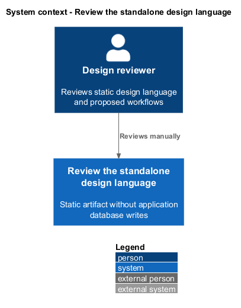
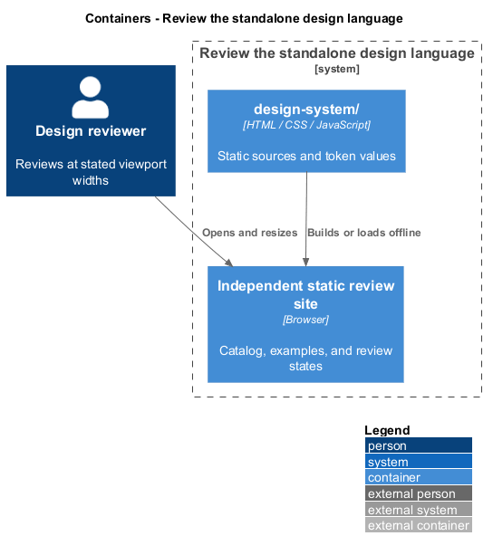
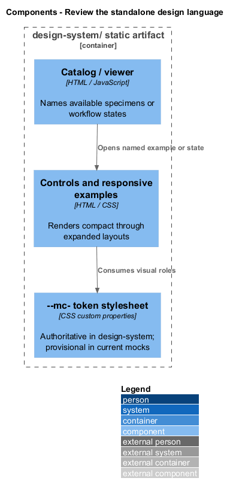
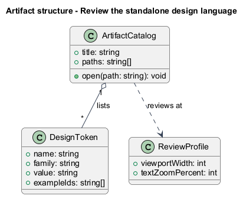
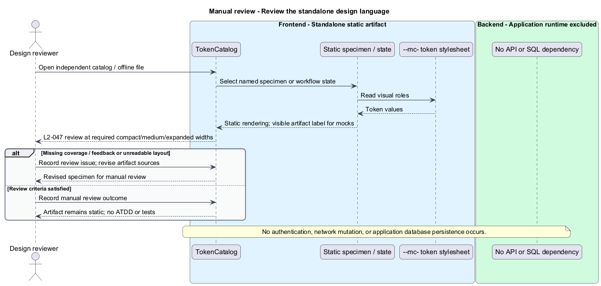

# Review the standalone design language

## Overview

The standalone design system documents Mission Control's visual language independently of the application runtime.

- **Design token** — prefixed CSS custom property representing a visual role
- **Specimen** — visual example of a control or responsive pattern

The current mock tokens are provisional; the design system becomes their authoritative owner.

This design refines the [L2 baseline](../../../specs/L2.md) and its linked L1 scope. Proposed defaults retain their proposal status.

## Description

The proposed `design-system/` contains its own `package.json`, build command, static catalog, token stylesheet, and control/layout specimens.
`--mc-` is the shared prefix already used by `docs/mocks/assets/tokens.css`.
The initial catalog adopts color, spacing, typography, radius, focus, elevation, and touch-size roles from that provisional stylesheet.
Its copy becomes authoritative; frontend and mocks mirror it through a documented copy step and manual review.
Missing roles are added to the authoritative stylesheet before component styles use them.

The static build bundles the token reference and examples without depending on the API or Angular application's runtime.
The hosting destination, build tooling, deployment command, and maintainer are `<TO SUPPLY>`.
Literal breakpoint values appear in stylesheet-level media queries because CSS custom properties cannot supply media-query conditions.
Their names and values remain documented centrally; component rules consume tokens for dimensions, fonts, spacing, and colors.
Manual review opens the built site independently and resizes through profile R, including control focus and compact/expanded specimens.
Contrast, status text, touch size, and zoom examples communicate the proposed accessibility baseline.
This artifact has no ATDD or automated tests; production workflows receive their own behavioral acceptance checks.

| Behavior | Proposed boundary | Review operation |
| --- | --- | --- |
| Build and manually review token specimens | `Standalone static build / preview` | `ReviewDesignLanguage` |

Mock input and review references:

- [assets/tokens.css](../../../mocks/assets/tokens.css).
- [README.md](../../../mocks/README.md).

## Requirements

Requirement text and identifiers below are copied verbatim from L2, including the source use of `must`.

| L2 ID | Refines (L1) | Requirement |
| --- | --- | --- |
| `L2-032` | `L1-008` | Production views must use the application design tokens and consistent typography, spacing, focus, form, and status patterns. Loading, empty data, zero search results, and request errors must be distinguishable and offer relevant actions. Visual review is for application UX; design artifacts themselves remain exempt from automated tests. |
| `L2-035` | `L1-009` | The application must meet the proposed WCAG 2.2 AA target. Normal text must reach 4.5:1 contrast, large text 3:1, and essential control boundaries/focus/status graphics 3:1 against adjacent colors. Status must include text or another non-color cue. Primary touch controls must provide at least 44×44 CSS-pixel targets; other controls must satisfy applicable AA target-size requirements. |
| `L2-047` | `L1-014` | The design system must live at `design-system/` beside backend/frontend, have its own package/build, and be deliverable as a standalone static site without an application runtime dependency. It must own authoritative prefixed CSS tokens for color, spacing, typography, radii, and focus, with visual examples of controls and responsive patterns. This is a design artifact: no ATDD and no tests. |

## Diagrams

The context view identifies the reviewer and the standalone artifact.

The container view separates editable static sources and their independent review site.

The component view shows the static catalog, examples, and token source.

The class view models source metadata and its composition; these are artifact concepts rather than production services.

Build and manually review token specimens follows the sequence below. The flow traces its enforcing steps to `L2-047` and includes rejection or recovery paths.

