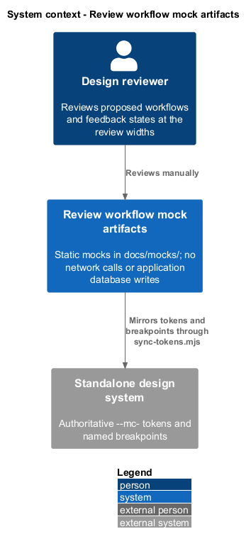
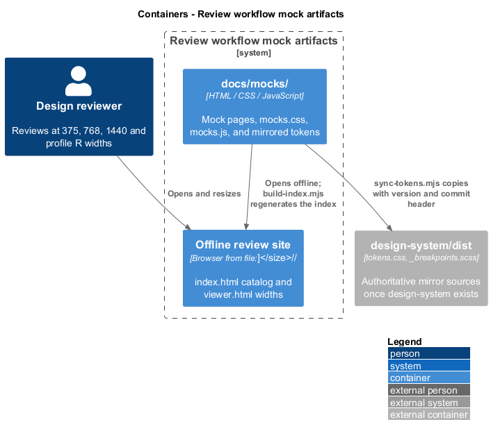
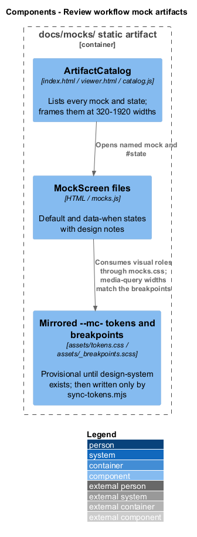
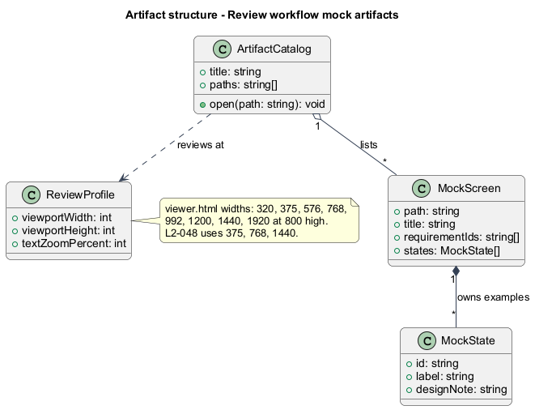
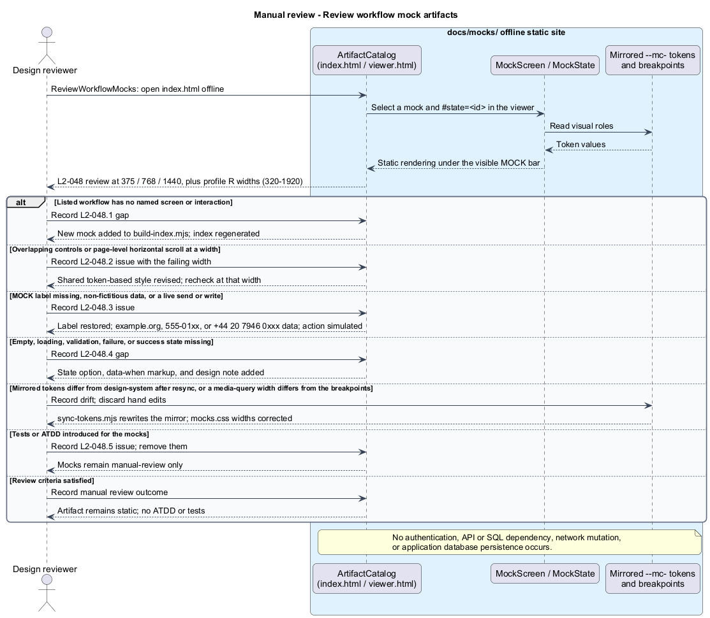

# Review workflow mock artifacts

## Overview

Static workflow mocks support review of proposed Mission Control screens before production implementation.

- **Mock state** — named simulated rendering for loading, empty, validation, failure, conflict, or success

The existing catalog covers pages and dialogs with clearly labeled simulated results. Fictitious contact data prevents sample records from implying live application data.

This design refines the [L2 baseline](../../../specs/L2.md) and its linked L1 scope. Proposed defaults retain their proposal status.

## Description

The [shared design rules](../../README.md#shared-design-rules) apply: proposed type status, Application placement and MediatR `12.5.0`, authentication and validation V, responsive profile R and accessibility, token styling, data ownership and session handling, and incremental ATDD. This page records feature-specific behavior and exceptions only.
Exception: as L2-048 design artifacts, the mocks have no ATDD and no automated tests. Production Playwright specs use the `e2e` mock composition, never these static mocks.

The existing artifact lives at `docs/mocks/`. `index.html` catalogs screens, `viewer.html` previews widths, and `build-index.mjs` creates the index and `assets/catalog.js` manifest.
`assets/mocks.js` handles state switching, menus, column selection, and click-through without network calls or persisted application writes.
`assets/mocks.css` consumes `--mc-` tokens from `assets/tokens.css`. Its only literal values are media-query widths, which cannot read custom properties, and the `1px` visually-hidden pattern.
`assets/tokens.css` is a provisional copy until `design-system/` exists. From then on, `node docs/mocks/sync-tokens.mjs` replaces it with the design system's `dist/tokens.css` and adds `assets/_breakpoints.scss` from `dist/_breakpoints.scss`.
Both mirrors carry the source design-system version and commit in a header comment, as the [design-language page](../review-design-language/README.md) defines; they are never edited by hand.
`assets/mocks.css` stays plain CSS, so review checks its media-query widths against the mirrored `_breakpoints.scss`.
HTML metadata names screen descriptions and L2 coverage; design notes record focus, announcement, and behavior rules beyond static appearance.

The catalog illustrates login/session, home, leads, workspaces, hierarchy, backlog, Kanban, Scrum planning/board/closure/history, accounts, and audit review.
Each named screen/state remains a design input, not an approved additional requirement.
`#state=<id>` links permit direct state review; MOCK chrome remains visible around simulated application content.
Contact samples use `example.org` addresses, `555-01xx` numbers, and the UK drama range `+44 20 7946 0xxx` for international formats.
The supplied Quinntyne Brown City identity is the only real one, and no phone is invented for it.
`viewer.html` frames any mock and state at 320, 375, 576, 768, 992, 1200, 1440, and 1920 CSS pixels, 800 pixels high.
Manual review uses 375, 768, and 1440 for L2-048 and the profile R widths (320, 375, 576, 768, 992, 1200, 1920) for intended production layouts.
Regeneration uses `node docs/mocks/build-index.mjs`; this design does not alter the existing mocks.

| Behavior | Proposed boundary | Review operation |
| --- | --- | --- |
| Review workflow coverage and feedback states | `Offline catalog and state links` | `ReviewWorkflowMocks` |

Mock input and review references:

- [Mission Control mocks](../../../mocks/index.html).
- [Mock viewer](../../../mocks/viewer.html).
- [README.md](../../../mocks/README.md).

## Requirements

Requirement text and identifiers below are copied verbatim from L2, including the source use of `must`.

| L2 ID | Refines (L1) | Requirement |
| --- | --- | --- |
| `L2-048` | `L1-014` | Mocks must illustrate login, home, lead directory/details/forms, work hierarchy, Kanban, Scrum planning/board/closure, and account-management workflows. They must use the design system language, identify themselves as mock/design artifacts, and use clearly fictitious contact data except the supplied City Lead identity. Mock data and simulated success must not be represented as live persisted results. This is a design artifact: no ATDD and no tests. |

## Diagrams

The context view identifies the reviewer, the static mocks, and the design system they mirror.

The container view separates the editable mock sources, their offline review site, and the design-system mirror source.

The component view shows the static catalog, mock screens, and the mirrored token and breakpoint files.

The class view models source metadata and its composition; these are artifact concepts rather than production services.

Review workflow coverage and feedback states follows the sequence below. The flow traces its enforcing steps to `L2-048` and includes rejection or recovery paths.

