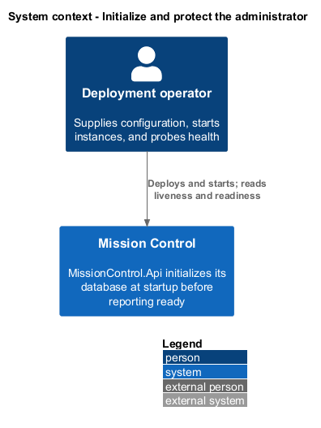
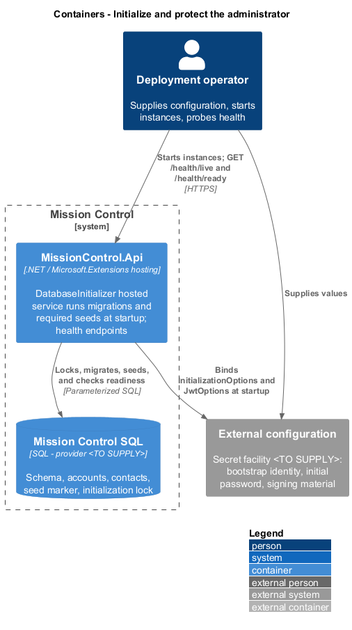
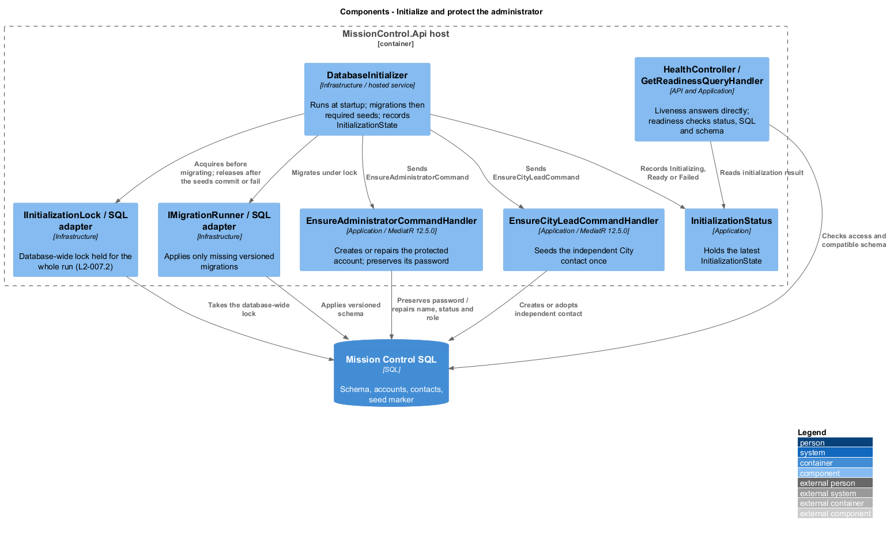
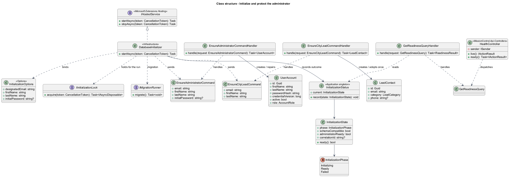
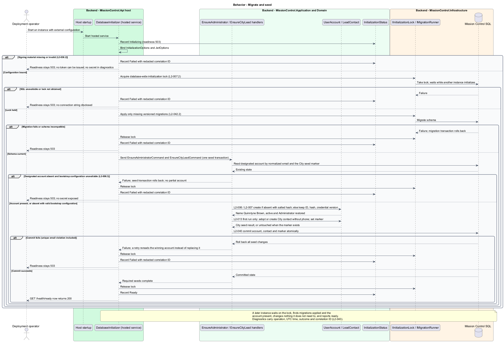
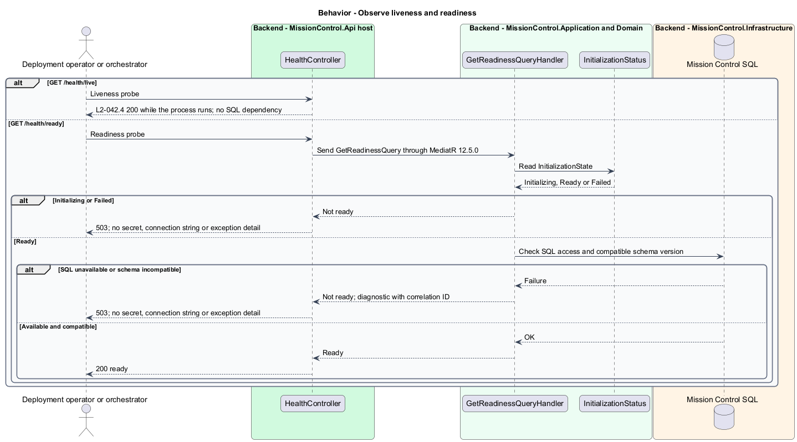

# Initialize and protect the administrator

## Overview

Deployment initializes the schema before the application becomes ready to serve users.

- **Bootstrap** — repeatable initialization that creates or repairs the designated administrator
- **Readiness** — ability to serve requests after schema, SQL, and required seeds succeed

The bootstrap account and City lead are independent records. Existing administrator passwords remain unchanged during initialization and recovery.

This design refines the [L2 baseline](../../../specs/L2.md) and its linked L1 scope. Proposed defaults retain their proposal status.

## Description

There is no separate initialization program. `DatabaseInitializer` in Infrastructure runs inside the `MissionControl.Api` host at startup as a hosted service.
It holds readiness false until it completes, so no instance reports ready before its own initialization succeeds.
It coordinates versioned SQL migrations followed by `EnsureAdministratorCommand` and `EnsureCityLeadCommand`, handled in Application through MediatR.
`InitializationOptions` binds external bootstrap identity and initial password from the PRD. The designated normalized email is `quinntynebrown@gmail.com`.
The exact initial password remains specified in L2-006 and the PRD; production code reads external configuration and stores only its salted hash.
`IMigrationRunner`, `IInitializationLock`, and the SQL implementation provide repeatability and a database-wide initialization lock.
Each instance initializes under `IInitializationLock` (L2-007.2). A later instance waits for the lock, finds migrations applied and the account present, and reports ready.
`InitializationStatus` records the outcome as `InitializationState` for readiness checks. The selected SQL provider and migration-lock implementation are `<TO SUPPLY>` before this slice is implemented.

The administrator seed loads the existing normalized identity inside the initialization transaction.
An absent account requires valid bootstrap configuration; failure rolls back seed changes and keeps readiness false.
An existing account retains ID, credential version, and password hash. Its first name, last name, active flag, and Administrator role are restored to the bootstrap values.
Application operations cannot rename the designated account, so this repair only reverses out-of-band database changes (L2-006).
The unique email index and initialization lock prevent concurrent duplicates. Initialization retries read the winning account rather than replacing it.
The City seed uses a durable `CityLeadSeedCompleted` marker in the same seed transaction.
On its first successful run it adopts an existing matching City contact or creates Quinntyne Brown with no phone; later runs leave that contact untouched.
The marker prevents a subsequent email/category edit or permitted contact deletion from creating a replacement contact on every startup.
This marker is a proposed resolution of L2-013's contact-edit preservation rule, not a restriction on contact CRUD.

`HealthController` is a thin controller in `MissionControl.Api.Controllers`. It answers `GET /health/live` directly and dispatches `GetReadinessQuery` for `GET /health/ready`.
`GET /health/live` reports `200` while the process runs. `GET /health/ready` reports `200` only after schema, SQL access, and administrator initialization succeed.
Initialization still running, loss of SQL, or incompatible schema returns `503` for readiness without connection strings or secret values.
Missing or invalid signing material also fails initialization (L2-036.2), so no token is ever issued with fallback material.
Failed initialization remains visibly unready and records a correlation ID, operation, outcome, and UTC diagnostic time. The operator corrects the cause and restarts the instance.
Concurrent initialization and restore checks run against the eventual chosen SQL provider; an in-memory substitute cannot prove locking or uniqueness behavior.

| Behavior | Proposed boundary | Proposed operation |
| --- | --- | --- |
| Migrate and seed | `MissionControl.Api` host startup (`DatabaseInitializer` hosted service) | `EnsureAdministratorCommand` / `EnsureAdministratorCommandHandler` |
| Observe liveness and readiness | `GET /health/live; GET /health/ready` | `GetReadinessQuery` / `GetReadinessQueryHandler` |

Mock input and review references:

- [Home · Mission Control mock](../../../mocks/home/home.html); review states: `default`, `collaborator`, `first-run-admin`, `first-run-collaborator`, `no-active-sprints`, `loading`, `error`, `section-error`.
- [Account details · Mission Control mock](../../../mocks/admin/account-detail.html); review states: `default`, `designated`, `inactive`, `not-found`, `loading`.
- [Lead details · Mission Control mock](../../../mocks/leads/lead-detail.html); review states: `default`, `lead`, `saved`, `collaborator`, `not-found`, `loading`, `error`.

## Requirements

Requirement text and identifiers below are copied verbatim from L2, including the source use of `must`.

| L2 ID | Refines (L1) | Requirement |
| --- | --- | --- |
| `L2-006` | `L1-002` | After migrations and successful initialization, the application must contain an active highest-capability administrator named Quinntyne Brown with normalized email `quinntynebrown@gmail.com`. The initial configured password must be `MissionCtrl2026!` and must be stored only as a hash in SQL. |
| `L2-007` | `L1-002` | The seed must avoid duplicates, preserve existing passwords and restore the designated account's active status and highest capabilities. |
| `L2-008` | `L1-002` | Application operations must not delete, deactivate, demote, or change the email identity of the designated administrator. Its password can be replaced securely. |
| `L2-013` | `L1-003` | Initial seeding must create a separate City contact for Quinntyne Brown at the designated email with no phone supplied. Existing matching City contacts must not be duplicated or have later contact edits reset by startup. |
| `L2-036` | `L1-010` | Passwords must be stored using a maintained password-hashing mechanism with per-password salts. JWT signing material and bootstrap secrets must come from external configuration. Production authentication must use HTTPS. Tokens must not be persisted in browser local/session storage, URLs, or contact data. |
| `L2-040` | `L1-011` | Committed account, contact, hierarchy, ordering, board, and sprint changes must survive restart. Operations spanning multiple records must commit entirely or leave all affected business records unchanged. |
| `L2-041` | `L1-011` | Edits must carry a record version or equivalent concurrency condition. SQL constraints must protect normalized account emails, lead email/category pairs, parent references, open sprint membership, and active sprint exclusivity. Caller errors must produce validation/conflict responses rather than generic failures. |
| `L2-042` | `L1-012` | Deployment must support repeatable migrations followed by required seeding. Readiness must succeed only after required schema, SQL access, and administrator initialization succeed. Liveness must distinguish an alive process from readiness. |
| `L2-043` | `L1-012` | The API must return a correlation ID for unexpected failures and write structured diagnostic records containing operation, UTC time, outcome, and that same ID. Users must receive useful error categories without internal stack traces or secret values. Production logs and diagnostics must be restricted operational data. |

## Diagrams

The context view identifies the actor and the Mission Control capability.

The container view shows initialization running inside the `MissionControl.Api` host, its external configuration, and the durable SQL environment.

The component view locates the startup hosted service, the initialization lock, the seed handlers, and the readiness check.

The class view identifies the hosted service, its options and lock, the seed commands, and the readiness query.

Migrate and seed follows the sequence below. The flow traces its enforcing steps to `L2-006` and includes rejection or recovery paths.

Observe liveness and readiness follows the sequence below. The flow traces its enforcing steps to `L2-042` and includes rejection or recovery paths.

