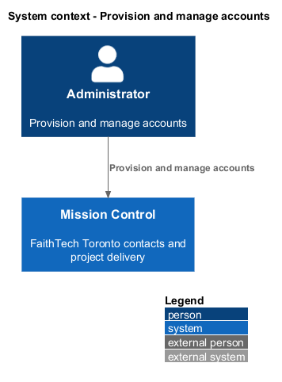
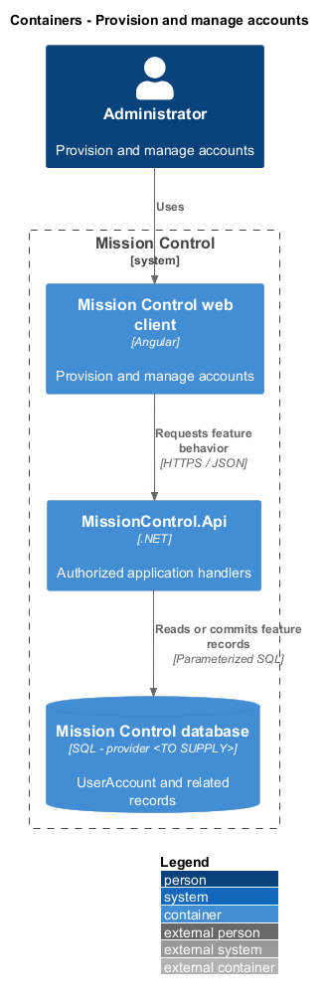
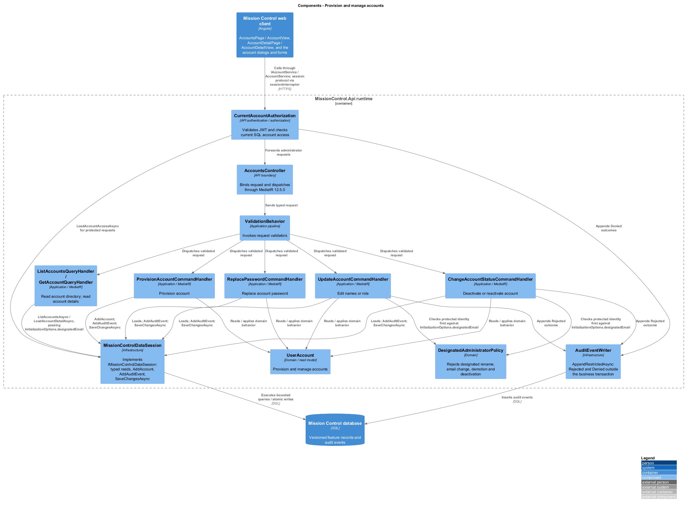
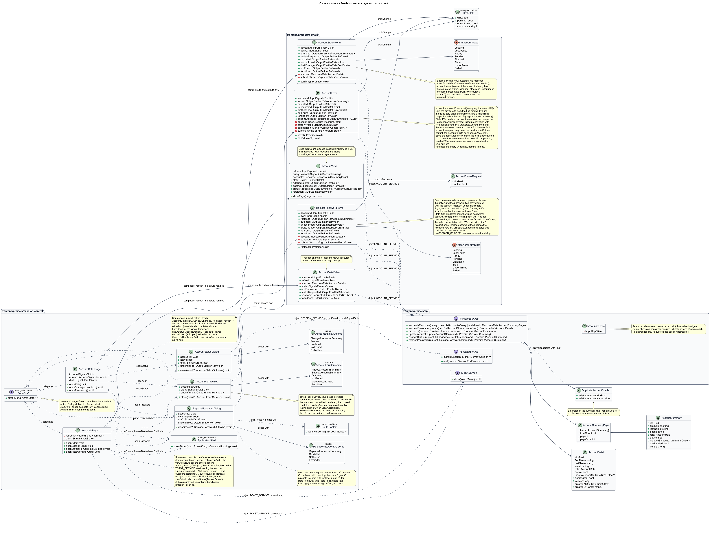
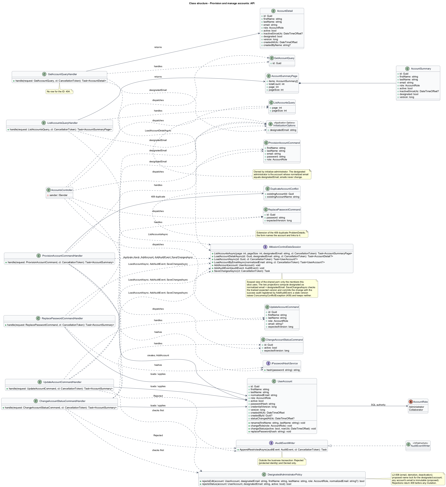
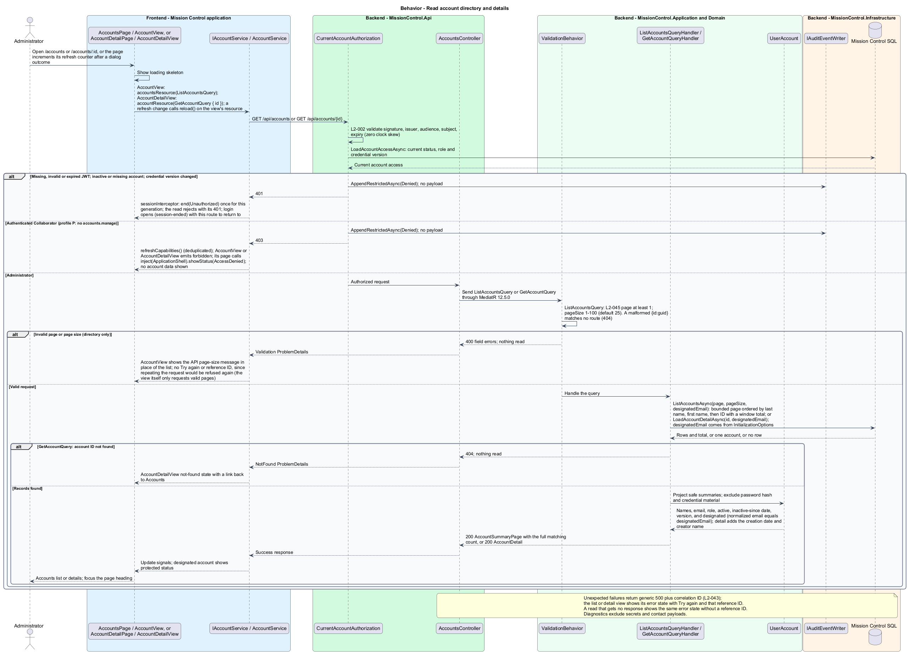
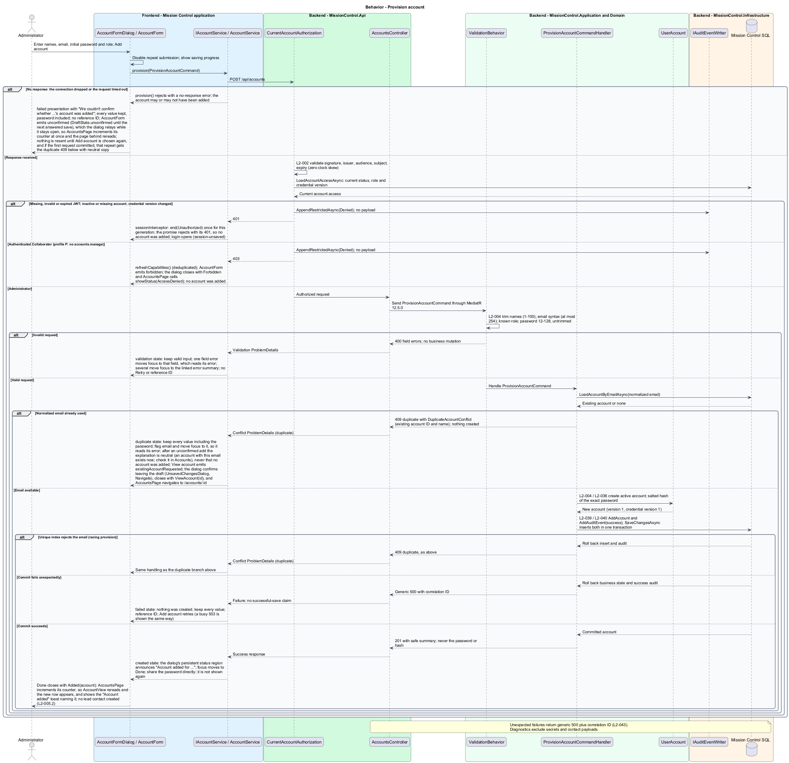
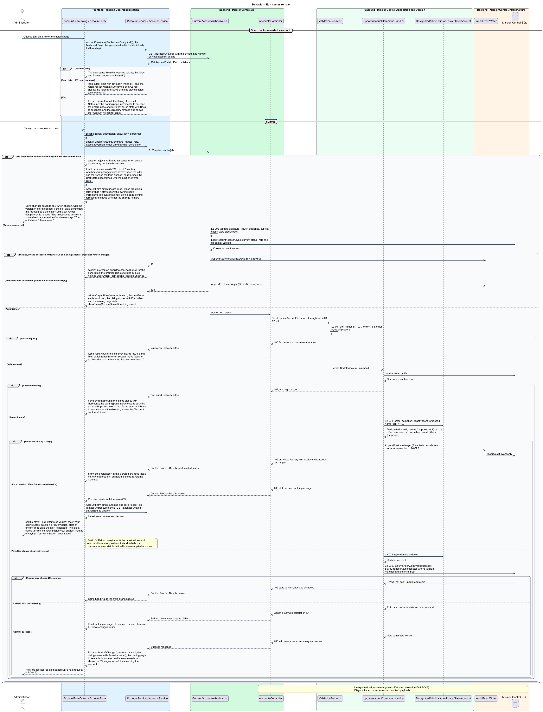
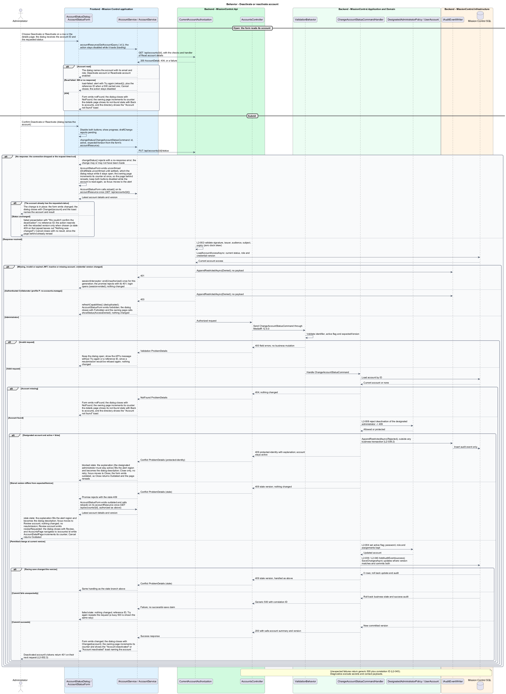
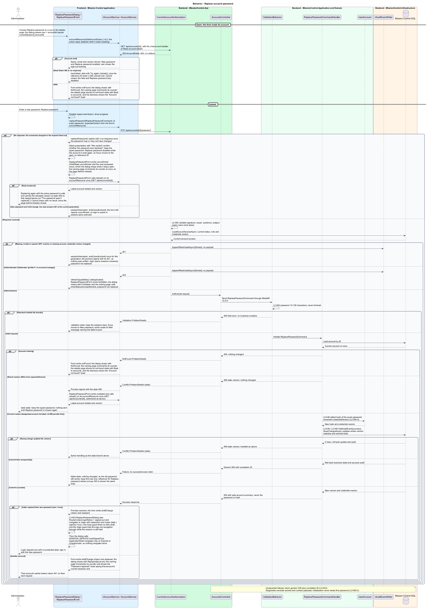

# Provision and manage accounts

## Overview

Administrators provision login accounts privately and manage their current access.

- **Designated administrator** — Quinntyne Brown account whose email, active status, and highest capabilities remain protected; its name is locked as a design proposal
- **Credential version** — counter that invalidates tokens issued before a password replacement

Accounts remain separate from similarly named or emailed lead contacts. Deactivation preserves assignments and audit identity; account deletion is outside the baseline.

This design refines the [L2 baseline](../../../specs/L2.md) and its linked L1 scope. Proposed defaults retain their proposal status.

## Description

The [shared design rules](../../README.md#shared-design-rules) apply: proposed type status, Application placement and MediatR `12.5.0`, authentication and validation V, responsive profile R and accessibility, token styling, data ownership and session handling, and incremental ATDD. This page records feature-specific behavior and exceptions only.

| Part | Responsibility and architectural home |
| --- | --- |
| `AccountsPage` | Routed page at `/accounts` in `frontend/projects/mission-control`; composes `AccountView` and binds its `refresh` input to the page's own counter. Add account in its header calls `openAdd()`, and the view's `editRequested`, `statusRequested`, and `passwordRequested` outputs call `openEdit(id)`, `openStatus(id, active)`, and `openPassword(id)`. Dialog outcomes: `Added`, `Saved`, `Changed`, and `Replaced` increment the counter and show, through `TOAST_SERVICE`, the "Account added", "Changes saved", "Account deactivated" or "Account reactivated", or "Password replaced" toast naming the account; `Outdated` increments the counter; `NotFound` increments it and shows the "Account not found" toast; `ViewAccount(id)` and `Review` navigate to `/accounts/:id`; `Forbidden`, like the view's `forbidden`, calls `inject(ApplicationShell).showStatus(AccessDenied)`. While a dialog stays open, its `unconfirmed` output (a request that got no response) increments the counter at once, so the list shows whether the change is there. It implements `FormDraft` by delegating to its open dialog. |
| `AccountView` | Domain component in `frontend/projects/domain` that lists accounts; injects `ACCOUNT_SERVICE`, owns its page query and `accountsResource` in signals, and takes `refresh: InputSignal<number>`, whose change rereads the list. Once the total exceeds the page size it renders "Showing 1–25 of N accounts" with Previous and Next page controls, and a page change sets its query at once. Each row's actions emit `editRequested` and `passwordRequested` with the account ID, and `statusRequested` with `{ id, active }`, where `active` is the requested status. A `403` on its read emits `forbidden`. |
| `AccountDetailPage` | Routed page at `/accounts/:id` in `frontend/projects/mission-control`; composes `AccountDetailView`, binds its `refresh` input to the page's own counter, and opens `AccountFormDialog`, `AccountStatusDialog`, or `ReplacePasswordDialog` from the view's outputs through `openEdit()`, `openStatus(active)`, and `openPassword()`. Dialog outcomes: `Saved`, `Changed`, and `Replaced` increment the counter and show the same toasts as on `AccountsPage`; `Review`, `Outdated`, and `NotFound` increment the counter, so the view shows the latest details or its not-found state; `Forbidden`, like the view's `forbidden`, calls `inject(ApplicationShell).showStatus(AccessDenied)`. While a dialog stays open, its `unconfirmed` output increments the counter at once, so the details reread. It opens Edit only, so `Added` and `ViewAccount` never reach it. It implements `FormDraft` by delegating to its open dialog. |
| `AccountDetailView` | Domain component in `frontend/projects/domain`; injects `ACCOUNT_SERVICE`, owns the routed account's `accountResource`, takes `refresh: InputSignal<number>`, renders the default, designated, inactive, not-found, loading, and load-failed (`error`) states, and emits `editRequested`, `statusRequested` with the requested status, `passwordRequested`, and, on a `403`, `forbidden`. |
| `AccountFormDialog` | Application dialog in `frontend/projects/mission-control`; hosts `AccountForm`, passes the edited account's ID as an input (none for Add), and implements `FormDraft` from the form's latest `draftChange`. It closes through `close(result?: AccountFormOutcome)`: `Saved(AccountSummary)` on an edit's `saved`; `Added(AccountSummary)` when it closes after an add's `saved`, carrying the latest account added; `Outdated` when it closes after the form emitted `outdated`; `NotFound` on `notFound`; `ViewAccount(Guid)` on `existingAccountRequested`, once the unsaved-changes check confirms leaving the draft; and `Forbidden` on `forbidden`. Closing with no result means it was dismissed. It relays the form's `unconfirmed` as its own output and stays open with the draft. |
| `AccountStatusDialog` | Application dialog in `frontend/projects/mission-control`; hosts `AccountStatusForm`, passes the account ID and the requested status as inputs, and implements `FormDraft` from the form's latest `draftChange`. It closes through `close(result?: AccountStatusOutcome)`: `Changed(AccountSummary)` on `changed`, `Review` on `reviewRequested`, `Outdated` when it closes after `outdated`, `NotFound` on `notFound`, and `Forbidden` on `forbidden`. It relays the form's `unconfirmed` as its own output and stays open. |
| `ReplacePasswordDialog` | Application dialog in `frontend/projects/mission-control`; hosts `ReplacePasswordForm`, passes the account ID as an input, implements `FormDraft` from the form's latest `draftChange`, injects `SESSION_SERVICE`, and computes `own` from `currentSession`. It closes through `close(result?: ReplacePasswordOutcome)`: `Replaced(AccountSummary)` on `replaced` for another account, `Outdated` when it closes after `outdated`, `NotFound` on `notFound`, and `Forbidden` on `forbidden`. It relays the form's `unconfirmed` as its own output and stays open with the typed password. On `replaced` with `own` true it runs the own-password sign-out instead and returns no result. |
| `AccountForm` | Domain component hosted by `AccountFormDialog`; injects `ACCOUNT_SERVICE` and owns the draft, the edited account's `accountResource`, the comparison, and submit state in signals; emits `saved`, `outdated`, `unconfirmed` when a save gets no response, `draftChange`, `notFound`, `forbidden`, and `existingAccountRequested` with a duplicate's account ID. |
| `AccountStatusForm` | Domain component hosted by `AccountStatusDialog`; injects `ACCOUNT_SERVICE`, owns the account's `accountResource` and its loading, load-failed, pending, blocked, stale, failed, and unconfirmed states, calls `changeStatus`, and emits `changed`, `reviewRequested`, `outdated`, `unconfirmed` when a change gets no response, `draftChange`, `notFound`, and `forbidden`. |
| `ReplacePasswordForm` | Domain component hosted by `ReplacePasswordDialog`; injects `ACCOUNT_SERVICE` only and takes `own` as an input. It owns the typed password, the account's `accountResource`, and its loading, load-failed, pending, validation, stale, failed, and unconfirmed states, calls `replacePassword`, and emits `replaced`, `outdated`, `unconfirmed` when a replacement gets no response, `draftChange`, `notFound`, and `forbidden`. It never ends the session itself. |
| `IAccountService`, `ACCOUNT_SERVICE` | Interface and token in `frontend/projects/api/account.service.contract.ts`; consumers import the contract only. |
| `AccountService` | Production HTTP adapter in `api`; reads return caller-owned signal resources (`accountsResource`, `accountResource`) and mutations return one `Promise` each. It holds no shared results. Composition binds a mock adapter for Chromium Playwright. |
| `AccountsController` | Thin controller under `backend/src/MissionControl.Api/Controllers`, namespace `MissionControl.Api.Controllers`. |
| `UserAccount` | Domain entity; account responses use safe read projections without credential fields. |
| `DesignatedAdministratorPolicy` | Domain policy; given the account and `designatedEmail`, decides protected-identity rejections before any mutation. |
| `InitializationOptions` | Application options class owned by [Initialize and protect the administrator](../initialize-administrator/README.md); this slice's handlers read only its `designatedEmail`. |
| `IMissionControlDataSession` | Shared Application data port defined in the [overview](../../README.md#data-access-and-security-ports); this slice uses its typed reads, `AddAccount`, `AddAuditEvent`, and `SaveChangesAsync`. |
| `IPasswordHashService` | Shared Application [security port](../../README.md#data-access-and-security-ports); hashes provisioned and replacement passwords. |
| `IAuditEventWriter` | Application audit port; `AppendRestrictedAsync(AuditEvent, ct)` appends `Rejected` and `Denied` events outside the business transaction. Success audits never use it: handlers register them with `AddAuditEvent`, and `SaveChangesAsync` commits them with the change. |

`AccountsPage` owns `/accounts` and `AccountDetailPage` owns `/accounts/:id`; both routes require the `accounts.manage` capability, and the API enforces it independently.
`UnsavedChangesGuard` is the `canDeactivate` of both routes. Each dialog's `FormDraft` follows its form's latest `DraftState`, a page with no open dialog is clean, and Cancel, Close, or Escape on a dirty draft opens `UnsavedChangesDialog`.
`AccountForm` and `ReplacePasswordForm` report typed input as dirty; `AccountStatusForm` holds no input and reports only `pending` while its change is in flight and `unconfirmed` after a change that got no response.
`ListAccountsQuery { page, pageSize }` reads the directory as an `AccountSummaryPage`, and `GetAccountQuery { id }` reads one `AccountDetail`. `AccountView` keeps the page in its query signal; once `totalCount` exceeds the page size it shows "Showing 1–25 of N accounts" and the Previous and Next page controls, and choosing a page sets its query at once.
`AccountSummary` carries everything the directory renders: names, email, role, active flag, inactive-since date, `designated` flag, and version. `AccountDetail` adds the creation date and the creating administrator's name.
Each form reads its account through its own `accountResource`, which supplies the names shown in its dialog and the version its mutation carries.
For Edit, the draft starts from the first resolved value, and the fields stay disabled until it arrives; a failed read keeps them disabled and offers Try again (`reload()`), with the reference ID when a `500` carried one (`edit-loading` and `edit-load-failed` mock states). For Add account the query is `undefined`, so nothing is read.
The status and password forms read on open the same way: Deactivate, Reactivate, Replace password, and the password field stay disabled until the account resolves, and a failed read shows the load-failed alert with Try again (`reload()`) and Cancel, plus the reference ID when a `500` carried one (`loading` and `load-failed` mock states).
A `404` from any form's read or save makes it emit `notFound`, and its dialog closes with `NotFound`: the details page rereads and shows its not-found state with Back to accounts and no reference ID or Try again, and the directory rereads and shows the "Account not found" toast.
The account service returns safe summaries, never hashes or replacement passwords. Account lists default to 25 rows ordered by last name, first name, then ID.
After a committed outcome, and after `Outdated`, `Review`, or `NotFound`, the owning page increments its counter, so its view rereads its account resource, and it increments the counter at once when an open dialog relays `unconfirmed`; there is no other account cache.

The designated administrator is the account whose normalized email equals `InitializationOptions.designatedEmail`. Account emails never change, so that identity cannot move to another account.
`UpdateAccountCommandHandler` and `ChangeAccountStatusCommandHandler` read `IOptions<InitializationOptions>` and pass `designatedEmail` to `DesignatedAdministratorPolicy`.
`ListAccountsQueryHandler` and `GetAccountQueryHandler` pass it to `ListAccountsAsync` and `LoadAccountDetailAsync`, whose projections compute each account's `designated` flag from it.
New account names measure 1–100 characters; email measures at most 254 and normalizes for unique comparison.
Proposed passwords measure 12–128 characters without trimming. Role selection defaults to Collaborator in the mock.

`ProvisionAccountCommandValidator` checks fields. The handler hashes the password through `IPasswordHashService`, adds the account with `AddAccount`, registers the success audit with `AddAuditEvent`, and commits both with `SaveChangesAsync`.
A SQL unique index protects normalized email under concurrent provisioning, and Infrastructure translates its violation into the duplicate result.
A duplicate normalized email returns `409` with the existing account's ID and name; the form keeps every value, including the password, marks the email field, and moves focus to it, so it reads its error.
Its View account link emits `existingAccountRequested`; the dialog first confirms leaving the unsaved draft through `UnsavedChangesDialog` with reason `Navigate`, then closes with `ViewAccount(id)`, and `AccountsPage` navigates to `/accounts/:id`.
A server `400` with one field error moves focus to that field, which reads its error; several move focus to the linked error summary. Neither offers Retry or a reference ID, because a repeat would be refused again.
A provision or edit that fails with `500` or `503` wrote nothing: it keeps every value, shows the reference ID, and lets Add account or Save changes try again; an edit's alert reads "We couldn't save this account. Nothing changed."
On success, Add account becomes the created confirmation: the dialog's status region, present in every state, announces "Account added for …", and focus moves to Done.
Done, Close, or Escape then closes the dialog with `Added`. Add another account resets the form and keeps the dialog open, so a later close still returns `Added` with the latest account added.

`UpdateAccountCommand` carries names, role, `expectedVersion`, and an optional `email`; active status is not part of it.
The optional email exists only so that a changed email is rejected rather than silently dropped.
When its normalized value differs from the stored email, the handler returns `409`. L2-008 protects the designated email; the proposed rule makes every other account email immutable too.
That broader rule matches the account-form mock and remains a design proposal; L2 explicitly protects the designated email only.
`ChangeAccountStatusCommand` carries `id`, `active`, and `expectedVersion` and serves the account-status dialog.
Account edits carry `expectedVersion`. `SaveChangesAsync` writes under that version condition, increments it, and commits the success audit registered with `AddAuditEvent`; a stale version raises `ConcurrencyConflictException`, returned as `409`, and leaves no success audit.

`DesignatedAdministratorPolicy` rejects an email change, demotion, or deactivation of the designated account, as L2-008 requires, and also a first- or last-name change.
That name lock is a design proposal, stricter than L2-008: L2-006 requires the name Quinntyne Brown after every initialization, and refusing renames keeps the running application consistent with what the next startup would restore. The account form shows every designated field locked and offers only Close.
A rejected designated-administrator change returns `409` and appends a `Rejected` audit event through `IAuditEventWriter.AppendRestrictedAsync`.
That append runs outside the business transaction, so the rejection stays recorded while no business record changes. A rejected email change on any other account is recorded the same way.
These protected-identity checks run before the version check, so a protected change is reported as protected even when it is also stale.
Administrator capability evaluation includes all capabilities, including later additions, rather than relying on a fixed seeded grant list.

On a stale-version `409` the edit form keeps the attempted values, emits `outdated`, and calls `reload()` on its account resource once to read the latest version (no resubmission); Reload latest adopts the reloaded values and version while the comparison stays visible.
A stale status change returns `409`; `AccountStatusForm` emits `outdated`, calls `reload()` on its account resource once, reports that nothing changed, and never resubmits. A protected-identity `409` makes it emit `outdated` too, since the page that offered the action was out of date.
The blocked and stale explanations sit inside the dialog's alert region and become the dialog's description; Deactivate account disappears, so focus moves to Close (blocked) or Review account (stale), and screen readers hear the explanation as an alert.
Review account emits `reviewRequested`, and the dialog closes with `Review`: `AccountsPage` navigates to `/accounts/:id`, and `AccountDetailPage` increments its counter, so its view shows the latest details. Close (blocked) and Cancel (stale) close with `Outdated`, so the page rereads.
A stale password replacement returns `409`; `ReplacePasswordForm` keeps the typed password, emits `outdated`, calls `reload()` on its account resource once, and sends nothing until Replace password is chosen again.
A missing account returns `404`; the detail page shows its not-found state with a link back to Accounts.

A provision, edit, status change, or password replacement that gets no response may have committed, so its form never says that nothing changed.
It keeps every value and shows its failed presentation with "We couldn't confirm whether …" and no reference ID, because no response carried one; each dialog mock's `failed` state describes this unconfirmed case.
The form emits `unconfirmed`, which its dialog relays while it stays open, so the owning page increments its counter at once and its view shows whether the change is there. The form's `DraftState` reports `unconfirmed` until a reread confirms the change or the next answered save settles it, so a session that ends meanwhile opens sign-in in `session-save-unknown`.
Add account sends nothing until it is chosen again, and the unique email then decides: if the first request added the account, the repeat gets the duplicate `409`, which names the account and links to it.
On that path the explanation is neutral: it says that an account with this email exists now and asks you to check it in Accounts, and never that no account was added.
Save changes also sends nothing until it is chosen again, and it keeps the version the form opened, so if the first save committed, the repeat meets the stale-version `409` and its comparison.
That comparison is headed "The latest saved version is shown beside your entries" and never says "Your edits haven't been saved", because the first save may be the change it shows.
The status and password forms instead call `reload()` on their account resource once and keep their action disabled until it resolves; when your own password replacement did commit, that read answers `401`, and sign-in opens in `session-save-unknown` because the form still reports `unconfirmed`.
The status form compares the reloaded active flag with the requested status: if they match, the change is in place and it emits `changed`; otherwise it keeps the "We couldn't confirm" presentation. The status action and Replace password then carry the reloaded version, so a repeat never collides with its own committed change; a stale `409` on that repeat never says that nothing changed or that the password wasn't replaced.

Password replacement hashes the exact supplied value through `IPasswordHashService`, increments `credentialVersion`, and commits both values with the success audit.
Replacing the caller's own password ends that session immediately after success. `ReplacePasswordDialog` computes `own` from `currentSession` and passes it to the form, which shows the sign-out warning.
On `replaced` with `own` true, the dialog sets `loginNotice` to `signed-out`, navigates to `/login` with `replaceUrl` and router state `{ signOut: true }`, and then calls `end(SignedOut)`; the form is clean by then, so the route guard lets the navigation proceed, the `/login` guard lets that sign-out navigation through although the session is still held, and sign-in opens in its `signed-out` state.
Other prior tokens fail on their next request.
Deactivation keeps the password and all assignments; the account's existing tokens return `401` on their next request.
Only active accounts appear for new work assignments. Work forms find them through the work slice's `ListAssigneeChoicesQuery`, so these account endpoints stay administrator-only.
Reactivation restores login using the existing password and role. No public registration or account-delete endpoint exists, so L2-008's delete prohibition holds by absence; the protected-identity `409` covers the operations that exist.

A current-generation `401` on any account request ends the session through `end(Unauthorized)`, and that request rejects with its `401`; for a provision, edit, or password save, the `401` proves nothing was written, so sign-in shows `session-unsaved`; a status change holds no input, so it ends on `session-ended` and the page rereads after sign-in. A form still reporting `unconfirmed` from an earlier request yields `session-save-unknown` instead.
A `403` means the caller is no longer an administrator, and the capability summary refreshes. `AccountView` or `AccountDetailView` emits `forbidden` from a read, and a form emits it from its read or save, after which its dialog closes with `Forbidden` and nothing saved; either way the owning page calls `inject(ApplicationShell).showStatus(AccessDenied)`, which replaces the page with the access-denied page.

| Behavior | Proposed boundary | Request / handler |
| --- | --- | --- |
| Read account directory | `GET /api/accounts` | `ListAccountsQuery` / `ListAccountsQueryHandler` |
| Read account details | `GET /api/accounts/{id}` | `GetAccountQuery` / `GetAccountQueryHandler` |
| Provision account | `POST /api/accounts` | `ProvisionAccountCommand` / `ProvisionAccountCommandHandler` |
| Edit names or role | `PUT /api/accounts/{id}` | `UpdateAccountCommand` / `UpdateAccountCommandHandler` |
| Deactivate or reactivate account | `PUT /api/accounts/{id}/status` | `ChangeAccountStatusCommand` / `ChangeAccountStatusCommandHandler` |
| Replace account password | `PUT /api/accounts/{id}/password` | `ReplacePasswordCommand` / `ReplacePasswordCommandHandler` |

Mock input and review references:

- [Accounts · Mission Control mock](../../../mocks/admin/accounts.html); review states: `default`, `loading`, `error`.
- [Account details · Mission Control mock](../../../mocks/admin/account-detail.html); review states: `default`, `designated`, `inactive`, `not-found`, `loading`, `error`.
- [Add or edit account · Mission Control mock](../../../mocks/admin/account-form-dialog.html); review states: `create`, `validation`, `duplicate`, `saving`, `failed`, `created`, `edit-loading`, `edit-load-failed`, `edit`, `designated`, `conflict`, `conflict-reloaded`.
- [Deactivate or reactivate account · Mission Control mock](../../../mocks/admin/account-status-dialog.html); review states: `deactivate`, `reactivate`, `loading`, `load-failed`, `blocked`, `saving`, `failed`, `stale`.
- [Replace password · Mission Control mock](../../../mocks/admin/replace-password-dialog.html); review states: `default`, `own`, `loading`, `load-failed`, `validation`, `saving`, `failed`, `stale`.

## Requirements

Requirement text and identifiers below are copied verbatim from L2, including the source use of `must`.

| L2 ID | Refines (L1) | Requirement |
| --- | --- | --- |
| `L2-003` | `L1-001` | The client must hold the token in memory, clear it on logout, and require login after reload or expiry. Local logout does not revoke a copied valid access token. |
| `L2-004` | `L1-001` | Administrators must provision active users, edit names and roles, set a replacement password, and deactivate/reactivate accounts. Users must have unique normalized email, first name, last name, and a role from profile P. Names must be 1–100 characters and email must be a syntactically valid address of at most 254 characters. Proposed password policy: new or replacement passwords must be 12–128 characters, without trimming. Account deletion is outside this baseline; deactivation preserves work assignments and audit identity. |
| `L2-005` | `L1-001` | The API and UI must apply permission profile P. Lead category or contact creation must not create a login or change a user's authorization. |
| `L2-006` | `L1-002` | After migrations and successful initialization, the application must contain an active highest-capability administrator named Quinntyne Brown with normalized email `quinntynebrown@gmail.com`. The initial configured password must be `MissionCtrl2026!` and must be stored only as a hash in SQL. |
| `L2-008` | `L1-002` | Application operations must not delete, deactivate, demote, or change the email identity of the designated administrator. Its password can be replaced securely. |
| `L2-029` | `L1-007` | Primary navigation must reach Home, Leads, and Projects, with account management visible only to administrators. Work details must expose their workspace and parent path. Direct routes must enforce authentication and handle missing records. |
| `L2-031` | `L1-008` | Forms must expose field-specific validation, retain input on rejected saves, prevent duplicate submission while pending, display results, and confirm leaving with unsaved edits. Destructive confirmations must name the affected item. |
| `L2-036` | `L1-010` | Passwords must be stored using a maintained password-hashing mechanism with per-password salts. JWT signing material and bootstrap secrets must come from external configuration. Production authentication must use HTTPS. Tokens must not be persisted in browser local/session storage, URLs, or contact data. |
| `L2-039` | `L1-010` | The system must record UTC timestamp, actor ID when known, operation, entity type/ ID, outcome, and correlation ID for account/permission changes, contact/workspace/ work mutations, board/sprint mutations, successful login, denied access, and throttling. Audit data must exclude secrets and contact payloads. Only administrators must access audit records; audit mutation endpoints must be absent. |
| `L2-040` | `L1-011` | Committed account, contact, hierarchy, ordering, board, and sprint changes must survive restart. Operations spanning multiple records must commit entirely or leave all affected business records unchanged. |
| `L2-041` | `L1-011` | Edits must carry a record version or equivalent concurrency condition. SQL constraints must protect normalized account emails, lead email/category pairs, parent references, open sprint membership, and active sprint exclusivity. Caller errors must produce validation/conflict responses rather than generic failures. |
| `L2-045` | `L1-013` | Directories, workspace lists, backlogs, and history lists must default to 25 records per page and cap requested page size at 100. Invalid sizes must return 400. Results must include total matching count and stable ordering. Boards/hierarchies must load bounded batches of at most 100 and allow access to every matching item; counts must reflect the full dataset rather than just loaded records. |

## Diagrams

The context view identifies the actor and the Mission Control capability.

The container view separates the client, .NET API, and durable SQL records.

The component view locates request dispatch, the designated-administrator policy, audit, and persistence within the feature.

The client class view shows the routed pages with their refresh counters, dialog openers, outcome reactions, and access-denied hand-off, the dialogs with their typed outcomes, the domain forms with their outputs and draft reporting, and the account service contract.

The API class view shows the typed requests and results, the designated-administrator policy with its configured email, the data-session members this slice uses, and the audit and hashing ports.

Read account directory and Read account details follow the sequence below: `AccountView` reads `ListAccountsQuery`, and `AccountDetailView` reads `GetAccountQuery`. The flow traces its enforcing steps to `L2-004` and `L2-045` and includes rejection or recovery paths.

Provision account follows the sequence below. The flow traces its enforcing steps to `L2-004` and includes rejection or recovery paths, including a request that gets no response.

Edit names or role follows the sequence below. The flow traces its enforcing steps to `L2-004` and `L2-008` and includes rejection or recovery paths, including a request that gets no response.

Deactivate or reactivate account follows the sequence below. The flow traces its enforcing steps to `L2-004` and `L2-008` and includes rejection or recovery paths, including a request that gets no response.

Replace account password follows the sequence below. The flow traces its enforcing steps to `L2-004` and includes rejection or recovery paths, including a request that gets no response.

