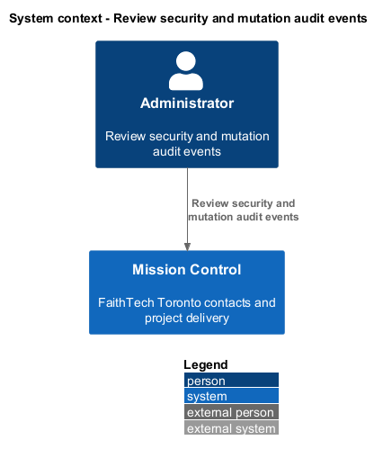
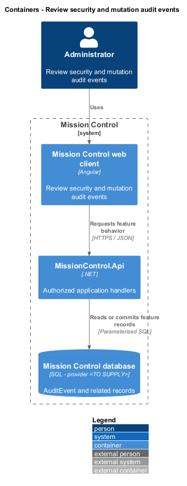
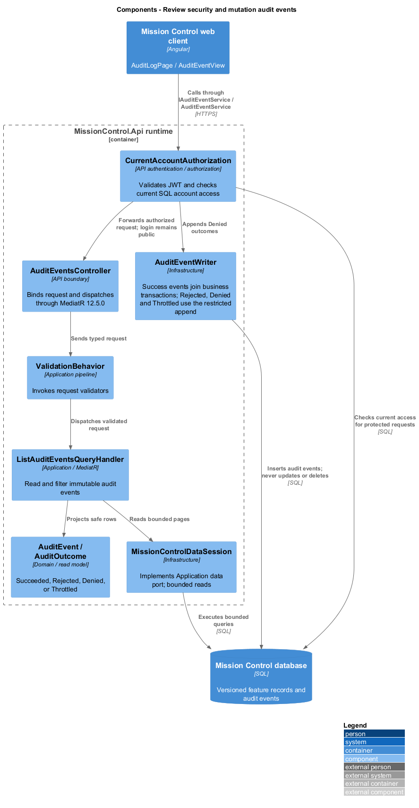
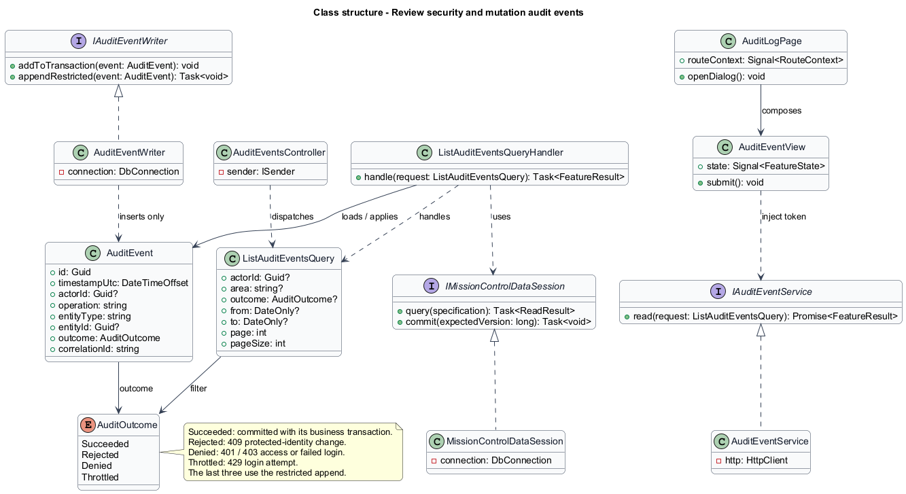
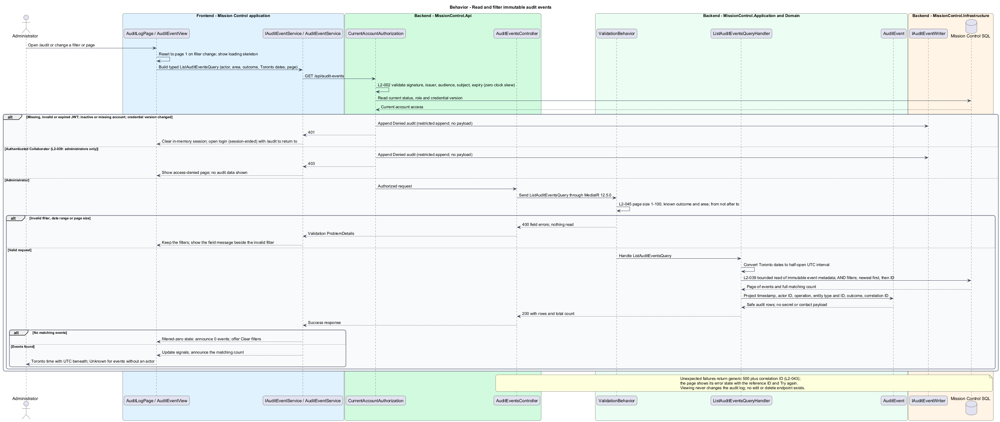

# Review security and mutation audit events

## Overview

Administrators review recorded security and data-changing operations without viewing secret or contact payloads.

- **Audit event** — immutable record of actor, operation, target, UTC timestamp, outcome, and correlation ID

Successful business audit entries agree with committed data. Denials and throttling remain inspectable even when no business mutation occurs.

This design refines the [L2 baseline](../../../specs/L2.md) and its linked L1 scope. Proposed defaults retain their proposal status.

## Description

All named production types are proposed; the repository currently contains requirements and static mocks.

| Part | Responsibility and architectural home |
| --- | --- |
| `AuditLogPage` | Routed page or dialog owned by `frontend/projects/mission-control`; composes the domain library and presentational components. |
| `AuditEventView` | Domain component in `frontend/projects/domain`; injects `AUDIT_EVENT_SERVICE` and holds feature state in signals. |
| `IAuditEventService`, `AUDIT_EVENT_SERVICE` | Interface and token in `frontend/projects/api/audit-event.service.contract.ts`; the consumer imports the contract only. |
| `AuditEventService` | Production HTTP adapter in `api`; owns HTTP calls and observable-to-signal conversion. Composition binds a mock adapter for Chromium Playwright. |
| `AuditEventsController` | Thin controller under `backend/src/MissionControl.Api/Controllers`, namespace `MissionControl.Api.Controllers`; binds, dispatches, and returns. |
| `AuditEvent` | Domain entity or Application read projection described below; Domain has no external project dependency. |
| `IMissionControlDataSession` | Application data port; the Infrastructure adapter runs parameterized queries and transaction commits. |

Commands, queries, handlers, and request validators live in Application feature folders. Each type has its own file; folders and namespaces agree.
MediatR remains pinned to `12.5.0`. Microsoft.Extensions supplies dependency injection, Options, and Configuration.

`AuditEventWriter` in Infrastructure implements the Application `IAuditEventWriter` port.
Mutation handlers include success audit inserts in their business transaction, so rollback removes both.
Authentication, authorization, and protected-identity checks record denied, rejected (409 protected-identity), and throttled outcomes through a separate restricted append operation.
That append runs outside any business transaction, so a rolled-back mutation never removes it, and it makes no successful-business claim.
`AuditOutcome` is `Succeeded`, `Rejected`, `Denied`, or `Throttled`; the audit-log outcome filter offers exactly these four.
Logs and audit records omit passwords, hashes, tokens, signing keys, connection strings, and contact payloads.
Optional actor ID remains null for unknown callers; email is not substituted for identity.

`AuditLogPage` uses `/audit` and requests actor, area, outcome, and Toronto calendar-date filters combined with AND.
These filter controls and Toronto time display come from the audit-log mock. SQL stores UTC; boundary conversion uses `America/Toronto` and half-open UTC intervals.
The actor filter lists accounts only. Events without a known actor display Unknown and appear when no actor filter is set.
Each row shows the entity type with its ID shortened to the first eight characters; events without an entity ID name the attempt instead.
Invalid filters, an inverted date range, or a page size above 100 return `400`; the page keeps the filters and shows the field message.
Records sort by timestamp descending then stable ID and default to 25 per page, capped at 100.
The view is read-only; no audit edit/delete endpoint exists. Production logs remain restricted operational data, separate from this administrative audit view.
Changing filters resets page one and announces the matching count; zero matches offer clear filters.

The authenticated API evaluates current SQL permissions before feature dispatch. Validation V maps invalid fields to `400`, absent authentication to `401`, forbidden access to `403`, missing records to `404`, and conflicts to `409`.
Unexpected errors return a generic `500` with a correlation ID. Structured diagnostics exclude secrets and contact payloads.

Responsive profile R covers `320`, `375`, `576`, `768`, `992`, `1200`, and `1920` CSS-pixel widths at `800` pixels high.
Forms stack on compact screens; dialogs become sheets below `576px`. Templates, styles, and classes remain separate files.
Component styles read `var(--mc-<role>)` from the mirrored authoritative design-system tokens.
Keyboard actions include visible focus, named controls, modal focus containment, trigger focus restoration, and destination-heading focus after navigation.
Field errors connect to inputs; asynchronous results use status or alert announcements. Status text supplements color; primary touch targets measure at least `44×44` CSS pixels.

| Behavior | Proposed boundary | Request / handler |
| --- | --- | --- |
| Read and filter immutable audit events | `GET /api/audit-events` | `ListAuditEventsQuery` / `ListAuditEventsQueryHandler` |

Mock input and review references:

- [Audit log · Mission Control mock](../../../mocks/admin/audit-log.html); review states: `default`, `filtered-zero`, `loading`, `error`.
- [Status pages · Mission Control mock](../../../mocks/shell/status-pages.html); review states: `not-found`, `access-denied`, `error`, `offline`.

Implementation proceeds one behavior at a time using the linked Given-When-Then criteria. An API integration acceptance check first fails for the expected missing behavior.
A Chromium Playwright check uses one page object per screen and a mock service bound through the same token. Tests express intent; page objects own selectors.
The smallest implementation turns those checks green before the next behavior begins. Relevant regression checks follow each slice; no architecture tests are introduced.

## Requirements

Requirement text and identifiers below are copied verbatim from L2, including the source use of `must`.

| L2 ID | Refines (L1) | Requirement |
| --- | --- | --- |
| `L2-039` | `L1-010` | The system must record UTC timestamp, actor ID when known, operation, entity type/ ID, outcome, and correlation ID for account/permission changes, contact/workspace/ work mutations, board/sprint mutations, successful login, denied access, and throttling. Audit data must exclude secrets and contact payloads. Only administrators must access audit records; audit mutation endpoints must be absent. |
| `L2-043` | `L1-012` | The API must return a correlation ID for unexpected failures and write structured diagnostic records containing operation, UTC time, outcome, and that same ID. Users must receive useful error categories without internal stack traces or secret values. Production logs and diagnostics must be restricted operational data. |
| `L2-045` | `L1-013` | Directories, workspace lists, backlogs, and history lists must default to 25 records per page and cap requested page size at 100. Invalid sizes must return 400. Results must include total matching count and stable ordering. Boards/hierarchies must load bounded batches of at most 100 and allow access to every matching item; counts must reflect the full dataset rather than just loaded records. |

## Diagrams

The context view identifies the actor and the Mission Control capability.

The container view separates the client, .NET API, and durable SQL records.

The component view locates request dispatch, domain behavior, and persistence within the feature.

The class view shows proposed typed requests, interface consumption, and relationships between the feature parts.

Read and filter immutable audit events follows the sequence below. The flow traces its enforcing steps to `L2-039` and includes rejection or recovery paths.

