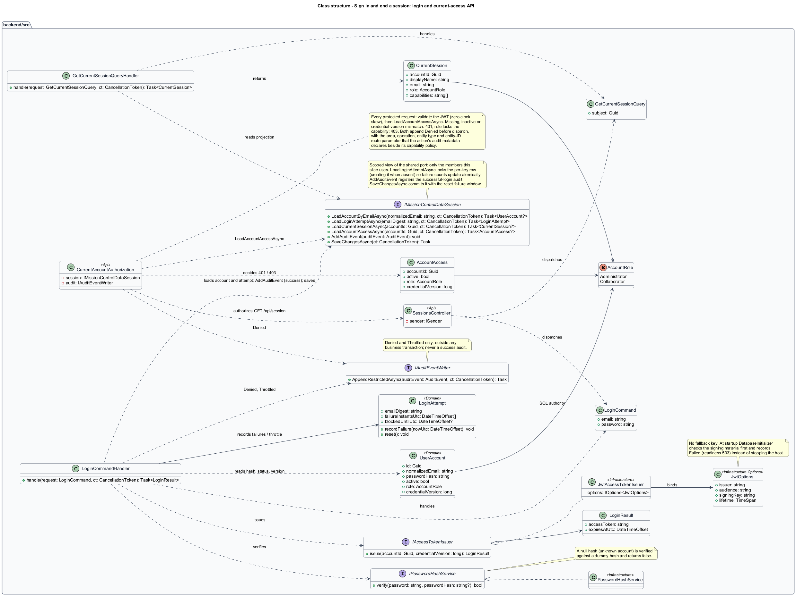

# Sign in and end a session

## Overview

Mission Control authenticates account holders before displaying contacts or project work.

- **Account** — SQL-backed login identity with an active flag and application role
- **Session** — in-memory client access token valid for 30 minutes, with a generation number that changes when the session ends

Lead contacts identify responsibilities and do not create accounts or grant access. This slice covers credential login, current-access checks, expiry, and local logout.
It also defines the client session protocol that every protected adapter and route follows.

This design refines the [L2 baseline](../../../specs/L2.md) and its linked L1 scope. Proposed defaults retain their proposal status.

## Description

The [shared design rules](../../README.md#shared-design-rules) apply: proposed type status, Application placement and MediatR `12.5.0`, authentication and validation V, responsive profile R and accessibility, token styling, data ownership and session handling, and incremental ATDD. This page records feature-specific behavior and exceptions only.

| Part | Responsibility and architectural home |
| --- | --- |
| `LoginPage` | Routed page at `/login` in `frontend/projects/mission-control`, outside the authenticated `ApplicationShell` layout; shows the notice held in `RouteContext.loginNotice` and navigates after sign-in. |
| `SessionView` | Domain component in `frontend/projects/domain`; injects `SESSION_SERVICE`, owns the sign-in draft and request state in signals, and emits `signedIn` to `LoginPage`. |
| `ISessionService`, `SESSION_SERVICE` | Interface and token in `frontend/projects/api/session.service.contract.ts`; consumers import the contract only. |
| `SessionService` | Production adapter in `api`; owns the in-memory token, the `generation` signal, the capability summary, the expiry timer, and the single `end(reason)` path. Composition binds a mock adapter for Chromium Playwright. |
| `sessionInterceptor` | HTTP interceptor in `api`, part of the session adapter. Every protected adapter's request passes through it: it attaches the token, captures the generation, aborts on session end, discards stale responses, sets the `offline: Signal<boolean>` member of `ISessionService` when a request gets no response and clears it on the next response, and routes `401` and `403` to `SessionService`. |
| `SessionEndReason`, `SessionEndedError` | `api` types: the reasons `SignedOut`, `Expired`, and `Unauthorized`, and the rejection of a mutation promise whose generation ended while it was in flight (aborted, or answered late). |
| `SessionsController` | Thin controller under `backend/src/MissionControl.Api/Controllers`, namespace `MissionControl.Api.Controllers`. |
| `LoginCommandHandler` | Application handler; verifies through `IPasswordHashService`, issues through `IAccessTokenIssuer`, and records failures in `LoginAttempt`. |
| `IPasswordHashService`, `IAccessTokenIssuer` | Shared Application [security ports](../../README.md#data-access-and-security-ports). Infrastructure `PasswordHashService` implements salted hashing; `JwtAccessTokenIssuer` signs tokens and owns `JwtOptions`. |
| `UserAccount` | Domain entity: normalized email, stored hash, active flag, role, and credential version. It holds no hashing logic. |
| `LoginAttempt` | Domain entity: keyed email digest, failure instants, and blocked-until instant for throttling. |
| `CurrentSession` | Application read projection returned by `GET /api/session`: account ID, display name, account email, role, and the [capability names](../../README.md#capabilities-and-permissions) the role holds; no lead-contact data. The user menu shows the name, email, and role. |
| `CurrentAccountAuthorization` | Authorization component in `backend/src/MissionControl.Api`. On every protected request it validates the JWT with zero clock skew, reads current status, role, and credential version through `LoadAccountAccessAsync(accountId, ct)`, and returns `401` or `403` before dispatch, appending `Denied` through `IAuditEventWriter` with the area, operation name, entity type, and entity ID that the controller action's audit metadata declares beside its capability policy (the entity ID from a named route parameter); [Review audit events](../review-audit-events/README.md) lists the areas. |
| `IMissionControlDataSession` | Shared Application data port defined in the [overview](../../README.md#data-access-and-security-ports); this slice uses its typed reads, `AddAuditEvent`, and `SaveChangesAsync`. |
| `IAuditEventWriter` | Application audit port; `AppendRestrictedAsync(AuditEvent, ct)` appends `Denied` and `Throttled` outside any business transaction. The successful-login audit is not written here: the handler registers it with `AddAuditEvent`, and `SaveChangesAsync` commits it with the reset failure window. |

`POST /api/sessions` is public; every other `/api` endpoint requires a session. It accepts normalized email and an untrimmed password.
`LoginCommandHandler` verifies the password through `IPasswordHashService` and issues the token through `IAccessTokenIssuer`.
`PasswordHashService` uses a maintained salted password hash; the algorithm configuration is `<TO SUPPLY>` before implementation.
`JwtAccessTokenIssuer` binds `JwtOptions` (issuer, audience, signing material, lifetime). No fallback key exists.
At startup, [`DatabaseInitializer`](../initialize-administrator/README.md) checks the signing material before anything else; missing or invalid material records `Failed`, so readiness answers `503` rather than the host stopping.
API token validation reads the same issuer, audience, and signing material. The signing algorithm and external secret facility are `<TO SUPPLY>`.
The token contains account ID, credential version, issuer, audience, and expiry. It excludes contact data and passwords.
The login response carries the token and its `expiresAtUtc`; the capability summary comes from `GET /api/session`.
`CurrentAccountAuthorization` verifies the token and loads current SQL status, role, and credential version through `LoadAccountAccessAsync` on every protected request.
Token validation sets `ClockSkew` to zero, so any request at or after `exp` returns `401` (L2-003.1); the .NET default skew of five minutes is not used.
An inactive or missing account, or a credential version that differs from the token's, returns `401` (L2-002.3, L2-004.4).
Role changes apply on the next request as `403` for operations no longer permitted. Password replacement increments the version and invalidates earlier tokens.

`LoginAttempt` records a keyed digest of normalized email, failure instants, and a blocked-until instant in SQL.
`LoadLoginAttemptAsync` locks the per-key row, so concurrent attempts update it atomically; five failures in a rolling 15-minute window set a further 15-minute throttle.
The fifth invalid attempt returns the generic `401`; subsequent attempts return `429`, including unknown emails.
`429` carries `Retry-After` and the blocked-until UTC instant. The login view shows that instant in Toronto time and the remaining minutes, keeping the email.
Successful login after the interval clears the failure window. Unknown, incorrect, and inactive credentials share the same failure message.
For an unknown account the handler passes no stored hash, and `IPasswordHashService` verifies against a dummy hash. Throttling never changes account status or role.

`SessionService` keeps the token only in memory; it never uses local storage, session storage, URLs, or cookies.
`login()` stores the token and schedules a proactive session end at `expiresAtUtc`. A late timer or a skewed client clock is covered by the `401` path.
`generation` starts at zero and increments at every session end; it never decreases while the page lives.
Every protected adapter's request passes through `sessionInterceptor`, which attaches the token and captures the current generation when sending.
A `401` carrying the current generation calls `end(Unauthorized)` once, and that request's promise still rejects with its `401`, not `SessionEndedError`; the `401` proves nothing was written.
`SessionEndedError` is reserved for a request whose generation ended while it was in flight. Its late response or error is discarded: a read resource keeps its state, a mutation's promise rejects with `SessionEndedError`, and no logout follows.
Later `401`s from that generation no longer match, so a session ends once.
The login request carries no token, and its `401` is a credential failure; `end()` does nothing while no session is held.

`end(reason)` is the single session-end path for Sign out (`SignedOut`), proactive expiry (`Expired`), and a current-generation `401` (`Unauthorized`).
It increments `generation` and clears the token, the capability summary, and the expiry timer.
It aborts every in-flight protected request inside the interceptor; unsubscribing aborts the `HttpClient` request, so domain components manage no HTTP subscriptions.
Read resources also abort when their consumer is destroyed.
It then sets `endReason`. On `Expired` or `Unauthorized`, `ApplicationShell` navigates to `/login`, as the [navigation design](../../workspace/navigate-and-recover-input/README.md) describes; `SignedOut` is always preceded by the caller's own navigation.
The two `SignedOut` callers are Sign out in `ApplicationShell` and, after the caller replaces their own password, [`ReplacePasswordDialog`](../manage-accounts/README.md), which sets `loginNotice` to `signed-out`, navigates to `/login`, and then calls `end(SignedOut)`.
Every navigation to `/login` (Sign out, the own-password sign-out, the session-end navigation, and `AuthenticationGuard`'s redirect) replaces the current history entry (`replaceUrl`).
Both `SignedOut` callers navigate with router state `{ signOut: true }`, which the `/login` guard lets through while the session is still held; only then do they call `end(SignedOut)`.
That navigation destroys every route-owned component and route-scoped provider holding protected data.
No protected record is kept in a root-level service or in browser storage. `SessionService` holds only the token and the capability summary, and `RouteContext` holds only route identifiers (return path, workspace and ancestor IDs) and the login notice.
Cancellation never implies that a mutation did not commit. A form or dialog save whose promise rejects with `SessionEndedError` never resolves for its form, so the `pending` it reports through `FormDraft` stays true.
Login then opens in its `session-save-unknown` state, which asks the user to check the record; so does a form whose last save got no response and that reports `unconfirmed`, because that save may have committed too.
A dirty draft that was never sent, or whose save was answered by a current-generation `401`, opens `session-unsaved`; neither state reports a successful save (L2-003.4).
Only a `FormDraft` reporting `pending` or `unconfirmed` yields `session-save-unknown`. A board move, reorder, status control, or other mutation without a `FormDraft` that rejects with `SessionEndedError` leaves login in `session-ended`, and its view rereads after sign-in, which shows whether it committed.
Local logout does not revoke a copied token.

The capability summary is the `CurrentSession` read by `GET /api/session` and held in the `currentSession` signal.
Its `capabilities` use the shared names `leads.manage`, `workspaces.manage`, `workspaces.changeMode`, `work.delete`, `accounts.manage`, and `audit.read`; an Administrator holds all six and a Collaborator none.
`refreshCapabilities(): Promise<CurrentSession | null>` loads it. Concurrent callers share one in-flight request, and with no token it resolves `null` without a request.
`LoginPage` calls it after sign-in, and `PermissionGuard` calls it on each primary-route activation, so later navigations pick up role changes.
`sessionInterceptor` also calls it after any `403` carrying the current generation; the `403` still reaches its caller.
Navigation and controls bound to `currentSession` then follow the current role. The API remains the authority for every operation.

Login failure clears the password and retains email, matching the `invalid` mock. A `400` with one field error moves focus to that field, which reads its error, and several move focus to the linked error summary (`validation`), with no Retry or reference ID.
A `500` keeps the email and password and shows the reference ID (`error`). A sign-in request that gets no response keeps them as well and shows "We couldn't reach Mission Control. Check your connection and try again." with no reference ID, because no answer arrived (`unreachable`).
Sign in sends the request again only when pressed; nothing retries automatically. `/login` sits outside `ApplicationShell`, so the shell's offline banner never appears there.
Successful login clears `endReason` and `loginNotice`. `LoginPage` awaits `refreshCapabilities()` and navigates to `requestedPath` only if `PermissionGuard.permits(requestedPath, currentSession())`, otherwise `/home`; that navigation also replaces the current history entry (`replaceUrl`).
Permitted means `currentSession().capabilities` hold the capability that path's route requires; a failed refresh leaves no summary, so `/home`, which needs no capability, opens and its sections report their own read failures.
`/login` opened while a session is held redirects to `/home`, except the sign-out navigation itself, which carries the `{ signOut: true }` state; browser Back therefore never reaches the sign-in form of a live session.
Return-route validation accepts internal application paths only. HTTP authentication redirects or rejects before exchanging credentials; CORS allows configured origins.
`LoginPage` shows `signed-out` after Sign out or after replacing your own password, and `session-ended` after expiry, a `401`, or a reload.
It shows `session-unsaved` or `session-save-unknown` when a form's draft, pending save, or unconfirmed save, reported through `FormDraft`, was dropped, and `deep-link` for a protected URL opened without a session.

| Behavior | Proposed boundary | Request / handler |
| --- | --- | --- |
| Authenticate credentials | `POST /api/sessions` | `LoginCommand` / `LoginCommandHandler` |
| Check current access | `GET /api/session` | `GetCurrentSessionQuery` / `GetCurrentSessionQueryHandler` |
| End a session | Client only; no request | `ISessionService.end(reason)` |

Mock input and review references:

- [Sign in · Mission Control mock](../../../mocks/auth/login.html); review states: `default`, `validation`, `submitting`, `invalid`, `throttled`, `signed-out`, `session-ended`, `session-unsaved`, `session-save-unknown`, `deep-link`, `error`, `unreachable`.
- [Unsaved changes · Mission Control mock](../../../mocks/shell/unsaved-changes-dialog.html); review states: `navigate`, `cancel-form`, `sign-out`.
- [Status pages · Mission Control mock](../../../mocks/shell/status-pages.html); review states: `not-found`, `access-denied`, `error`, `offline`.

## Requirements

Requirement text and identifiers below are copied verbatim from L2, including the source use of `must`.

| L2 ID | Refines (L1) | Requirement |
| --- | --- | --- |
| `L2-001` | `L1-001` | The application must authenticate SQL-backed active users by email and password. |
| `L2-002` | `L1-001` | The API must validate signature, configured issuer/audience, subject, and expiry, and evaluate current account status and permissions in SQL for protected requests. |
| `L2-003` | `L1-001` | The client must hold the token in memory, clear it on logout, and require login after reload or expiry. Local logout does not revoke a copied valid access token. |
| `L2-004` | `L1-001` | Administrators must provision active users, edit names and roles, set a replacement password, and deactivate/reactivate accounts. Users must have unique normalized email, first name, last name, and a role from profile P. Names must be 1–100 characters and email must be a syntactically valid address of at most 254 characters. Proposed password policy: new or replacement passwords must be 12–128 characters, without trimming. Account deletion is outside this baseline; deactivation preserves work assignments and audit identity. |
| `L2-005` | `L1-001` | The API and UI must apply permission profile P. Lead category or contact creation must not create a login or change a user's authorization. |
| `L2-029` | `L1-007` | Primary navigation must reach Home, Leads, and Projects, with account management visible only to administrators. Work details must expose their workspace and parent path. Direct routes must enforce authentication and handle missing records. |
| `L2-036` | `L1-010` | Passwords must be stored using a maintained password-hashing mechanism with per-password salts. JWT signing material and bootstrap secrets must come from external configuration. Production authentication must use HTTPS. Tokens must not be persisted in browser local/session storage, URLs, or contact data. |
| `L2-037` | `L1-010` | The backend must independently enforce validation V, permission profile P, and record relationship rules. Data access must treat user text as data, and Angular must render user text without executing markup or scripts. CORS must permit only configured frontend origins. Public registration must not be exposed. |
| `L2-038` | `L1-010` | Proposed baseline: five failed login attempts for a normalized email within a rolling 15-minute window must cause subsequent attempts to return 429 for 15 minutes after the fifth failure. The same policy must apply to nonexistent accounts. Throttling must not deactivate or demote the designated administrator. |
| `L2-039` | `L1-010` | The system must record UTC timestamp, actor ID when known, operation, entity type/ ID, outcome, and correlation ID for account/permission changes, contact/workspace/ work mutations, board/sprint mutations, successful login, denied access, and throttling. Audit data must exclude secrets and contact payloads. Only administrators must access audit records; audit mutation endpoints must be absent. |
| `L2-043` | `L1-012` | The API must return a correlation ID for unexpected failures and write structured diagnostic records containing operation, UTC time, outcome, and that same ID. Users must receive useful error categories without internal stack traces or secret values. Production logs and diagnostics must be restricted operational data. |

## Diagrams

The context view identifies the actor and the Mission Control capability.

The container view separates the client, .NET API, and durable SQL records.

The component view locates the client session parts, request dispatch, the hashing and token ports, and persistence.

The client class view shows the session protocol members that every protected adapter and route relies on.

The API class view shows the login and current-access requests, the Application ports, and their Infrastructure owners.

Authenticate credentials follows the sequence below. The flow traces its enforcing steps to `L2-001` and `L2-039` and includes rejection or recovery paths, including a request that gets no response.

Check current access follows the sequence below. It covers the deduplicated capability refresh, the guard's access-denied, error, and offline statuses, the single session end on `401`, stale-generation discards, and the refresh after any `403` with each caller's presentation.

Sign out, an own-password replacement, proactive expiry, and a current-generation `401` converge on one `end(reason)` path below; the two `SignedOut` callers navigate first. A reload starts with no session, so no end runs.

