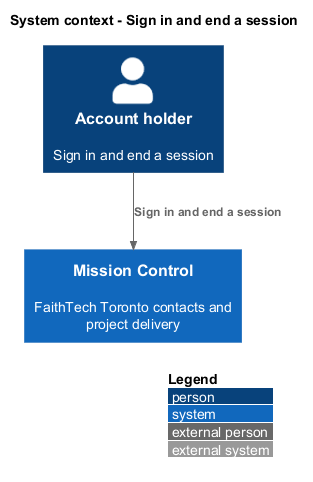
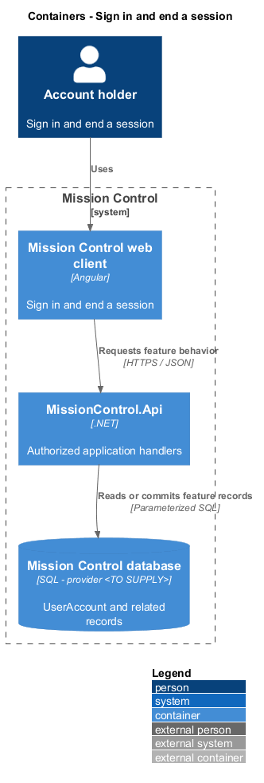
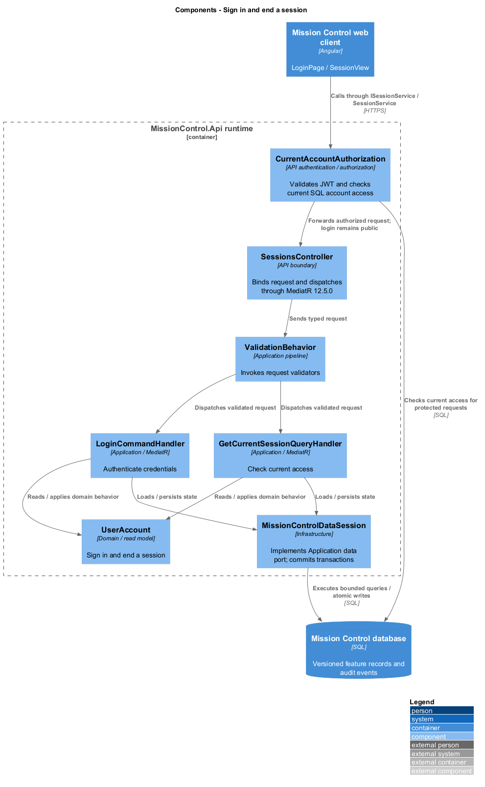
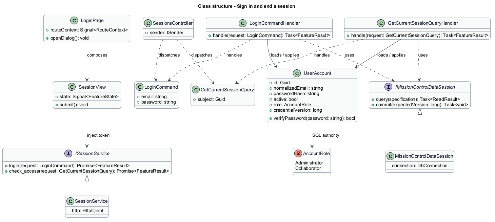
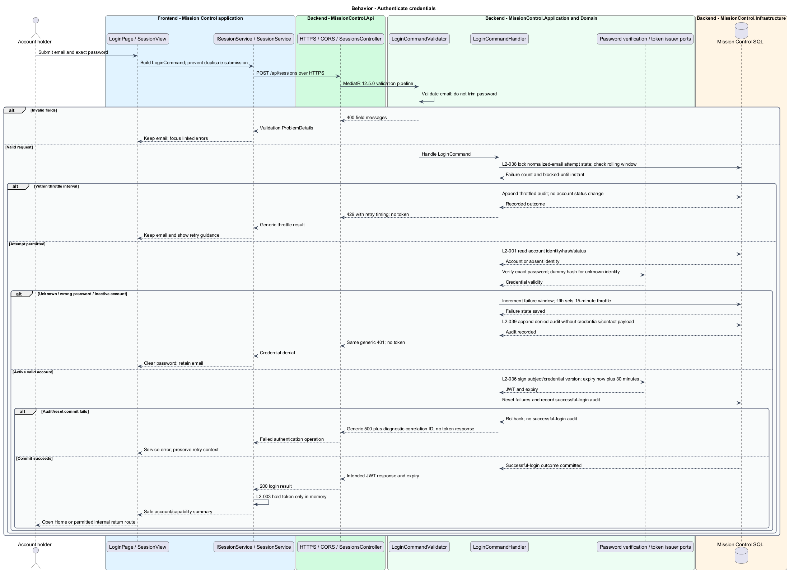
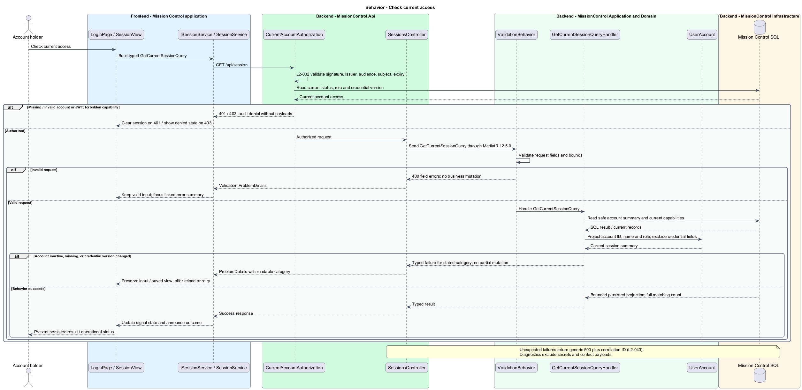
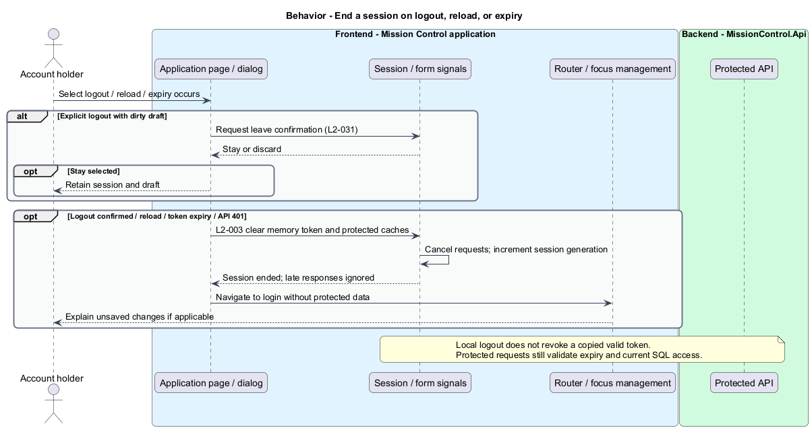

# Sign in and end a session

## Overview

Mission Control authenticates account holders before displaying contacts or project work.

- **Account** — SQL-backed login identity with an active flag and application role
- **Session** — in-memory client access token valid for 30 minutes

Lead contacts identify responsibilities and do not create accounts or grant access. This slice covers credential login, current-access checks, expiry, and local logout.

This design refines the [L2 baseline](../../../specs/L2.md) and its linked L1 scope. Proposed defaults retain their proposal status.

## Description

All named production types are proposed; the repository currently contains requirements and static mocks.

| Part | Responsibility and architectural home |
| --- | --- |
| `LoginPage` | Routed page or dialog owned by `frontend/projects/mission-control`; composes the domain library and presentational components. |
| `SessionView` | Domain component in `frontend/projects/domain`; injects `SESSION_SERVICE` and holds feature state in signals. |
| `ISessionService`, `SESSION_SERVICE` | Interface and token in `frontend/projects/api/session.service.contract.ts`; the consumer imports the contract only. |
| `SessionService` | Production HTTP adapter in `api`; owns HTTP calls and observable-to-signal conversion. Composition binds a mock adapter for Chromium Playwright. |
| `SessionsController` | Thin controller under `backend/src/MissionControl.Api/Controllers`, namespace `MissionControl.Api.Controllers`; binds, dispatches, and returns. |
| `UserAccount` | Domain entity or Application read projection described below; Domain has no external project dependency. |
| `IMissionControlDataSession` | Application data port; the Infrastructure adapter runs parameterized queries and transaction commits. |

Commands, queries, handlers, and request validators live in Application feature folders. Each type has its own file; folders and namespaces agree.
MediatR remains pinned to `12.5.0`. Microsoft.Extensions supplies dependency injection, Options, and Configuration.

`POST /api/sessions` accepts normalized email and an untrimmed password. `LoginCommandHandler` uses `IPasswordHashService` and `IAccessTokenIssuer` ports.
The Infrastructure password adapter uses a maintained salted password hash; the algorithm configuration is `<TO SUPPLY>` before implementation.
`JwtOptions` validates external issuer, audience, and signing material. No fallback key exists. The signing algorithm and external secret facility are `<TO SUPPLY>`.
The token contains account ID, credential version, issuer, audience, and expiry. It excludes contact data and passwords.
`CurrentAccountAuthorization` verifies the token and loads current SQL status, role, and credential version on every protected request.
Role changes apply on the next request. Password replacement increments the version and invalidates earlier tokens.

`LoginAttempt` records a keyed digest of normalized email, failure instants, and a blocked-until instant in SQL.
Atomic per-key updates enforce five failures in a rolling 15-minute window; the fifth sets a further 15-minute throttle.
The fifth invalid attempt returns the generic `401`; subsequent attempts return `429` with retry timing, including unknown emails.
Successful login after the interval clears the failure window. Unknown, incorrect, and inactive credentials share the same failure message.
The handler performs a dummy hash verification for unknown accounts. Throttling never changes account status or role.

`SessionService` stores tokens only in memory; it never uses local storage, session storage, URLs, or cookies.
Logout is a client operation, clears protected signal caches, cancels in-flight protected requests, and navigates to login.
A session generation counter ignores responses from an earlier session, preventing late responses from repopulating cleared data.
Reload and expiry require login; unsaved-form expiry explains that no save completed. Local logout does not revoke a copied token.
Login failure clears the password and retains email, matching the `invalid` mock. The requested internal route is restored only after access checks.
Return-route validation accepts internal application paths only. HTTP authentication redirects or rejects before exchanging credentials; CORS allows configured origins.

The authenticated API evaluates current SQL permissions before feature dispatch. Validation V maps invalid fields to `400`, absent authentication to `401`, forbidden access to `403`, missing records to `404`, and conflicts to `409`.
Unexpected errors return a generic `500` with a correlation ID. Structured diagnostics exclude secrets and contact payloads.

Responsive profile R covers `320`, `375`, `576`, `768`, `992`, `1200`, and `1920` CSS-pixel widths at `800` pixels high.
Forms stack on compact screens; dialogs become sheets below `576px`. Templates, styles, and classes remain separate files.
Component styles read `var(--mc-<role>)` from the mirrored authoritative design-system tokens.
Keyboard actions include visible focus, named controls, modal focus containment, trigger focus restoration, and destination-heading focus after navigation.
Field errors connect to inputs; asynchronous results use status or alert announcements. Status text supplements color; primary touch targets measure at least `44×44` CSS pixels.

| Behavior | Proposed boundary | Request / handler |
| --- | --- | --- |
| Authenticate credentials | `POST /api/sessions` | `LoginCommand` / `LoginCommandHandler` |
| Check current access | `GET /api/session` | `GetCurrentSessionQuery` / `GetCurrentSessionQueryHandler` |

Mock input and review references:

- [Sign in · Mission Control mock](../../../mocks/auth/login.html); review states: `default`, `validation`, `submitting`, `invalid`, `throttled`, `signed-out`, `session-ended`, `session-unsaved`, `deep-link`, `error`.
- [Unsaved changes · Mission Control mock](../../../mocks/shell/unsaved-changes-dialog.html); review states: `navigate`, `cancel-form`, `sign-out`.
- [Status pages · Mission Control mock](../../../mocks/shell/status-pages.html); review states: `not-found`, `access-denied`, `error`, `offline`.

Implementation proceeds one behavior at a time using the linked Given-When-Then criteria. An API integration acceptance check first fails for the expected missing behavior.
A Chromium Playwright check uses one page object per screen and a mock service bound through the same token. Tests express intent; page objects own selectors.
The smallest implementation turns those checks green before the next behavior begins. Relevant regression checks follow each slice; no architecture tests are introduced.

## Requirements

Requirement text and identifiers below are copied verbatim from L2, including the source use of `must`.

| L2 ID | Refines (L1) | Requirement |
| --- | --- | --- |
| `L2-001` | `L1-001` | The application must authenticate SQL-backed active users by email and password. |
| `L2-002` | `L1-001` | The API must validate signature, configured issuer/audience, subject, and expiry, and evaluate current account status and permissions in SQL for protected requests. |
| `L2-003` | `L1-001` | The client must hold the token in memory, clear it on logout, and require login after reload or expiry. Local logout does not revoke a copied valid access token. |
| `L2-005` | `L1-001` | The API and UI must apply permission profile P. Lead category or contact creation must not create a login or change a user's authorization. |
| `L2-036` | `L1-010` | Passwords must be stored using a maintained password-hashing mechanism with per-password salts. JWT signing material and bootstrap secrets must come from external configuration. Production authentication must use HTTPS. Tokens must not be persisted in browser local/session storage, URLs, or contact data. |
| `L2-037` | `L1-010` | The backend must independently enforce validation V, permission profile P, and record relationship rules. Data access must treat user text as data, and Angular must render user text without executing markup or scripts. CORS must permit only configured frontend origins. Public registration must not be exposed. |
| `L2-038` | `L1-010` | Proposed baseline: five failed login attempts for a normalized email within a rolling 15-minute window must cause subsequent attempts to return 429 for 15 minutes after the fifth failure. The same policy must apply to nonexistent accounts. Throttling must not deactivate or demote the designated administrator. |
| `L2-043` | `L1-012` | The API must return a correlation ID for unexpected failures and write structured diagnostic records containing operation, UTC time, outcome, and that same ID. Users must receive useful error categories without internal stack traces or secret values. Production logs and diagnostics must be restricted operational data. |

## Diagrams

The context view identifies the actor and the Mission Control capability.

The container view separates the client, .NET API, and durable SQL records.

The component view locates request dispatch, domain behavior, and persistence within the feature.

The class view shows proposed typed requests, interface consumption, and relationships between the feature parts.

Authenticate credentials follows the sequence below. The flow traces its enforcing steps to `L2-001` and includes rejection or recovery paths.

Check current access follows the sequence below. The flow traces its enforcing steps to `L2-002` and includes rejection or recovery paths.

End a session on logout, reload, or expiry remains a client-side behavior with no mutation request for discarded input.

