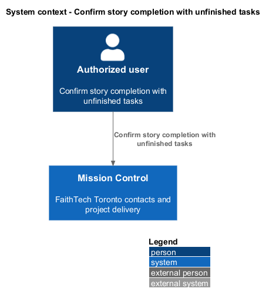
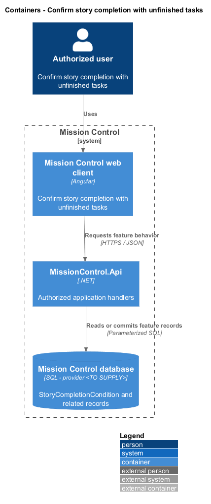
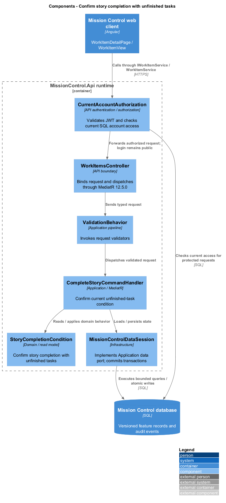
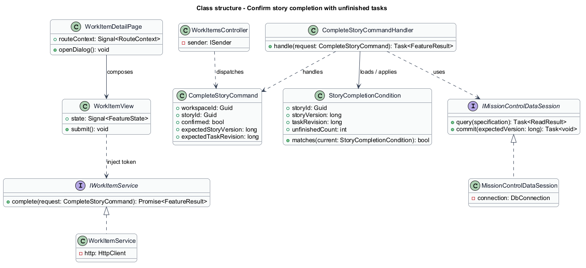
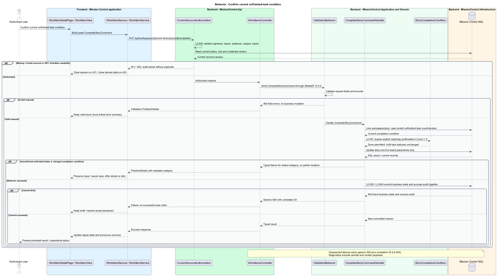

# Confirm story completion with unfinished tasks

## Overview

A story can be complete even while tasks remain unfinished, but the decision requires explicit review.

- **Completion condition** — versioned summary of the story's current task completion state

The same guard applies to Kanban, sprint boards, and direct story status edits. Confirming changes the story alone.

This design refines the [L2 baseline](../../../specs/L2.md) and its linked L1 scope. Proposed defaults retain their proposal status.

## Description

All named production types are proposed; the repository currently contains requirements and static mocks.

| Part | Responsibility and architectural home |
| --- | --- |
| `WorkItemDetailPage` | Routed page or dialog owned by `frontend/projects/mission-control`; composes the domain library and presentational components. |
| `WorkItemView` | Domain component in `frontend/projects/domain`; injects `WORK_ITEM_SERVICE` and holds feature state in signals. |
| `IWorkItemService`, `WORK_ITEM_SERVICE` | Interface and token in `frontend/projects/api/work-item.service.contract.ts`; the consumer imports the contract only. |
| `WorkItemService` | Production HTTP adapter in `api`; owns HTTP calls and observable-to-signal conversion. Composition binds a mock adapter for Chromium Playwright. |
| `WorkItemsController` | Thin controller under `backend/src/MissionControl.Api/Controllers`, namespace `MissionControl.Api.Controllers`; binds, dispatches, and returns. |
| `StoryCompletionCondition` | Domain entity or Application read projection described below; Domain has no external project dependency. |
| `IMissionControlDataSession` | Application data port; the Infrastructure adapter runs parameterized queries and transaction commits. |

Commands, queries, handlers, and request validators live in Application feature folders. Each type has its own file; folders and namespaces agree.
MediatR remains pinned to `12.5.0`. Microsoft.Extensions supplies dependency injection, Options, and Configuration.

`StoryCompletionPolicy` in Application loads unfinished count and `TaskRevision` under the workspace transaction lock.
Every child task create, delete, reparent, or status update increments the affected story's task revision in the same transaction.
A Done request with no tasks or all tasks Done proceeds without confirmation.
Otherwise it returns `409` with a specific `unfinished-tasks` category, current count, story version, and task revision.
The dialog initially focuses Keep in progress and names the story and unfinished count.

Explicit confirmation resubmits the requested transition with `confirmed=true` and the displayed completion condition.
The server rechecks the condition atomically. A changed revision/count returns a new `409` and the `server-count` mock state requests fresh confirmation.
Cancellation restores any dragged card and sends no transition. Success updates story status and live placements without changing any task status.
The completion command delegates to the same status-transition service used by `MoveStoryCommand` and `UpdateWorkItemCommand`.
The dedicated endpoint below supports the detail status control; it does not bypass the shared guard.

The authenticated API evaluates current SQL permissions before feature dispatch. Validation V maps invalid fields to `400`, absent authentication to `401`, forbidden access to `403`, missing records to `404`, and conflicts to `409`.
Unexpected errors return a generic `500` with a correlation ID. Structured diagnostics exclude secrets and contact payloads.

Responsive profile R covers `320`, `375`, `576`, `768`, `992`, `1200`, and `1920` CSS-pixel widths at `800` pixels high.
Forms stack on compact screens; dialogs become sheets below `576px`. Templates, styles, and classes remain separate files.
Component styles read `var(--mc-<role>)` from the mirrored authoritative design-system tokens.
Keyboard actions include visible focus, named controls, modal focus containment, trigger focus restoration, and destination-heading focus after navigation.
Field errors connect to inputs; asynchronous results use status or alert announcements. Status text supplements color; primary touch targets measure at least `44×44` CSS pixels.

| Behavior | Proposed boundary | Request / handler |
| --- | --- | --- |
| Confirm current unfinished-task condition | `PUT /api/workspaces/{id}/work-items/{storyId}/completion` | `CompleteStoryCommand` / `CompleteStoryCommandHandler` |

Mock input and review references:

- [Unfinished tasks confirmation · Mission Control mock](../../../mocks/kanban/unfinished-tasks-dialog.html); review states: `default`, `server-count`, `saving`.
- [Move story · Mission Control mock](../../../mocks/kanban/move-story-dialog.html); review states: `default`, `to-done`, `saving`, `failed`.
- [Work item detail · Mission Control mock](../../../mocks/work/work-item-detail.html); review states: `default`, `initiative`, `epic`, `task`, `unset`, `inactive-assignee`, `collaborator`, `not-found`, `loading`, `error`.

Implementation proceeds one behavior at a time using the linked Given-When-Then criteria. An API integration acceptance check first fails for the expected missing behavior.
A Chromium Playwright check uses one page object per screen and a mock service bound through the same token. Tests express intent; page objects own selectors.
The smallest implementation turns those checks green before the next behavior begins. Relevant regression checks follow each slice; no architecture tests are introduced.

## Requirements

Requirement text and identifiers below are copied verbatim from L2, including the source use of `must`.

| L2 ID | Refines (L1) | Requirement |
| --- | --- | --- |
| `L2-021` | `L1-005` | Marking a story Done while it contains unfinished tasks must require an explicit confirmation showing the unfinished count. Confirmation must not silently mark tasks Done. The rule applies to Kanban, Scrum, and direct story status edits. |
| `L2-024` | `L1-006` | An active sprint board must show only its currently allocated stories, using the same status columns, task counts, and accessible move behavior as Kanban. Story status is shared across backlog, hierarchy, and sprint views. |
| `L2-031` | `L1-008` | Forms must expose field-specific validation, retain input on rejected saves, prevent duplicate submission while pending, display results, and confirm leaving with unsaved edits. Destructive confirmations must name the affected item. |
| `L2-033` | `L1-009` | Every application workflow must be operable by keyboard without required dragging. Focus must remain visible, follow a logical sequence, and be managed when dialogs open/close and routed content changes. |
| `L2-034` | `L1-009` | Application controls must expose programmatic names and roles. Inputs must have associated labels; field errors must identify their inputs. Pages must expose main/navigation regions and a coherent heading hierarchy. Asynchronous outcomes must be announced without relying only on visual changes. |
| `L2-040` | `L1-011` | Committed account, contact, hierarchy, ordering, board, and sprint changes must survive restart. Operations spanning multiple records must commit entirely or leave all affected business records unchanged. |
| `L2-041` | `L1-011` | Edits must carry a record version or equivalent concurrency condition. SQL constraints must protect normalized account emails, lead email/category pairs, parent references, open sprint membership, and active sprint exclusivity. Caller errors must produce validation/conflict responses rather than generic failures. |

## Diagrams

The context view identifies the actor and the Mission Control capability.

The container view separates the client, .NET API, and durable SQL records.

The component view locates request dispatch, domain behavior, and persistence within the feature.

The class view shows proposed typed requests, interface consumption, and relationships between the feature parts.

Confirm current unfinished-task condition follows the sequence below. The flow traces its enforcing steps to `L2-021` and includes rejection or recovery paths.

