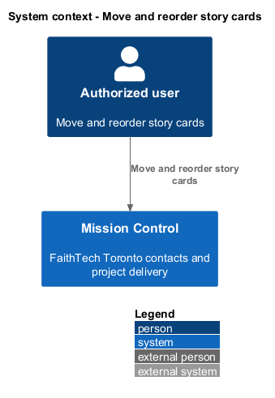
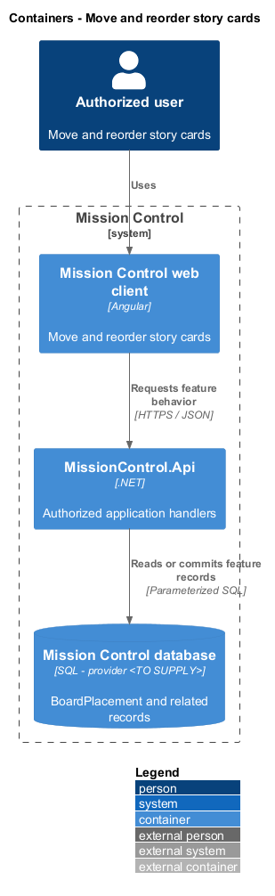
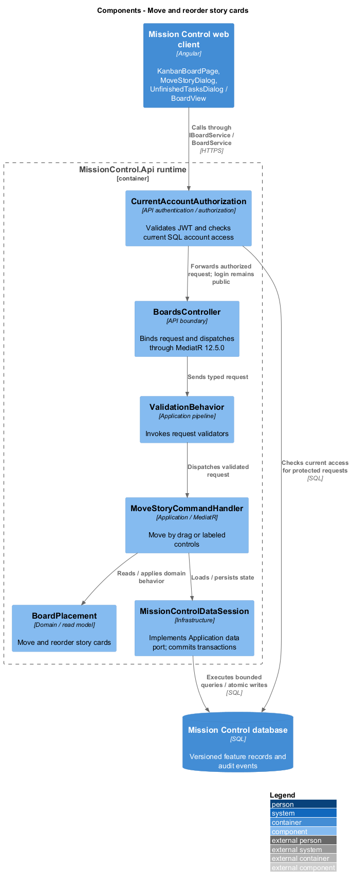
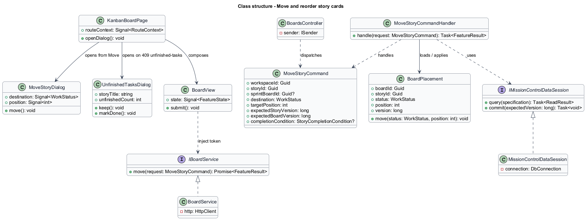
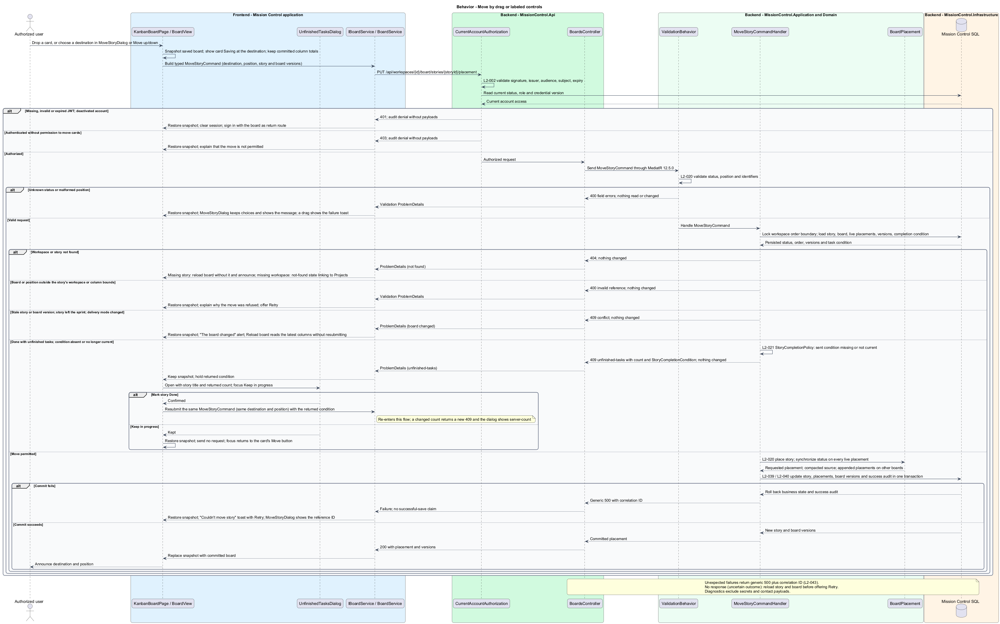

# Move and reorder story cards

## Overview

Authorized users move stories between statuses and reorder cards within a column.

- **Board placement** — persisted story position in a board's status column

Pointer drag and named move controls produce the same API command. Failed moves restore the saved placement.

This design refines the [L2 baseline](../../../specs/L2.md) and its linked L1 scope. Proposed defaults retain their proposal status.

## Description

All named production types are proposed; the repository currently contains requirements and static mocks.

| Part | Responsibility and architectural home |
| --- | --- |
| `KanbanBoardPage` | Routed page or dialog owned by `frontend/projects/mission-control`; composes the domain library and presentational components. |
| `MoveStoryDialog` | Application dialog in `frontend/projects/mission-control`, opened by `KanbanBoardPage` and `SprintBoardPage`; chooses destination column and position without dragging. |
| `UnfinishedTasksDialog` | Application dialog in `frontend/projects/mission-control`, opened by `KanbanBoardPage`, `SprintBoardPage`, and (confirmation only) `WorkItemDetailPage`; shows the returned unfinished count and focuses Keep in progress. |
| `BoardView` | Domain component in `frontend/projects/domain`; injects `BOARD_SERVICE` and holds feature state in signals. |
| `IBoardService`, `BOARD_SERVICE` | Interface and token in `frontend/projects/api/board.service.contract.ts`; the consumer imports the contract only. |
| `BoardService` | Production HTTP adapter in `api`; owns HTTP calls and observable-to-signal conversion. Composition binds a mock adapter for Chromium Playwright. |
| `BoardsController` | Thin controller under `backend/src/MissionControl.Api/Controllers`, namespace `MissionControl.Api.Controllers`; binds, dispatches, and returns. |
| `BoardPlacement` | Domain entity or Application read projection described below; Domain has no external project dependency. |
| `IMissionControlDataSession` | Application data port; the Infrastructure adapter runs parameterized queries and transaction commits. |

Commands, queries, handlers, and request validators live in Application feature folders. Each type has its own file; folders and namespaces agree.
MediatR remains pinned to `12.5.0`. Microsoft.Extensions supplies dependency injection, Options, and Configuration.

`MoveStoryDialog` chooses destination column and absolute position; card menus also expose Move up/down.
`MoveStoryCommand` contains workspace/story, optional sprint board ID, destination status/position, expected story version, and board version.
After confirmation it also carries the returned `StoryCompletionCondition`; the first attempt carries none.
The server validates story ownership and current active-sprint membership for a sprint board.
`StoryCompletionPolicy` applies before any Done transition, including drag and direct edits.
Unknown statuses, out-of-range positions, and boards outside the story's workspace return `400` before anything changes.
A missing story returns `404`; the board reloads without it and announces that it was deleted.
A missing workspace returns `404` and shows a not-found state linking back to Projects.

`BoardState` uses a workspace Kanban identity or sprint ID and owns a versioned order per board.
`BoardPlacement` uniquely identifies `(BoardId, StoryId)` and `(BoardId, Status, Position)`.
Story status remains authoritative on `WorkItem`; placement status is constrained to match through the SQL adapter's composite relationship.
An open-sprint story may appear on its sprint board and, during a later Kanban mode, on the continuous workspace board.
A status-changing command updates every live placement for that story in the same workspace transaction.
The requested board gets the explicit target position; other affected boards append the story in the destination column and compact its source column.
Other board versions increment. This avoids diverging order/status after mode changes or direct detail edits.
Column reorders affect only the selected board, never backlog or sibling priority.

The UI snapshots the saved board before an optimistic move. The pending card reports Saving while totals remain committed totals.
A confirmed commit replaces the snapshot and announces destination and position.
A rejected or unavailable save restores the snapshot and offers retry.
A `409` with the `unfinished-tasks` category keeps the snapshot and opens `UnfinishedTasksDialog` with the returned count.
Mark story Done resubmits the same `MoveStoryCommand` (same destination and position) carrying the returned `StoryCompletionCondition`.
Keep restores the snapshot and sends no request. Any other `409` reloads current state before a fresh explicit attempt.
That covers a stale story or board version, a story no longer on the sprint board, and a changed delivery mode.
The board restores the snapshot, explains that the board changed, and Reload board reads the latest columns without resubmitting.
An uncertain network outcome first reloads the story/board before retry, avoiding a second blind mutation.
SQL transactions lock the workspace order boundary and compare versions and the completion condition before any write.
They then update status and affected positions and append the audit event atomically.

The authenticated API evaluates current SQL permissions before feature dispatch. Validation V maps invalid fields to `400`, absent authentication to `401`, forbidden access to `403`, missing records to `404`, and conflicts to `409`.
Unexpected errors return a generic `500` with a correlation ID. Structured diagnostics exclude secrets and contact payloads.

Responsive profile R covers `320`, `375`, `576`, `768`, `992`, `1200`, and `1920` CSS-pixel widths at `800` pixels high.
Forms stack on compact screens; dialogs become sheets below `576px`. Templates, styles, and classes remain separate files.
Component styles read `var(--mc-<role>)` from the mirrored authoritative design-system tokens.
Keyboard actions include visible focus, named controls, modal focus containment, trigger focus restoration, and destination-heading focus after navigation.
Field errors connect to inputs; asynchronous results use status or alert announcements. Status text supplements color; primary touch targets measure at least `44×44` CSS pixels.

| Behavior | Proposed boundary | Request / handler |
| --- | --- | --- |
| Move by drag or labeled controls | `PUT /api/workspaces/{id}/board/stories/{storyId}/placement` | `MoveStoryCommand` / `MoveStoryCommandHandler` |

Mock input and review references:

- [Kanban board · Mission Control mock](../../../mocks/kanban/kanban-board.html); review states: `default`, `dragging`, `pending`, `move-failed`, `conflict`, `empty`, `empty-column`, `load-more`, `card-menu`, `collaborator`, `preserved`, `loading`, `error`.
- [Move story · Mission Control mock](../../../mocks/kanban/move-story-dialog.html); review states: `default`, `to-done`, `saving`, `failed`.
- [Unfinished tasks confirmation · Mission Control mock](../../../mocks/kanban/unfinished-tasks-dialog.html); review states: `default`, `server-count`, `saving`, `failed`.
- [Sprint board · Mission Control mock](../../../mocks/scrum/sprint-board.html); review states: `default`, `scope-log`, `no-stories`, `no-active`, `no-sprints`, `move-failed`, `collaborator`, `loading`, `error`.

Implementation proceeds one behavior at a time using the linked Given-When-Then criteria. An API integration acceptance check first fails for the expected missing behavior.
A Chromium Playwright check uses one page object per screen and a mock service bound through the same token. Tests express intent; page objects own selectors.
The smallest implementation turns those checks green before the next behavior begins. Relevant regression checks follow each slice; no architecture tests are introduced.

## Requirements

Requirement text and identifiers below are copied verbatim from L2, including the source use of `must`.

| L2 ID | Refines (L1) | Requirement |
| --- | --- | --- |
| `L2-020` | `L1-005` | Permitted users must move stories between statuses and reorder cards using both pointer dragging and labeled move controls. The API must apply status and column order atomically. Failed or conflicting moves must restore the last saved view. |
| `L2-021` | `L1-005` | Marking a story Done while it contains unfinished tasks must require an explicit confirmation showing the unfinished count. Confirmation must not silently mark tasks Done. The rule applies to Kanban, Scrum, and direct story status edits. |
| `L2-024` | `L1-006` | An active sprint board must show only its currently allocated stories, using the same status columns, task counts, and accessible move behavior as Kanban. Story status is shared across backlog, hierarchy, and sprint views. |
| `L2-033` | `L1-009` | Every application workflow must be operable by keyboard without required dragging. Focus must remain visible, follow a logical sequence, and be managed when dialogs open/close and routed content changes. |
| `L2-034` | `L1-009` | Application controls must expose programmatic names and roles. Inputs must have associated labels; field errors must identify their inputs. Pages must expose main/navigation regions and a coherent heading hierarchy. Asynchronous outcomes must be announced without relying only on visual changes. |
| `L2-040` | `L1-011` | Committed account, contact, hierarchy, ordering, board, and sprint changes must survive restart. Operations spanning multiple records must commit entirely or leave all affected business records unchanged. |
| `L2-041` | `L1-011` | Edits must carry a record version or equivalent concurrency condition. SQL constraints must protect normalized account emails, lead email/category pairs, parent references, open sprint membership, and active sprint exclusivity. Caller errors must produce validation/conflict responses rather than generic failures. |

## Diagrams

The context view identifies the actor and the Mission Control capability.

The container view separates the client, .NET API, and durable SQL records.

The component view locates request dispatch, domain behavior, and persistence within the feature.

The class view shows proposed typed requests, interface consumption, and relationships between the feature parts.

Move by drag or labeled controls follows the sequence below. The flow traces its enforcing steps to `L2-020` and includes rejection or recovery paths.

