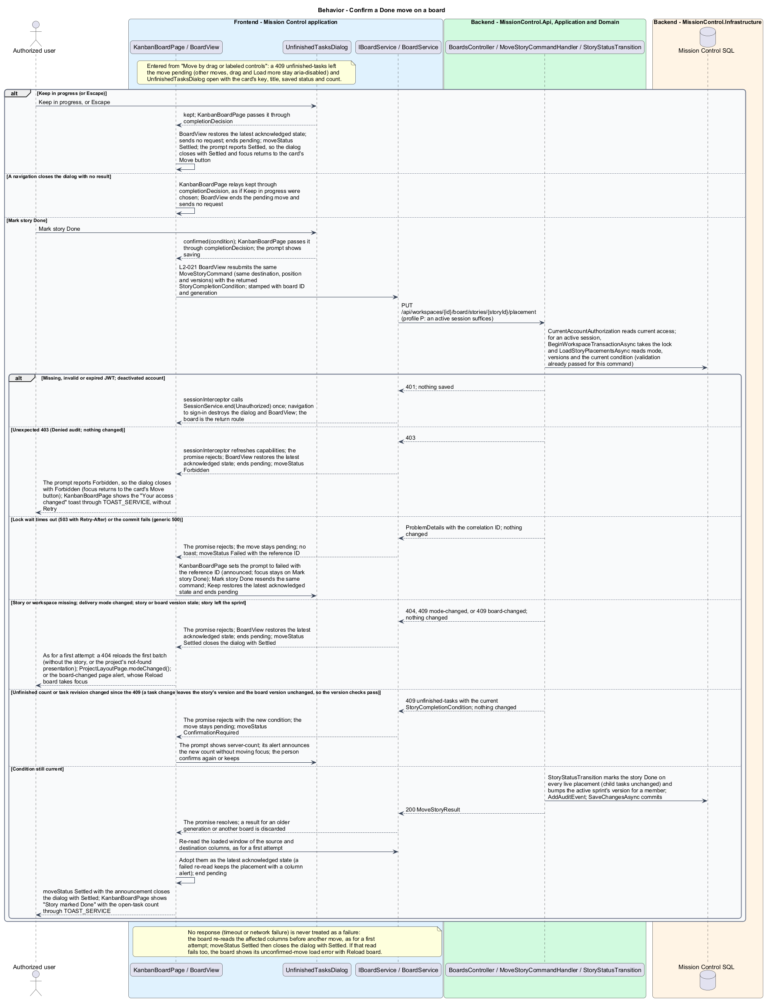

# Move and reorder story cards

## Overview

Authorized users move stories between statuses and reorder cards within a column.

- **Board placement** — persisted story position in a board's status column

Pointer drag and named move controls produce the same API command. One move saves at a time per board, and a failed move restores the latest saved board.

This design refines the [L2 baseline](../../../specs/L2.md) and its linked L1 scope. Proposed defaults retain their proposal status.

## Description

The [shared design rules](../../README.md#shared-design-rules) apply: proposed type status, Application placement and MediatR `12.5.0`, authentication and validation V, responsive profile R and accessibility, token styling, data ownership and session handling, and incremental ATDD. This page records feature-specific behavior and exceptions only.

| Part | Responsibility and architectural home |
| --- | --- |
| `KanbanBoardPage` | Routed page owned by `frontend/projects/mission-control`; composes `BoardView`, opens `MoveStoryDialog` on `moveRequested` and `UnfinishedTasksDialog` when `moveStatus` asks for confirmation, passes their choices back through `chosenMove` and `completionDecision`, shows the move's success, failure, and "Your access changed" toasts through `TOAST_SERVICE` from `moveStatus`, and calls `ProjectLayoutPage.modeChanged()` on `modeChanged`. It reacts to `MoveStoryDialog`'s close result: no result clears its move request, sends nothing, and returns focus to the card's Move button; `Settled` lets focus follow the move's outcome; `Forbidden` returns focus to the card's Move button; `ConfirmationRequired` opens `UnfinishedTasksDialog` in its place. To `UnfinishedTasksDialog`'s `Settled` or `Forbidden` it returns focus to the card's Move button unless a board alert, the board region (story deleted), or the not-found heading takes it; when a navigation closes that dialog with no result, it relays `kept` through `completionDecision`, so `BoardView` drops the pending move without a request. |
| `MoveStoryDialog` | Application dialog in `frontend/projects/mission-control`, opened by `KanbanBoardPage` and `SprintBoardPage` with the `MoveRequest` from `moveRequested` as its `request` input; chooses destination column and position without dragging, emits `chosen`, and shows the move's saving or failed status from its `status` input. It closes through `close(result: MoveStoryOutcome?)`: `Settled`, `Forbidden`, or `ConfirmationRequired` when its `status` input reports that state, and no result (dismissed) on Cancel, Close, or Escape, which are unavailable while a move is pending. |
| `UnfinishedTasksDialog` | Application dialog in `frontend/projects/mission-control`, opened by `KanbanBoardPage`, `SprintBoardPage`, `WorkItemDetailPage`, and `WorkItemFormDialog` (the edit form); shows the count from its `prompt` input, focuses Keep in progress, and emits `confirmed(condition)` on Mark story Done or `kept` on Keep in progress or Escape to its opener. It closes through `close(result: UnfinishedTasksOutcome?)`, `Settled` or `Forbidden`, when its `prompt` reports that state; it is never dismissed without a choice, except that, like any dialog, it closes with no result once a navigation leaves its page or changes that page's route parameters, and its opener then relays `kept`, so the sending component drops its pending change without a request. |
| `BoardView` | Domain component in `frontend/projects/domain`, shared by Kanban and sprint boards; injects `BOARD_SERVICE` and owns its board resource, the acknowledged board, the request generation, and the single pending move in signals. It emits `moveRequested`, `moveStatus`, and `modeChanged`. |
| `IBoardService`, `BOARD_SERVICE` | Contract and token in `frontend/projects/api/board.service.contract.ts`; the read member `boardResource(query)` returns a caller-owned `ResourceRef<BoardResult>`, and the mutation `move(command)` returns a `Promise<MoveStoryResult>`. The consumer imports the contract only. |
| `BoardService` | Production HTTP adapter in `api`; creates each board resource in the consumer's injection context, converts observables to signals or promises, aborts a superseded read when the query signal changes, and cancels reads on consumer destroy; no shared mutable state. Composition binds a mock adapter for Chromium Playwright. |
| `BoardsController` | Thin controller under `backend/src/MissionControl.Api/Controllers`, namespace `MissionControl.Api.Controllers`; binds, dispatches, and returns. |
| `StoryStatusTransition` | Application service defined by [confirm story completion](../confirm-story-completion/README.md); `MoveStoryCommandHandler` makes every status change through it. |
| `BoardState`, `BoardPlacement` | Domain entities: a board's versioned order and one story's position in one of its status columns. |
| `IMissionControlDataSession` | Shared Application data port defined in the [overview](../../README.md); this feature uses `BeginWorkspaceTransactionAsync`, `LoadStoryPlacementsAsync`, `AddAuditEvent`, and `SaveChangesAsync`. |

`MoveStoryDialog` chooses destination column and absolute position; card menus also expose Move up/down.
`BoardView` emits `moveRequested` with a `MoveRequest`: the card, and for each column of the latest acknowledged board its status, full `totalCount`, and the loaded cards' story IDs and titles.
`KanbanBoardPage` passes it to the dialog's `request` input. The dialog reads nothing on open: it starts on the card's current column and position, labels each column with its total, and offers Top of column, After each loaded card, and Bottom of column.
Move story is therefore available at once; if the board changed since it loaded, the move returns the board-changed `409` described below.
Escape or Cancel returns focus to the card's Move button.
`MoveStoryDialog` and `UnfinishedTasksDialog` hold a choice, not a draft: neither implements `FormDraft`, so neither asks the unsaved-changes confirmation.
`MoveStoryDialog`'s Cancel, Close, or Escape discards the choice and closes it with no result. `UnfinishedTasksDialog` has no dismissal: Escape is Keep in progress and emits `kept`, and while Mark story Done is pending Escape does nothing, as Keep in progress is disabled.
The page passes the dialog's `chosen` destination and position back through the `chosenMove` input; drag and Move up/down start a move inside `BoardView`.
The view reports each move through its `moveStatus` output: `Saving`, `ConfirmationRequired` with the returned condition, `Failed` with the reference ID, `Forbidden`, or `Settled`.
Every status carries the card and its `MoveChoice`; a saved move's `Settled` also carries the success announcement.
The page passes it to the open dialog, as `MoveStoryDialog`'s `status` or the `prompt` built from it, and the dialog closes itself with the matching result on `Settled`, `Forbidden`, or, for `MoveStoryDialog`, `ConfirmationRequired`. Toasts follow `moveStatus` whether or not a dialog is open, so a close result adds only focus and the next dialog.
A `Failed` move with no dialog open shows the "Couldn't move story" toast through `TOAST_SERVICE`, with the reference ID and Retry, which sets `chosenMove` to the status's choice again. A `Settled` announcement shows as a success toast.
`MoveStoryCommand` contains workspace/story, optional sprint board ID, destination status/position, expected story version, and board version.
After confirmation it also carries the returned `StoryCompletionCondition`; the first attempt carries none.
The server validates story ownership and current active-sprint membership for a sprint board.
A status change goes through `StoryStatusTransition`, which applies `StoryCompletionPolicy` before any Done transition; direct story edits and the completion endpoint use the same service.
Unknown statuses, out-of-range positions, and boards outside the story's workspace return `400` before anything changes.
A missing story or workspace returns `404`; the move ends with `Settled`, which closes any open dialog, and the board reads its first batch again with a new generation.
When only the story was deleted, the board shows the columns without it and announces that it was deleted. When the project was deleted, that read returns `404` too, and the board shows the project's not-found presentation described in [view the board](../view-story-board/README.md).

`BoardState` uses a workspace Kanban identity or sprint ID and owns a versioned order per board.
`BoardPlacement` uniquely identifies `(BoardId, StoryId)` and `(BoardId, Status, Position)`.
Story status remains authoritative on `WorkItem`; placement status is constrained to match through the SQL adapter's composite relationship.
An open-sprint story may appear on its sprint board and, during a later Kanban mode, on the continuous workspace board.
`StoryStatusTransition` updates every live placement for that story in the same workspace transaction.
The requested board gets the explicit target position; other affected boards append the story in the destination column and compact its source column.
Other board versions increment. This avoids diverging order/status after mode changes or direct detail edits.
Column reorders affect only the selected board, never backlog or sibling priority.

`MoveStoryCommandHandler` calls `BeginWorkspaceTransactionAsync` first, which takes the workspace lock with a bounded wait.
A lock-wait timeout returns `503` with `Retry-After` and changes nothing.
Under the lock, `LoadStoryPlacementsAsync` loads the story, its boards with live placements, the workspace's delivery mode, and the completion condition (the unfinished count is one aggregate).
The handler checks the delivery mode, then compares the expected story and board versions, before it checks the position against the column and evaluates completion.
With current versions the client's choice lies inside the column, so a position `400` signals a malformed request, never a concurrent change.
A status change then goes through `StoryStatusTransition`; a same-column reorder only repositions the card on the requested board.
`AddAuditEvent` registers the success audit, and `SaveChangesAsync` checks every tracked expected version and commits atomically.
When the story's status changes and it belongs to the active sprint, the transition increments that sprint's version in the same transaction, as the [closure revision matrix](../../scrum/close-sprint/README.md#description) lists; a same-column reorder leaves it unchanged.

`BoardView` holds the latest acknowledged state: the cards, totals, and board version last confirmed by the server.
Resolved values of its board resource (the initial read, Load more batches, and the re-read after a move) are the only sources of that state.
Each board allows one pending placement mutation. While a move is pending, every other Move control, card-menu move, drag, and Load more on that board reports `aria-disabled`.
A status message announces "Saving move…"; the moved card shows Saving at its destination, and column totals keep their acknowledged values.
A move start increments the view's request generation and clears its board query, so the resource aborts any read in flight; then `move(command)` sends the command and returns a promise.
Every read and move is stamped with the board ID and the generation. A result for an older generation or another board is discarded without changing state, so a late result cannot overwrite a newer board.

On success the view sets its board query to the loaded window of the source column and then the destination column, in batches of at most 100, and the resource reads them.
When the last batch resolves, those columns become the latest acknowledged state, with the new board version and full counts. The moved story appears there when its position lies inside the window; otherwise Load more reaches it.
`moveStatus` then reports `Settled` with the destination and position as its announcement, which the page shows as a success toast. If a re-read fails, the confirmed placement stays and that column shows an alert with Retry, which reads the batch again, and the reference ID when the response carried one (the board mock's `batch-error` state).
The pending move ends once the re-read settles, and moves and Load more become available again.

A rejected or unavailable save restores the latest acknowledged state, never an older copy, and ends the pending move.
An unexpected `500` or a `503` lock-wait timeout reports `Failed` with the reference ID: an open `MoveStoryDialog` keeps its choices and shows its failed state, where Move story sends the move again, and otherwise the "Couldn't move story" toast shows the reference ID and Retry.
A resubmission after Mark story Done is the one exception, described below.
A `400` refusal (an unknown status, a position outside the column, or a board outside the story's workspace) would only repeat if resent, so it offers no Retry and no reference ID.
`moveStatus` reports `Settled`, which closes any open dialog, and the board shows the server's reason in the alert "Your move wasn't applied" with Reload board (the board mock's `move-refused` state).
Moving cards needs only an active session (profile P), so a `403` is unexpected. It still triggers the capability refresh (session rules), and `moveStatus` reports `Forbidden`.
`KanbanBoardPage` closes any open dialog and shows the "Your access changed" toast through `TOAST_SERVICE`, without Retry or a reference ID (the board mock's `move-forbidden` state).
A board-changed `409` (a stale story or board version, or a story no longer on the sprint board) restores the latest acknowledged state too, ends the pending move, and reports `Settled`, which closes any open dialog.
The board shows the neutral page alert "The board changed after it loaded, so your move wasn't applied. Reload to see the latest board."; this outcome never shows a toast.
Reload board, in this alert and in the refusal alert, sets a new generation's first-batch query, which reads the latest columns without resubmitting.
A mode-changed `409` (the workspace's delivery mode changed after the board loaded) restores the latest acknowledged state, ends the pending move, and reports `Settled` with no board-changed alert.
`BoardView` then emits `modeChanged`, and `KanbanBoardPage` calls `ProjectLayoutPage.modeChanged()`, reached through `inject(ProjectLayoutPage)`, so the header reloads and `BoardModeGuard` re-matches the Board tab to the sprint board.
An uncertain outcome (a timeout or network failure without a response) is never treated as a failure: the move may have committed, so nothing says the story didn't move, and an open `MoveStoryDialog` shows no failed alert.
The view sets its board query to the source and destination columns' loaded window; when they resolve it adopts them as the latest acknowledged state and announces where the story is before any other move.
When the re-read settles, `moveStatus` reports `Settled`, which closes any open dialog.
If that re-read also fails, the board shows the load error "We couldn't confirm your move", with Reload board and a reference ID only when the re-read's response carried one, and moves stay unavailable until a read succeeds (the `reread-failed` state).

Focus follows the outcome. While a move is pending, the control that started it reports `aria-disabled` and keeps focus.
When a saved move, or a settled uncertain outcome, closes `MoveStoryDialog`, focus returns to the moved card's Move button at its new place.
Below `576px` the column selector first switches to the destination column; when the new position lies beyond that column's loaded cards, focus goes to its Load more instead.
When a board-changed `409` or a `400` refusal closes a dialog, focus moves to the alert's Reload board. A `404` removes the card, so focus moves to the board region, or to the "Project not found" heading when the project was deleted; a mode-changed `409` re-matches the route, and focus moves to the board heading as after any navigation.
`Forbidden` closes a dialog and returns focus to the card's Move button; focus never moves to a toast.
With no dialog open, outcomes are announced without moving focus unless they remove the focused control: the `reread-failed` load error moves focus to its Reload board, a `404` that removes the card holding focus (after Move up or Move down from its menu) moves it to the board region, and the project's not-found presentation moves it to its heading.

The `409` with the `unfinished-tasks` category stays separate from these conflicts.
The move stays pending, and `moveStatus` reports `ConfirmationRequired` with the card and the returned `StoryCompletionCondition`.
An open `MoveStoryDialog` closes with `ConfirmationRequired`, and `KanbanBoardPage` opens `UnfinishedTasksDialog` with a prompt built from the card's key, title, and saved status and that condition; the dialog shows the count only.
The dialog emits `confirmed(condition)` or `kept`, and the page passes the choice back through the `completionDecision` input.
Mark story Done makes `BoardView` resubmit the same `MoveStoryCommand` (same destination and position) carrying the returned condition; the dialog shows `saving`, then closes when the move settles.
A changed count returns a new `409` and the dialog shows `server-count`.
A resubmission repeats a move the server already validated under the same versions, so besides the session outcomes it can meet only the confirmation, conflict, not-found, and unavailable outcomes, or no response, which is uncertain like any move: the board re-reads the affected columns, and `Settled` closes the dialog.
An unexpected `500` or a `503` keeps the move pending and the dialog open: `moveStatus` reports `Failed` with the reference ID, no toast appears, the dialog shows `failed`, and Mark story Done resends the same command.
A board-changed or mode-changed `409`, or a `404`, ends the move with `Settled`, which closes the dialog, as described above.
An unexpected `403` restores the latest acknowledged state and ends the move with `Forbidden`: the dialog closes and the page shows the "Your access changed" toast without Retry.
Keep, or Escape, restores the latest acknowledged state, sends no request, and ends the pending move; its `Settled` closes the dialog. A navigation that closes the dialog with no result makes the page relay `kept` the same way, so the pending move ends without a request.
The sprint board composes the same `BoardView` with the same move inputs and outputs, so these rules apply to both boards, and `SprintBoardPage` reacts to both dialogs' close results as `KanbanBoardPage` does. Its sprint-only outputs, `removeRequested` and `sprintLoaded`, belong to [sprint execution](../../scrum/execute-sprint-work/README.md); the Kanban-only members belong to [view the board](../view-story-board/README.md).

| Behavior | Proposed boundary | Request / handler |
| --- | --- | --- |
| Move by drag or labeled controls | `PUT /api/workspaces/{id}/board/stories/{storyId}/placement` | `MoveStoryCommand` / `MoveStoryCommandHandler` |

Mock input and review references:

- [Kanban board · Mission Control mock](../../../mocks/kanban/kanban-board.html); review states: `default`, `dragging`, `pending`, `move-failed`, `move-refused`, `move-forbidden`, `conflict`, `reread-failed`, `empty`, `empty-column`, `load-more`, `batch-error`, `card-menu`, `collaborator`, `preserved`, `loading`, `error`.
- [Move story · Mission Control mock](../../../mocks/kanban/move-story-dialog.html); review states: `default`, `to-done`, `saving`, `failed`.
- [Unfinished tasks confirmation · Mission Control mock](../../../mocks/kanban/unfinished-tasks-dialog.html); review states: `default`, `server-count`, `saving`, `failed`.
- [Sprint board · Mission Control mock](../../../mocks/scrum/sprint-board.html); review states: `default`, `pending`, `scope-log`, `scope-log-loading`, `scope-log-failed`, `no-stories`, `no-active`, `no-planned`, `no-sprints`, `move-failed`, `collaborator`, `loading`, `error`.

## Requirements

Requirement text and identifiers below are copied verbatim from L2, including the source use of `must`.

| L2 ID | Refines (L1) | Requirement |
| --- | --- | --- |
| `L2-020` | `L1-005` | Permitted users must move stories between statuses and reorder cards using both pointer dragging and labeled move controls. The API must apply status and column order atomically. Failed or conflicting moves must restore the last saved view. |
| `L2-021` | `L1-005` | Marking a story Done while it contains unfinished tasks must require an explicit confirmation showing the unfinished count. Confirmation must not silently mark tasks Done. The rule applies to Kanban, Scrum, and direct story status edits. |
| `L2-024` | `L1-006` | An active sprint board must show only its currently allocated stories, using the same status columns, task counts, and accessible move behavior as Kanban. Story status is shared across backlog, hierarchy, and sprint views. |
| `L2-027` | `L1-006` | Only administrators must switch workspace mode. An active sprint must block a mode change. Kanban mode must preserve planned/closed sprints but disable their execution until returning to Scrum; work remains available on the Kanban board. |
| `L2-033` | `L1-009` | Every application workflow must be operable by keyboard without required dragging. Focus must remain visible, follow a logical sequence, and be managed when dialogs open/close and routed content changes. |
| `L2-034` | `L1-009` | Application controls must expose programmatic names and roles. Inputs must have associated labels; field errors must identify their inputs. Pages must expose main/navigation regions and a coherent heading hierarchy. Asynchronous outcomes must be announced without relying only on visual changes. |
| `L2-039` | `L1-010` | The system must record UTC timestamp, actor ID when known, operation, entity type/ ID, outcome, and correlation ID for account/permission changes, contact/workspace/ work mutations, board/sprint mutations, successful login, denied access, and throttling. Audit data must exclude secrets and contact payloads. Only administrators must access audit records; audit mutation endpoints must be absent. |
| `L2-040` | `L1-011` | Committed account, contact, hierarchy, ordering, board, and sprint changes must survive restart. Operations spanning multiple records must commit entirely or leave all affected business records unchanged. |
| `L2-041` | `L1-011` | Edits must carry a record version or equivalent concurrency condition. SQL constraints must protect normalized account emails, lead email/category pairs, parent references, open sprint membership, and active sprint exclusivity. Caller errors must produce validation/conflict responses rather than generic failures. |

## Diagrams

The context view identifies the actor and the Mission Control capability.

The container view separates the client, .NET API, and durable SQL records.

The component view locates request dispatch, domain behavior, and persistence within the feature.

The class view shows proposed typed requests, interface consumption, and relationships between the feature parts.

Move by drag or labeled controls follows the sequence below. The flow traces its enforcing steps to `L2-020` and includes rejection or recovery paths.

Confirming a Done move after the `unfinished-tasks` `409` follows the sequence below. It traces the resubmission to `L2-021` and shows how each outcome settles or keeps the pending move.

