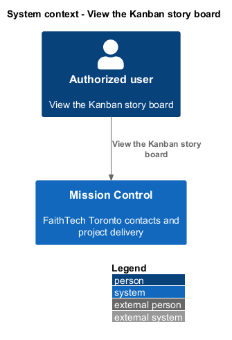
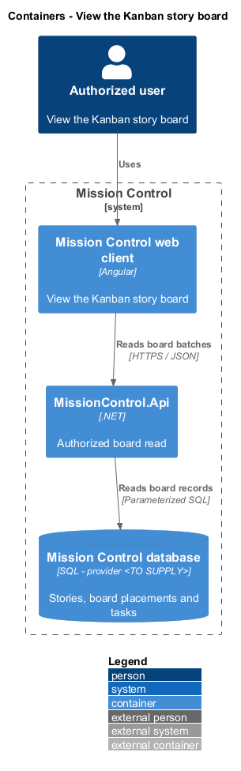
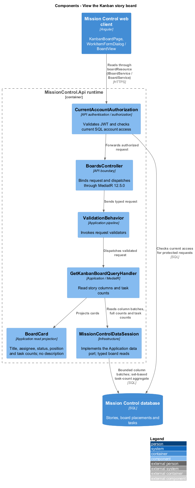
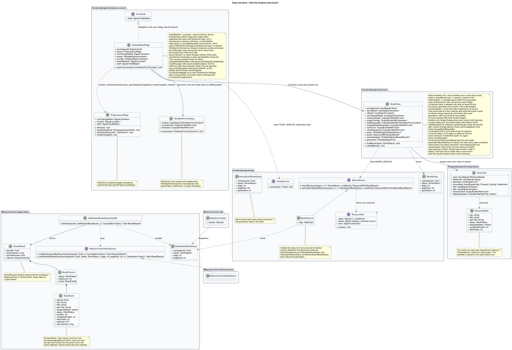
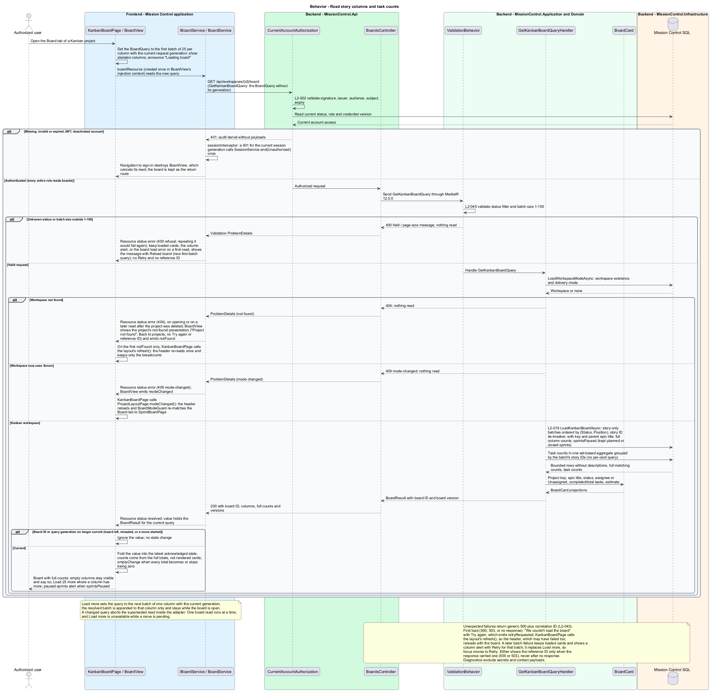

# View the Kanban story board

## Overview

Kanban shows continuous workspace delivery through three persisted statuses.

- **Board column** — To Do, In Progress, or Done group of ordered story cards

Each story appears once; tasks remain inside its detail view. Board placement is distinct from backlog priority.

This design refines the [L2 baseline](../../../specs/L2.md) and its linked L1 scope. Proposed defaults retain their proposal status.

## Description

The [shared design rules](../../README.md#shared-design-rules) apply: proposed type status, Application placement and MediatR `12.5.0`, authentication and validation V, responsive profile R and accessibility, token styling, data ownership and session handling, and incremental ATDD. This page records feature-specific behavior and exceptions only.

| Part | Responsibility and architectural home |
| --- | --- |
| `KanbanBoardPage` | Routed page owned by `frontend/projects/mission-control`, the `board` child route of `ProjectLayoutPage`, which it reaches through `inject(ProjectLayoutPage)`; composes `BoardView` for the workspace in the route and binds its `refresh` input to the page's own counter plus the layout's `revision`. It registers the Board tab's create action with the layout's `setTabAction({ label, run })` (cleared on destroy) and opens `WorkItemFormDialog` from it or from `addRequested`, relays `changeModeRequested` to the layout's `openDialog(ChangeMode)`, calls `ProjectLayoutPage.modeChanged()` on `modeChanged` and the layout's `refresh()` on the first `notFound` and on every `retryRequested`, so the header and the board reread together, and implements `FormDraft`: its route keeps `canDeactivate: UnsavedChangesGuard`, and its `draft` delegates to an open `WorkItemFormDialog`, else falls back to the layout's open dialog (`inject(ProjectLayoutPage).draft()`), so leaving the project asks once. It reacts to `WorkItemFormOutcome`: `Saved(saved, title, parentTitle)` increments its counter, so the board rereads, and shows the added-item toast, named for the item's type, through `TOAST_SERVICE`, naming the new story or initiative from `title` and a story's chosen epic from `parentTitle`; `NotFound` calls the layout's `refresh()`, so the header and the board reread and show the project's not-found state; no result changes nothing. |
| `BoardView` | Domain component in `frontend/projects/domain`, shared with the sprint board; injects `BOARD_SERVICE` and owns its board resource, the latest acknowledged columns, the request generation, and the pending move in signals, and renders each card through `StoryCard`. It emits `moveRequested` from a card's Move or Move to… ([moves](../move-story-cards/README.md)), `modeChanged` on a mode-changed `409`, `notFound` when a read finds the workspace missing, `retryRequested` from a failed first read's Try again, and on the Kanban board `emptyChange`, `addRequested` from the empty state's Add initiative, and `changeModeRequested` from the paused-sprints alert. On the sprint board it also emits `removeRequested` and `sprintLoaded` ([sprint execution](../../scrum/execute-sprint-work/README.md)). `sprintLoaded` emits `null` only while a first-batch read (opening, a `refresh` change, or Reload board) is loading or after it failed; Load more batches and the re-reads after a move emit `sprintLoaded` with the header from their result, with no `null` in between, so the sprint's progress totals follow each confirmed move. |
| `IBoardService`, `BOARD_SERVICE` | Contract and token in `frontend/projects/api/board.service.contract.ts`; the read member `boardResource(query)` takes a `BoardQuery` and returns a caller-owned `ResourceRef<BoardResult>`, and the sprint board's `activeSprintBoardResource` belongs to [sprint execution](../../scrum/execute-sprint-work/README.md). The consumer imports the contract only. |
| `BoardService` | Production HTTP adapter in `api`; creates each board resource in the consumer's injection context, aborts a superseded read when the query signal changes, and cancels reads on consumer destroy; no shared mutable state. Composition binds a mock adapter for Chromium Playwright. |
| `BoardsController` | Thin controller under `backend/src/MissionControl.Api/Controllers`, namespace `MissionControl.Api.Controllers`; binds, dispatches, and returns. |
| `BoardCard` | Application read projection of one story card; it carries no description. |
| `WorkItemFormDialog` | Application dialog in `frontend/projects/mission-control`, defined by [create and navigate work](../../work/create-and-navigate-work/README.md); `KanbanBoardPage` opens it to add a story, or an initiative on an empty board, and reacts to its `WorkItemFormOutcome` as the page row states. While it stays open, its `unconfirmed` output makes the page increment its counter at once, so the board rereads, and its `forbidden` output (an unexpected `403`) makes the page show the "Your access changed" toast through `TOAST_SERVICE`, without Retry. |
| `IMissionControlDataSession` | Shared Application data port defined in the [overview](../../README.md); this feature uses only the typed reads `LoadWorkspaceModeAsync` and `LoadKanbanBoardAsync`. |

`BoardModeGuard` matches `KanbanBoardPage` to `/projects/:workspaceId/board` when the mode is Kanban; the [project layout](../../README.md#project-layout) renders the pinned header and tabs around it, and `UnsavedChangesGuard` is the board route's `canDeactivate`.
Project actions in the header belong to the layout. The Board tab's own create action, which `KanbanBoardPage` registers through `setTabAction` for the header's action area, is Add story, or Add initiative while every column total is zero; `BoardView` reports that through `emptyChange`.
Both roles can add work. The empty state's Add initiative emits `addRequested` with a `WorkItemFormContext`, and either action calls the page's `openForm`, which opens `WorkItemFormDialog` with the workspace and the type: a story with no preselected epic, or an initiative.
Every control that opens a dialog emits an output that `KanbanBoardPage` maps: Move and Move to… emit `moveRequested` (`MoveStoryDialog`), Add initiative emits `addRequested` (`WorkItemFormDialog`), and Change delivery mode emits `changeModeRequested` (the layout's `ModeChangeDialog`).
Links that only navigate (a card's title and Open story, View sprint history, and the empty state's Open Work) are router links that the view builds from the workspace and story IDs it holds.
A change to the `refresh` input, from the page's counter or the layout's `revision`, makes `BoardView` reload the first batch with a new generation; a refresh that arrives while a move is pending waits until the move settles.
Moves are the view's own mutations, so it re-reads the affected columns itself, and the outcomes of `MoveStoryDialog` and `UnfinishedTasksDialog` never change the counter.
Presentational `StoryCard` in `frontend/projects/components` takes its own `StoryCardData` input (key, title, epic title, status, assignee name or none, and completed and total task counts), which `BoardCard` matches. It also takes the detail link, the estimate (passed on the sprint board only), its move state (idle, paused while another move saves, saving, or restored after a failed move), and whether it is first or last in its column, which explains why Move up or Move down is unavailable.
It emits `moveClicked` for Move and Move to… and `stepRequested` for Move up and Move down, and imports no other project; `BoardView` turns them into `moveRequested` or a move, and owns pointer drag, for which the card renders its handle.
`GetKanbanBoardQueryHandler` reads story-only cards, with Unassigned text and saved per-column order.
Creating a story in either mode inserts its Kanban `BoardPlacement` at the bottom of To Do in the same transaction.
The workspace's Kanban `BoardState` is created with the workspace, so a mode switch needs no backfill.
Deletion removes the placement and compacts its column. Cards order by `(Status, Position)`, with story ID only as a tie-breaker.
Each column loads bounded batches, defaulting to 25 and capped at 100; its total count covers all matching stories.

A card carries story ID, display key, title, parent epic title, assignee display name or Unassigned, status, position, task counts, estimate, and story version; it omits the description.
The sprint board shows the estimate; the Kanban card does not. The epic title comes from the parent row in the same batch statement.
The board result adds the board ID, board version, each column's full count, and `sprintsPaused`: true on a Kanban board while the workspace keeps planned or closed sprints, and always false on a sprint board.
Task counts come from one set-based aggregate per batch: persisted child-task statuses grouped by the batch's story IDs.
No card issues its own query, and counts are not multiplied through joined membership tables.

`BoardView` reads through one `boardResource`, created in its field initializer and driven by its `query` signal.
`BoardQuery` names the workspace, an optional column status, page, page size, and the view's request generation. `BoardService` sends it as `GetKanbanBoardQuery` without the generation, which stays in the client.
On the sprint board the same view reads through `activeSprintBoardResource` with an `ActiveSprintBoardQuery` of the same shape, sent as `GetActiveSprintBoardQuery`; its `ActiveSprintBoardResult` wraps a `BoardResult` with the sprint header ([sprint execution](../../scrum/execute-sprint-work/README.md)). The view's `sprintBoard` input decides which of its two resources receives a defined query, so only one ever reads.
Opening the board sets the query to the first batch of every column, and Load more sets it to the next batch of one column.
When the resource resolves, the view folds the value into its latest acknowledged state: a first read replaces it, and a Load more batch appends to its column.
A changed query makes the resource abort the superseded read, so a late batch cannot overwrite newer cards.
The view adopts a value only while its board ID and the query's generation are current; the board ID check also covers a route change to another workspace that reuses the same view.
One board read runs at a time: while a read is loading, Load more on the other columns reports `aria-disabled`.
Reload board increments the generation and sets the query to the first batch again. A failed batch (a `500` or `503`, or no response) keeps loaded cards and shows a column alert with Retry, which reads that batch again, and with the reference ID when the response carried one (the mock's `batch-error` state).
A failed first read shows the board load error the same way: Try again, and the reference ID only for a `500` or `503`. Try again emits `retryRequested`, and `KanbanBoardPage` calls the layout's `refresh()`, so the project header, which may have failed too, rereads with the board.
A refused read (`400`, only possible from a malformed query) would fail again if repeated, so the column alert, or the board load error on a first read, shows the server's message with Reload board instead, without Retry or a reference ID.
[Moves](../move-story-cards/README.md) define the single pending move and its reconciliation.
While a move is pending, Load more is unavailable on that board.

Load more appends the next batch to that column only. Appended batches stay in that column for as long as the board is open.
Load more keeps focus on its button and announces the loaded count; when the column is complete, focus moves to the first new card.
A failed batch replaces Load more with the column alert, so focus moves to the alert's action: Retry, or Reload board after a refused read.
Leaving the board destroys `BoardView`; the adapter cancels any read in flight, and every loaded card is released.
Column totals and the M of "Showing N of M" come from the server's full counts, never from the number of rendered cards; N counts the loaded cards.
Loaded cards render as ordinary list items. Release tooling records retained card counts and memory trend on a large workspace.
Virtualization or windowing is introduced only if that measurement fails its budget. No limit on workspace size is added.

At `992px` and wider all columns appear together. At `576–991px` the board scrolls within its own region.
Below `576px` a named column selector exposes one column at a time without page horizontal scrolling.
Empty columns remain represented, including a completely empty workspace.
Opening a card routes to work details with ancestor context and bounded tasks. Project tabs remain pinned on phones; larger layouts pin header and tabs.
Scroll offsets include fixed-content clearance so keyboard focus remains visible. Failed batch loads preserve already loaded cards.
A missing workspace returns `404`, also when the project is deleted after the board opened: a later read (Load more, a refresh, or Reload board) or a move ([moves](../move-story-cards/README.md)) finds it.
`BoardView` then shows the project's not-found presentation, as the project overview does: "Project not found" with Back to projects, without Try again or a reference ID, and focus moves to that heading when the cards it replaces held focus.
It emits `notFound`, and `KanbanBoardPage` calls the layout's `refresh()` on the first one only, so the header re-reads once and keeps only the breadcrumb, and the board's own repeated `404` cannot loop.
A read for a workspace now in Scrum mode returns `409` with the `mode-changed` category; `BoardView` emits `modeChanged`, and `KanbanBoardPage` calls `ProjectLayoutPage.modeChanged()`, so the header reloads and `BoardModeGuard` re-matches the Board tab to the sprint board.
When `sprintsPaused` is true, `BoardView` shows the paused-sprints alert with View sprint history, a link to the Sprints tab, and board operation stays available (the `preserved` state).
With its `canChangeMode` input true, computed by the page from the layout's `canChangeMode`, the alert also offers Change delivery mode.
That emits `changeModeRequested`, and `KanbanBoardPage` relays it to the layout's `openDialog`, which opens `ModeChangeDialog`, as the overview's paused-sprints banner does.

| Behavior | Proposed boundary | Request / handler |
| --- | --- | --- |
| Read story columns and task counts | `GET /api/workspaces/{id}/board` | `GetKanbanBoardQuery` / `GetKanbanBoardQueryHandler` |

Mock input and review references:

- [Kanban board · Mission Control mock](../../../mocks/kanban/kanban-board.html); review states: `default`, `dragging`, `pending`, `move-failed`, `move-refused`, `move-forbidden`, `conflict`, `reread-failed`, `empty`, `empty-column`, `load-more`, `batch-error`, `card-menu`, `collaborator`, `preserved`, `loading`, `error`.
- [Work item detail · Mission Control mock](../../../mocks/work/work-item-detail.html); review states: `default`, `status-failed`, `initiative`, `epic`, `task`, `unset`, `inactive-assignee`, `collaborator`, `not-found`, `loading`, `error`.

## Requirements

Requirement text and identifiers below are copied verbatim from L2, including the source use of `must`.

| L2 ID | Refines (L1) | Requirement |
| --- | --- | --- |
| `L2-019` | `L1-005` | A Kanban workspace must display To Do, In Progress, and Done columns with stories as cards. Each card must show title, assignee or Unassigned, and completed/total task counts. Opening a card must show its tasks and hierarchy path. Card ordering must be stable per column and independent of backlog priority. |
| `L2-027` | `L1-006` | Only administrators must switch workspace mode. An active sprint must block a mode change. Kanban mode must preserve planned/closed sprints but disable their execution until returning to Scrum; work remains available on the Kanban board. |
| `L2-030` | `L1-008` | Every login/session, account-management, lead CRUD, workspace, hierarchy, backlog, board, sprint, home, and navigation workflow must satisfy responsive profile R. Compact layouts must stack form fields and summary cards and provide local board scrolling or a column selector. Larger layouts must use available space without overlapping controls. Vertical page scrolling is permitted. |
| `L2-032` | `L1-008` | Production views must use the application design tokens and consistent typography, spacing, focus, form, and status patterns. Loading, empty data, zero search results, and request errors must be distinguishable and offer relevant actions. Visual review is for application UX; design artifacts themselves remain exempt from automated tests. |
| `L2-033` | `L1-009` | Every application workflow must be operable by keyboard without required dragging. Focus must remain visible, follow a logical sequence, and be managed when dialogs open/close and routed content changes. |
| `L2-034` | `L1-009` | Application controls must expose programmatic names and roles. Inputs must have associated labels; field errors must identify their inputs. Pages must expose main/navigation regions and a coherent heading hierarchy. Asynchronous outcomes must be announced without relying only on visual changes. |
| `L2-035` | `L1-009` | The application must meet the proposed WCAG 2.2 AA target. Normal text must reach 4.5:1 contrast, large text 3:1, and essential control boundaries/focus/status graphics 3:1 against adjacent colors. Status must include text or another non-color cue. Primary touch controls must provide at least 44×44 CSS-pixel targets; other controls must satisfy applicable AA target-size requirements. |
| `L2-045` | `L1-013` | Directories, workspace lists, backlogs, and history lists must default to 25 records per page and cap requested page size at 100. Invalid sizes must return 400. Results must include total matching count and stable ordering. Boards/hierarchies must load bounded batches of at most 100 and allow access to every matching item; counts must reflect the full dataset rather than just loaded records. |

## Diagrams

The context view identifies the actor and the Mission Control capability.

The container view separates the client, .NET API, and durable SQL records.

The component view locates request dispatch, domain behavior, and persistence within the feature.

The class view shows proposed typed requests, interface consumption, and relationships between the feature parts.

Read story columns and task counts follows the sequence below. The flow traces its enforcing steps to `L2-019` and includes rejection or recovery paths.

