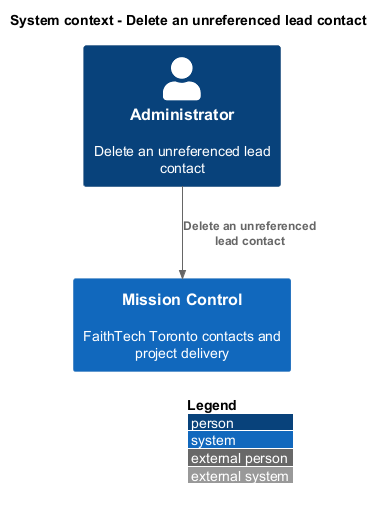
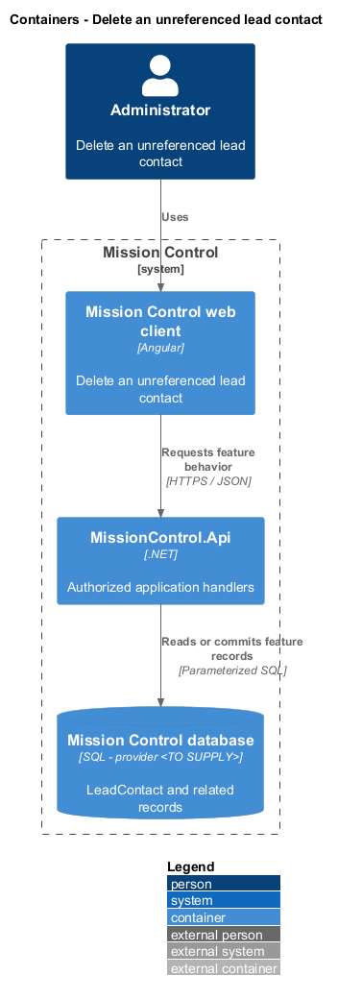
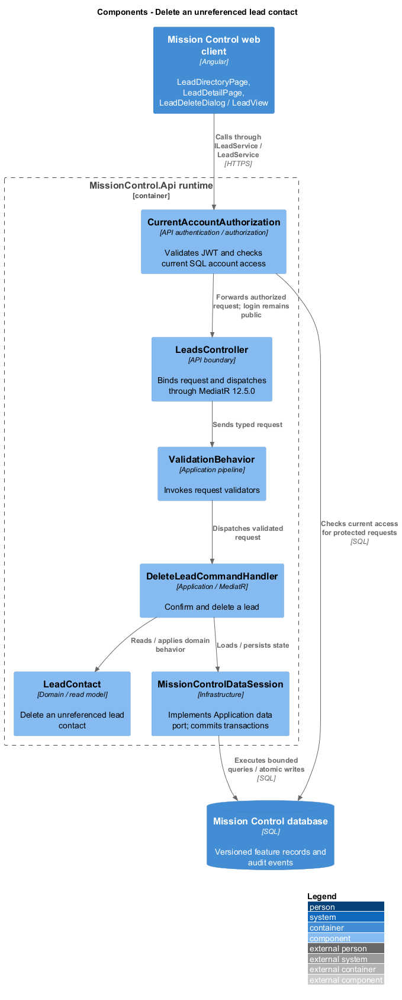
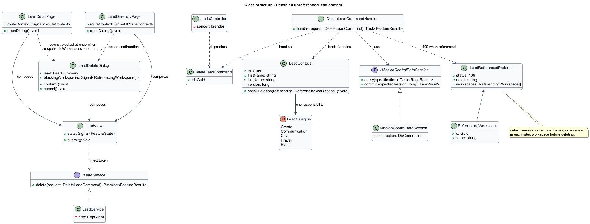
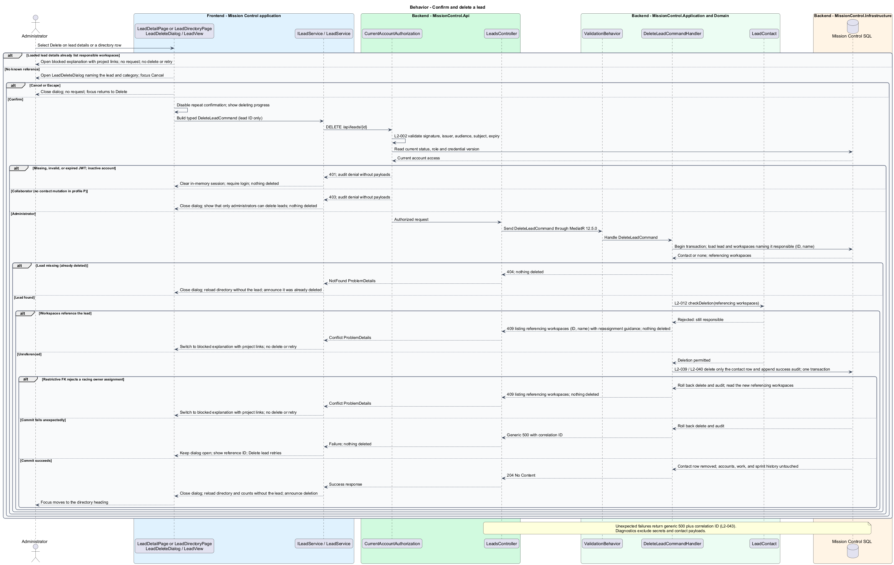

# Delete an unreferenced lead contact

## Overview

Administrators remove obsolete lead contacts after reviewing a named confirmation.

- **Responsible contact** — existing lead referenced as the owner of a project workspace

A contact still responsible for a workspace remains protected from deletion. Removing a permitted contact preserves accounts, work, and sprint history.

This design refines the [L2 baseline](../../../specs/L2.md) and its linked L1 scope. Proposed defaults retain their proposal status.

## Description

All named production types are proposed; the repository currently contains requirements and static mocks.

| Part | Responsibility and architectural home |
| --- | --- |
| `LeadDetailPage` | Routed page or dialog owned by `frontend/projects/mission-control`; composes the domain library and presentational components. |
| `LeadDirectoryPage` | Routed directory page in `frontend/projects/mission-control`; each administrator row offers Delete. |
| `LeadDeleteDialog` | Application dialog in `frontend/projects/mission-control`; shows the named confirmation or the blocked explanation. |
| `LeadView` | Domain component in `frontend/projects/domain`; injects `LEAD_SERVICE` and holds feature state in signals. |
| `ILeadService`, `LEAD_SERVICE` | Interface and token in `frontend/projects/api/lead.service.contract.ts`; the consumer imports the contract only. |
| `LeadService` | Production HTTP adapter in `api`; owns HTTP calls and observable-to-signal conversion. Composition binds a mock adapter for Chromium Playwright. |
| `LeadsController` | Thin controller under `backend/src/MissionControl.Api/Controllers`, namespace `MissionControl.Api.Controllers`; binds, dispatches, and returns. |
| `LeadContact` | Domain entity or Application read projection described below; Domain has no external project dependency. |
| `IMissionControlDataSession` | Application data port; the Infrastructure adapter runs parameterized queries and transaction commits. |

Commands, queries, handlers, and request validators live in Application feature folders. Each type has its own file; folders and namespaces agree.
MediatR remains pinned to `12.5.0`. Microsoft.Extensions supplies dependency injection, Options, and Configuration.

`LeadDeleteDialog` names the contact and initially focuses Cancel. Cancellation sends no mutation request.
When the loaded lead details already list responsible workspaces, Delete opens the blocked explanation without a request.
`DeleteLeadCommand` carries only the lead ID; deletion carries no expected version.
`DeleteLeadCommandHandler` loads the lead and its referencing workspaces inside the deletion transaction, before it deletes anything.
A missing lead returns `404`. The dialog closes, the directory reloads without the lead, and an announcement says it was already deleted.
A referenced contact returns `409`. Its ProblemDetails lists the referencing workspaces (ID and name) with reassignment guidance.
A directory-row delete shows the blocked explanation after that `409`, with project links and no delete or retry action.
A restrictive workspace foreign key prevents a racing ownership assignment from creating a dangling contact reference; that rejection returns the same `409`.
Successful deletion removes only that lead row, updates live counts, and returns focus to a surviving directory control or heading.
Account identity and closed history have no cascading contact dependency.

The authenticated API evaluates current SQL permissions before feature dispatch. Validation V maps invalid fields to `400`, absent authentication to `401`, forbidden access to `403`, missing records to `404`, and conflicts to `409`.
Unexpected errors return a generic `500` with a correlation ID. Structured diagnostics exclude secrets and contact payloads.

Responsive profile R covers `320`, `375`, `576`, `768`, `992`, `1200`, and `1920` CSS-pixel widths at `800` pixels high.
Forms stack on compact screens; dialogs become sheets below `576px`. Templates, styles, and classes remain separate files.
Component styles read `var(--mc-<role>)` from the mirrored authoritative design-system tokens.
Keyboard actions include visible focus, named controls, modal focus containment, trigger focus restoration, and destination-heading focus after navigation.
Field errors connect to inputs; asynchronous results use status or alert announcements. Status text supplements color; primary touch targets measure at least `44×44` CSS pixels.

| Behavior | Proposed boundary | Request / handler |
| --- | --- | --- |
| Confirm and delete a lead | `DELETE /api/leads/{id}` | `DeleteLeadCommand` / `DeleteLeadCommandHandler` |

Mock input and review references:

- [Delete lead · Mission Control mock](../../../mocks/leads/lead-delete-dialog.html); review states: `default`, `city-lead`, `blocked`, `deleting`, `failed`.
- [Lead directory · Mission Control mock](../../../mocks/leads/lead-directory.html); review states: `default`, `collaborator`, `filtered`, `zero-results`, `page-2`, `deleted`, `empty-admin`, `empty-collaborator`, `loading`, `error`.
- [Lead details · Mission Control mock](../../../mocks/leads/lead-detail.html); review states: `default`, `lead`, `saved`, `collaborator`, `not-found`, `loading`, `error`.

Implementation proceeds one behavior at a time using the linked Given-When-Then criteria. An API integration acceptance check first fails for the expected missing behavior.
A Chromium Playwright check uses one page object per screen and a mock service bound through the same token. Tests express intent; page objects own selectors.
The smallest implementation turns those checks green before the next behavior begins. Relevant regression checks follow each slice; no architecture tests are introduced.

## Requirements

Requirement text and identifiers below are copied verbatim from L2, including the source use of `must`.

| L2 ID | Refines (L1) | Requirement |
| --- | --- | --- |
| `L2-012` | `L1-003` | Lead deletion must require confirmation naming the contact and must be blocked while any workspace references the lead as its responsible contact. |
| `L2-031` | `L1-008` | Forms must expose field-specific validation, retain input on rejected saves, prevent duplicate submission while pending, display results, and confirm leaving with unsaved edits. Destructive confirmations must name the affected item. |
| `L2-039` | `L1-010` | The system must record UTC timestamp, actor ID when known, operation, entity type/ ID, outcome, and correlation ID for account/permission changes, contact/workspace/ work mutations, board/sprint mutations, successful login, denied access, and throttling. Audit data must exclude secrets and contact payloads. Only administrators must access audit records; audit mutation endpoints must be absent. |
| `L2-040` | `L1-011` | Committed account, contact, hierarchy, ordering, board, and sprint changes must survive restart. Operations spanning multiple records must commit entirely or leave all affected business records unchanged. |
| `L2-041` | `L1-011` | Edits must carry a record version or equivalent concurrency condition. SQL constraints must protect normalized account emails, lead email/category pairs, parent references, open sprint membership, and active sprint exclusivity. Caller errors must produce validation/conflict responses rather than generic failures. |

## Diagrams

The context view identifies the actor and the Mission Control capability.

The container view separates the client, .NET API, and durable SQL records.

The component view locates request dispatch, domain behavior, and persistence within the feature.

The class view shows proposed typed requests, interface consumption, and relationships between the feature parts.

Confirm and delete a lead follows the sequence below. The flow traces its enforcing steps to `L2-012` and includes rejection or recovery paths.

