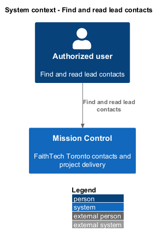
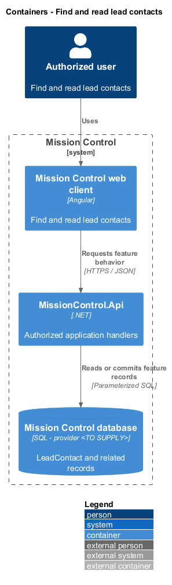
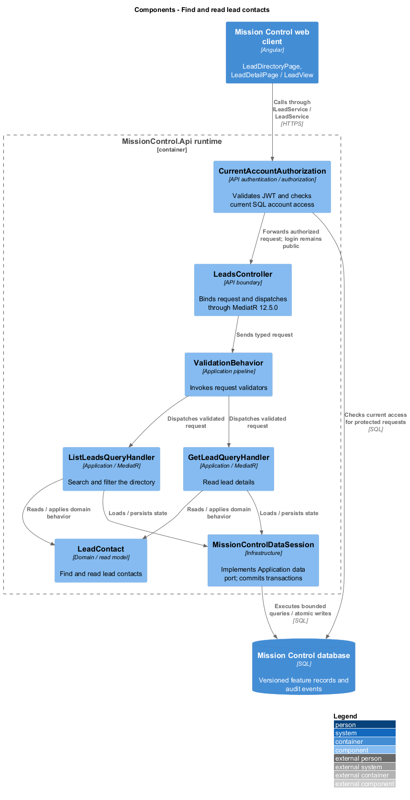
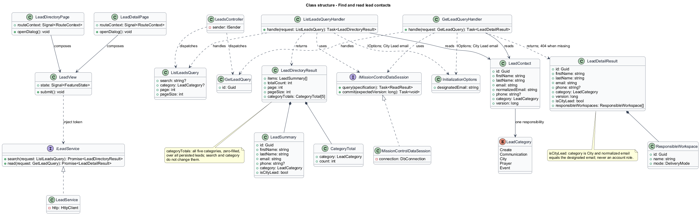
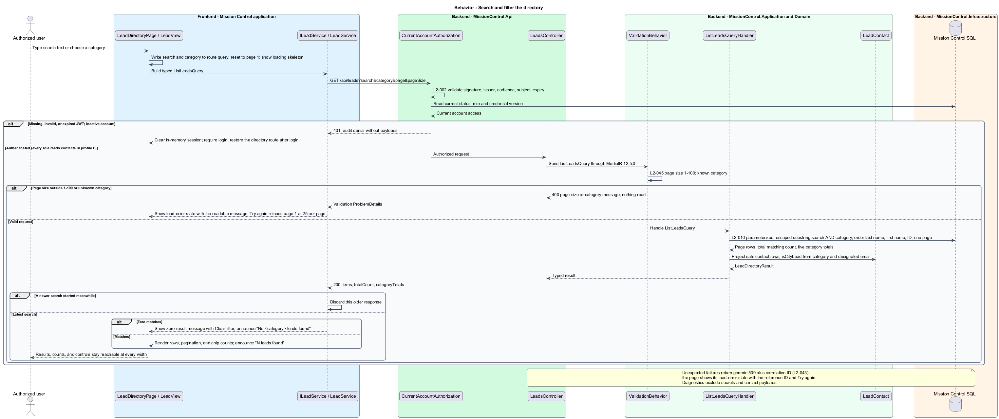
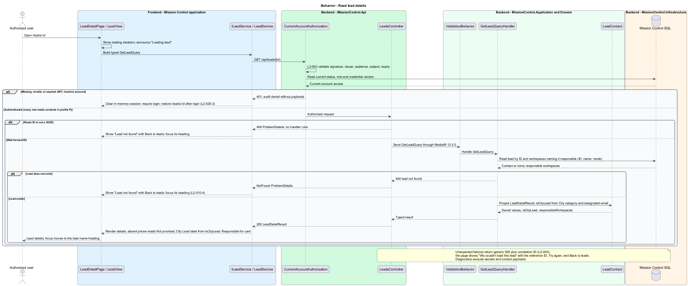

# Find and read lead contacts

## Overview

The directory helps authorized users find leads by responsibility and contact information.

- **Directory result** — bounded ordered contact page plus total matching count

Contact details identify the City Lead and show absent phone values explicitly. Lead responsibilities never imply application permissions.

This design refines the [L2 baseline](../../../specs/L2.md) and its linked L1 scope. Proposed defaults retain their proposal status.

## Description

All named production types are proposed; the repository currently contains requirements and static mocks.

| Part | Responsibility and architectural home |
| --- | --- |
| `LeadDirectoryPage` | Routed page or dialog owned by `frontend/projects/mission-control`; composes the domain library and presentational components. |
| `LeadDetailPage` | Routed page for `/leads/:id` in `frontend/projects/mission-control`; composes `LeadView` and owns the not-found and load-error states. |
| `LeadView` | Domain component in `frontend/projects/domain`; injects `LEAD_SERVICE` and holds feature state in signals. |
| `ILeadService`, `LEAD_SERVICE` | Interface and token in `frontend/projects/api/lead.service.contract.ts`; the consumer imports the contract only. |
| `LeadService` | Production HTTP adapter in `api`; owns HTTP calls and observable-to-signal conversion. Composition binds a mock adapter for Chromium Playwright. |
| `LeadsController` | Thin controller under `backend/src/MissionControl.Api/Controllers`, namespace `MissionControl.Api.Controllers`; binds, dispatches, and returns. |
| `LeadContact` | Domain entity or Application read projection described below; Domain has no external project dependency. |
| `IMissionControlDataSession` | Application data port; the Infrastructure adapter runs parameterized queries and transaction commits. |

Commands, queries, handlers, and request validators live in Application feature folders. Each type has its own file; folders and namespaces agree.
MediatR remains pinned to `12.5.0`. Microsoft.Extensions supplies dependency injection, Options, and Configuration.

`GET /api/leads` applies trimmed case-insensitive substring search to first name, last name, combined full name, email, and phone.
Category and search combine with AND before counting or paging. Literal wildcard characters are escaped for SQL substring matching; parameters remain data.
The stable order is last name, first name, then ID. Pages default to 25 and cap at 100; invalid sizes return `400`.
`ListLeadsQuery` results carry the page, the total matching count, and five zero-filled `categoryTotals` over all persisted leads.
Search and category never change `categoryTotals`, so category chip counts stay stable while filtering. Loading and error states show no counts.
Search/filter state uses route query parameters so home category links preserve context. Every change resets page one.
The adapter ignores older search responses after a newer search begins.
A loaded result is announced in the status region, including zero results such as "No Event leads found". Zero results offer Clear filter.

`LeadDetailPage` owns `/leads/:id` and displays saved values, explicit Not provided phone text, and City Lead identity.
`GetLeadQuery` also returns `responsibleWorkspaces` (ID, name, and mode) for the Responsible for card. An empty list reads as no project responsibility.
A nonexistent or malformed lead ID returns `404`; the page shows "Lead not found" with Back to leads.
A contact is labeled City Lead when its category is City and its normalized email equals the configured designated email (`InitializationOptions`); the unique email/category index guarantees at most one.
Read projections expose `isCityLead`; the label never reflects any account's role. It uses the City category styling, not a role or permission badge.
Email/phone links open local `mailto:` / `tel:` clients; Mission Control sends no messages.
Below `768px` directory rows become labeled cards. Initial loading skeletons differ from empty data, zero results, and request errors.
Collaborators retain read access while contact mutation controls remain unavailable with a readable explanation.

The authenticated API evaluates current SQL permissions before feature dispatch. Validation V maps invalid fields to `400`, absent authentication to `401`, forbidden access to `403`, missing records to `404`, and conflicts to `409`.
Unexpected errors return a generic `500` with a correlation ID. Structured diagnostics exclude secrets and contact payloads.

Responsive profile R covers `320`, `375`, `576`, `768`, `992`, `1200`, and `1920` CSS-pixel widths at `800` pixels high.
Forms stack on compact screens; dialogs become sheets below `576px`. Templates, styles, and classes remain separate files.
Component styles read `var(--mc-<role>)` from the mirrored authoritative design-system tokens.
Keyboard actions include visible focus, named controls, modal focus containment, trigger focus restoration, and destination-heading focus after navigation.
Field errors connect to inputs; asynchronous results use status or alert announcements. Status text supplements color; primary touch targets measure at least `44×44` CSS pixels.

| Behavior | Proposed boundary | Request / handler |
| --- | --- | --- |
| Search and filter the directory | `GET /api/leads` | `ListLeadsQuery` / `ListLeadsQueryHandler` |
| Read lead details | `GET /api/leads/{id}` | `GetLeadQuery` / `GetLeadQueryHandler` |

Mock input and review references:

- [Lead directory · Mission Control mock](../../../mocks/leads/lead-directory.html); review states: `default`, `collaborator`, `filtered`, `zero-results`, `page-2`, `deleted`, `empty-admin`, `empty-collaborator`, `loading`, `error`.
- [Lead details · Mission Control mock](../../../mocks/leads/lead-detail.html); review states: `default`, `lead`, `saved`, `collaborator`, `not-found`, `loading`, `error`.

Implementation proceeds one behavior at a time using the linked Given-When-Then criteria. An API integration acceptance check first fails for the expected missing behavior.
A Chromium Playwright check uses one page object per screen and a mock service bound through the same token. Tests express intent; page objects own selectors.
The smallest implementation turns those checks green before the next behavior begins. Relevant regression checks follow each slice; no architecture tests are introduced.

## Requirements

Requirement text and identifiers below are copied verbatim from L2, including the source use of `must`.

| L2 ID | Refines (L1) | Requirement |
| --- | --- | --- |
| `L2-010` | `L1-003` | The directory must show names, category, email, and phone with a readable empty phone value and link to lead details. Search must use a trimmed, case-insensitive substring of first name, last name, combined full name, email, or phone; category filter and search must combine using AND. Default ordering is last name, first name, then stable ID. Pagination follows L2-045. |
| `L2-013` | `L1-003` | Initial seeding must create a separate City contact for Quinntyne Brown at the designated email with no phone supplied. Existing matching City contacts must not be duplicated or have later contact edits reset by startup. |
| `L2-030` | `L1-008` | Every login/session, account-management, lead CRUD, workspace, hierarchy, backlog, board, sprint, home, and navigation workflow must satisfy responsive profile R. Compact layouts must stack form fields and summary cards and provide local board scrolling or a column selector. Larger layouts must use available space without overlapping controls. Vertical page scrolling is permitted. |
| `L2-032` | `L1-008` | Production views must use the application design tokens and consistent typography, spacing, focus, form, and status patterns. Loading, empty data, zero search results, and request errors must be distinguishable and offer relevant actions. Visual review is for application UX; design artifacts themselves remain exempt from automated tests. |
| `L2-034` | `L1-009` | Application controls must expose programmatic names and roles. Inputs must have associated labels; field errors must identify their inputs. Pages must expose main/navigation regions and a coherent heading hierarchy. Asynchronous outcomes must be announced without relying only on visual changes. |
| `L2-045` | `L1-013` | Directories, workspace lists, backlogs, and history lists must default to 25 records per page and cap requested page size at 100. Invalid sizes must return 400. Results must include total matching count and stable ordering. Boards/hierarchies must load bounded batches of at most 100 and allow access to every matching item; counts must reflect the full dataset rather than just loaded records. |

## Diagrams

The context view identifies the actor and the Mission Control capability.

The container view separates the client, .NET API, and durable SQL records.

The component view locates request dispatch, domain behavior, and persistence within the feature.

The class view shows proposed typed requests, interface consumption, and relationships between the feature parts.

Search and filter the directory follows the sequence below. The flow traces its enforcing steps to `L2-010` and includes rejection or recovery paths.

Read lead details follows the sequence below. The flow traces its enforcing steps to `L2-010` and includes rejection or recovery paths.

