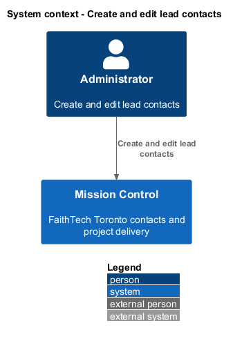
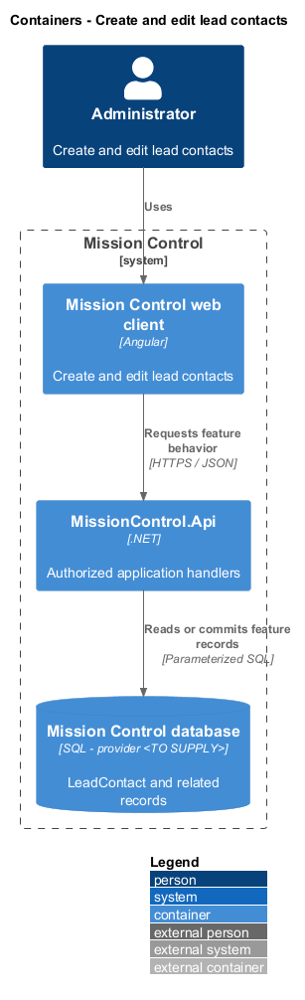
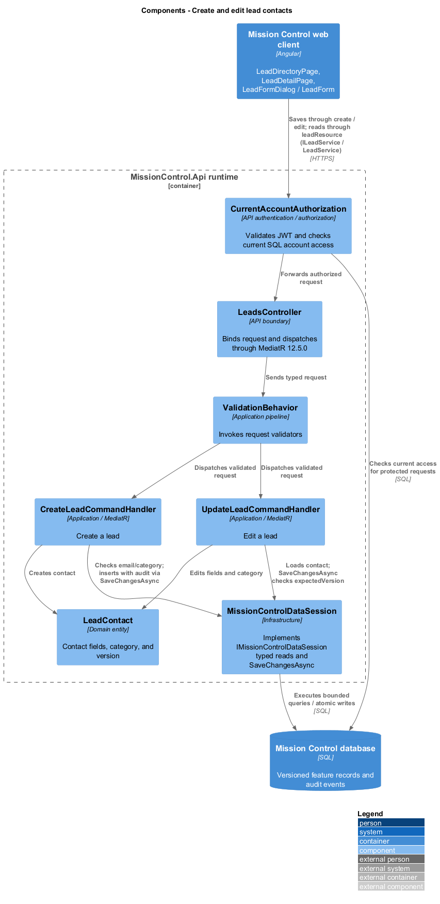
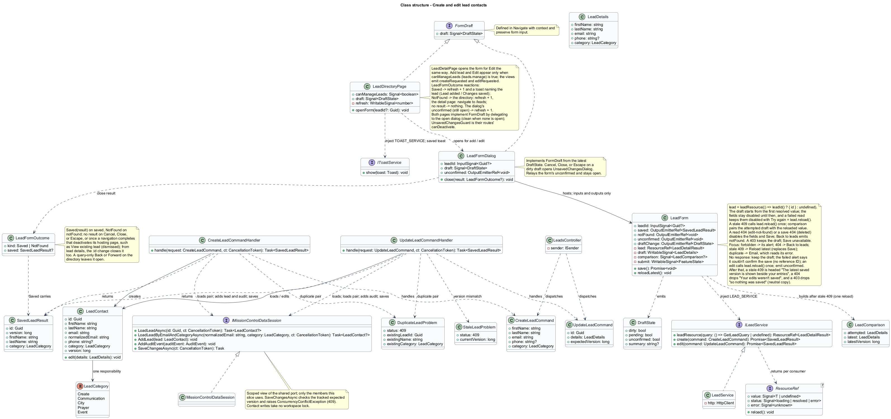
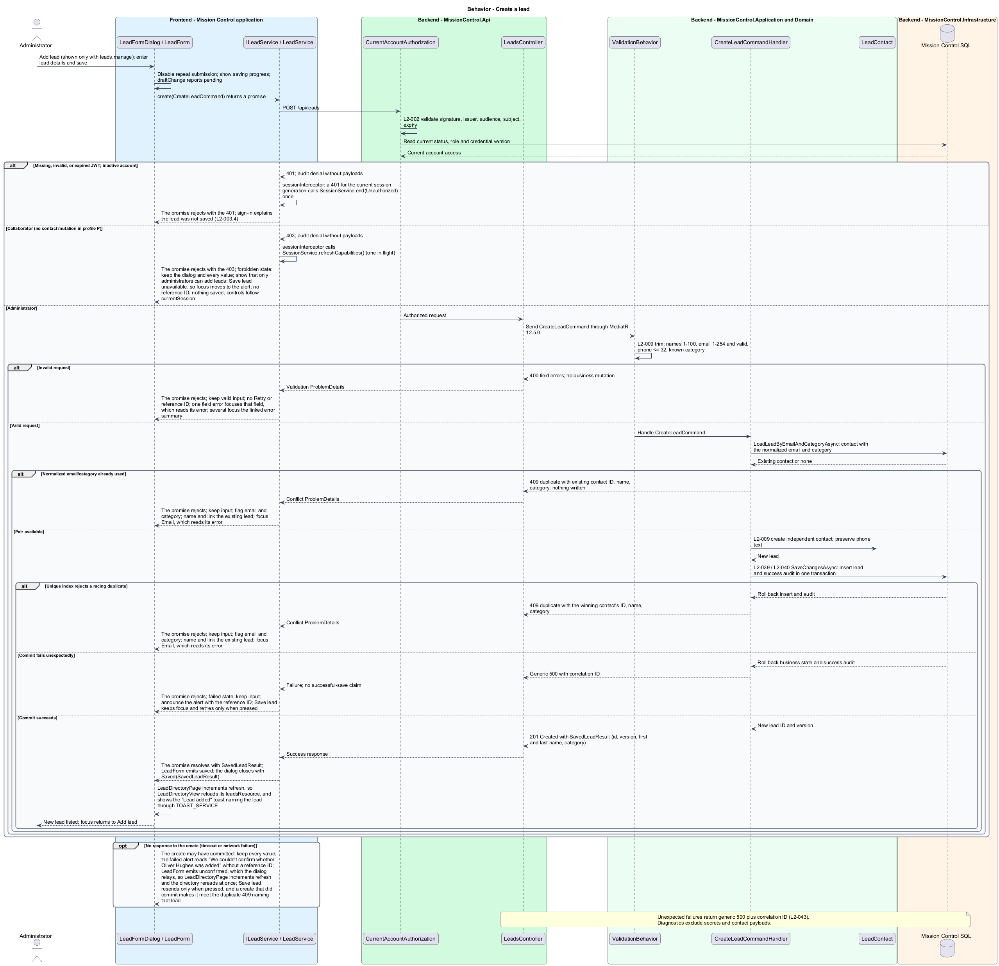
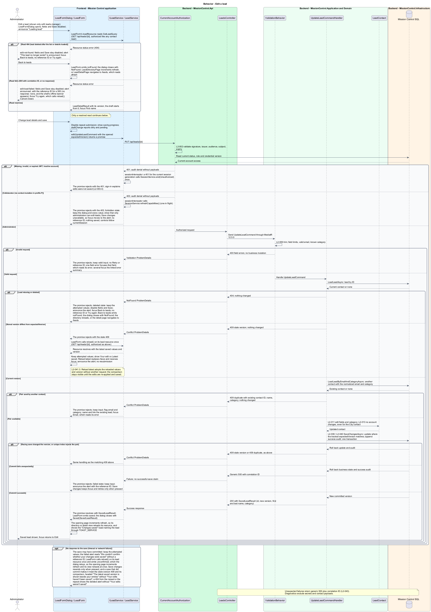

# Create and edit lead contacts

## Overview

FaithTech Toronto records team lead responsibilities in a contact directory.

- **Lead contact** — person record with one Create, Communication, City, Prayer, or Event category

This slice creates and edits contacts without changing login accounts. Multiple contacts share a category, and one email may appear in different categories.

This design refines the [L2 baseline](../../../specs/L2.md) and its linked L1 scope. Proposed defaults retain their proposal status.

## Description

The [shared design rules](../../README.md#shared-design-rules) apply: proposed type status, Application placement and MediatR `12.5.0`, authentication and validation V, responsive profile R and accessibility, token styling, data ownership and session handling, and incremental ATDD. This page records feature-specific behavior and exceptions only.

| Part | Responsibility and architectural home |
| --- | --- |
| `LeadDirectoryPage`, `LeadDetailPage` | Routed pages for `/leads` and `/leads/:id` in `frontend/projects/mission-control`; pass `canManageLeads` (the `leads.manage` capability in `currentSession`) to their views, which show Add lead and Edit only when it is true, and open `LeadFormDialog` from the views' `createRequested` (directory only) and `editRequested` outputs. Each injects `TOAST_SERVICE` and reacts to the dialog's `LeadFormOutcome`: `Saved` increments its view's `refresh` input and shows a success toast naming the lead from `SavedLeadResult` ("Lead added" after Add, "Changes saved" after Edit); `NotFound` makes the directory increment `refresh` and the detail page navigate to `/leads`; no result changes nothing. While the dialog stays open, its `unconfirmed` output makes the page increment its view's `refresh` at once. Each implements `FormDraft` by delegating to its open dialog (clean when none is open), and `UnsavedChangesGuard` is the `canDeactivate` of both routes. |
| `LeadFormDialog` | Application dialog in `frontend/projects/mission-control`; hosts `LeadForm`, passes the edited lead's ID as an input, moves focus to First name, implements `FormDraft` from the form's latest `DraftState`, and opens `UnsavedChangesDialog` when Cancel, Close, or Escape meets a dirty draft. It closes through `close(result: LeadFormOutcome?)`: `Saved(SavedLeadResult)` on the form's `saved` output, `NotFound` on `notFound`, and no result on Cancel, Close, or Escape or once a navigation completes that deactivates the lead page hosting it, such as View existing lead. It relays the form's `unconfirmed` as its own output and stays open with the draft. |
| `LeadForm` | Domain component in `frontend/projects/domain`; injects `LEAD_SERVICE` and owns the draft, the edited lead's `leadResource`, the conflict comparison, and submit state in signals; emits `saved` with the `SavedLeadResult`, `notFound` from Back to leads after a `404`, `unconfirmed` when a save gets no response, and `draftChange` with a `DraftState` whenever its draft or pending state changes. |
| `ILeadService`, `LEAD_SERVICE` | Contract and token in `frontend/projects/api/lead.service.contract.ts`; the read member `leadResource(query)` returns a caller-owned `ResourceRef<LeadDetailResult>`, and the mutations `create` and `edit` return `Promise<SavedLeadResult>`. Consumers import the contract only. |
| `LeadService` | Production HTTP adapter in `api`; creates each resource in the consumer's injection context, converts observables to signals or promises, aborts a superseded read when the query signal changes, and cancels reads on consumer destroy; no shared mutable state. |
| `LeadsController` | Thin controller under `backend/src/MissionControl.Api/Controllers`, namespace `MissionControl.Api.Controllers`. |
| `SavedLeadResult` | Application mutation result `{ id, version, firstName, lastName, category }` returned by create and edit; it holds only values the handlers own, and the opening page announces the saved lead by name from it. |
| `LeadContact` | Domain entity holding contact fields, category, and version. |
| `IMissionControlDataSession` | Shared Application data port defined in the [overview](../../README.md#data-access-and-security-ports); this slice uses its typed reads, `AddLead`, `AddAuditEvent`, and `SaveChangesAsync`. |

`LeadFormDialog` opens from Add lead or Edit and moves focus to First name.
For Edit, `LeadForm` reads the lead through its `leadResource`; the draft starts from the first resolved value, and the fields stay disabled until it arrives; a failed read keeps them disabled and offers Try again (`reload()`), with a reference ID only when a `500` response carried one (`edit-loading` and `edit-load-failed` mock states).
A read `404`, for a lead deleted after the list or details loaded, shows `edit-not-found`: the fields and Save stay disabled, the alert says the lead no longer exists, focus moves to Back to leads, and Back to leads emits `notFound`, with no reference ID or Try again. For Add the query is `undefined`, so nothing is read.
`CreateLeadCommandValidator` and `UpdateLeadCommandValidator` trim required text and check 1–100-character names, valid email up to 254 characters, and the category enum.
Phone is optional and at most 32 characters. International prefixes, spaces, parentheses, and hyphens remain as typed; no local phone format is imposed.
SQL uniquely indexes `(NormalizedEmail, Category)`. Contact writes do not join or mutate account identity tables.
Editing Quinntyne Brown's City contact therefore changes that contact alone; the administrator account's identity, password, status, and permissions stay unchanged.
Contact writes change no workspace, so they take no workspace lock.

Edits include `expectedVersion`. `UpdateLeadCommandHandler` checks existence, version, and the email/category pair before it writes.
`SaveChangesAsync` re-checks the tracked expected version, so a racing save surfaces as the same stale-version `409`.
On a stale-version `409` the form keeps the attempted values and calls `reload()` on its lead resource once to read the latest version (no resubmission); Reload latest adopts the reloaded values and version while the comparison stays visible.
The conflict copy names no person or time; the comparison lists "Your edit" beside "Latest saved".
A duplicate email/category returns `409` with the existing contact's ID, name, and category, so the form can name that lead and link View existing lead to `/leads/{existingLeadId}`; leaving through that link passes the route's `UnsavedChangesGuard`, which asks first because the draft is dirty, and the dialog closes with no result once the navigation completes; Stay keeps the dialog open with the draft. From the directory that navigation deactivates `LeadDirectoryPage`; from another lead's details it changes the reused `LeadDetailPage`'s `:id`, which runs the same guard, so that page closes its dialog with no result as well.
The form keeps every value and flags email and category; selecting a different category can resolve it.
A racing insert or update that the unique index rejects receives the same duplicate `409`.
A save that returns `404`, because the contact was deleted while the form was open, keeps the attempted values, disables the fields and Save, and offers Back to leads, which receives focus, with no reference ID or Try again (`deleted`, matching `edit-not-found`).
Back to leads emits `notFound`, and the dialog closes with `NotFound`; `LeadDirectoryPage` increments its view's `refresh`, so the directory reads afresh, and `LeadDetailPage` navigates to `/leads`.
Canceled forms leave persisted data unchanged. Pending saves disable repeat submission; a save that fails with a `500` keeps valid input, shows its reference ID, and offers explicit retry (`failed`).
A save that gets no response may have committed, so the form never says nothing was saved: it keeps every value and shows the `failed` alert titled "We couldn't confirm whether Oliver Hughes was added" (for Edit, "… whether your changes were saved"), without a reference ID; an edit also calls `reload()` on its lead resource once.
The form emits `unconfirmed`, which the dialog relays, so the opening page's view rereads at once. Save sends again only when pressed: a repeated add that already went through meets the duplicate `409` naming that lead, and a repeated edit meets the stale-version `409` and its comparison, so nothing is applied twice.
The first save may be the change that comparison shows, so after an unconfirmed save the conflict alert is headed "The latest saved version is shown beside your entries" and never says "Your edits haven't been saved"; a `404` from that reread or a repeat shows the deleted presentation reading only "Hana Kim was deleted while you were editing.", without "Your edits weren't saved".
A `403` on save, after the role changed while the form was open, keeps the dialog and every value, explains that only administrators can add or edit leads, and leaves Save unavailable (`forbidden`); after a save that got no response, that explanation drops "so nothing was saved", because the first save may have gone through.
When an outcome disables or removes the focused Save, focus moves to the outcome: `forbidden` focuses its alert, `edit-not-found` and `deleted` focus Back to leads, and `conflict`, which replaces Save with Reload latest, focuses Reload latest.
A duplicate moves focus to Email, which reads its error. A server `400` with one field error focuses that field, which reads its error, and several errors focus the linked error summary. A failed save keeps focus on Save and is announced through the dialog's alert region.
After `saved` the dialog closes with `Saved(SavedLeadResult)`. The opening page increments its view's `refresh` input, so the directory or the details reload their resource, and shows a polite success toast through `TOAST_SERVICE` naming the lead from `SavedLeadResult` (the lead-details `saved` state).
Each committed create or edit registers a success `AuditEvent` (actor, operation, lead ID, outcome, and correlation ID, never contact values) through `AddAuditEvent`, and `SaveChangesAsync` commits it with the change, so a rolled-back save leaves no success audit. `CurrentAccountAuthorization` audits a refused `403` as `Denied`.
`LeadForm` emits `draftChange` whenever the draft or the pending save changes: `dirty` once a value differs from the opened values, `pending` while a save is in flight, and a `summary` naming the edited lead, or `null` for Add, which uses the generic copy.
Navigating away, signing out, or Cancel, Close, and Escape on a dirty draft therefore ask through `UnsavedChangesDialog` first.

| Behavior | Proposed boundary | Request / handler |
| --- | --- | --- |
| Create a lead | `POST /api/leads` | `CreateLeadCommand` / `CreateLeadCommandHandler` |
| Edit a lead | `PUT /api/leads/{id}` | `UpdateLeadCommand` / `UpdateLeadCommandHandler` |

Mock input and review references:

- [Add or edit lead · Mission Control mock](../../../mocks/leads/lead-form-dialog.html); review states: `add`, `add-international`, `validation`, `saving`, `failed`, `forbidden`, `duplicate`, `edit-loading`, `edit-load-failed`, `edit-not-found`, `edit`, `conflict`, `conflict-reloaded`, `deleted`.
- [Lead details · Mission Control mock](../../../mocks/leads/lead-detail.html); review states: `default`, `lead`, `lead-rafael`, `lead-lucia`, `saved`, `collaborator`, `not-found`, `loading`, `error`.

## Requirements

Requirement text and identifiers below are copied verbatim from L2, including the source use of `must`.

| L2 ID | Refines (L1) | Requirement |
| --- | --- | --- |
| `L2-003` | `L1-001` | The client must hold the token in memory, clear it on logout, and require login after reload or expiry. Local logout does not revoke a copied valid access token. |
| `L2-005` | `L1-001` | The API and UI must apply permission profile P. Lead category or contact creation must not create a login or change a user's authorization. |
| `L2-009` | `L1-003` | Lead records must include first name and last name (1–100 characters each), email (1–254 characters with a syntactically valid address), optional phone (at most 32 characters), and one category: Create, Communication, City, Prayer, or Event. Phone must accept international prefixes and ordinary spaces, parentheses, and hyphens; no phone number can be fabricated. Duplicate normalized email/category pairs are prohibited; the same email in different categories is allowed. |
| `L2-011` | `L1-003` | Administrators must edit all contact fields and category using L2-009 validation and concurrency protection from L2-041. |
| `L2-013` | `L1-003` | Initial seeding must create a separate City contact for Quinntyne Brown at the designated email with no phone supplied. Existing matching City contacts must not be duplicated or have later contact edits reset by startup. |
| `L2-031` | `L1-008` | Forms must expose field-specific validation, retain input on rejected saves, prevent duplicate submission while pending, display results, and confirm leaving with unsaved edits. Destructive confirmations must name the affected item. |
| `L2-039` | `L1-010` | The system must record UTC timestamp, actor ID when known, operation, entity type/ ID, outcome, and correlation ID for account/permission changes, contact/workspace/ work mutations, board/sprint mutations, successful login, denied access, and throttling. Audit data must exclude secrets and contact payloads. Only administrators must access audit records; audit mutation endpoints must be absent. |
| `L2-040` | `L1-011` | Committed account, contact, hierarchy, ordering, board, and sprint changes must survive restart. Operations spanning multiple records must commit entirely or leave all affected business records unchanged. |
| `L2-041` | `L1-011` | Edits must carry a record version or equivalent concurrency condition. SQL constraints must protect normalized account emails, lead email/category pairs, parent references, open sprint membership, and active sprint exclusivity. Caller errors must produce validation/conflict responses rather than generic failures. |

## Diagrams

The context view identifies the actor and the Mission Control capability.

The container view separates the client, .NET API, and durable SQL records.

The component view locates request dispatch, domain behavior, and persistence within the feature.

The class view shows proposed typed requests, interface consumption, and relationships between the feature parts.

Create a lead follows the sequence below. The flow traces its enforcing steps to `L2-009` and includes rejection or recovery paths.

Edit a lead follows the sequence below. The flow traces its enforcing steps to `L2-011` and includes rejection or recovery paths.

