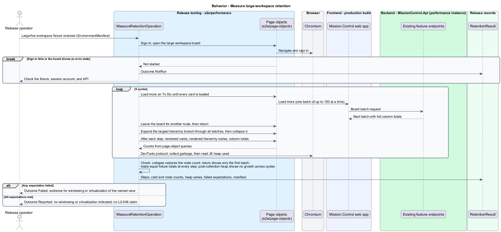

# Measure release workflow performance

## Overview

Release measurement assesses the application's responsiveness under the proposed initial workload.

- **Operation class** — distinct read or write behavior with its own expected statuses and independently reported server time
- **Server time** — API time from pipeline entry until the response completes, joined to each request by correlation ID
- **Cold view** — authenticated in-app navigation to a view with the HTTP cache cleared, timed until real content and essential actions are usable

Budgets are proposed targets; this design contains no measured performance claim.

This design refines the [L2 baseline](../../../specs/L2.md) and its linked L1 scope. Proposed defaults retain their proposal status.

## Description

The [shared design rules](../../README.md#shared-design-rules) apply: proposed type status, Application placement and MediatR `12.5.0`, authentication and validation V, responsive profile R and accessibility, token styling, data ownership and session handling, and incremental ATDD. This page records feature-specific behavior and exceptions only.

| Part | Responsibility and architectural home |
| --- | --- |
| `MissionControl.Operations` | Release-tooling .NET console project under `backend/src`, shared with [backup and restore](../restore-data/README.md); it references no other Mission Control project. |
| `SeedPerformanceFixtureOperation` | `fixture` verb; builds the uniform L2-046 fixture, or the large/hot-workspace variant, through existing endpoints. The `backup` verb then captures each once. |
| `MeasureApiLoadOperation` | `load` verb; runs one `LoadScenario` with 25 open-loop sessions over HTTP, joins timing records by correlation ID, aggregates per class, and runs post-load invariant reads. |
| `PerformanceOptions` | Options bound from configuration: API address, session accounts, scenario, warm-up, duration, rate, operation mix, minimum successful samples, and timing-record location. Session passwords come from external secret configuration. |
| `LoadScenario` | `Baseline` (the L2-046.1 gate), `SharedWorkspaceContention`, or `LargeHotWorkspace`; the latter two are reported separately and never gate L2-046. |
| `RequestTimingMiddleware`, `RequestTimingOptions` | Outermost middleware in `backend/src/MissionControl.Api`, off by default. When enabled, it writes a `RequestTimingRecord` from `HttpResponse.OnCompleted` and adds a diagnostic `Server-Timing: app;dur=<ms>` header (time to headers). |
| `RequestTimingRecord` | Restricted diagnostic record in `MissionControl.Api`: correlation ID, operation, status, server milliseconds to completion, time-to-headers milliseconds, workspace-lock wait milliseconds, and SQL command count. It is written as one JSON line and holds no payload or secret. |
| `TimingRecordEntry` | Operations-local record in `MissionControl.Operations` that parses one JSON timing line by field name, so the load runner shares no type with `MissionControl.Api`. |
| `MeasureColdViewsOperation` | Cold-view runner in `e2e/performance/measure-cold-views.operation.ts`; a Playwright-library Chromium script, separate from `e2e/specs`, reusing `e2e/page-objects`. |
| `MeasureRetentionOperation` | Retention runner in `e2e/performance/measure-retention.operation.ts`; repeats Load more, branch expand/collapse, and route changes on the large workspace. |
| Mission Control web app (production build) | `frontend/projects/mission-control` built with the production configuration, so every service token binds its HTTP adapter. |
| `PerformanceResult`, `OperationClassResult`, `MeasurementOutcome` | Load results in `MissionControl.Operations`, one file each; written as JSON under `docs/operations/performance/<run>/`. `MeasurementOutcome` has a TypeScript twin with the same values in its own `e2e/performance` file, which the browser results use. |
| `ColdViewResult`, `RetentionResult` | Browser results in `e2e/performance`, one file each, with the TypeScript `MeasurementOutcome` and `EnvironmentManifest`; written beside the load results. |
| `EnvironmentManifest` | Operator-completed JSON in the run folder: exact versions, configuration, fixture, hardware, and network profile. Each runner parses it by field name into its own type, an Operations-local `EnvironmentManifest` record in `MissionControl.Operations` and an `EnvironmentManifest` interface in `e2e/performance`, one file each and sharing no type, and embeds it in its results. |

Separate app and SQL instances each use 4 vCPUs, 8 GiB RAM, SSD storage, and at most 2 ms inter-instance round-trip latency.
The browser uses installed Chromium, four logical cores, 8 GiB RAM, 20 Mbps throughput, and 40 ms API round-trip latency.
Chromium network emulation applies the throughput and latency when the physical link differs; the manifest records which applied.
Exact framework, browser, and SQL versions, configuration, fixture, and hardware are `<TO SUPPLY>` until measured.
A manifest that differs from this profile labels its results `OtherEnvironment`; they never claim that L2-046 passed.

The uniform fixture holds 1,000 leads (999 created by the `fixture` verb plus the seeded City contact), 10,000 work items, and 50 workspaces, 25 in each mode. Scrum workspaces include closed history and an active sprint.
It also provisions 25 session accounts. Five Administrator sessions send every lead edit, and 20 Collaborator sessions send the other write classes.
Each Administrator session owns 40 leads. Each Collaborator session owns one Kanban and one Scrum workspace, so its board, backlog and sibling orders, and sprints are its own.
Each owned Scrum workspace also holds one planned sprint and a pool of unallocated unfinished stories.
The runner spreads reads across all sessions so that the overall mix holds.
The proposed large/hot variant keeps those totals but concentrates 2,500 work items in one Scrum workspace that no session owns.
It holds a 600-story backlog, an active sprint of 200 stories with 150 unfinished, and an empty planned sprint.
Building fixtures through existing endpoints keeps them consistent with every business rule. Each run restores the captured fixture into an empty isolated target.
A fresh `MissionControl.Api` instance then starts against it with `RequestTimingOptions` enabled.

After one minute of warm-up, each of 25 authenticated sessions sends one request per second for ten minutes on a fixed open-loop schedule; a slow response never delays the next scheduled request.
The proposed mix gives each read class 15% and each write class 10%, making 60% reads and 40% permitted writes.
Read classes are directory/search, backlog, board batches, and sprint history. Write classes are lead edits, work edits, card moves, and sprint planning.
Every write is valid when sent:

- **Lead edits** change names and phone numbers and keep each lead's email and category, so no edit duplicates an email/category pair.
- **Work edits** change title, description, assignee (an active session account), dates, or a story's estimate, and leave status unchanged, so no edit sets a story Done.
- **Card moves** change status only between To Do and In Progress, or to Done only for a story with no unfinished tasks.
- **Sprint planning** saves the session's planned sprint through `SaveSprintPlanCommand`, alternately adding one pool story and removing it again.

A session never overlaps two writes on the same record or board. Each write carries the version returned by that session's previous write, or one read deliberately before its first write.
The runner records offered and completed requests per second. A run whose runner falls behind its schedule fails as invalid instead of reporting a silently reduced load.
Nothing is retried automatically. Warm-up responses are discarded.

Server time runs from pipeline entry until the response completes (`HttpResponse.OnCompleted`), so serialization and body writing are included; client and network time are excluded.
The runner logs each request's `X-Correlation-ID`. After the run it parses the JSON timing lines in the configured diagnostics location into `TimingRecordEntry` values and joins its log with them.
`Server-Timing` measures only the time to response headers; it is reported as a diagnostic and never substitutes for server time.
The data session tags the current `Activity` with workspace-lock wait and SQL command count; the middleware copies both into the record, so execution time is server time minus lock wait.
Durations come from the API host's monotonic `Stopwatch`. Percentiles use the nearest-rank method: the value at rank ⌈0.95n⌉ of the sorted samples.

Each class defines its expected success and rejection statuses per scenario. In `Baseline`, every class expects only its success status, because each session owns what it writes and every write is valid when sent.
Each response counts once: success, expected rejection, unexpected status (any other `4xx` or `5xx`), transport error, or missing timing record.
Each class reports offered and completed counts, the success count and p95 server time, the expected-rejection count and its own p95, the other counts, p95 lock wait and execution time, and p95 response bytes.
`Baseline` passes only when every class has at least 500 successful samples in the measured window and a successful p95 server time of at most 500 ms.
Any unexpected status, transport error, missing timing record, schedule lag, or invariant failure fails it. Rejection latency never enters a class's successful p95.

`SharedWorkspaceContention` sends every Collaborator session's writes to one shared Kanban workspace and one shared Scrum workspace, each set up like an owned one: the same board, orders, planned sprint, and pool.
Its writes also expect `409` stale-version rejections and `503` workspace-lock timeouts; it reports conflicts, lock timeouts, lock wait, and execution time per class.
`LargeHotWorkspace` keeps every session's ordinary writes in its own baseline workspaces, so they stay uncontended.
Its backlog, board-batch, and sprint-history reads target the hot workspace, which also receives two dedicated write classes:

- **Long-distance reorder.** Every 30 seconds of the measured window, one Collaborator session adds a reorder beside its schedule: it moves the last backlog story to the top, and on the next turn moves it back.
- **Large closure.** One closure runs after the measured window, once every scheduled request, card moves included, has stopped. It reads every page of the hot sprint's closure review, then closes the sprint with the reviewed revision, carrying every unfinished story the review returned to the planned sprint.

Each dedicated class expects `200`; a `409` or `503` counts as a reported rejection. Each reports every sample's server time, lock wait, and execution time, and the ordinary classes report the lock wait they suffered.
Both scenarios end `Reported` or, on an unexpected status or invariant failure, `Failed`; neither passes nor fails L2-046. They show whether the simple workspace lock needs to change.

After load, invariant reads page through every workspace with existing `GET` endpoints at page size 100.
They check unique IDs, typed same-workspace parents, unique contiguous sibling and backlog order, at most one active sprint per workspace, one open sprint per story, and unchanged earlier closed history.
They also confirm that each session's last acknowledged write per record is stored with its returned version, so a run in which nothing changed cannot pass.
After a successful large closure they confirm that every carried story belongs to the planned sprint and the new history records the reviewed outcomes.
All collection APIs retain default 25 and maximum 100 records. SQL indexes align with directory filters, sibling/backlog positions, membership, and board queries.

Home, Leads, Backlog, and Active board each receive 30 runs. Each run uses two fresh Chromium contexts with empty cache and storage under the browser profile.
Access tokens live only in memory, so every context signs in through the sign-in page object. The first context records three intervals:

1. **Shell usable** — from document navigation start at the start view's URL, which redirects to `/login`, until the sign-in form is interactive.
2. **Authenticated** — from sign-in submission until the session is established and the authenticated shell shows the start view's route.
3. **Cold view** — after the start view is usable, the runner clears the HTTP cache through the Chromium DevTools protocol without reloading, keeping the in-memory session. It then navigates in-app to the target, and the interval ends when the target view is usable.

The start view is one navigation step from the target: Leads for Home, Home for Leads, and the workspace's project overview for Backlog and Active board.
Code that the start view already loaded stays warm; each `ColdViewResult` names its start view as that documented warm state.
The second context opens the target's direct route, signs in, and times the full fresh-context journey from document navigation start until the target view is usable.
Interval (3) gates L2-046.2: its p95 targets at most 2.5 seconds. This is the design's proposed interpretation of "cold frontend cache", and every result records it as such.
Intervals (1) and (2) and the full journey are reported alongside without a gate, so startup and sign-in cost remain visible.

A view is usable when its page object sees real fixture content and enabled essential actions. Skeletons, spinners, and network idleness never count.

| View | Usable when |
| --- | --- |
| Home | Lead coverage, Projects, and Active sprints sections show fixture counts. |
| Leads | The first page of fixture leads and the total count show; search and category filter are enabled. |
| Backlog | The first page of ordered fixture stories and the total count show; reorder controls are enabled. |
| Active board | Each status column shows fixture cards and its full total; card move controls are enabled. |

Intervals use the page's monotonic `performance.now()` clock and the same nearest-rank p95.
A run that shows an error, fails sign-in, or is not usable within 30 seconds fails. The runner records it and never drops it, and any failed run fails its view.

`MeasureRetentionOperation` signs in to the production build and opens the large/hot workspace. It runs five cycles of the same three steps.
It loads every To Do card through Load more, leaves the board for another route and returns, then expands the largest hierarchy branch through all its batches and collapses it.
After each step its page objects report rendered cards and hierarchy nodes, and the runner reads the JavaScript heap after a DevTools-protocol garbage collection.
Collapse shall return the node count to its earlier level, and a return to the board shall show only the first batch. Column totals shall equal the fixture totals at every step.
The post-collection heap shall show no growth across cycles. The result is reported with the run and does not gate L2-046.
A failed expectation, or a large-workspace view missing the 2.5-second usable target, is the evidence that justifies windowing or virtualization.

The browser runners use the production HTTP composition against the isolated fixture, a [retained decision](../../README.md#retained-decisions-and-gaps); no runner is an acceptance test.
`RequestTimingMiddleware` and each console verb are production code built through API integration checks in `backend/tests`.
A measured bottleneck informs a targeted change only after evidence; this design adds no background cache or queue.

| Behavior | Proposed boundary | Proposed operation |
| --- | --- | --- |
| Measure proposed concurrent API workload | `MissionControl.Operations load` against existing protected endpoints | `MeasureApiLoadOperation` |
| Measure cold Chromium view readiness | `e2e/performance` against Home / Leads / Backlog / Active board routes | `MeasureColdViewsOperation` |
| Measure large-workspace retention | `e2e/performance` against the large/hot workspace board and hierarchy | `MeasureRetentionOperation` |

Mock input and review references:

No workflow mock represents this operational capability. The operational flow follows the linked L2 acceptance criteria.

## Requirements

Requirement text and identifiers below are copied verbatim from L2, including the source use of `must`.

| L2 ID | Refines (L1) | Requirement |
| --- | --- | --- |
| `L2-045` | `L1-013` | Directories, workspace lists, backlogs, and history lists must default to 25 records per page and cap requested page size at 100. Invalid sizes must return 400. Results must include total matching count and stable ordering. Boards/hierarchies must load bounded batches of at most 100 and allow access to every matching item; counts must reflect the full dataset rather than just loaded records. |
| `L2-046` | `L1-013` | The proposed acceptance workload is 1,000 leads and 10,000 work items across 50 workspaces with both delivery modes and sprint history. Measure on separate app and SQL instances, each with 4 vCPUs and 8 GiB RAM, SSD storage, and ≤2 ms app/SQL round-trip latency. The browser profile is current installed Chromium, four logical CPU cores, 8 GiB RAM, 20 Mbps network throughput and 40 ms API round-trip latency. Record exact versions, configuration, fixture, and hardware in results. Run 25 authenticated concurrent sessions at one request per second each for 10 minutes after one minute of warm-up: 60% reads, 40% permitted writes. Reads must include directory/search, backlog, board batches, and sprint history; writes must include lead/work edits, card moves, and sprint planning. Report p95 by operation class rather than pooling all operations. These budgets are proposed targets, not measured claims. |

## Diagrams

The context view identifies the operator, the release tooling, and the isolated measurement environment.

The container view separates the API load runner, the browser runners, the production web app, the API with its timing records, and the fixture database.

The component view shows the console verbs, the browser scripts and page objects, and the request-timing source.

The class view identifies the operations, their options, the timing record and its Operations-local parse, the manifest JSON with the runners' own parsed types, and the load, cold-view, and retention results with their outcome twins.

Measure proposed concurrent API workload follows the sequence below. The flow traces its enforcing steps to `L2-046` and includes rejection or recovery paths.

Measure cold Chromium view readiness follows the sequence below. The flow traces its enforcing steps to `L2-046` and includes rejection or recovery paths.

Measure large-workspace retention follows the sequence below. The flow traces its checks to `L2-045` and `L2-046` and reports without gating either.

