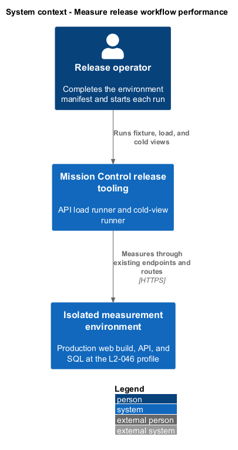
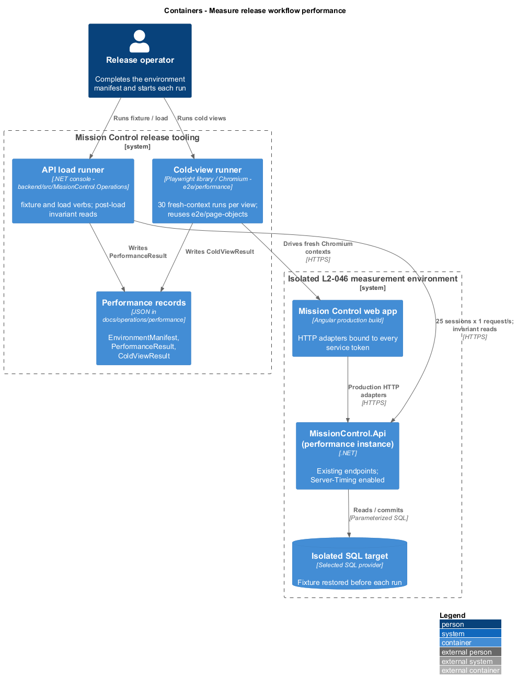
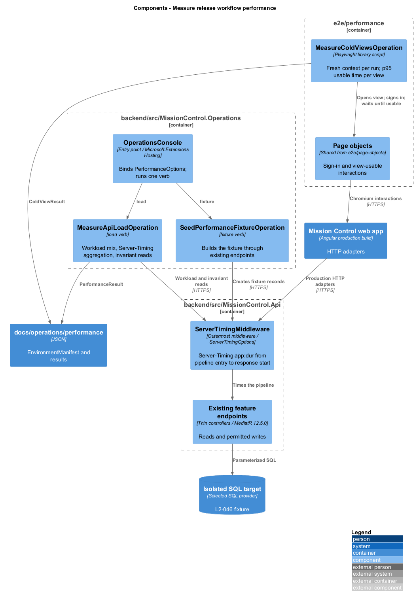
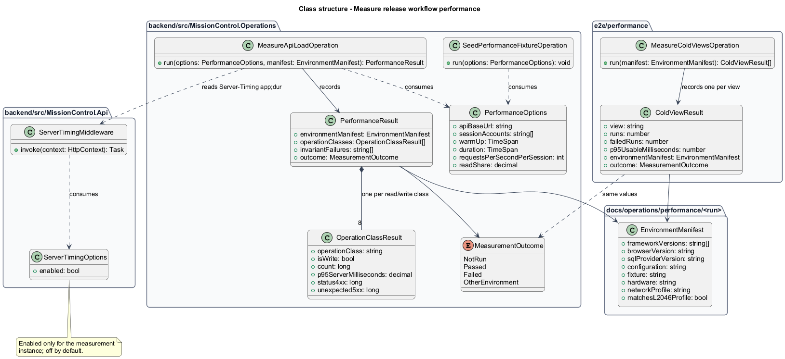
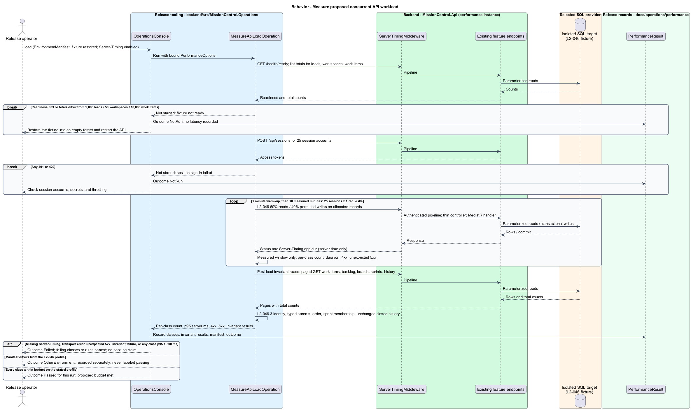
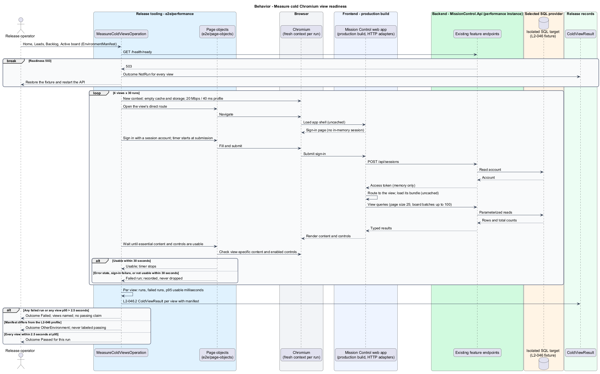

# Measure release workflow performance

## Overview

Release measurement assesses the application's responsiveness under the proposed initial workload.

- **Operation class** — distinct read or write behavior whose server latency is reported independently
- **Cold-view run** — Chromium navigation with a cold frontend cache that measures time until essential content and controls are usable

Budgets are proposed targets; this design contains no measured performance claim.

This design refines the [L2 baseline](../../../specs/L2.md) and its linked L1 scope. Proposed defaults retain their proposal status.

## Description

All named parts are proposed; the repository currently contains requirements, designs, and static mocks.

| Part | Responsibility and architectural home |
| --- | --- |
| `MissionControl.Operations` | Release-tooling .NET console project under `backend/src`, shared with [backup and restore](../restore-data/README.md). Microsoft.Extensions supplies DI, Options, and Configuration. |
| `SeedPerformanceFixtureOperation` | `fixture` verb; builds the L2-046 fixture through existing endpoints. The `backup` verb then captures it once. |
| `MeasureApiLoadOperation` | `load` verb and the API load runner; drives 25 sessions over HTTP, aggregates per-class results, and runs post-load invariant reads. |
| `PerformanceOptions` | Options bound from configuration: API address, session accounts, warm-up, duration, rate, and operation mix. Session passwords come from external secret configuration. |
| `ServerTimingMiddleware`, `ServerTimingOptions` | Outermost middleware in `backend/src/MissionControl.Api`. When enabled, it emits `Server-Timing: app;dur=<ms>` from pipeline entry to response start. It is off by default. |
| `MeasureColdViewsOperation` | Cold-view runner in `e2e/performance/measure-cold-views.operation.ts`; a Playwright-library Chromium script, separate from `e2e/specs`, reusing `e2e/page-objects`. |
| Mission Control web app (production build) | `frontend/projects/mission-control` built with the production configuration, so every service token binds its HTTP adapter. |
| `PerformanceResult`, `OperationClassResult`, `MeasurementOutcome` | Load results in `MissionControl.Operations`, one file each; written as JSON under `docs/operations/performance/<run>/`. |
| `ColdViewResult` | Per-view result type in `e2e/performance`; written beside the load results. |
| `EnvironmentManifest` | Operator-completed JSON in the run folder: exact versions, configuration, fixture, hardware, and network profile. Both runners embed it in their results. |

Separate app and SQL instances each use 4 vCPUs, 8 GiB RAM, SSD storage, and at most 2 ms inter-instance round-trip latency.
The browser uses installed Chromium, four logical cores, 8 GiB RAM, 20 Mbps throughput, and 40 ms API round-trip latency.
Chromium network emulation applies the throughput and latency when the physical link differs; the manifest records which applied.
Exact framework, browser, and SQL versions, configuration, fixture, and hardware are `<TO SUPPLY>` until measured.
A manifest that differs from this profile labels its results `OtherEnvironment`; they never claim that L2-046 passed.

The fixture holds 1,000 leads, 10,000 work items, and 50 workspaces in both modes. Scrum workspaces include closed history and an active sprint.
It also provisions 25 session accounts. Lead edits use Administrator sessions; the other write classes use Collaborator sessions.
Building it through existing endpoints keeps it consistent with every business rule. Each run restores the captured fixture into an empty isolated target.
A fresh `MissionControl.Api` instance then starts against it with `ServerTimingOptions` enabled.

After one minute of warm-up, 25 authenticated sessions each issue one request per second for ten minutes.
The mix is 60% reads and 40% permitted writes. Read classes are directory/search, backlog, board batches, and sprint history.
Write classes are lead edits, work edits, card moves, and sprint planning. Each session writes only records allocated to it, so expected conflicts cannot mask latency or errors.
The runner takes each response's `Server-Timing` `app` duration as server time, which excludes client and network time. Warm-up responses are discarded.
Each operation class reports its count, p95 server milliseconds, 4xx count, and unexpected 5xx count; transport errors and missing `Server-Timing` count as unexpected.
The run passes only when every class has p95 at most 500 ms, no unexpected 5xx, and no invariant failure.

After load, invariant reads page through every workspace with existing `GET` endpoints at page size 100.
They check unique IDs, typed same-workspace parents, unique contiguous sibling and backlog order, one active sprint per workspace, one open sprint per story, and unchanged closed history.
All collection APIs retain default 25 and maximum 100 records. SQL indexes align with directory filters, sibling/backlog positions, membership, and board queries.

Home, Leads, Backlog, and Active board each receive 30 cold-view runs; p95 usable-view time targets at most 2.5 seconds.
Each run opens a fresh Chromium context with empty cache and storage. Access tokens live only in memory, so the runner opens the view's direct route and signs in through the sign-in page object.
The runner times from sign-in submission until the view's page object reports essential content and controls usable. The view's route bundle and data requests are uncached.
A run that shows an error, fails sign-in, or is not usable within 30 seconds fails. The runner records it and never drops it.

Cold-view runs use the production HTTP composition against the isolated fixture, a retained decision in the [design overview](../../README.md).
Acceptance specs in `e2e/specs` keep the `e2e` mock composition. Neither runner is an acceptance test.
`ServerTimingMiddleware` and each console verb arrive test-first through API integration checks in `backend/tests`.
A measured bottleneck informs a targeted change only after evidence; this design adds no background cache or queue.

| Behavior | Proposed boundary | Proposed operation |
| --- | --- | --- |
| Measure proposed concurrent API workload | `MissionControl.Operations load` against existing protected endpoints | `MeasureApiLoadOperation` |
| Measure cold Chromium view readiness | `e2e/performance` against Home / Leads / Backlog / Active board routes | `MeasureColdViewsOperation` |

Mock input and review references:

No workflow mock represents this operational capability. The operational flow follows the linked L2 acceptance criteria.

## Requirements

Requirement text and identifiers below are copied verbatim from L2, including the source use of `must`.

| L2 ID | Refines (L1) | Requirement |
| --- | --- | --- |
| `L2-045` | `L1-013` | Directories, workspace lists, backlogs, and history lists must default to 25 records per page and cap requested page size at 100. Invalid sizes must return 400. Results must include total matching count and stable ordering. Boards/hierarchies must load bounded batches of at most 100 and allow access to every matching item; counts must reflect the full dataset rather than just loaded records. |
| `L2-046` | `L1-013` | The proposed acceptance workload is 1,000 leads and 10,000 work items across 50 workspaces with both delivery modes and sprint history. Measure on separate app and SQL instances, each with 4 vCPUs and 8 GiB RAM, SSD storage, and ≤2 ms app/SQL round-trip latency. The browser profile is current installed Chromium, four logical CPU cores, 8 GiB RAM, 20 Mbps network throughput and 40 ms API round-trip latency. Record exact versions, configuration, fixture, and hardware in results. Run 25 authenticated concurrent sessions at one request per second each for 10 minutes after one minute of warm-up: 60% reads, 40% permitted writes. Reads must include directory/search, backlog, board batches, and sprint history; writes must include lead/work edits, card moves, and sprint planning. Report p95 by operation class rather than pooling all operations. These budgets are proposed targets, not measured claims. |

## Diagrams

The context view identifies the operator, the release tooling, and the isolated measurement environment.

The container view separates the API load runner, the cold-view runner, the production web app, the API, and the fixture database.

The component view shows the console verbs, the cold-view script and page objects, and the server-timing source.

The class view identifies the operations, their options, and the load and cold-view results.

Measure proposed concurrent API workload follows the sequence below. The flow traces its enforcing steps to `L2-046` and includes rejection or recovery paths.

Measure cold Chromium view readiness follows the sequence below. The flow traces its enforcing steps to `L2-046` and includes rejection or recovery paths.

