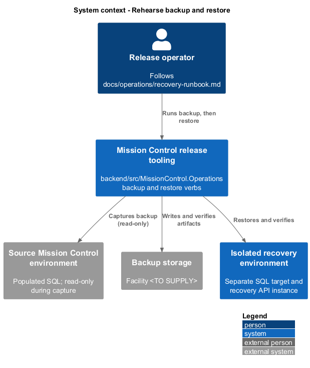
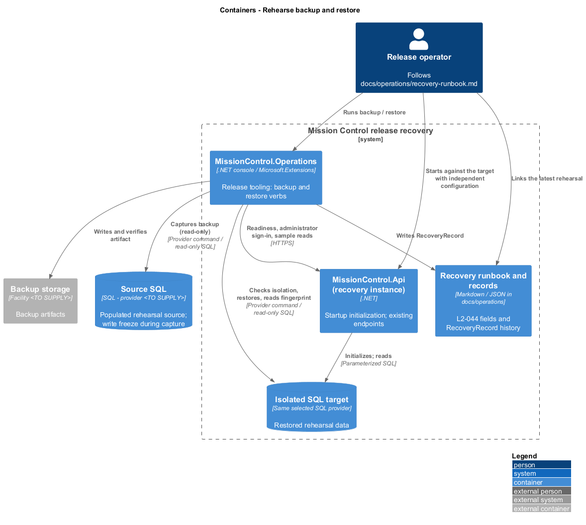
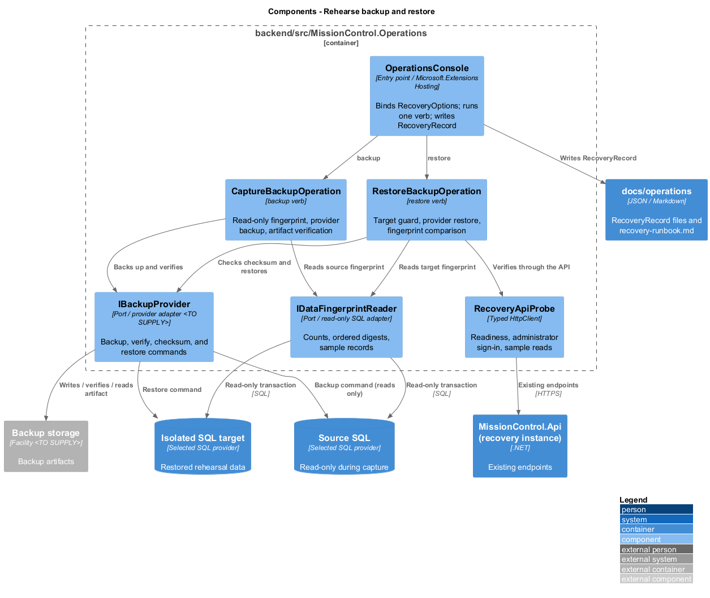
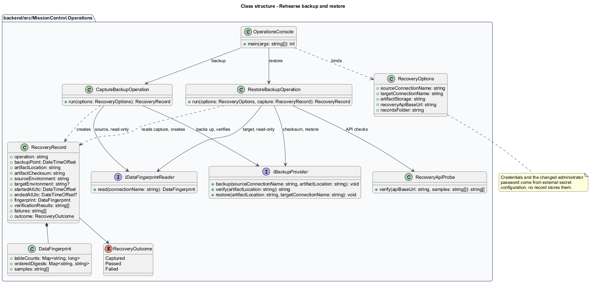
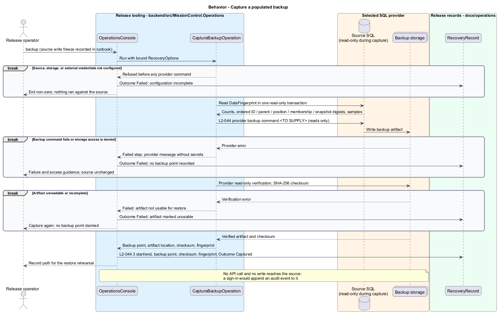
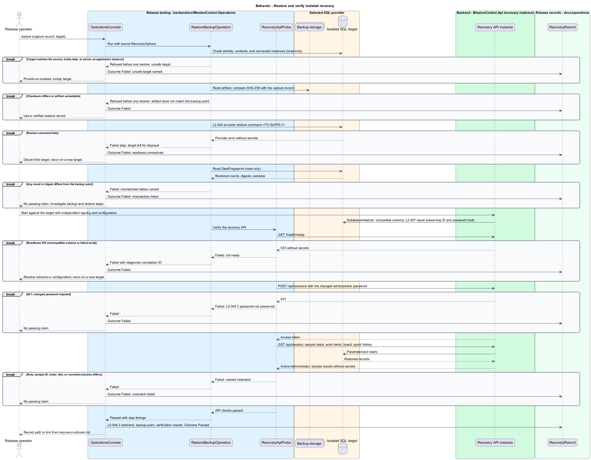

# Rehearse backup and restore

## Overview

Release recovery restores all committed Toronto account, contact, project, and delivery records into an isolated environment.

- **Backup point** — database state captured by the provider-specific backup procedure
- **Restore rehearsal** — documented recovery exercise performed against a separate target, preserving the source environment

The restored administrator retains any changed password, and closed sprint history remains unchanged.

This design refines the [L2 baseline](../../../specs/L2.md) and its linked L1 scope. Proposed defaults retain their proposal status.

## Description

All named parts are proposed; the repository currently contains requirements, designs, and static mocks.

| Part | Responsibility and architectural home |
| --- | --- |
| `MissionControl.Operations` | Release-tooling .NET console project under `backend/src`. Microsoft.Extensions Hosting supplies DI, Options, and Configuration; it references no other Mission Control project. |
| `OperationsConsole` | Entry point in `MissionControl.Operations`; binds options, runs one verb (`backup` or `restore` here), and writes the resulting `RecoveryRecord`. |
| `CaptureBackupOperation` | `backup` verb; reads the source fingerprint, runs the provider backup, and verifies the artifact. It sends no API call and no write to the source. |
| `RestoreBackupOperation` | `restore` verb; refuses an unsafe target, restores into the isolated target, compares fingerprints, and delegates API checks to `RecoveryApiProbe`. |
| `IBackupProvider` | Port in `MissionControl.Operations` for provider backup, read-only verify, checksum, and restore commands; its adapter is `<TO SUPPLY>` with the SQL provider. |
| `IDataFingerprintReader` | Port for read-only provider queries in one read-only transaction; returns per-table counts, ordered digests, and sample records. |
| `RecoveryApiProbe` | Typed `HttpClient` in `MissionControl.Operations`; calls existing endpoints on the recovery API instance and holds no business rules. |
| `RecoveryOptions` | Options bound from configuration: source and target connection names, artifact storage, recovery API address, and records folder. Credentials come from external secret configuration. |
| `RecoveryRecord`, `DataFingerprint`, `RecoveryOutcome` | One file each in `MissionControl.Operations`. Records serialize to JSON under `docs/operations/rehearsals/` without connection strings, credentials, or contact payloads. |
| `docs/operations/recovery-runbook.md` | Release runbook holding every L2-044 field and a link to the latest rehearsal record. |

The chosen SQL provider, framework versions, deployment topology, backup command, restore command, and backup storage facility are `<TO SUPPLY>`.
Schedule, retention, backup encryption/access, responsible operator, and restoration credentials are `<TO SUPPLY>` in the runbook before release.
The rehearsal source is a populated database with accounts, five lead categories, complete hierarchies, board ordering, sprint plans, and closed history.

Capture treats the source as read-only. The runbook records a write freeze on the source while capture runs, so the fingerprint describes the backup point.
`IDataFingerprintReader` reads counts and ordered digests of IDs, parent links, sibling and backlog positions, board placements, sprint membership, and closure snapshots.
The provider backup writes the artifact to backup storage; the provider's read-only verification and a SHA-256 checksum then confirm it is usable.
Capture makes no API call: a sign-in would append an audit event to the source, and L2-044.3 forbids altering it.

Restore first refuses a target that matches the source, already holds data, or already serves an application instance. Nothing runs against a refused target.
It then confirms the artifact checksum, runs the provider restore, and compares a fresh target fingerprint with the recorded one.
The operator starts a recovery `MissionControl.Api` instance bound to the target, with signing and configuration material supplied independently.
Its startup `DatabaseInitializer` checks compatible schema and repairs administrator access while preserving the account ID and password hash (L2-007).
`RecoveryApiProbe` waits for `GET /health/ready`, signs in through `POST /api/sessions` with the changed administrator password, and confirms the active Administrator through `GET /api/session`.
It then reads sample leads, work items, board placements, and sprint history and compares their IDs, order, titles, and recorded outcomes with the fingerprint samples.

Each record holds the backup point, source and target names, start and end instants, verification results, and failures.
Any failure records the outcome `Failed` and leaves release readiness unresolved. The operator links the latest record from the runbook.
The tooling is built test-first: integration checks in `backend/tests` drive each verb against disposable SQL instances, for example `restore` refusing the source as its target.

| Behavior | Proposed boundary | Proposed operation |
| --- | --- | --- |
| Capture a populated backup | `MissionControl.Operations backup`; provider backup command `<TO SUPPLY>` | `CaptureBackupOperation` |
| Restore and verify isolated recovery | `MissionControl.Operations restore`; provider restore command `<TO SUPPLY>` | `RestoreBackupOperation` |

Mock input and review references:

No workflow mock represents this operational capability. The operational flow follows the linked L2 acceptance criteria.

## Requirements

Requirement text and identifiers below are copied verbatim from L2, including the source use of `must`.

| L2 ID | Refines (L1) | Requirement |
| --- | --- | --- |
| `L2-007` | `L1-002` | The seed must avoid duplicates, preserve existing passwords and restore the designated account's active status and highest capabilities. |
| `L2-026` | `L1-006` | Closed sprint history must preserve its name, goal, planned dates, actual start/ close instants, initial and final scope, and story IDs, titles, statuses, and carryover destinations as recorded at closure. Later edits, reparenting, or permitted deletions must not rewrite these recorded outcomes. |
| `L2-040` | `L1-011` | Committed account, contact, hierarchy, ordering, board, and sprint changes must survive restart. Operations spanning multiple records must commit entirely or leave all affected business records unchanged. |
| `L2-044` | `L1-012` | Release documentation must identify the chosen SQL provider, backup commands, schedule/retention, storage access, restore steps, responsible operator, and verification procedure. A restore rehearsal must recover a populated database into a separate environment before release. Recovery must not reset existing administrator passwords or rewrite historical sprint results. |

## Diagrams

The context view identifies the operator, the release tooling, and the environments it touches.

The container view separates the release tooling, the read-only source, backup storage, the isolated target, and its recovery API instance.

The component view shows the console verbs, the provider and fingerprint ports, and the API probe.

The class view identifies the operations, their options, and the recorded outcome.

Capture a populated backup follows the sequence below. The flow traces its enforcing steps to `L2-044` and includes rejection or recovery paths.

Restore and verify isolated recovery follows the sequence below. The flow traces its enforcing steps to `L2-044` and includes rejection or recovery paths.

