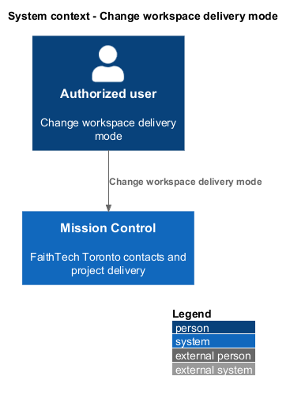
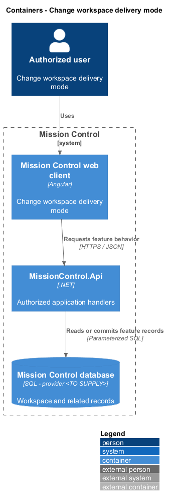
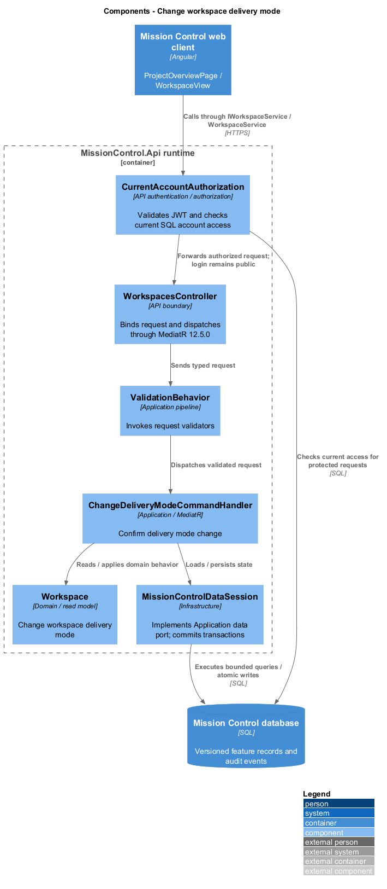
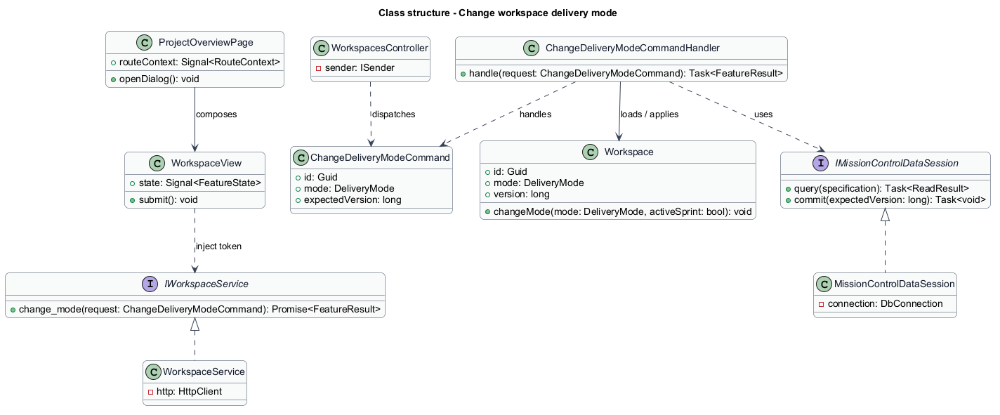
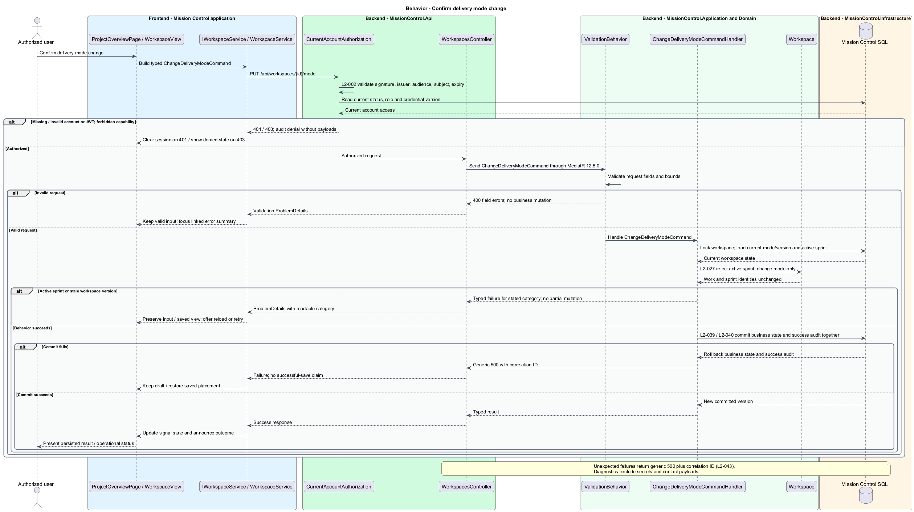

# Change workspace delivery mode

## Overview

Administrators choose Kanban for continuous flow or Scrum for sprint delivery.

- **Delivery mode** — workspace setting that selects its board and enabled sprint actions

Switching mode retains all work and sprint records. An active sprint blocks the transition until closure.

This design refines the [L2 baseline](../../../specs/L2.md) and its linked L1 scope. Proposed defaults retain their proposal status.

## Description

All named production types are proposed; the repository currently contains requirements and static mocks.

| Part | Responsibility and architectural home |
| --- | --- |
| `ProjectOverviewPage` | Routed page or dialog owned by `frontend/projects/mission-control`; composes the domain library and presentational components. |
| `WorkspaceView` | Domain component in `frontend/projects/domain`; injects `WORKSPACE_SERVICE` and holds feature state in signals. |
| `IWorkspaceService`, `WORKSPACE_SERVICE` | Interface and token in `frontend/projects/api/workspace.service.contract.ts`; the consumer imports the contract only. |
| `WorkspaceService` | Production HTTP adapter in `api`; owns HTTP calls and observable-to-signal conversion. Composition binds a mock adapter for Chromium Playwright. |
| `WorkspacesController` | Thin controller under `backend/src/MissionControl.Api/Controllers`, namespace `MissionControl.Api.Controllers`; binds, dispatches, and returns. |
| `Workspace` | Domain entity or Application read projection described below; Domain has no external project dependency. |
| `IMissionControlDataSession` | Application data port; the Infrastructure adapter runs parameterized queries and transaction commits. |

Commands, queries, handlers, and request validators live in Application feature folders. Each type has its own file; folders and namespaces agree.
MediatR remains pinned to `12.5.0`. Microsoft.Extensions supplies dependency injection, Options, and Configuration.

`ModeChangeDialog` opens from Project actions, names the destination mode, and initially focuses Cancel.
`ChangeDeliveryModeCommandHandler` locks the workspace aggregate before checking active sprint state.
Sprint start, allocation, and mode change share the workspace lock/version boundary, preventing a racing start after the check.
The command updates only `Workspace.Mode`; IDs, statuses, assignments, sibling/backlog/column order, and sprint membership remain intact.

Kanban displays the continuous board and disables sprint planning, allocation, scope mutation, start, and execution.
Preserved sprint plans/history remain readable under Sprints, matching `kanban-preserved` and `kanban-paused` mocks.
Returning to Scrum restores the planned-sprint controls. A workspace with no preserved sprints has no Kanban Sprints tab.
The preserved tab is a design interpretation from the mocks; the underlying retention and disabled execution follow L2-027.
Active-sprint conflict returns `409`, explains closure, and keeps the previous mode.

The authenticated API evaluates current SQL permissions before feature dispatch. Validation V maps invalid fields to `400`, absent authentication to `401`, forbidden access to `403`, missing records to `404`, and conflicts to `409`.
Unexpected errors return a generic `500` with a correlation ID. Structured diagnostics exclude secrets and contact payloads.

Responsive profile R covers `320`, `375`, `576`, `768`, `992`, `1200`, and `1920` CSS-pixel widths at `800` pixels high.
Forms stack on compact screens; dialogs become sheets below `576px`. Templates, styles, and classes remain separate files.
Component styles read `var(--mc-<role>)` from the mirrored authoritative design-system tokens.
Keyboard actions include visible focus, named controls, modal focus containment, trigger focus restoration, and destination-heading focus after navigation.
Field errors connect to inputs; asynchronous results use status or alert announcements. Status text supplements color; primary touch targets measure at least `44×44` CSS pixels.

| Behavior | Proposed boundary | Request / handler |
| --- | --- | --- |
| Confirm delivery mode change | `PUT /api/workspaces/{id}/mode` | `ChangeDeliveryModeCommand` / `ChangeDeliveryModeCommandHandler` |

Mock input and review references:

- [Change delivery mode · Mission Control mock](../../../mocks/projects/mode-change-dialog.html); review states: `to-kanban`, `to-scrum`, `blocked`, `saving`, `failed`.
- [Project overview · Mission Control mock](../../../mocks/projects/project-overview.html); review states: `default`, `kanban`, `new-empty`, `new-empty-collaborator`, `kanban-preserved`, `collaborator`, `not-found`, `loading`, `error`.
- [Sprints · Mission Control mock](../../../mocks/scrum/sprints.html); review states: `default`, `no-sprints`, `kanban-paused`, `loading`, `error`.
- [Backlog · Mission Control mock](../../../mocks/backlog/backlog.html); review states: `default`, `add-to-sprint`, `kanban`, `kanban-preserved`, `collaborator`, `empty`, `reorder-failed`, `loading`, `error`.

Implementation proceeds one behavior at a time using the linked Given-When-Then criteria. An API integration acceptance check first fails for the expected missing behavior.
A Chromium Playwright check uses one page object per screen and a mock service bound through the same token. Tests express intent; page objects own selectors.
The smallest implementation turns those checks green before the next behavior begins. Relevant regression checks follow each slice; no architecture tests are introduced.

## Requirements

Requirement text and identifiers below are copied verbatim from L2, including the source use of `must`.

| L2 ID | Refines (L1) | Requirement |
| --- | --- | --- |
| `L2-027` | `L1-006` | Only administrators must switch workspace mode. An active sprint must block a mode change. Kanban mode must preserve planned/closed sprints but disable their execution until returning to Scrum; work remains available on the Kanban board. |
| `L2-040` | `L1-011` | Committed account, contact, hierarchy, ordering, board, and sprint changes must survive restart. Operations spanning multiple records must commit entirely or leave all affected business records unchanged. |
| `L2-041` | `L1-011` | Edits must carry a record version or equivalent concurrency condition. SQL constraints must protect normalized account emails, lead email/category pairs, parent references, open sprint membership, and active sprint exclusivity. Caller errors must produce validation/conflict responses rather than generic failures. |

## Diagrams

The context view identifies the actor and the Mission Control capability.

The container view separates the client, .NET API, and durable SQL records.

The component view locates request dispatch, domain behavior, and persistence within the feature.

The class view shows proposed typed requests, interface consumption, and relationships between the feature parts.

Confirm delivery mode change follows the sequence below. The flow traces its enforcing steps to `L2-027` and includes rejection or recovery paths.

