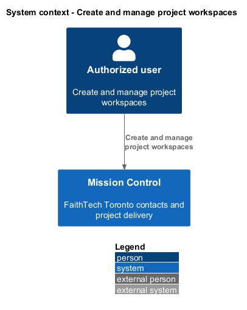
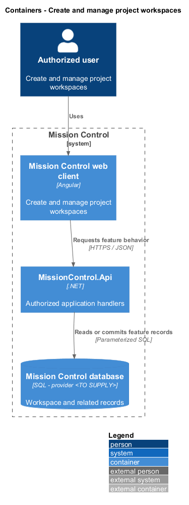
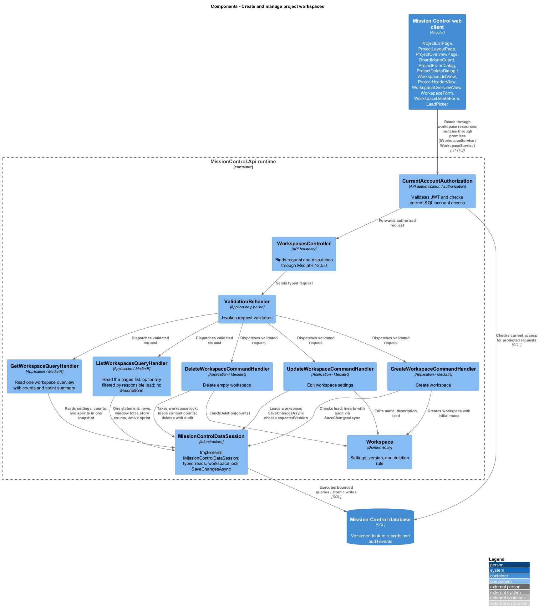
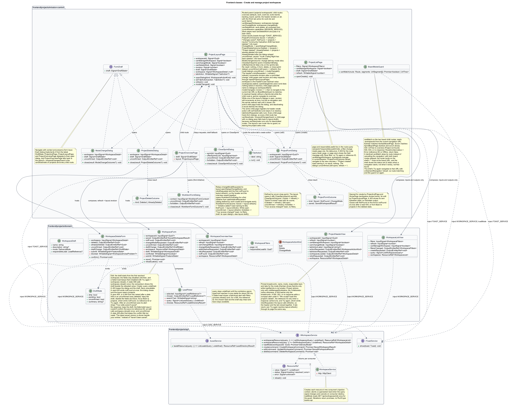
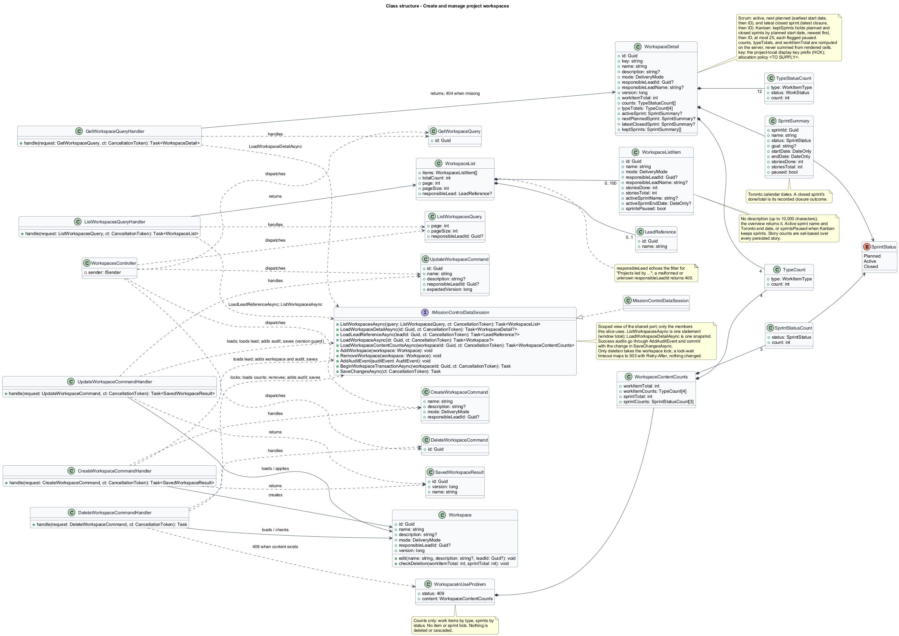
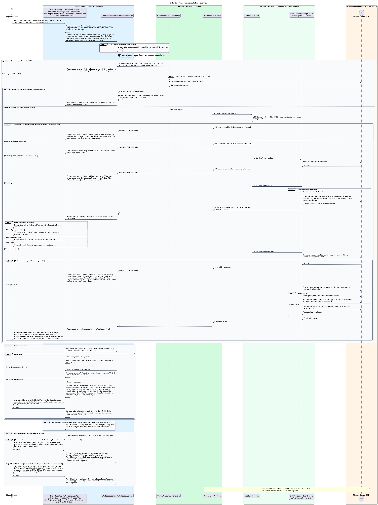
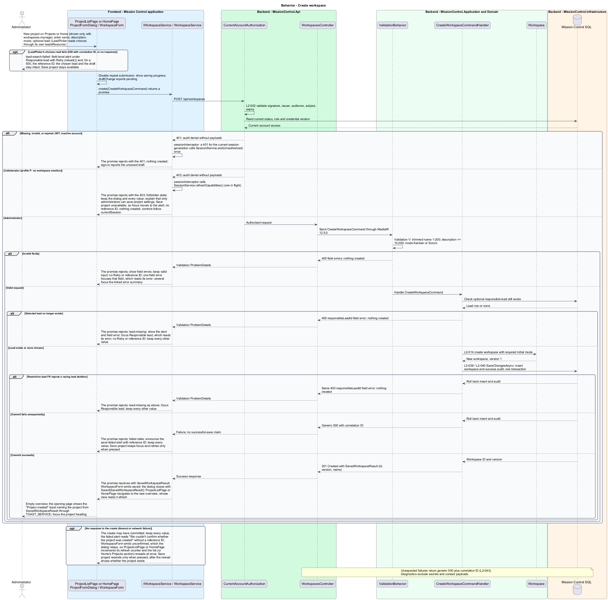
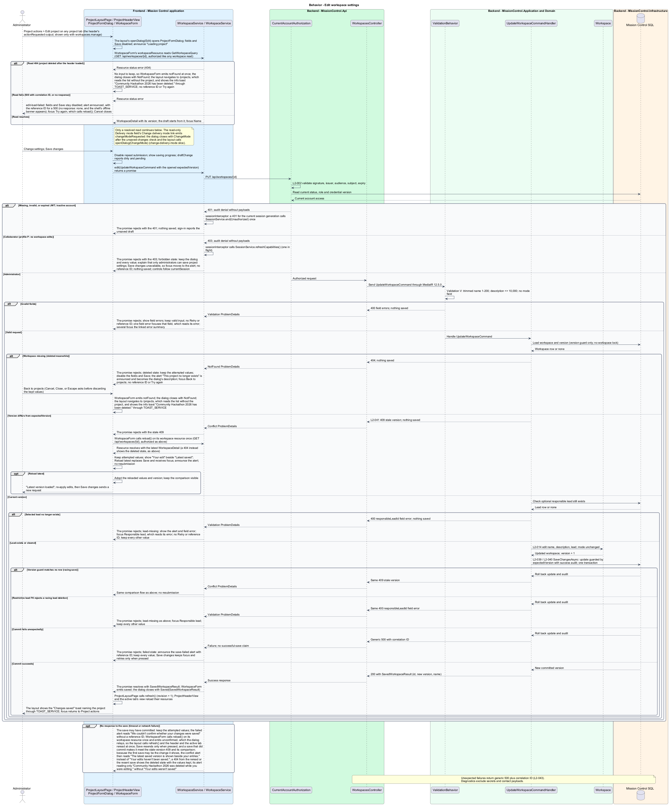
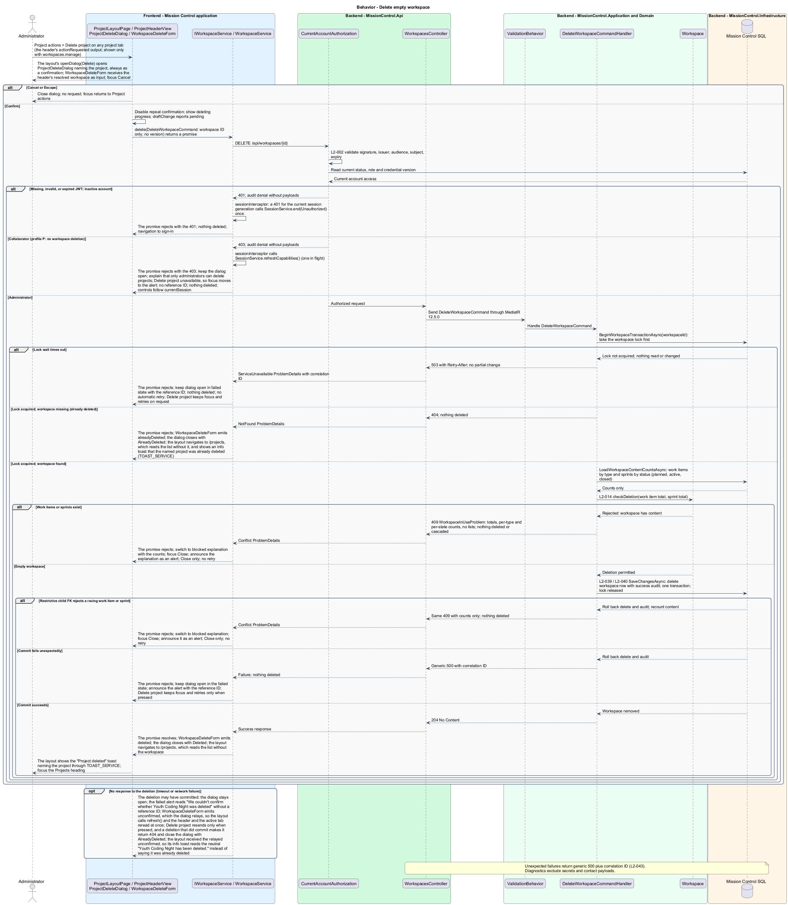

# Create and manage project workspaces

## Overview

A project workspace groups Toronto work under one delivery mode and an optional responsible lead.

- **Workspace** — project record that owns a work hierarchy, board order, and sprint records

Administrators manage workspace settings; collaborators read workspaces and contribute work. Empty workspace deletion never cascades through project data.

This design refines the [L2 baseline](../../../specs/L2.md) and its linked L1 scope. Proposed defaults retain their proposal status.

## Description

The [shared design rules](../../README.md#shared-design-rules) apply: proposed type status, Application placement and MediatR `12.5.0`, authentication and validation V, responsive profile R and accessibility, token styling, data ownership and session handling, and incremental ATDD. This page records feature-specific behavior and exceptions only.

| Part | Responsibility and architectural home |
| --- | --- |
| `ProjectListPage` | Routed page for `/projects` in `frontend/projects/mission-control`; keeps page and responsible-lead filter in the route query, reads `currentSession` through `SESSION_SERVICE`, computes `canManageWorkspace` from the `workspaces.manage` capability, passes the filters, that flag, and its own `refresh` counter to `WorkspaceListView`, shows New project only with that capability, and opens `ProjectFormDialog` for it or for the view's `createRequested`. It injects `TOAST_SERVICE`: when the dialog closes with `Saved(SavedWorkspaceResult)` it navigates to the new project's overview and shows the "Project created" toast naming the project, and no result changes nothing (a create never closes with `NotFound` or `ChangeMode`); while the dialog stays open, its `unconfirmed` output increments the page's `refresh` counter at once, so the list shows whether the project was created. It implements `FormDraft` by delegating to its open dialog (clean when none is open), and `UnsavedChangesGuard` is the route's `canDeactivate`. |
| `ProjectLayoutPage` | Routed parent page for `/projects/:workspaceId` in `frontend/projects/mission-control`; reads `currentSession` through `SESSION_SERVICE`, computes `canManageWorkspace` (`workspaces.manage`), `canChangeMode` (`workspaces.changeMode`), and `canDeleteWork` (`work.delete`), composes `ProjectHeaderView` above the child-route outlet, exposes the header's latest resolved workspace as `workspace: Signal<WorkspaceDetail | null>`, set from its `workspaceLoaded` output, so child pages pass the project name to the dialogs that show it, maps the header's `retryRequested` output to `refresh()`, and opens `ProjectFormDialog`, `ProjectDeleteDialog`, and `ModeChangeDialog` through `openDialog(kind)` from the header's `actionRequested` output, a request a child page relays, or a dialog's close result such as `ChangeMode`. It injects `TOAST_SERVICE` and reacts to each dialog's close result: `ProjectFormOutcome` `Saved` calls `refresh()` and shows the "Changes saved" toast naming the project, `NotFound` navigates to `/projects`, which reads the list without the project, with an info toast that neutrally says the named project has been deleted ("Community Hackathon 2026 has been deleted."), and `ChangeMode` calls `openDialog(ChangeMode)`; `ProjectDeleteOutcome` `Deleted` navigates to `/projects` with the "Project deleted" toast naming the project, and `AlreadyDeleted` navigates there with an info toast saying the project was already deleted, or, when the dialog relayed `unconfirmed` before it closed, an info toast that neutrally says the named project has been deleted ("Youth Coding Night has been deleted."); [Change workspace delivery mode](../change-delivery-mode/README.md) defines the `ModeChangeOutcome` reactions. When `ModeChangeDialog` closes with `CloseSprint(SprintReference)`, the layout opens `CloseSprintDialog` with that sprint's ID as its `sprintId` input; on `CloseSprintOutcome` `Closed` the layout calls `refresh()` and shows the "Sprint 8 closed" toast with the result's counts through `TOAST_SERVICE`, and on `Outdated` it calls `refresh()`. No result changes nothing. While `ProjectFormDialog`, `ProjectDeleteDialog`, or `CloseSprintDialog` stays open, its `unconfirmed` output calls `refresh()` at once; while `CloseSprintDialog` stays open, its `forbidden` output (an unexpected `403`) shows the "Your access changed" toast through `TOAST_SERVICE`, without Retry. It increments its `revision` signal after a committed change (`refresh()`), defers its own re-navigation while one of its dialogs is open (see below), holds the active tab's create action registered through `setTabAction`, and implements `FormDraft` by delegating to its open dialog. Every child page's `draft` falls back to the layout's, so the layout's own route has no `canDeactivate` (see below). |
| `ProjectHeaderView` | Domain component in `frontend/projects/domain`; injects `WORKSPACE_SERVICE`, owns a `workspaceResource` for the routed workspace, and renders the pinned breadcrumb, name, mode, responsible lead, and the tabs for the mode on every project tab. It shows Project actions only when `canManageWorkspace` is true (Change delivery mode only when `canChangeMode` is also true), shows the Collaborator notice otherwise, and emits `actionRequested` with the action kind and `workspaceLoaded` with each resolved workspace. Its `tabActionLabel` input renders the active tab's create button (such as Add story) in the action area for every role, and the button emits `tabActionRequested`. A `404` on its read leaves only the breadcrumb back to Projects. A `500`, `503`, or no response also shows a compact alert under the breadcrumb, "We couldn't load this project's details", with the reference ID only when a response carried one and Try again, which emits `retryRequested`. |
| `BoardModeGuard` | Application `canMatch` guard in `frontend/projects/mission-control` on the two `board` child routes; awaits the workspace's mode and matches `KanbanBoardPage` in Kanban mode or `SprintBoardPage` in Scrum mode. A `404` redirects to `overview`, which shows Project not found. A `500`, `503`, or no response sets `RouteContext.status` to Error (with the reference ID) or Offline and returns `false` from `canMatch`, which skips the route rather than cancelling the navigation: with both board routes skipped, the router lands on the shell's `**` route at the board URL, and the shell shows the status the guard set, because the status clears when a navigation starts, not when it ends. |
| `ProjectOverviewPage` | Routed `overview` child page in `frontend/projects/mission-control`; composes `WorkspaceOverviewView`, passes the layout's `revision` as its `refresh` input and the layout's `canChangeMode`, relays its `changeModeRequested` output through `inject(ProjectLayoutPage).openDialog(ChangeMode)`, and relays its `retryRequested` output and its first `notFound` to the layout's `refresh()`. Its `addInitiativeRequested` output opens `WorkItemFormDialog` for a first initiative in this workspace ([Create and navigate the work hierarchy](../../work/create-and-navigate-work/README.md)), and the page injects `TOAST_SERVICE` and reacts to `WorkItemFormOutcome`: `Saved` calls the layout's `refresh()`, so the header and the overview reread, and shows the "Initiative added" toast naming the new initiative from the outcome's `title`; `NotFound` calls the layout's `refresh()`; no result changes nothing. While the dialog stays open, its `unconfirmed` output calls the layout's `refresh()` at once, and its `forbidden` output (an unexpected `403`) shows the "Your access changed" toast, without Retry. It implements `FormDraft` by delegating to that dialog and, when none is open, to the layout's open dialog (`inject(ProjectLayoutPage).draft()`), with `UnsavedChangesGuard` on the route. |
| `ProjectFormDialog` | Application dialog in `frontend/projects/mission-control`, opened by `ProjectListPage` and `HomePage` ([Review home coverage and progress](../../workspace/review-home/README.md)) for create and by `ProjectLayoutPage` for edit; hosts `WorkspaceForm`, passes the edited workspace's ID as an input, implements `FormDraft` from the form's latest `DraftState`, and opens `UnsavedChangesDialog` when Cancel, Close, or Escape meets a dirty draft. It closes through `close(result: ProjectFormOutcome?)`: `Saved(SavedWorkspaceResult)` on the form's `saved` output, `NotFound` on `notFound`, `ChangeMode` on `changeModeRequested` after the unsaved-changes check, and no result on Cancel, Close, or Escape. It relays the form's `unconfirmed` as its own output and stays open with the draft; a `403` shows its own `forbidden` state, so it relays no `forbidden` output. |
| `ProjectDeleteDialog` | Application dialog in `frontend/projects/mission-control`; hosts `WorkspaceDeleteForm`, takes the workspace from its opener as an input, names the project, offers Cancel, and implements `FormDraft` from the form's latest `DraftState`. It closes through `close(result: ProjectDeleteOutcome?)`: `Deleted` on the form's `deleted` output, `AlreadyDeleted` on `alreadyDeleted`, and no result on Cancel or Escape. It relays the form's `unconfirmed` as its own output and stays open; a `403` shows its own forbidden explanation, so it relays no `forbidden` output. |
| `WorkspaceListView` | Domain component in `frontend/projects/domain`; injects `WORKSPACE_SERVICE`, owns a `workspacesResource` driven by its `filters` input and reread when its `refresh` input changes, and renders cards, paging, the lead-filter heading, and the list states. Its load-failed Try again calls `reload()`. Its `canManageWorkspace` input decides whether the empty state offers New project (`createRequested`) or explains that an administrator adds projects. |
| `WorkspaceOverviewView` | Domain component in `frontend/projects/domain`; injects `WORKSPACE_SERVICE`, owns a `workspaceResource` for the routed workspace, and renders settings, counts, and the sprint or board summary. Its `canChangeMode` input decides whether the paused-sprints banner offers Change delivery mode (`changeModeRequested`) or only says that an administrator can switch back; the new-empty state's Add initiative emits `addInitiativeRequested`, the load-failed state's Try again emits `retryRequested`, and a `404` shows its not-found state and emits `notFound`. |
| `WorkspaceForm` | Domain component in `frontend/projects/domain`; injects `WORKSPACE_SERVICE`, owns the draft, the edited workspace's `workspaceResource`, the conflict state, and submit state in signals, and composes `LeadPicker`. It emits `saved` with the `SavedWorkspaceResult`, `notFound` at once after a read `404` and from Back to projects in its `deleted` state after a save `404`, `changeModeRequested` from the edit form's Change delivery mode link, `unconfirmed` when a save gets no response, and `draftChange` with a `DraftState`. |
| `WorkspaceDeleteForm` | Domain component in `frontend/projects/domain`; injects `WORKSPACE_SERVICE`, owns the pending, blocked, and failure state of one deletion in signals, and emits `deleted`, `alreadyDeleted`, `unconfirmed` when the delete gets no response, and `draftChange` (never dirty; pending while the delete is in flight). |
| `LeadPicker` | Domain combobox in `frontend/projects/domain`; injects `LEAD_SERVICE`, owns a `leadsResource` driven by its debounced search query, and emits the chosen lead to the form. |
| `IWorkspaceService`, `WORKSPACE_SERVICE` | Contract and token in `frontend/projects/api/workspace.service.contract.ts`; the read members `workspacesResource(query)` and `workspaceResource(query)` return caller-owned `ResourceRef<WorkspaceList>` and `ResourceRef<WorkspaceDetail>`, `loadMode(workspaceId)` returns `Promise<DeliveryMode>` for `BoardModeGuard`, the mutations `create` and `edit` return `Promise<SavedWorkspaceResult>`, and `delete` returns `Promise<void>`. Consumers import the contract only. |
| `WorkspaceService` | Production HTTP adapter in `api`; creates each resource in the consumer's injection context, converts observables to signals or promises, aborts a superseded read when the query signal changes, and cancels reads on consumer destroy; no shared mutable state. |
| `WorkspacesController` | Thin controller under `backend/src/MissionControl.Api/Controllers`, namespace `MissionControl.Api.Controllers`. |
| `Workspace` | Domain entity; Domain has no external project dependency. |
| `WorkspaceList`, `WorkspaceListItem`, `WorkspaceDetail`, `SprintSummary`, `TypeStatusCount`, `TypeCount` | Application read projections returned by the list and overview queries. |
| `SavedWorkspaceResult` | Application mutation result `{ id, version, name }` returned by create and edit; it holds only values the handlers own, and the created-project toast names the project from it. |
| `WorkspaceInUseProblem` | Application `409` ProblemDetails for a delete blocked by work items or sprints; counts only, with sprints counted by `SprintStatus`. |
| `IMissionControlDataSession` | Shared Application data port defined in the [overview](../../README.md#data-access-and-security-ports); this slice uses its typed reads, `AddWorkspace`, `RemoveWorkspace`, `AddAuditEvent`, `BeginWorkspaceTransactionAsync`, and `SaveChangesAsync`. |

`ProjectListPage` owns `/projects`. `ProjectLayoutPage` owns `/projects/:workspaceId` and its child routes `overview` (the default), `work`, `work-list`, `work/:itemId`, `backlog`, `board`, and `sprints`, so every project page shows the same pinned header, tabs, and Project actions; the Work tab is active on `work`, `work-list`, and `work/:itemId`.
Child pages reach the layout through `inject(ProjectLayoutPage)`, their parent in the element-injector tree, to read `revision` and the capability flags (`WorkHierarchyPage` and `WorkItemDetailPage` pass `canDeleteWork` to their views) and to relay requests: `ProjectOverviewPage`, `BacklogPage`, `KanbanBoardPage`, and `SprintsPage` pass their paused-sprints banner's Change delivery mode to `openDialog(ChangeMode)`.
A child page with a create action in the header, such as Add story on Board and Backlog, Add initiative on Work, or Plan sprint on Sprints, registers it with `setTabAction({ label, run })` and clears it with `setTabAction(null)` when it is destroyed; it updates the registration when its label changes, for example to Add initiative on an empty board.
The layout passes the label to the header's `tabActionLabel` input and calls `run()` on `tabActionRequested`, so the child page opens its own dialog.
Every child page hosts form dialogs, so every child route (overview, work, work-list, work/:itemId, backlog, both board routes, and sprints) has `canDeactivate: UnsavedChangesGuard`, and its page implements `FormDraft` by delegating to its open dialog.
When the child page has no dialog open, its `draft` falls back to the layout's open dialog (`inject(ProjectLayoutPage).draft()`). Angular runs `canDeactivate` only for the routes a navigation deactivates, and a tab change, or Back or Forward between tabs, deactivates the child page but reuses the layout, so the child's guard is the one that sees a dialog the layout opened.
The layout's own route has no `canDeactivate`: leaving the project deactivates the active child page too, whose guard already sees the layout's dialog, and a second guard would ask twice.
`openDialog(kind)` opens the dialog for `kind` with the workspace the header last resolved, which it emits through `workspaceLoaded`. Every entry point renders from a resolved read of the same workspace; a request made before the header resolves does nothing.
The header lists Overview, Work, Backlog, Board, and Sprints in Scrum mode; in Kanban mode Sprints appears only while kept sprints exist.
While the header's read loads it shows a skeleton. A `404` leaves only the breadcrumb back to Projects, and the active tab's own view shows its not-found state.
A `500`, `503`, or no response leaves the breadcrumb with a compact alert under it: "We couldn't load this project's details", the reference ID only when a response carried one, and Try again. The alert is announced, and the active tab's view below keeps whatever its own read returned.
The header's Try again emits `retryRequested`, which the layout maps to `refresh()`, so the header and the active tab reread together.
A tab view's own load-failed Try again also emits `retryRequested`, and its page calls the layout's `refresh()`, so a header that failed too rereads with the tab. `ProjectOverviewPage` relays `WorkspaceOverviewView`'s output this way, and every other tab page relays its view's output the same way.
Links to other routes, such as project cards, tabs, count links, sprint links, Open board, the responsible lead, and Back to projects, are router links the views render from IDs in their results. Actions that open a dialog, filter and page changes, and a project tab's Try again leave a view through outputs, which its page maps to the dialog, the route query, or `refresh()`.
Two `board` child routes share the path. `BoardModeGuard` (`canMatch`) awaits `IWorkspaceService.loadMode(workspaceId)` and matches `KanbanBoardPage` in Kanban mode or `SprintBoardPage` in Scrum mode.
A `404` from that read redirects to `overview`, whose view shows Project not found with Back to projects.
A `500`, `503`, or no response sets `RouteContext.status` to Error, with the response's reference ID, or to Offline, and returns `false` from `canMatch`.
A declined `canMatch` skips its route instead of cancelling the navigation, so with both board routes skipped the router matches the shell's `**` route and completes the navigation at the board URL, outside the project layout.
`ApplicationShell` then shows `ShellStatusView` with the status the guard set, not the `**` route's Not found, because the status clears when a navigation starts, not when it ends.
Its Try again navigates to the attempted board URL with `onSameUrlNavigation: 'reload'`, so route matching, and with it the guard, runs again although the router already holds that URL.
The guard holds no view state and runs before any component exists, so its single read returns a promise rather than a resource.
The layout's `modeChanged()` runs after a committed, outdated, or unconfirmed mode change, and the active page calls it when a board mutation returns a mode-changed `409`. It increments `revision`, so the header and the active tab reload, and navigates to the current tab URL again (`onSameUrlNavigation: 'reload'`), so `BoardModeGuard` re-matches the board for the current mode.
Each time the header's workspace resolves without a Sprints tab while the active child route is `sprints`, the layout navigates to `overview`, replacing the URL.
So `modeChanged()` after a switch to Kanban from the Sprints tab of a project with no sprints lands on `overview`, and a direct `sprints` URL for a Kanban project with no kept sprints redirects there.
While one of the layout's dialogs is open, `modeChanged()` still increments `revision` at once, but the layout defers that re-navigation and the `sprints`→`overview` redirect until the dialog closes, then applies them to the current tab.
The active child page hosts that dialog, so a navigation that deactivated it would dismiss the dialog; the mode-change dialog in particular stays open after an unconfirmed switch so the administrator can see the persisted mode and choose again.
`ProjectFormDialog` and `ProjectDeleteDialog` belong to the application project; each hosts a domain form and exchanges data with it through inputs and outputs only.
`WorkspaceForm` emits `draftChange` whenever its draft or pending save changes, with a `summary` naming the edited project, or `null` for New project, which uses the generic copy; the delete form reports only pending.
`ListWorkspacesQuery` takes `page`, `pageSize`, and an optional `responsibleLeadId`.
The list sorts by name then stable ID, 25 per page by default. A page below 1 or a page size outside 1–100, for example from an edited link, returns `400` with a field message.
The view shows that message as in `lead-filter-invalid`, with Clear filter, which opens all projects at page 1, and with no Try again or reference ID, because a retry could only repeat the refusal.
When the total exceeds the page size, the list shows the total and Previous/Next page controls.
The list projection returns per-workspace story done/total and either the active sprint's name and Toronto end date or a sprints-paused flag.
List items omit the description, which can reach 10,000 characters; the overview returns it.
One projection statement returns the page rows with a window total, set-based story counts, and the active sprint summary, so rows and total agree and no per-row query runs.

`responsibleLeadId` limits the list to workspaces naming that lead responsible; the result then echoes the lead's ID and name.
The filter lives in the route query (`/projects?responsibleLeadId={leadId}`), so lead details and the blocked lead-delete dialog link straight to it.
The page shows "Projects led by" the lead's name with the full matching count and Clear filter, as in `by-lead`, `by-lead-rafael`, and `by-lead-lucia`; paging works as usual.
A malformed or unknown `responsibleLeadId` returns `400` with a field message. The view then shows `lead-filter-invalid` ("That lead no longer exists, so projects can't be filtered by them") with Clear filter and no Try again or reference ID, because nothing failed on the server.
`WorkspaceListView` emits `filtersChanged` for paging and Clear filter, and `ProjectListPage` writes the route query, which returns as the view's `filters` input.
These changes reach the view's query at once, without debounce, and a filter change resets page one; `workspacesResource` aborts a superseded read inside `WorkspaceService`.

The detail projection returns the project-local display key (such as `HCK`, whose allocation policy stays `<TO SUPPLY>`), type-by-status counts, per-type totals, and the work-item total, all computed on the server, plus the active sprint (name, goal, dates, done/total stories), the next planned sprint (earliest start date, then ID) and the latest closed sprint's outcome (latest closure, then ID); in Kanban mode it returns kept planned/closed sprints flagged paused.
All counts come from persisted records. Kept sprints are listed by planned start date, newest first, then ID, and bounded to 25; Sprints pages the full history.
`GetWorkspaceQueryHandler` reads settings, counts, and sprint summaries in one snapshot-isolation read transaction; the provider-specific isolation setting is chosen at the SQL gate.
`WorkspaceOverviewView` reads the overview through `workspaceResource`. A missing workspace returns `404`, and the view shows its not-found state with a way back to Projects. The view emits `notFound`, and on the first one `ProjectOverviewPage` calls the layout's `refresh()`, so a header that still shows the project rereads and keeps only the breadcrumb.
The same not-found state follows a `404` from a delivery-mode change: the dialog closes with `Outdated`, the layout increments `revision`, the header keeps only the breadcrumb, and the active tab's view shows not found. A `404` in Edit project returns to Projects instead (below).
A malformed workspace ID matches no API route under the `{id:guid}` route constraint and returns the same `404`.
Creating a workspace closes the dialog with `Saved`, and `ProjectListPage` or `HomePage` opens the new overview with the "Project created" toast naming it from `SavedWorkspaceResult`.
Name measures 1–200 characters and description at most 10,000. Initial mode is Kanban or Scrum.
An optional responsible lead uses `LeadPicker`, a paginated searchable combobox matching the `lead-picker` mock.
`LeadPicker` reads choices through its own `leadsResource`. Its query stays `undefined` until the combobox opens; typed text reaches it once stable for about `250` ms, and the resource aborts a superseded read inside `LeadService`.
A failed choices read (`500` or no response) shows a field-level alert under Responsible lead with Retry, which calls the resource's `reload()`, and the reference ID for a `500` (`lead-search-failed`). The chosen lead and the rest of the draft stay intact, and Save stays available.
The API rechecks the lead FK at save time; a lead removed after selection causes `400` without losing other input.

`UpdateWorkspaceCommand` excludes mode changes; the separate mode-change slice enforces active-sprint rules.
Create, edit, and delete require `workspaces.manage`, which only administrators hold. Without it, New project and Project actions are absent and the list and header explain who can change projects; the API still answers `403`.
A `403` on save, after the role changed while the form was open, keeps the dialog and every value, explains that only administrators can save project settings, and leaves Save unavailable (`forbidden`).
When an outcome disables or removes the focused Save, focus moves to the outcome: `forbidden` focuses its alert, `deleted` focuses Back to projects, and `conflict`, which replaces Save with Reload latest, focuses Reload latest.
A rejected lead (`lead-missing`, a `400`) moves focus to Responsible lead, which reads its error, with no Retry or reference ID; other single-field `400` errors focus their field, and several focus the linked error summary. A save that fails with a `500` keeps focus on Save, shows its reference ID, and is announced through the dialog's alert region (`failed`); Save retries only when pressed.
A save that gets no response may have committed, so the form never says nothing was saved: it keeps every value and shows the `failed` alert titled "We couldn't confirm whether the project was created" (for Edit, "… whether your changes were saved"), without a reference ID; an edit also calls `reload()` on its workspace resource once.
The form emits `unconfirmed`, which the dialog relays, so `ProjectListPage` or `HomePage` increments its `refresh` counter, or the layout calls `refresh()`, at once. Save sends again only when pressed: a repeated edit that already went through meets the stale-version `409` and its comparison, and the reread list (or Home's Projects section) shows whether a create went through before it is repeated.
The first save may be the change that comparison shows, so after an unconfirmed save the conflict alert keeps its title but reads "The latest saved version is shown beside your entries." in place of "Your edits haven't been saved."
For Edit, `WorkspaceForm` reads the workspace through its `workspaceResource`; the draft starts from the first resolved value, and the fields stay disabled until it arrives; a failed read keeps them disabled and offers Try again (`reload()`), with a reference ID only when a `500` response carried one (`edit-loading` and `edit-load-failed` mock states). For New project the query is `undefined`, so nothing is read.
A read `404` leaves no input to keep, so the form emits `notFound` at once: the dialog closes with `NotFound`, and the layout navigates to `/projects`, which reads the list without the project, and shows the info toast "Community Hackathon 2026 has been deleted.", with no reference ID or Try again.
A save `404`, for a project deleted while the form was open, or a `404` from the reread after a stale-version `409` or an unconfirmed save, keeps the attempted values, disables the fields and Save, says the project no longer exists, and moves focus to Back to projects, with no reference ID or Try again (`deleted`); the dialog's description then points to that explanation.
Back to projects emits `notFound`, and the dialog closes with `NotFound`, which the layout handles as above; Cancel, Close, or Escape asks before discarding the kept values, as in `forbidden`.
After an unconfirmed save the alert reads only "Community Hackathon 2026 was deleted while you were editing.", without "Your edits weren't saved", because the first save may have gone through.
The edit form shows the delivery mode read-only with a Change delivery mode link; the form emits `changeModeRequested`, `ProjectFormDialog` closes with `ChangeMode` after the unsaved-changes check, and the layout calls `openDialog(ChangeMode)` ([Change workspace delivery mode](../change-delivery-mode/README.md)).
Workspace edits compare `expectedVersion`; `UpdateWorkspaceCommandHandler` checks existence, version, and the lead reference before it writes.
A settings edit changes only the workspace row, so its version guard suffices and it takes no workspace lock; `SaveChangesAsync` re-checks that version.
On a stale-version `409` the form keeps the attempted values and calls `reload()` on its workspace resource once to read the latest version (no resubmission); Reload latest adopts the reloaded values and version while the comparison stays visible.
After `saved`, the dialog closes with `Saved(SavedWorkspaceResult)`. After a create `ProjectListPage` or `HomePage` opens the new overview; after an edit `ProjectLayoutPage` calls `refresh()`, so the header and the active tab reload their resources, and shows the "Changes saved" toast naming the project.
The conflict copy names no person or time; the comparison lists "Your edit" beside "Latest saved".
Create, edit, and delete each register a success `AuditEvent` (actor, operation, workspace ID, outcome, and correlation ID) through `AddAuditEvent`, and `SaveChangesAsync` commits it with the change, so a rolled-back change leaves none. `CurrentAccountAuthorization` audits a refused `403` as `Denied`.

`DeleteWorkspaceCommand` carries only the workspace ID; deletion carries no expected version.
`DeleteWorkspaceCommandHandler` opens `BeginWorkspaceTransactionAsync`, which takes the workspace lock first and holds it only for this deletion.
Under that lock it counts work items by type and sprints by status (planned, active, closed), including planned and active records, before it deletes anything.
A missing workspace returns `404`. The form emits `alreadyDeleted`, the dialog closes with `AlreadyDeleted`, and the layout navigates to `/projects`, which reads the list without it, and shows an info toast through `TOAST_SERVICE` saying the named project was already deleted.
A committed deletion makes the form emit `deleted`; the dialog closes with `Deleted`, and the layout navigates to `/projects`, which reads the list without it, and shows the "Project deleted" toast naming the project.
A `403`, after the role changed while the dialog was open, keeps the dialog open, explains that only administrators can delete projects, and leaves Delete project unavailable, so focus moves to that alert; nothing is deleted and no reference ID appears.
Any content returns `409` with counts only: `WorkspaceInUseProblem` carries the work-item total and per-type counts and the sprint total and per-status counts.
It never lists work items or sprints, so the response stays small for any workspace size.
Delete project always opens the confirmation; only confirming reveals the block. The dialog then explains it with those counts, as in `blocked`, `blocked-paused` (a Kanban project whose kept sprints count), and the work-only `blocked-work`, offers Close with no retry, moves focus to Close, and announces the explanation as an alert.
Restrictive foreign keys remain the backstop: a racing child creation rolls back the delete and returns the same `409`.
A lock-wait timeout returns `503` with `Retry-After` and no partial change. The dialog keeps the project, shows its `failed` state, and retries only when the administrator chooses.
A deletion that gets no response may have committed, so the dialog never says nothing was deleted: the `failed` alert reads "We couldn't confirm whether Youth Coding Night was deleted", without a reference ID, and the form emits `unconfirmed`, which the dialog relays, so the layout calls `refresh()` at once.
Delete project sends again only when pressed; if the first deletion went through, it returns `404` and the dialog closes with `AlreadyDeleted`.
That deletion may have been the first request, so the layout, which received the relayed `unconfirmed`, shows the neutral info toast "Youth Coding Night has been deleted." instead of saying it was already deleted.
Treating every existing sprint, not only closed history, as workspace content is a design proposal, stricter than L2-014's "work or sprint history", and is listed among the overview's [retained decisions](../../README.md#retained-decisions-and-gaps).

| Behavior | Proposed boundary | Request / handler |
| --- | --- | --- |
| Read workspace list and overview | `GET /api/workspaces`, `GET /api/workspaces/{id}` | `ListWorkspacesQuery` / `ListWorkspacesQueryHandler`; `GetWorkspaceQuery` / `GetWorkspaceQueryHandler` |
| Create workspace | `POST /api/workspaces` | `CreateWorkspaceCommand` / `CreateWorkspaceCommandHandler` |
| Edit workspace settings | `PUT /api/workspaces/{id}` | `UpdateWorkspaceCommand` / `UpdateWorkspaceCommandHandler` |
| Delete empty workspace | `DELETE /api/workspaces/{id}` | `DeleteWorkspaceCommand` / `DeleteWorkspaceCommandHandler` |

Mock input and review references:

- [Projects · Mission Control mock](../../../mocks/projects/project-list.html); review states: `default`, `collaborator`, `many`, `by-lead`, `by-lead-rafael`, `by-lead-lucia`, `lead-filter-invalid`, `empty-admin`, `empty-collaborator`, `loading`, `error`.
- [Project overview · Mission Control mock](../../../mocks/projects/project-overview.html); review states: `default`, `kanban`, `new-empty`, `new-empty-collaborator`, `kanban-preserved`, `collaborator`, `not-found`, `loading`, `error`.
- [New or edit project · Mission Control mock](../../../mocks/projects/project-form-dialog.html); review states: `create`, `lead-picker`, `lead-search-failed`, `validation`, `lead-missing`, `saving`, `failed`, `forbidden`, `edit-loading`, `edit-load-failed`, `edit`, `conflict`, `conflict-reloaded`, `deleted`.
- [Delete project · Mission Control mock](../../../mocks/projects/project-delete-dialog.html); review states: `default`, `blocked`, `blocked-paused`, `blocked-work`, `deleting`, `failed`.

## Requirements

Requirement text and identifiers below are copied verbatim from L2, including the source use of `must`.

| L2 ID | Refines (L1) | Requirement |
| --- | --- | --- |
| `L2-005` | `L1-001` | The API and UI must apply permission profile P. Lead category or contact creation must not create a login or change a user's authorization. |
| `L2-014` | `L1-004` | Administrators must create, list, read, and edit workspaces with a required name (1–200 characters), optional description (up to 10,000 characters), delivery mode (Kanban or Scrum), and optional existing responsible lead contact. Workspace deletion must require confirmation and be blocked while work or sprint history exists. Initial mode selection is required; later changes follow L2-027. |
| `L2-027` | `L1-006` | Only administrators must switch workspace mode. An active sprint must block a mode change. Kanban mode must preserve planned/closed sprints but disable their execution until returning to Scrum; work remains available on the Kanban board. |
| `L2-029` | `L1-007` | Primary navigation must reach Home, Leads, and Projects, with account management visible only to administrators. Work details must expose their workspace and parent path. Direct routes must enforce authentication and handle missing records. |
| `L2-031` | `L1-008` | Forms must expose field-specific validation, retain input on rejected saves, prevent duplicate submission while pending, display results, and confirm leaving with unsaved edits. Destructive confirmations must name the affected item. |
| `L2-039` | `L1-010` | The system must record UTC timestamp, actor ID when known, operation, entity type/ ID, outcome, and correlation ID for account/permission changes, contact/workspace/ work mutations, board/sprint mutations, successful login, denied access, and throttling. Audit data must exclude secrets and contact payloads. Only administrators must access audit records; audit mutation endpoints must be absent. |
| `L2-040` | `L1-011` | Committed account, contact, hierarchy, ordering, board, and sprint changes must survive restart. Operations spanning multiple records must commit entirely or leave all affected business records unchanged. |
| `L2-041` | `L1-011` | Edits must carry a record version or equivalent concurrency condition. SQL constraints must protect normalized account emails, lead email/category pairs, parent references, open sprint membership, and active sprint exclusivity. Caller errors must produce validation/conflict responses rather than generic failures. |
| `L2-045` | `L1-013` | Directories, workspace lists, backlogs, and history lists must default to 25 records per page and cap requested page size at 100. Invalid sizes must return 400. Results must include total matching count and stable ordering. Boards/hierarchies must load bounded batches of at most 100 and allow access to every matching item; counts must reflect the full dataset rather than just loaded records. |

## Diagrams

The context view identifies the actor and the Mission Control capability.

The container view separates the client, .NET API, and durable SQL records.

The component view locates request dispatch, domain behavior, and persistence within the feature.

The frontend class view shows the routed layout and pages, the board guard, dialogs, domain components, and the contracts they consume through resources and promises.

The class view shows proposed typed requests, handlers, read projections, and the data port.

Read workspace list and overview follows the sequence below. The flow traces its enforcing steps to `L2-014` and `L2-045` and includes rejection or recovery paths.

Create workspace follows the sequence below. The flow traces its enforcing steps to `L2-014` and includes rejection or recovery paths.

Edit workspace settings follows the sequence below. The flow traces its enforcing steps to `L2-014` and includes rejection or recovery paths.

Delete empty workspace follows the sequence below. The flow traces its enforcing steps to `L2-014` and includes rejection or recovery paths.

