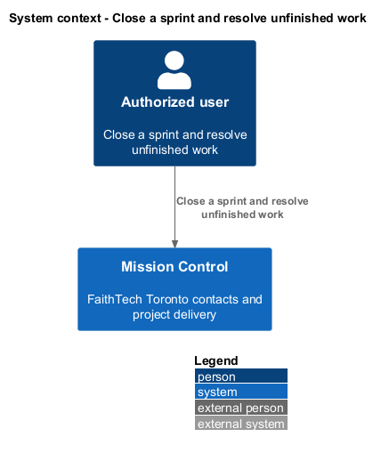
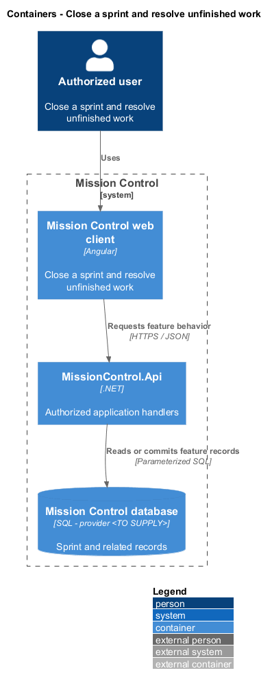
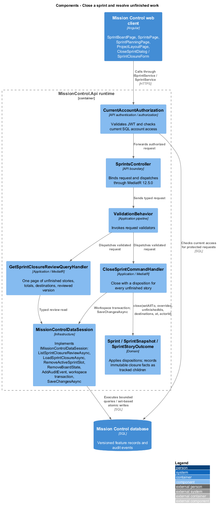
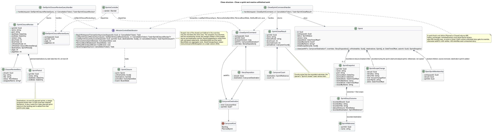
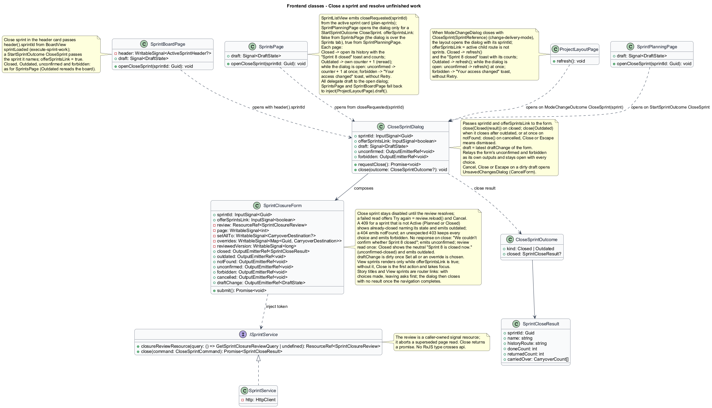
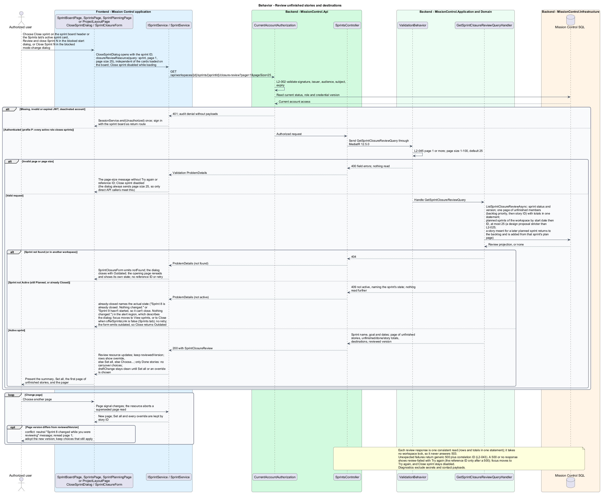
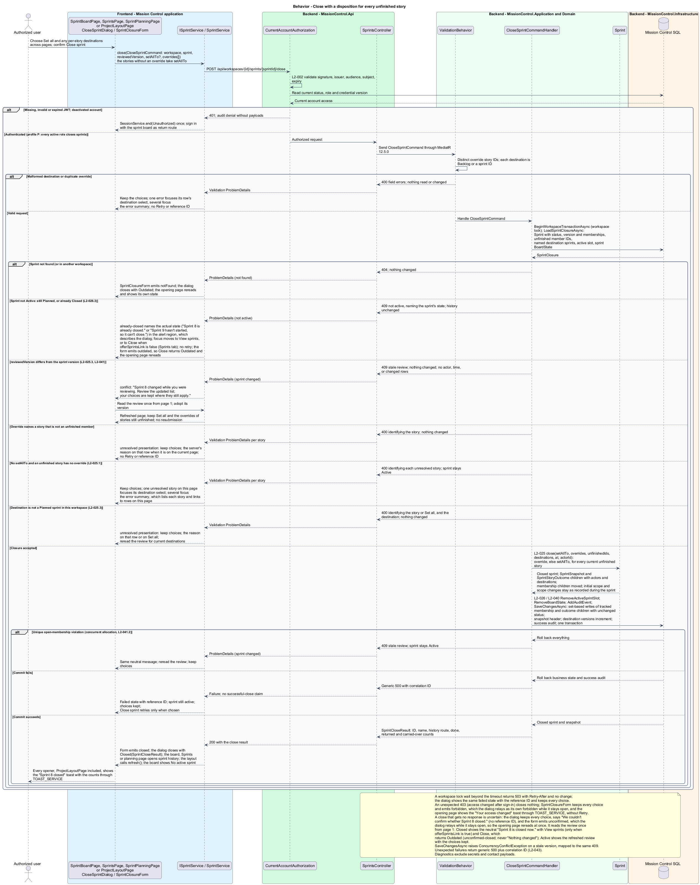

# Close a sprint and resolve unfinished work

## Overview

Sprint closure records completed outcomes and explicitly relocates every unfinished story.

- **Disposition** — decision to return an unfinished story to backlog or move it to an eligible planned sprint
- **Closure review** — paged list of the sprint's unfinished stories with the eligible destinations and the sprint version it was read at
- **Closure snapshot** — immutable record of sprint fields, final scope, and story outcomes at closure

Closure commits the entire decision or leaves the sprint and memberships unchanged.

This design refines the [L2 baseline](../../../specs/L2.md) and its linked L1 scope. Proposed defaults retain their proposal status.

## Description

The [shared design rules](../../README.md#shared-design-rules) apply: proposed type status, Application placement and MediatR `12.5.0`, authentication and validation V, responsive profile R and accessibility, token styling, data ownership and session handling, and incremental ATDD. This page records feature-specific behavior and exceptions only.

| Part | Responsibility and architectural home |
| --- | --- |
| `SprintBoardPage` | Routed page owned by `frontend/projects/mission-control` for `/projects/:id/board` in Scrum mode, defined by [execute sprint work](../execute-sprint-work/README.md); the header's Close sprint calls `openCloseSprint(sprintId)` with the sprint ID from the `sprintLoaded` header, as does a `StartSprintOutcome` CloseSprint, and passes `offerSprintsLink` true. On `CloseSprintOutcome` Closed it opens that sprint's history and shows the "Sprint 8 closed" toast with the result's counts; on Outdated it increments its counter, so the board rereads. While the dialog stays open, its `unconfirmed` (a close that got no response) increments the counter at once, and its `forbidden` shows the "Your access changed" toast through `TOAST_SERVICE`, without Retry. The page's `FormDraft` delegates to the open dialog, else to the layout's. |
| `SprintsPage` | Routed Sprints tab, defined by [plan sprints](../plan-sprints/README.md); Close sprint on the active sprint card emits `closeRequested(sprintId)`, and `openCloseSprint(sprintId)` opens `CloseSprintDialog`, as does a `StartSprintOutcome` CloseSprint, with `offerSprintsLink` false, because the dialog already sits over the Sprints tab. Closed opens that sprint's history with the "Sprint 8 closed" toast; Outdated increments its counter, so the list rereads. While the dialog stays open, its `unconfirmed` increments the counter at once, and its `forbidden` shows the "Your access changed" toast through `TOAST_SERVICE`, without Retry. The page's `FormDraft` delegates to the open dialog, else to the layout's. |
| `SprintPlanningPage` | Routed planning page, defined by [plan sprints](../plan-sprints/README.md); a `StartSprintOutcome` CloseSprint calls `openCloseSprint(sprintId)` for the sprint the start's `409` named, with `offerSprintsLink` true. Closed opens that sprint's history with the "Sprint 8 closed" toast; Outdated increments its counter, so the plan header rereads. While the dialog stays open, its `unconfirmed` increments the counter at once, and its `forbidden` shows the "Your access changed" toast through `TOAST_SERVICE`, without Retry. |
| `ProjectLayoutPage` | Routed project layout, defined by [create and manage project workspaces](../../projects/manage-workspaces/README.md); when `ModeChangeDialog` closes with `CloseSprint(SprintReference)` (its Close Sprint N action), it opens `CloseSprintDialog` with that sprint's ID ([change delivery mode](../../projects/change-delivery-mode/README.md)), and with `offerSprintsLink` true unless its active child route is `sprints`. On `Closed` it calls `refresh()` and shows the "Sprint 8 closed" toast with the result's counts through `TOAST_SERVICE`; on `Outdated` it calls `refresh()`. While the dialog stays open, its `unconfirmed` calls `refresh()` at once, and its `forbidden` shows the "Your access changed" toast through `TOAST_SERVICE`, without Retry. The active child page's `FormDraft` falls back to this dialog, so leaving the page asks first. |
| `CloseSprintDialog` | Application dialog in `frontend/projects/mission-control`; takes `sprintId` and `offerSprintsLink`, composes `SprintClosureForm` with both, and implements `FormDraft` from its `draftChange`. It closes through `close(CloseSprintOutcome?)` with the kinds `Closed(SprintCloseResult)` after `closed` and `Outdated` when it closes after `outdated` or at once after `notFound`; closing with no result (the form's `cancelled`, Close, or Escape) means dismissed. Cancel, Close, or Escape on a dirty draft opens `UnsavedChangesDialog` first. It relays the form's `unconfirmed` (a close that got no response) and `forbidden` as its own outputs and stays open with every choice. |
| `SprintClosureForm` | Domain component in `frontend/projects/domain`; injects `SPRINT_SERVICE` and owns the review resource and its page, the Set all destination, the per-story overrides, and the reviewed version; renders View sprints only while its `offerSprintsLink` input is true; emits `closed`, `outdated` (the sprint is not active), `notFound`, `unconfirmed` (a close that got no response), `forbidden` (an unexpected `403`), `cancelled`, and `draftChange`. |
| `ISprintService`, `SPRINT_SERVICE` | Interface and token in `frontend/projects/api/sprint.service.contract.ts`; consumers import the contract only. |
| `SprintService` | Production HTTP adapter in `api`; the review read is a caller-owned signal resource and closure returns a promise. Composition binds a mock adapter for Chromium Playwright. |
| `SprintsController` | Thin controller under `backend/src/MissionControl.Api/Controllers`, namespace `MissionControl.Api.Controllers`; binds, dispatches, and returns. |
| `Sprint` | Domain aggregate; `close` applies the dispositions and records the snapshot. |
| `SprintSnapshot`, `SprintStoryOutcome` | Domain records created by `Sprint.close` as tracked children of the loaded sprint; immutable after closure and read by the sprint history slice. |
| `IMissionControlDataSession` | Shared Application data port defined in the [overview](../../README.md#data-access-and-security-ports); this feature uses `ListSprintClosureReviewAsync`, `LoadSprintClosureAsync`, `RemoveActiveSprintSlot`, `RemoveBoardState`, `AddAuditEvent`, `BeginWorkspaceTransactionAsync`, and `SaveChangesAsync`. |

Initial scope and `SprintScopeChange` rows are recorded at start and at each scope change by [start and adjust a sprint](../start-and-adjust-sprint/README.md); closure references them and copies nothing.

The sprint `version` is the revision a closure review is compared against. It changes only for the facts that decide which stories are unfinished and where they can go:

| Change | Planned sprint version | Active sprint version |
| --- | --- | --- |
| Plan field edit (name, goal, dates) | Increments | Not editable |
| Membership add or remove: plan save, scope change, carryover into a planned sprint | Increments | Increments |
| State change: start of a planned sprint, close of an active one | Increments | Increments |
| Status change of a member story: board move across columns, story detail status edit, confirmed completion | Unchanged | Increments |
| Same-column reorder; task create, edit, status change, delete, or move; other story fields; reparenting | Unchanged | Unchanged |

Handlers that change a member story's status increment the active sprint's version in the same workspace transaction; they belong to the kanban move and confirmation slices and the work edit slice.
A task moved between stories changes neither story's status, so it invalidates no review.

`CloseSprintDialog` reads `GetSprintClosureReviewQuery { workspaceId, sprintId, page, pageSize }`, never the cards loaded on the board.
The review returns one page of unfinished stories (ID, key, title, status, assignee) in backlog priority order with story ID as the tie-breaker. It also returns the sprint's name, goal, and dates for the dialog's title, the unfinished, done, and story totals, the eligible destinations, and the sprint version it was read at.
Pages default to 25 and cap at 100; an invalid page size returns `400`. Done stories are counted, not listed.
Destinations are Return to backlog plus the workspace's planned sprints by planned start date, then ID (`SprintPeriod` values), at most 25: a design proposal stricter than L2-025, listed among the overview's [retained decisions](../../README.md#retained-decisions-and-gaps). A story meant for a later planned sprint returns to the backlog and is added from that sprint's plan page. No planned sprint leaves the backlog as the only destination.
Close sprint stays disabled, and the title stays generic, until the first review resolves (`loading`).
A missing sprint returns `404`; the form emits `notFound`, the dialog closes with Outdated, and the opening page rereads and shows its own state.
A sprint that is not Active, because it is still Planned or already Closed, returns `409`. The dialog names its actual state, for example "Sprint 8 is already closed. Nothing changed." or "Sprint 9 hasn't started, so it can't close. Nothing changed.", with View sprints and Close, and offers no retry (`already-closed`). View sprints, a router link to the Sprints tab, appears only when `offerSprintsLink` is true, that is, when the hosting page is not the Sprints tab, where the link would only reopen the page behind the dialog. That explanation sits in the dialog's alert region as its description, and with Close sprint gone, focus moves to the first action offered: View sprints, or Close on the Sprints tab. The form emits `outdated`, so Close returns Outdated and the opening page rereads.
A `500` (or no response) on the review read shows Try again, which repeats the read (`reload()`), and Cancel, with the reference ID only when the server answered with a `500`; Close sprint stays disabled until a review loads, and focus moves to Try again (`review-failed`). The review read takes no workspace lock, so it never answers `503`.
The dialog always asks for valid pages of 25; a page-size `400`, which only a direct API caller meets, would show its message without Try again or a reference ID.
A sprint with only Done stories closes without carryover choices.

`SprintClosureForm` keeps an optional Set all destination and a map of per-story overrides keyed by story ID; both survive paging.
A row shows its override, else the Set all destination, else Choose…. Choosing a row's destination records an override.
Changing Set all changes every row without an override, including stories on pages not yet shown. With no planned sprint, Set all starts on Return to backlog.
A later page read at a different version is handled like the stale-review `409` below, in the same `conflict` presentation, so one review never mixes versions.
`SprintClosureForm` emits `draftChange`, dirty once Set all or any override is chosen, with a summary such as "Destinations for 4 unfinished stories"; the starting Return to backlog when no sprint is planned is not a change. `CloseSprintDialog` implements `FormDraft` from it, so a dirty Cancel, Close, or Escape asks before the choices are discarded, and the opening page's `FormDraft` delegates to the open dialog.
Each story title in the review is a router link to that story, and View sprints, when offered, is a router link to the Sprints tab. With choices made, leaving asks first, because `UnsavedChangesGuard` sees the dialog's draft through that delegation; once the navigation completes, the dialog closes with no result and nothing is closed.

`CloseSprintCommand { workspaceId, sprintId, reviewedVersion, setAllTo?, overrides[] }` carries a disposition for every current unfinished story: its override when present, otherwise `setAllTo`.
A destination is Return to backlog or a planned sprint ID. The reviewed version fixes the unfinished set, so the command needs no list of every story ID.
`CloseSprintCommandValidator` rejects duplicate override IDs and malformed destinations with `400` before anything is read.

`CloseSprintCommandHandler` calls `BeginWorkspaceTransactionAsync`, which takes the workspace lock. `LoadSprintClosureAsync` then loads the sprint aggregate with its version and memberships, its unfinished member IDs, the named destination sprints, the active slot, and the sprint's `BoardState`.
It decides every rejection before any write:

- A missing sprint returns `404`; the form emits `notFound`, the dialog closes with Outdated, and the opening page rereads and shows its own state.
- A sprint that is not Active, because it is still Planned or already Closed, returns `409` with history unchanged; the dialog shows the same `already-closed` explanation naming the sprint's actual state, whose View sprints link, when offered, reaches the Sprints tab, and Close returns Outdated.
- A `reviewedVersion` that differs from the current version returns `409`. The copy is neutral: "Sprint 8 changed while you were reviewing. Review the updated list; your choices are kept where they still apply." The response names no actor, time, or changed row.
- An override naming a story that is not an unfinished member returns `400` identifying it; the dialog shows the server's reason on that row in the `unresolved` presentation.
- With no `setAllTo`, unfinished stories without an override return `400` identifying each unresolved story (L2-025.1), and the sprint stays Active. One unresolved story on the current page moves focus to its destination select, which reads its error; several move focus to the error summary, which links to each row on this page (`unresolved`). No `400` offers Retry or a reference ID.
- A destination that is not a Planned sprint in this workspace returns `400` identifying the story, or Set all, and the destination; the same `unresolved` presentation shows the reason on that row or on Set all.

After a stale-review `409` (`conflict`) the dialog reads the review once from page 1 and adopts its version. It keeps Set all and every override whose story is still unfinished in the sprint, and sends nothing until Close sprint is pressed again.
A raced exclusive-membership violation rolls back the closure and returns the same stale-review `409`.

Closure records `ClosedAtUtc` and the closing actor (`ClosedByUserId`, `ClosedByName`).
`Sprint.close(setAllTo, overrides, unfinishedIds, destinations, at, actorId)` records a `SprintSnapshot` that captures name, goal, planned dates, and actual start and close with their actors.
It adds one `SprintStoryOutcome` per story in final scope with its ID, key, title, status, and destination, so the outcome rows are the final scope.
Outcome rows carry the recorded destination as a `SprintReference` (ID and name) independently of live FKs, so history keeps the name recorded at closure.
The snapshot persists as one header row with child rows for outcomes. [Sprint history](../read-sprint-history/README.md) reads the snapshot, the initial-scope rows, and the scope-change rows through its own paged read models.

Done stories leave live open membership and remain associated through immutable outcomes.
Unfinished stories leave the source sprint's `OpenSprintMembership` children and, for a planned destination, join that loaded destination sprint's children with unchanged status, IDs, parents, and tasks; each destination sprint's version increments.
The sprint becomes Closed. The handler releases the active slot with `RemoveActiveSprintSlot`, removes the sprint's board with `RemoveBoardState`, and registers the success audit with `AddAuditEvent`.
`SaveChangesAsync` commits the snapshot and outcome children, the membership moves, the board and slot removals, and the audit together.
It writes the tracked membership and outcome children with set-based statements, so a large sprint closes in one bounded transaction; the large/hot-workspace scenario of [release measurement](../../operations/measure-release-performance/README.md) measures it.
A `500`, or a lock-wait `503` with `Retry-After`, changes nothing. Any failure rolls back the whole change; the dialog keeps every choice, shows the reference ID, and Close sprint retries only when chosen (`failed`).
A close that gets no response is uncertain: the dialog keeps every choice and says "We couldn't confirm whether Sprint 8 closed." without a reference ID or a claim that nothing changed. The form emits `unconfirmed`, which the dialog relays while it stays open, so the opening page rereads at once (the layout calls `refresh()`).
The form then reads the review once from page 1. A sprint now Closed shows neutral copy instead of the `already-closed` explanation, which says nothing changed: "Sprint 8 is closed now." with "Its outcomes are recorded in its history.", View sprints when `offerSprintsLink` is true, and Close, which returns Outdated; Close sprint is gone, so focus moves to the first action offered, View sprints or, on the Sprints tab, Close (`unconfirmed-closed`). An Active sprint shows the refreshed review with the choices kept, as after the stale-review `409`, before Close sprint is offered again.
An unexpected `403` closes nothing: the form keeps every choice and emits `forbidden`, which the dialog relays as its own `forbidden` while it stays open, and the opening page shows the "Your access changed" toast through `TOAST_SERVICE`, without Retry.
On success the form emits `closed` with the `SprintCloseResult`: the sprint's ID and name, the history route, and the done, returned, and per-destination carried-over counts. The dialog closes with Closed: the board, Sprints, or planning page opens sprint history; the layout calls `refresh()`; every opener shows the "Sprint 8 closed" toast ("2 done, 2 returned to the backlog, 2 moved to Sprint 9.") through `TOAST_SERVICE`, and the board shows No active sprint: Start for the next planned sprint, or, with none planned, Plan sprint and a link to the latest closed sprint's history ([execute sprint work](../execute-sprint-work/README.md)).

| Behavior | Proposed boundary | Request / handler |
| --- | --- | --- |
| Review unfinished stories and destinations | `GET /api/workspaces/{id}/sprints/{sprintId}/closure-review` | `GetSprintClosureReviewQuery` / `GetSprintClosureReviewQueryHandler` |
| Close with a disposition for every unfinished story | `POST /api/workspaces/{id}/sprints/{sprintId}/close` | `CloseSprintCommand` / `CloseSprintCommandHandler` |

Mock input and review references:

- [Close sprint · Mission Control mock](../../../mocks/scrum/close-sprint-dialog.html); review states: `default`, `loading`, `many-unfinished`, `unresolved`, `all-done`, `no-planned`, `conflict`, `review-failed`, `already-closed`, `closing`, `failed`, `unconfirmed-closed`.
- [Sprints · Mission Control mock](../../../mocks/scrum/sprints.html); review states: `default`, `empty`, `kanban-paused`, `loading`, `error`.
- [Sprint history · Mission Control mock](../../../mocks/scrum/sprint-history.html); review states: `default`, `renamed`, `not-found`, `project-not-found`, `loading`, `error`.
- [Sprint board · Mission Control mock](../../../mocks/scrum/sprint-board.html); review states: `default`, `pending`, `scope-log`, `scope-log-loading`, `scope-log-failed`, `no-stories`, `no-active`, `no-planned`, `no-sprints`, `move-failed`, `collaborator`, `loading`, `error`.

## Requirements

Requirement text and identifiers below are copied verbatim from L2, including the source use of `must`.

| L2 ID | Refines (L1) | Requirement |
| --- | --- | --- |
| `L2-025` | `L1-006` | Closing an active sprint must require a disposition for every unfinished story: return to backlog or move to an eligible planned sprint in the same workspace. Closure must be atomic, record a close instant and story outcomes, and preserve completed stories' association with the closed sprint. |
| `L2-026` | `L1-006` | Closed sprint history must preserve its name, goal, planned dates, actual start/ close instants, initial and final scope, and story IDs, titles, statuses, and carryover destinations as recorded at closure. Later edits, reparenting, or permitted deletions must not rewrite these recorded outcomes. |
| `L2-031` | `L1-008` | Forms must expose field-specific validation, retain input on rejected saves, prevent duplicate submission while pending, display results, and confirm leaving with unsaved edits. Destructive confirmations must name the affected item. |
| `L2-039` | `L1-010` | The system must record UTC timestamp, actor ID when known, operation, entity type/ ID, outcome, and correlation ID for account/permission changes, contact/workspace/ work mutations, board/sprint mutations, successful login, denied access, and throttling. Audit data must exclude secrets and contact payloads. Only administrators must access audit records; audit mutation endpoints must be absent. |
| `L2-040` | `L1-011` | Committed account, contact, hierarchy, ordering, board, and sprint changes must survive restart. Operations spanning multiple records must commit entirely or leave all affected business records unchanged. |
| `L2-041` | `L1-011` | Edits must carry a record version or equivalent concurrency condition. SQL constraints must protect normalized account emails, lead email/category pairs, parent references, open sprint membership, and active sprint exclusivity. Caller errors must produce validation/conflict responses rather than generic failures. |
| `L2-045` | `L1-013` | Directories, workspace lists, backlogs, and history lists must default to 25 records per page and cap requested page size at 100. Invalid sizes must return 400. Results must include total matching count and stable ordering. Boards/hierarchies must load bounded batches of at most 100 and allow access to every matching item; counts must reflect the full dataset rather than just loaded records. |

## Diagrams

The context view identifies the actor and the Mission Control capability.

The container view separates the client, .NET API, and durable SQL records.

The component view locates request dispatch, domain behavior, and persistence within the feature.

The backend class view shows the typed review and close requests, the closure records, and the data port members of this feature.

The frontend class view shows the board page, the Sprints and planning pages, and the project layout that open the closure dialog with their outcome reactions, the dialog with its typed close result, the form, and the sprint service contract they use.

Review unfinished stories and destinations follows the sequence below. The flow traces its enforcing steps to `L2-025` and `L2-045` and includes rejection or recovery paths.

Close with a disposition for every unfinished story follows the sequence below. The flow traces its enforcing steps to `L2-025` and includes rejection or recovery paths.

