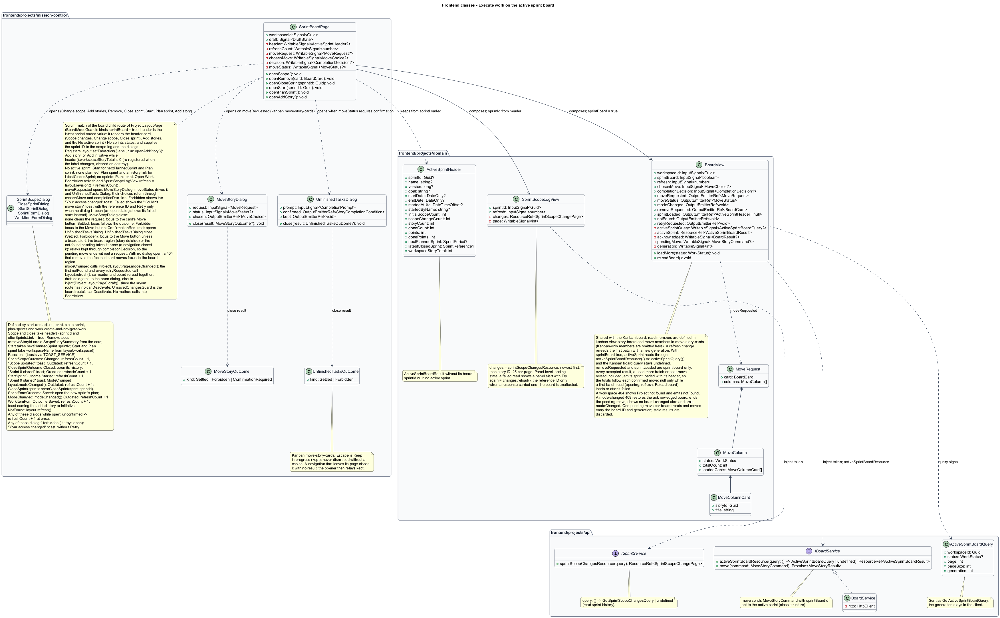

# Execute work on the active sprint board

## Overview

The active sprint board exposes the stories currently allocated to one sprint.

- **Current scope** — live story membership after initial allocation and explicit scope changes

Story status and task progress come from the same work records used by hierarchy and backlog views.

This design refines the [L2 baseline](../../../specs/L2.md) and its linked L1 scope. Proposed defaults retain their proposal status.

## Description

The [shared design rules](../../README.md#shared-design-rules) apply: proposed type status, Application placement and MediatR `12.5.0`, authentication and validation V, responsive profile R and accessibility, token styling, data ownership and session handling, and incremental ATDD. This page records feature-specific behavior and exceptions only.

| Part | Responsibility and architectural home |
| --- | --- |
| `SprintBoardPage` | Routed page owned by `frontend/projects/mission-control`: the `board` child route of `ProjectLayoutPage` that `BoardModeGuard` matches in Scrum mode for `/projects/:id/board`. It composes `BoardView` and `SprintScopeLogView`, binding both `refresh` inputs to the layout's `revision` plus its own counter, keeps the `sprintLoaded` header in a signal, and renders the sprint header card with its actions and the No active sprint and No sprints states. It registers the header's create action with `ProjectLayoutPage.setTabAction({ label, run })`: Add story, or Add initiative while the header's `workspaceStoryTotal` is zero, updated when the label changes and cleared on destroy. It opens the move, confirmation, scope, close, start, plan, and work item dialogs (passing `workspaceName` from the layout's `workspace` signal to `StartSprintDialog` and `SprintFormDialog`), relays `modeChanged` to `ProjectLayoutPage.modeChanged()`, calls the layout's `refresh()` on the first `notFound` and on every `retryRequested`, so the header and the board reread together, and implements `FormDraft` by delegating to its open dialog, else to the layout's open dialog through `inject(ProjectLayoutPage).draft()`, because the layout route has no `canDeactivate` of its own; `UnsavedChangesGuard` is the board route's `canDeactivate`. Dialog reactions are listed in the dialog rows below. |
| `BoardView` | Domain component in `frontend/projects/domain`, shared with the Kanban board; injects `BOARD_SERVICE`, owns the active-sprint board resource, the latest acknowledged board, the request generation, and the single pending move in signals, and exchanges data with the page through inputs and outputs only. A change of its `refresh` input rereads the first batch with a new generation. It emits `notFound` when a read finds the workspace missing, `retryRequested` from a failed first batch's Try again, and on the sprint board also `removeRequested` and `sprintLoaded`. |
| `SprintScopeLogView` | Domain component; injects `SPRINT_SERVICE` and owns the Scope changes panel's paged resource for the `sprintId` input the page passes from the header, with the panel's own loading and failed presentation; a change of its `refresh` input rereads the current page. |
| `IBoardService`, `BOARD_SERVICE` | Interface and token in `frontend/projects/api/board.service.contract.ts`; the consumer imports the contract only. |
| `BoardService` | Production HTTP adapter in `api`; the board read is a caller-owned signal resource and a move returns a promise. Composition binds a mock adapter for Chromium Playwright. |
| `BoardsController` | Thin controller under `backend/src/MissionControl.Api/Controllers`, namespace `MissionControl.Api.Controllers`; binds, dispatches, and returns. |
| `MoveStoryDialog` | Application dialog in `frontend/projects/mission-control`, owned by the kanban move-story-cards slice; `SprintBoardPage` opens it from a card's Move action. It closes through `close(MoveStoryOutcome?)`: on no result (dismissed) the page clears its move request, sends nothing, and returns focus to the card's Move button; on `Settled` focus follows the move's outcome; on `Forbidden` focus returns to the card's Move button; on `ConfirmationRequired` the page opens `UnfinishedTasksDialog` in its place. |
| `UnfinishedTasksDialog` | Application dialog in `frontend/projects/mission-control`, owned by the kanban confirm-story-completion slice; `SprintBoardPage` opens it on a `409 unfinished-tasks`. It closes through `close(UnfinishedTasksOutcome?)`, `Settled` or `Forbidden`, and is never dismissed without a choice (Escape is Keep in progress), except that, like any dialog, it closes with no result once a navigation leaves its page or changes that page's route parameters. On either result the page returns focus to the card's Move button unless a board alert, the board region (story deleted), or the not-found heading takes it; when a navigation closes the dialog with no result, it relays `kept` through `completionDecision`, so `BoardView` drops the pending move without a request. |
| `SprintScopeDialog` | Application dialog in `frontend/projects/mission-control`, owned by the start-and-adjust-sprint slice; `SprintBoardPage` opens it from Change scope and Add stories with the header's sprint ID, and from Remove on an unfinished card with that card's summary. On `SprintScopeOutcome` Changed the page increments its counter, so the board and scope log reread, and shows the "Scope updated" toast with the outcome's summary; on Outdated it increments the counter. While the dialog stays open, its `unconfirmed` output (a change that got no response) increments the counter at once, and its `forbidden` output (an unexpected `403`) shows the "Your access changed" toast through `TOAST_SERVICE`, without Retry. |
| `CloseSprintDialog`, `StartSprintDialog`, `SprintFormDialog` | Application dialogs owned by the close-sprint, start-and-adjust-sprint, and plan-sprints slices. `SprintBoardPage` opens `CloseSprintDialog` through `openCloseSprint(sprintId)` from the header's Close sprint with its sprint ID, and from No active sprint opens `StartSprintDialog` for the next planned sprint and `SprintFormDialog` from Plan sprint. Reactions: `CloseSprintOutcome` Closed opens that sprint's history with the "Sprint 8 closed" toast and Outdated increments the counter; `StartSprintOutcome` Started increments the counter with the "Sprint 9 started" toast, ModeChanged calls `ProjectLayoutPage.modeChanged()`, Outdated increments the counter, and CloseSprint calls `openCloseSprint(sprintId)` for the named sprint; `SprintFormOutcome` Saved after Plan sprint opens the new sprint's plan, ModeChanged calls `modeChanged()`, and Outdated increments the counter. While any of these dialogs stays open, its `unconfirmed` output (a start, close, or save that got no response) increments the counter at once, and its `forbidden` output (an unexpected `403`) shows the "Your access changed" toast through `TOAST_SERVICE`, without Retry. |
| `WorkItemFormDialog` | Application dialog owned by the [create and navigate work](../../work/create-and-navigate-work/README.md) slice; the header's create action calls back into `SprintBoardPage`, which opens it for a new story, or for a new initiative while the workspace has no stories. A story joins the backlog, not the sprint; Change scope adds it. The page reacts to `WorkItemFormOutcome`: `Saved` increments its counter, so the board and scope log reread, and shows the added-item toast naming the item through `TOAST_SERVICE`; `NotFound` calls the layout's `refresh()`, so the header and the board reread and show the project's not-found state; no result changes nothing. While the dialog stays open, its `unconfirmed` output increments the counter at once, and its `forbidden` output (an unexpected `403`) shows the "Your access changed" toast, without Retry. |
| `ActiveSprintBoardResult` | Application read projection: the sprint header with its version, start, and server-computed totals, the next planned and latest closed sprints, and the workspace's story total, and, for an active sprint, the same board shape as the Kanban board. |
| `IMissionControlDataSession` | Shared Application data port defined in the [overview](../../README.md#data-access-and-security-ports); this feature uses only its typed `LoadActiveSprintBoardAsync` read. |

`SprintBoardPage` occupies `/projects/:id/board` in Scrum mode and reads the workspace's active sprint.
`BoardModeGuard` (`canMatch`) awaits `IWorkspaceService.loadMode(workspaceId)` and matches it in Scrum mode; the [project layout](../../README.md#project-layout) renders the pinned header and tabs around it.
`GetActiveSprintBoardQueryHandler` filters cards by current open membership, not initial scope or historical outcomes.
With no active sprint the query returns `200` without columns. The next planned sprint, a `SprintPeriod`, yields Start and Plan sprint; with no planned sprint, the latest closed sprint, a `SprintReference` (latest closure, then ID), yields Plan sprint and a router link to that sprint's history; a workspace with no sprints yields Plan sprint and Open Work.
An empty active sprint still renders all three columns and Add stories.
A missing workspace returns `404`, also when the project is deleted after the board opened. `BoardView` then shows the project's not-found presentation, "Project not found" with Back to projects and no Try again or reference ID, and emits `notFound`; `SprintBoardPage` calls the layout's `refresh()` on the first one only, so the header rereads once and keeps only the breadcrumb.
A read for a workspace now in Kanban mode returns `409` with the `mode-changed` category (L2-027.3). `BoardView` emits `modeChanged`, and the page calls `ProjectLayoutPage.modeChanged()`, reached through `inject(ProjectLayoutPage)`, so the header reloads and `BoardModeGuard` re-matches the Board tab to `KanbanBoardPage`; the same applies to a mode-changed `409` from a move.
The result's header carries the sprint ID, name, version, dates, goal, start instant and actor, initial scope count, scope-change count, and the server-computed `storyCount`, `doneCount`, `points`, and `donePoints` behind "2 of 6 stories done · 3 of 15 points"; counts never come from loaded cards.
Every read returns that header, whether it asks for the first batch, a Load more batch, or the columns reread after a move, so the totals shown follow each confirmed move.
The header also carries `nextPlannedSprint`, `latestClosedSprint`, and `workspaceStoryTotal`, the count of stories in the whole workspace, which decides the header's create action as on the Kanban board and the backlog.
The Scope changes panel (`SprintScopeLogView`) pages through `GetSprintScopeChangesQuery` from [sprint history](../read-sprint-history/README.md), newest first, then story ID, 25 at a time; recorded changes never rewrite initial scope.
While a page reads, the panel shows its own loading state (`scope-log-loading`). A failed read shows a panel alert with Try again (`reload()`), with the reference ID only when a response carried one (`500` or `503`); the board and its header are unaffected (`scope-log-failed`).
Its start entry comes from the header ("Quinntyne Brown started Sprint 8 with 5 stories.", with the start instant), so it names the count and never lists initial-scope IDs; "Started with 5 stories · now 6" uses the initial scope count and `storyCount`.
Columns load in bounded batches, defaulting to 25 and capped at 100, with full column totals, as on the [Kanban board](../../kanban/view-story-board/README.md).
A failed first batch shows Load failed with Try again (`error`), with the reference ID only when the read was answered with a `500` or `503`. Try again emits `retryRequested`, and the page calls the layout's `refresh()`, so the project header, which may have failed too, rereads with the board.
A card carries its key, title, epic title, assignee, task counts, and estimate but no description, and task counts come from one set-based aggregate per batch, never a per-card query.
Only current scope appears; removed or unallocated stories cannot be moved through this sprint board endpoint.

`SprintBoardPage` composes `BoardView` with its `sprintBoard` input set to true, so the view reads through `activeSprintBoardResource` and leaves its Kanban board query undefined.
The view's client query is `ActiveSprintBoardQuery { workspaceId, status?, page, pageSize, generation }`, defined in `frontend/projects/api` beside the board contract and sent as `GetActiveSprintBoardQuery`; the generation stays in the client and stamps the result the view accepts.
As on the Kanban board, the page opens `MoveStoryDialog` on `moveRequested`, whose `MoveRequest` carries the card and each column's status, total, and loaded cards from the latest acknowledged board. It drives the open dialog and `UnfinishedTasksDialog` from `moveStatus` (`Settled` and `Forbidden` close any open dialog) and passes their choices back through the `chosenMove` and `completionDecision` inputs; it never calls a `BoardView` method. The kanban [confirm move sequence](../../kanban/move-story-cards/README.md) covers Mark story Done and Keep after the unfinished-tasks dialog.
A mode-changed `409` from the read or a move makes the view emit `modeChanged`; it restores the latest acknowledged state, ends any pending move, and shows no board-changed alert, and the page calls `ProjectLayoutPage.modeChanged()`.
The sprint board adds two outputs. Remove on an unfinished card emits `removeRequested(card)`. Each time the view accepts a read result, whether a first batch, a Load more batch, or the reread after a confirmed move, it emits `sprintLoaded` with that result's `ActiveSprintHeader`: the result without its columns, including `nextPlannedSprint`, `latestClosedSprint`, and `workspaceStoryTotal`.
Load more batches and the rereads after a move replace the header with no `null` in between, so the progress totals follow each confirmed move; a failed batch or reread keeps the last header. The view emits `null` only while a first-batch read (opening, a `refresh` change, or Reload board) is loading or after it failed.
The page keeps that header in a signal. It renders the header card with Scope changes, Change scope, and Close sprint, passes the sprint ID to `SprintScopeLogView`, `SprintScopeDialog`, and `CloseSprintDialog`, with `offerSprintsLink` true for both dialogs, since the board is not the Sprints tab, and with no stories renders Add stories. `BoardView` and `SprintScopeLogView` both take the layout's `revision` plus the page's own counter as their `refresh` input. After a committed dialog outcome (scope Changed, Started, or any Outdated), and at once when an open dialog relays `unconfirmed`, the page increments its counter, so the board rereads its first batch with a new generation and the scope log rereads its page; a closure opens sprint history.
With no active sprint it renders Start for `nextPlannedSprint` (opening `StartSprintDialog` with its ID) and Plan sprint (`no-active`); with no planned sprint, Plan sprint and View history, a router link to `latestClosedSprint`'s history (`no-planned`); and with no sprints, Plan sprint and Open Work (`no-sprints`).
The header's create action follows `workspaceStoryTotal`: Add story, or Add initiative while the workspace has no stories, as `KanbanBoardPage` and `BacklogPage` do; the page updates its `setTabAction` registration when the label changes, and both open `WorkItemFormDialog` in create mode.
The page hosts form dialogs, so it implements `FormDraft` by delegating to its open dialog, else to the layout's open dialog through `inject(ProjectLayoutPage).draft()`, and `UnsavedChangesGuard` is its `canDeactivate`.
`BoardView` runs the sprint board under the [Kanban move rules](../../kanban/move-story-cards/README.md), with the sprint ID as the board ID:

- One placement mutation is pending per board. While a move is pending, every other Move control, card-menu move, drag, and Load more on the sprint board is unavailable, and a status message announces "Saving move…".
- Every read and move is stamped with the board ID and the view's request generation. A result for an older generation or another board is discarded without changing state.
- On success the board rereads the loaded window of the source and destination columns, in batches of at most 100; that read becomes the latest acknowledged state.
- A rejected move restores the latest acknowledged state, never an older snapshot. An uncertain outcome, such as a timeout or network failure, rereads the affected columns before another move; it is never treated as a failure.
- A `500`, or a `503` lock timeout, ends in `moveStatus` Failed with the reference ID. With `MoveStoryDialog` or `UnfinishedTasksDialog` open, that dialog shows its failed state with the ID, Move story or Mark story Done sends the move again only when chosen, and no toast appears. With no dialog open, the page shows the "Couldn't move story" toast through `TOAST_SERVICE` with that ID and Retry, which sends the move again through `chosenMove` only when chosen (`move-failed`), as on the [Kanban board](../../kanban/move-story-cards/README.md).
- A `400` refusal follows the [Kanban rule](../../kanban/move-story-cards/README.md): repeating the move would be refused again, so `moveStatus` reports `Settled`, which closes any open dialog, and the board shows the server's reason in the "Your move wasn't applied" page alert with Reload board, without Retry or a reference ID.
- An unexpected `403` restores the latest acknowledged state and ends the move with `moveStatus` `Forbidden`, which closes any open dialog and returns focus to the card's Move button; the page shows the "Your access changed" toast through `TOAST_SERVICE`, without Retry.
- A `404` (the story or the project was deleted) ends the move with `Settled`, which closes any open dialog, and the board rereads its first batch. A deleted story's card leaves the board, so focus moves to the board region; with no dialog open this happens only when the removed card held focus (after Move up or Move down from its menu). A deleted project shows the not-found presentation, whose heading takes focus.
- A board-changed `409` keeps the latest acknowledged board and shows the neutral alert "The board changed after it loaded, so your move wasn't applied. Reload to see the latest board." as a page alert on the board, not a toast; Reload board rereads the columns and resubmits nothing.
- An uncertain move whose reread also fails shows no cards and pauses moves until Reload board succeeds. A failed batch, or a failed reread after a confirmed move, keeps the loaded cards and adds a column alert with Retry, and with the reference ID when the read was answered with a `500` or `503`.

Because `SprintBoardPage` composes the same `BoardView`, the refusal, the access change, the board-changed alert, and those last two outcomes reuse the Kanban board's `move-refused`, `move-forbidden`, `conflict`, `reread-failed`, and `batch-error` presentations; the sprint board mock's `move-failed` note names them.

Moves delegate to `MoveStoryCommand` through `IBoardService` and its token, with `sprintBoardId` set to the active sprint.
The move handler updates the shared WorkItem status and board placements atomically.
A status change also increments the active sprint's version, as listed in the [closure revision matrix](../close-sprint/README.md#description); same-column reorders and task updates do not.
Task updates happen in story detail (`WorkItemDetailView`) through `IWorkItemService` and its token. With no client cache, the board rereads its columns when it is activated again.
Every card carries Move and the Kanban card menu (Open story, Move to…, Move up, Move down); while a move is pending, the menu's moves are unavailable too.
Each unfinished card also offers Remove, which opens `SprintScopeDialog` for that story; Done cards offer Move and the card menu but no Remove.
The sprint board handles a `409 unfinished-tasks` separately from these rules, by opening `UnfinishedTasksDialog`, owned by the kanban confirm-story-completion slice.
The dialog shows the returned unfinished count only, with no task titles and no attribution.
Mark story Done resubmits the same `MoveStoryCommand` with the returned `StoryCompletionCondition`; Keep restores the latest acknowledged state and sends nothing.
Collaborators can move, change scope, and close the sprint; workspace settings remain administrator-only, and a notice under the project header says so (`collaborator`).

| Behavior | Proposed boundary | Request / handler |
| --- | --- | --- |
| Read current sprint board | `GET /api/workspaces/{id}/active-sprint/board` | `GetActiveSprintBoardQuery` / `GetActiveSprintBoardQueryHandler` |

Mock input and review references:

- [Sprint board · Mission Control mock](../../../mocks/scrum/sprint-board.html); review states: `default`, `pending`, `scope-log`, `scope-log-loading`, `scope-log-failed`, `no-stories`, `no-active`, `no-planned`, `no-sprints`, `move-failed`, `collaborator`, `loading`, `error`.
- [Move story · Mission Control mock](../../../mocks/kanban/move-story-dialog.html); review states: `default`, `to-done`, `saving`, `failed`.
- [Unfinished tasks confirmation · Mission Control mock](../../../mocks/kanban/unfinished-tasks-dialog.html); review states: `default`, `server-count`, `saving`, `failed`.
- [Change sprint scope · Mission Control mock](../../../mocks/scrum/sprint-scope-dialog.html); review states: `add`, `paged`, `remove`, `loading`, `load-failed`, `stale`, `allocated`, `closed`, `saving`, `failed`, `unconfirmed-added`, `unconfirmed-closed`.
- [Work item detail · Mission Control mock](../../../mocks/work/work-item-detail.html); review states: `default`, `status-failed`, `initiative`, `epic`, `task`, `unset`, `inactive-assignee`, `collaborator`, `not-found`, `loading`, `error`.

## Requirements

Requirement text and identifiers below are copied verbatim from L2, including the source use of `must`.

| L2 ID | Refines (L1) | Requirement |
| --- | --- | --- |
| `L2-019` | `L1-005` | A Kanban workspace must display To Do, In Progress, and Done columns with stories as cards. Each card must show title, assignee or Unassigned, and completed/total task counts. Opening a card must show its tasks and hierarchy path. Card ordering must be stable per column and independent of backlog priority. |
| `L2-020` | `L1-005` | Permitted users must move stories between statuses and reorder cards using both pointer dragging and labeled move controls. The API must apply status and column order atomically. Failed or conflicting moves must restore the last saved view. |
| `L2-021` | `L1-005` | Marking a story Done while it contains unfinished tasks must require an explicit confirmation showing the unfinished count. Confirmation must not silently mark tasks Done. The rule applies to Kanban, Scrum, and direct story status edits. |
| `L2-023` | `L1-006` | A workspace must have at most one active sprint. Starting must transition a planned sprint to Active and record the start instant. Active sprint scope can be changed explicitly by permitted users, without losing the recorded initial scope. |
| `L2-024` | `L1-006` | An active sprint board must show only its currently allocated stories, using the same status columns, task counts, and accessible move behavior as Kanban. Story status is shared across backlog, hierarchy, and sprint views. |
| `L2-027` | `L1-006` | Only administrators must switch workspace mode. An active sprint must block a mode change. Kanban mode must preserve planned/closed sprints but disable their execution until returning to Scrum; work remains available on the Kanban board. |
| `L2-030` | `L1-008` | Every login/session, account-management, lead CRUD, workspace, hierarchy, backlog, board, sprint, home, and navigation workflow must satisfy responsive profile R. Compact layouts must stack form fields and summary cards and provide local board scrolling or a column selector. Larger layouts must use available space without overlapping controls. Vertical page scrolling is permitted. |
| `L2-033` | `L1-009` | Every application workflow must be operable by keyboard without required dragging. Focus must remain visible, follow a logical sequence, and be managed when dialogs open/close and routed content changes. |
| `L2-034` | `L1-009` | Application controls must expose programmatic names and roles. Inputs must have associated labels; field errors must identify their inputs. Pages must expose main/navigation regions and a coherent heading hierarchy. Asynchronous outcomes must be announced without relying only on visual changes. |
| `L2-035` | `L1-009` | The application must meet the proposed WCAG 2.2 AA target. Normal text must reach 4.5:1 contrast, large text 3:1, and essential control boundaries/focus/status graphics 3:1 against adjacent colors. Status must include text or another non-color cue. Primary touch controls must provide at least 44×44 CSS-pixel targets; other controls must satisfy applicable AA target-size requirements. |
| `L2-045` | `L1-013` | Directories, workspace lists, backlogs, and history lists must default to 25 records per page and cap requested page size at 100. Invalid sizes must return 400. Results must include total matching count and stable ordering. Boards/hierarchies must load bounded batches of at most 100 and allow access to every matching item; counts must reflect the full dataset rather than just loaded records. |

## Diagrams

The context view identifies the actor and the Mission Control capability.

The container view separates the client, .NET API, and durable SQL records.

The component view locates request dispatch, domain behavior, and persistence within the feature.

The backend class view shows the typed board read, its result with the sprint header and totals, and the data port member of this feature.

The frontend class view shows the board page with the outputs it handles, the dialogs it opens with their typed close results, the shared board view with its `refresh` input and sprint-board outputs, and the service contracts.

Read current sprint board follows the sequence below. The flow traces its enforcing steps to `L2-024` and includes rejection or recovery paths.

