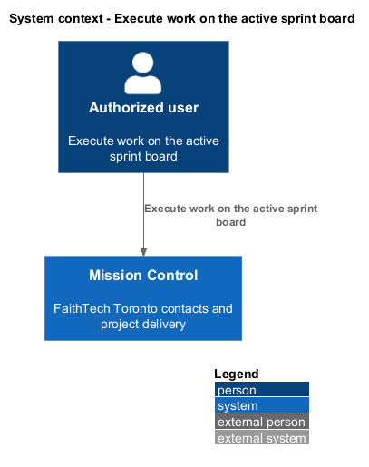
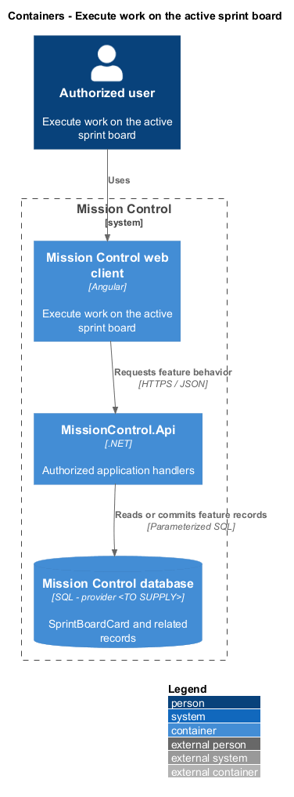
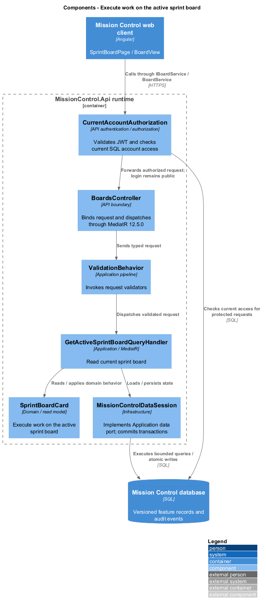
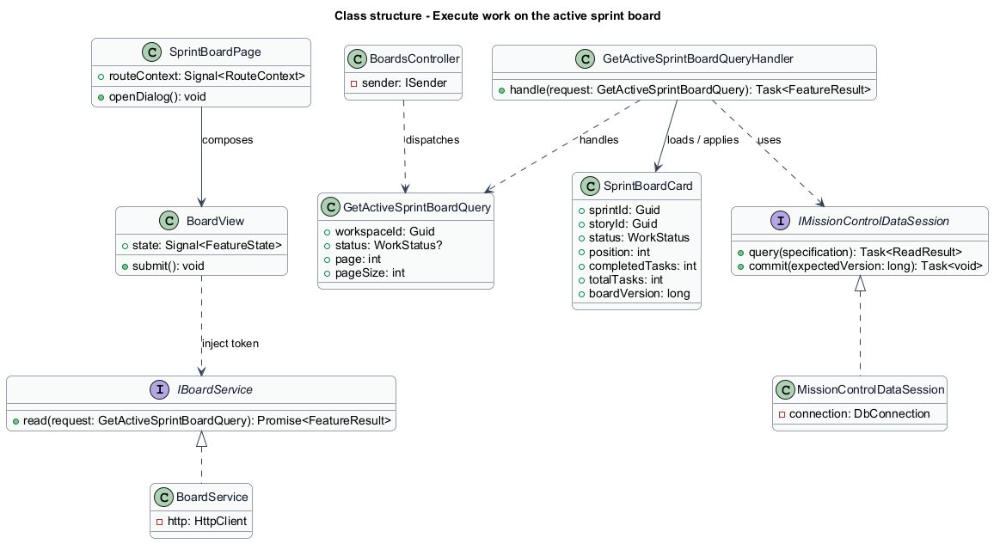
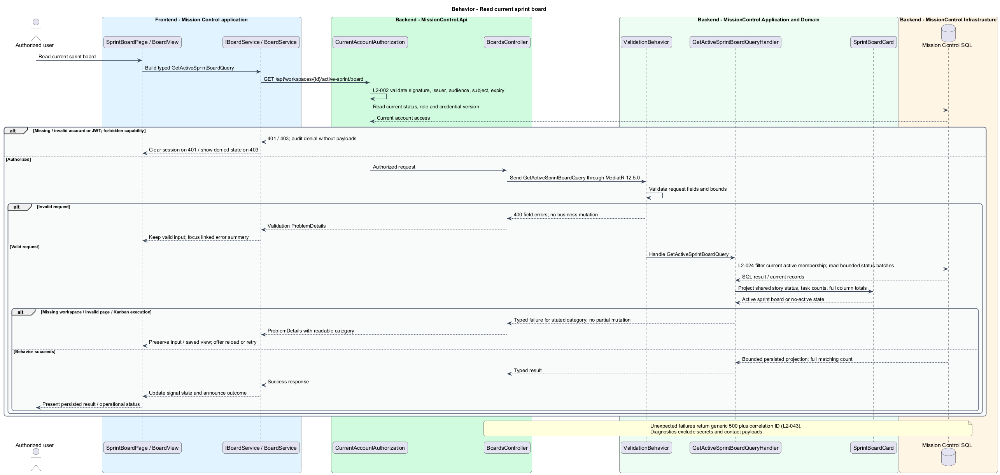

# Execute work on the active sprint board

## Overview

The active sprint board exposes the stories currently allocated to one sprint.

- **Current scope** — live story membership after initial allocation and explicit scope changes

Story status and task progress come from the same work records used by hierarchy and backlog views.

This design refines the [L2 baseline](../../../specs/L2.md) and its linked L1 scope. Proposed defaults retain their proposal status.

## Description

All named production types are proposed; the repository currently contains requirements and static mocks.

| Part | Responsibility and architectural home |
| --- | --- |
| `SprintBoardPage` | Routed page or dialog owned by `frontend/projects/mission-control`; composes the domain library and presentational components. |
| `BoardView` | Domain component in `frontend/projects/domain`; injects `BOARD_SERVICE` and holds feature state in signals. |
| `IBoardService`, `BOARD_SERVICE` | Interface and token in `frontend/projects/api/board.service.contract.ts`; the consumer imports the contract only. |
| `BoardService` | Production HTTP adapter in `api`; owns HTTP calls and observable-to-signal conversion. Composition binds a mock adapter for Chromium Playwright. |
| `BoardsController` | Thin controller under `backend/src/MissionControl.Api/Controllers`, namespace `MissionControl.Api.Controllers`; binds, dispatches, and returns. |
| `SprintBoardCard` | Domain entity or Application read projection described below; Domain has no external project dependency. |
| `IMissionControlDataSession` | Application data port; the Infrastructure adapter runs parameterized queries and transaction commits. |

Commands, queries, handlers, and request validators live in Application feature folders. Each type has its own file; folders and namespaces agree.
MediatR remains pinned to `12.5.0`. Microsoft.Extensions supplies dependency injection, Options, and Configuration.

`SprintBoardPage` occupies `/projects/:id/board` in Scrum mode and reads the workspace's active sprint.
`GetActiveSprintBoardQueryHandler` filters cards by current open membership, not initial scope or historical outcomes.
No active sprint renders a planning/start action; an empty active sprint still renders all three columns and Add stories.
The header shows goal/dates and links to explicit scope change and closure. The scope log displays actor and instant without rewriting initial scope.

Moves delegate to `MoveStoryCommand` through `IBoardService` and its token. Task updates delegate to `IWorkItemService` and its token.
Their handlers update shared WorkItem status, task revision, board placement, and active-sprint revision atomically.
The board invalidates cached task counts and refetches changed summaries after commit.
Only current scope appears; removed or unallocated stories cannot be moved through this sprint board endpoint.
The completion-confirmation slice handles unfinished tasks. Layout and bounded column loading follow the Kanban board rules.
Collaborators can move, change scope, and close the sprint; workspace settings remain administrator-only.

The authenticated API evaluates current SQL permissions before feature dispatch. Validation V maps invalid fields to `400`, absent authentication to `401`, forbidden access to `403`, missing records to `404`, and conflicts to `409`.
Unexpected errors return a generic `500` with a correlation ID. Structured diagnostics exclude secrets and contact payloads.

Responsive profile R covers `320`, `375`, `576`, `768`, `992`, `1200`, and `1920` CSS-pixel widths at `800` pixels high.
Forms stack on compact screens; dialogs become sheets below `576px`. Templates, styles, and classes remain separate files.
Component styles read `var(--mc-<role>)` from the mirrored authoritative design-system tokens.
Keyboard actions include visible focus, named controls, modal focus containment, trigger focus restoration, and destination-heading focus after navigation.
Field errors connect to inputs; asynchronous results use status or alert announcements. Status text supplements color; primary touch targets measure at least `44×44` CSS pixels.

| Behavior | Proposed boundary | Request / handler |
| --- | --- | --- |
| Read current sprint board | `GET /api/workspaces/{id}/active-sprint/board` | `GetActiveSprintBoardQuery` / `GetActiveSprintBoardQueryHandler` |

Mock input and review references:

- [Sprint board · Mission Control mock](../../../mocks/scrum/sprint-board.html); review states: `default`, `scope-log`, `no-stories`, `no-active`, `move-failed`, `collaborator`, `loading`, `error`.
- [Move story · Mission Control mock](../../../mocks/kanban/move-story-dialog.html); review states: `default`, `to-done`, `saving`, `failed`.
- [Unfinished tasks confirmation · Mission Control mock](../../../mocks/kanban/unfinished-tasks-dialog.html); review states: `default`, `server-count`, `saving`.
- [Work item detail · Mission Control mock](../../../mocks/work/work-item-detail.html); review states: `default`, `initiative`, `epic`, `task`, `unset`, `inactive-assignee`, `collaborator`, `not-found`, `loading`, `error`.

Implementation proceeds one behavior at a time using the linked Given-When-Then criteria. An API integration acceptance check first fails for the expected missing behavior.
A Chromium Playwright check uses one page object per screen and a mock service bound through the same token. Tests express intent; page objects own selectors.
The smallest implementation turns those checks green before the next behavior begins. Relevant regression checks follow each slice; no architecture tests are introduced.

## Requirements

Requirement text and identifiers below are copied verbatim from L2, including the source use of `must`.

| L2 ID | Refines (L1) | Requirement |
| --- | --- | --- |
| `L2-019` | `L1-005` | A Kanban workspace must display To Do, In Progress, and Done columns with stories as cards. Each card must show title, assignee or Unassigned, and completed/total task counts. Opening a card must show its tasks and hierarchy path. Card ordering must be stable per column and independent of backlog priority. |
| `L2-020` | `L1-005` | Permitted users must move stories between statuses and reorder cards using both pointer dragging and labeled move controls. The API must apply status and column order atomically. Failed or conflicting moves must restore the last saved view. |
| `L2-021` | `L1-005` | Marking a story Done while it contains unfinished tasks must require an explicit confirmation showing the unfinished count. Confirmation must not silently mark tasks Done. The rule applies to Kanban, Scrum, and direct story status edits. |
| `L2-024` | `L1-006` | An active sprint board must show only its currently allocated stories, using the same status columns, task counts, and accessible move behavior as Kanban. Story status is shared across backlog, hierarchy, and sprint views. |
| `L2-030` | `L1-008` | Every login/session, account-management, lead CRUD, workspace, hierarchy, backlog, board, sprint, home, and navigation workflow must satisfy responsive profile R. Compact layouts must stack form fields and summary cards and provide local board scrolling or a column selector. Larger layouts must use available space without overlapping controls. Vertical page scrolling is permitted. |
| `L2-033` | `L1-009` | Every application workflow must be operable by keyboard without required dragging. Focus must remain visible, follow a logical sequence, and be managed when dialogs open/close and routed content changes. |
| `L2-034` | `L1-009` | Application controls must expose programmatic names and roles. Inputs must have associated labels; field errors must identify their inputs. Pages must expose main/navigation regions and a coherent heading hierarchy. Asynchronous outcomes must be announced without relying only on visual changes. |
| `L2-035` | `L1-009` | The application must meet the proposed WCAG 2.2 AA target. Normal text must reach 4.5:1 contrast, large text 3:1, and essential control boundaries/focus/status graphics 3:1 against adjacent colors. Status must include text or another non-color cue. Primary touch controls must provide at least 44×44 CSS-pixel targets; other controls must satisfy applicable AA target-size requirements. |
| `L2-045` | `L1-013` | Directories, workspace lists, backlogs, and history lists must default to 25 records per page and cap requested page size at 100. Invalid sizes must return 400. Results must include total matching count and stable ordering. Boards/hierarchies must load bounded batches of at most 100 and allow access to every matching item; counts must reflect the full dataset rather than just loaded records. |

## Diagrams

The context view identifies the actor and the Mission Control capability.

The container view separates the client, .NET API, and durable SQL records.

The component view locates request dispatch, domain behavior, and persistence within the feature.

The class view shows proposed typed requests, interface consumption, and relationships between the feature parts.

Read current sprint board follows the sequence below. The flow traces its enforcing steps to `L2-024` and includes rejection or recovery paths.

