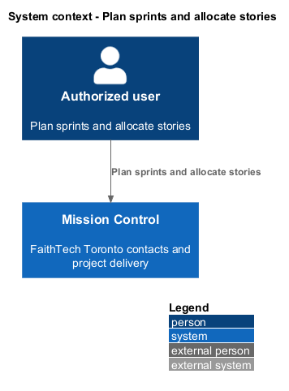
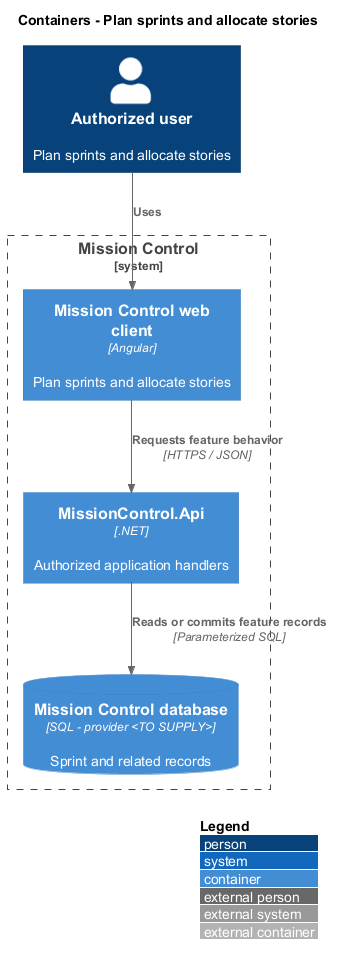
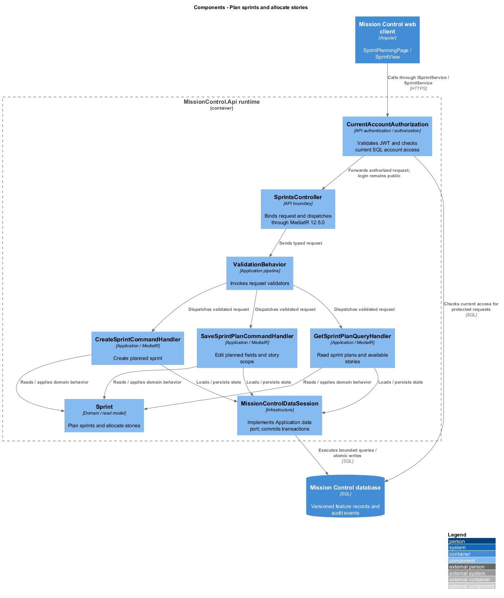
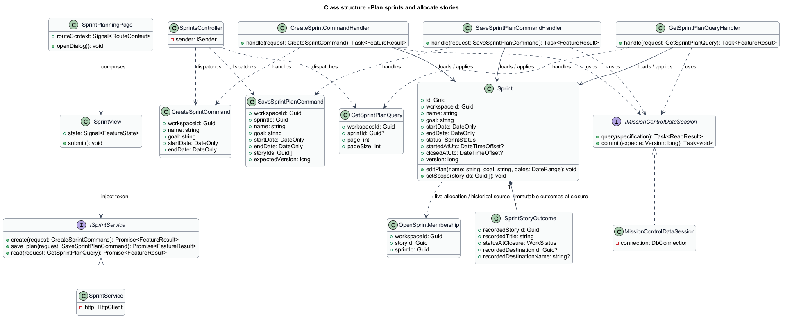
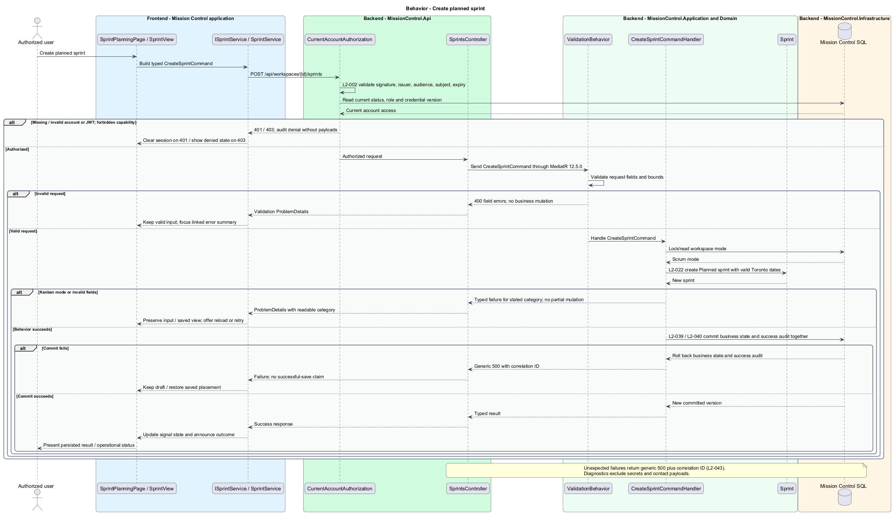
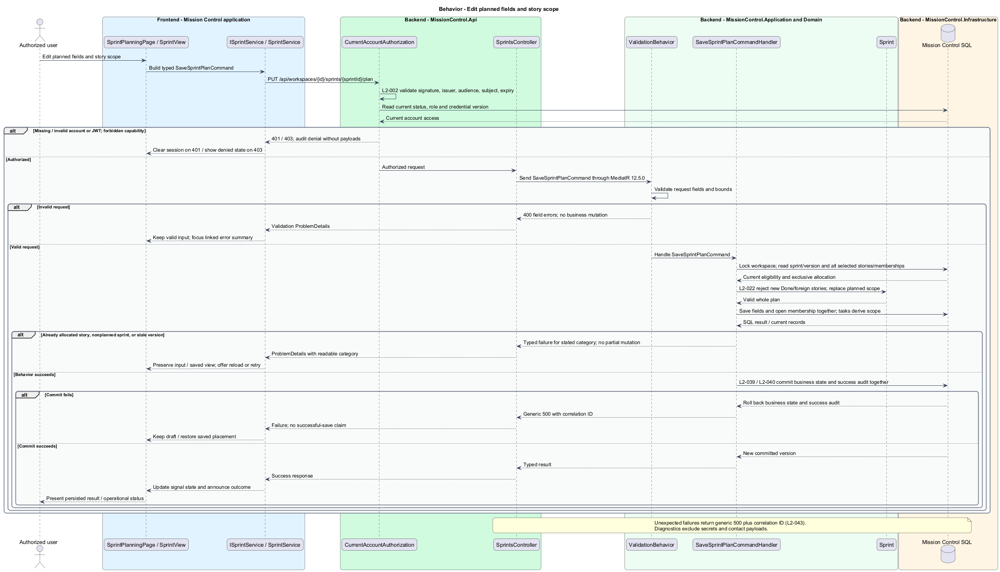
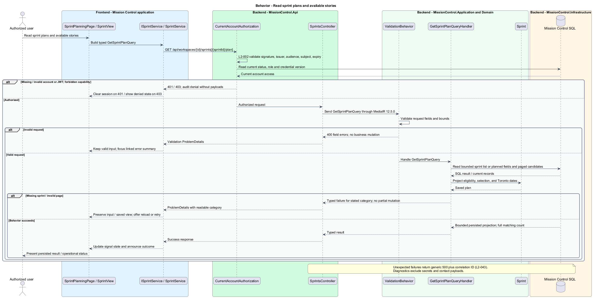

# Plan sprints and allocate stories

## Overview

Scrum groups unfinished stories into planned delivery periods within one workspace.

- **Sprint** — named period with goal, Toronto start/end calendar dates, and story scope
- **Open membership** — exclusive story allocation to one planned or active sprint

Tasks inherit their story's membership; they receive no separate allocation row.

This design refines the [L2 baseline](../../../specs/L2.md) and its linked L1 scope. Proposed defaults retain their proposal status.

## Description

All named production types are proposed; the repository currently contains requirements and static mocks.

| Part | Responsibility and architectural home |
| --- | --- |
| `SprintPlanningPage` | Routed page or dialog owned by `frontend/projects/mission-control`; composes the domain library and presentational components. |
| `SprintView` | Domain component in `frontend/projects/domain`; injects `SPRINT_SERVICE` and holds feature state in signals. |
| `ISprintService`, `SPRINT_SERVICE` | Interface and token in `frontend/projects/api/sprint.service.contract.ts`; the consumer imports the contract only. |
| `SprintService` | Production HTTP adapter in `api`; owns HTTP calls and observable-to-signal conversion. Composition binds a mock adapter for Chromium Playwright. |
| `SprintsController` | Thin controller under `backend/src/MissionControl.Api/Controllers`, namespace `MissionControl.Api.Controllers`; binds, dispatches, and returns. |
| `Sprint` | Domain entity or Application read projection described below; Domain has no external project dependency. |
| `IMissionControlDataSession` | Application data port; the Infrastructure adapter runs parameterized queries and transaction commits. |

Commands, queries, handlers, and request validators live in Application feature folders. Each type has its own file; folders and namespaces agree.
MediatR remains pinned to `12.5.0`. Microsoft.Extensions supplies dependency injection, Options, and Configuration.

`SprintsPage` owns `/projects/:id/sprints`; `SprintPlanningPage` owns `/projects/:id/sprints/:sprintId/plan`.
`SprintFormDialog` captures required name 1–200, goal 1–2,000, and start/end dates with end on or after start.
Dates use Toronto calendar values; actual start/closure use UTC instants. A suggested next sprint name is display assistance, not a uniqueness rule.
`SaveSprintPlanCommand` validates every selected story before replacing membership atomically.
Only unfinished stories in this workspace are newly eligible. Membership removal returns a story to the unallocated backlog without changing status.

`OpenSprintMembership` uniquely indexes StoryId and references a same-workspace Story and Sprint.
Planned or active is the permitted referenced sprint state; closed membership moves to history and leaves this live table.
`SaveSprintPlanCommandHandler` locks the workspace, compares sprint/version and scope changes, and rejects raced allocations with `409`.
Kanban mode blocks plan mutations and allocations while preserving readable plans.
Story pickers page through bounded results, with unavailable Done stories explained.
Already-selected stories that became Done are retained unless explicitly removed; new Done allocation remains prohibited.
Below `992px` the available-story and selected-story lists stack, matching the planning mock.

The authenticated API evaluates current SQL permissions before feature dispatch. Validation V maps invalid fields to `400`, absent authentication to `401`, forbidden access to `403`, missing records to `404`, and conflicts to `409`.
Unexpected errors return a generic `500` with a correlation ID. Structured diagnostics exclude secrets and contact payloads.

Responsive profile R covers `320`, `375`, `576`, `768`, `992`, `1200`, and `1920` CSS-pixel widths at `800` pixels high.
Forms stack on compact screens; dialogs become sheets below `576px`. Templates, styles, and classes remain separate files.
Component styles read `var(--mc-<role>)` from the mirrored authoritative design-system tokens.
Keyboard actions include visible focus, named controls, modal focus containment, trigger focus restoration, and destination-heading focus after navigation.
Field errors connect to inputs; asynchronous results use status or alert announcements. Status text supplements color; primary touch targets measure at least `44×44` CSS pixels.

| Behavior | Proposed boundary | Request / handler |
| --- | --- | --- |
| Create planned sprint | `POST /api/workspaces/{id}/sprints` | `CreateSprintCommand` / `CreateSprintCommandHandler` |
| Edit planned fields and story scope | `PUT /api/workspaces/{id}/sprints/{sprintId}/plan` | `SaveSprintPlanCommand` / `SaveSprintPlanCommandHandler` |
| Read sprint plans and available stories | `GET /api/workspaces/{id}/sprints[/{sprintId}/plan]` | `GetSprintPlanQuery` / `GetSprintPlanQueryHandler` |

Mock input and review references:

- [Sprints · Mission Control mock](../../../mocks/scrum/sprints.html); review states: `default`, `no-sprints`, `kanban-paused`, `loading`, `error`.
- [Plan or edit sprint · Mission Control mock](../../../mocks/scrum/sprint-form-dialog.html); review states: `create`, `validation`, `saving`, `failed`, `edit`, `conflict`.
- [Plan sprint stories · Mission Control mock](../../../mocks/scrum/sprint-planning.html); review states: `default`, `done-story`, `allocated-conflict`, `saving`, `not-found`, `loading`.
- [Backlog · Mission Control mock](../../../mocks/backlog/backlog.html); review states: `default`, `add-to-sprint`, `kanban`, `kanban-preserved`, `collaborator`, `empty`, `reorder-failed`, `loading`, `error`.

Implementation proceeds one behavior at a time using the linked Given-When-Then criteria. An API integration acceptance check first fails for the expected missing behavior.
A Chromium Playwright check uses one page object per screen and a mock service bound through the same token. Tests express intent; page objects own selectors.
The smallest implementation turns those checks green before the next behavior begins. Relevant regression checks follow each slice; no architecture tests are introduced.

## Requirements

Requirement text and identifiers below are copied verbatim from L2, including the source use of `must`.

| L2 ID | Refines (L1) | Requirement |
| --- | --- | --- |
| `L2-022` | `L1-006` | Scrum workspaces must support planned sprints with a name (1–200 characters), goal (1–2,000 characters), start date, and end date on or after start. Dates use Toronto calendar dates. A story must belong to at most one planned/active sprint at a time; tasks inherit membership. Permitted users can edit planned sprints and add/remove unfinished stories. Done stories cannot be newly allocated. |
| `L2-027` | `L1-006` | Only administrators must switch workspace mode. An active sprint must block a mode change. Kanban mode must preserve planned/closed sprints but disable their execution until returning to Scrum; work remains available on the Kanban board. |
| `L2-031` | `L1-008` | Forms must expose field-specific validation, retain input on rejected saves, prevent duplicate submission while pending, display results, and confirm leaving with unsaved edits. Destructive confirmations must name the affected item. |
| `L2-040` | `L1-011` | Committed account, contact, hierarchy, ordering, board, and sprint changes must survive restart. Operations spanning multiple records must commit entirely or leave all affected business records unchanged. |
| `L2-041` | `L1-011` | Edits must carry a record version or equivalent concurrency condition. SQL constraints must protect normalized account emails, lead email/category pairs, parent references, open sprint membership, and active sprint exclusivity. Caller errors must produce validation/conflict responses rather than generic failures. |
| `L2-045` | `L1-013` | Directories, workspace lists, backlogs, and history lists must default to 25 records per page and cap requested page size at 100. Invalid sizes must return 400. Results must include total matching count and stable ordering. Boards/hierarchies must load bounded batches of at most 100 and allow access to every matching item; counts must reflect the full dataset rather than just loaded records. |

## Diagrams

The context view identifies the actor and the Mission Control capability.

The container view separates the client, .NET API, and durable SQL records.

The component view locates request dispatch, domain behavior, and persistence within the feature.

The class view shows proposed typed requests, interface consumption, and relationships between the feature parts.

Create planned sprint follows the sequence below. The flow traces its enforcing steps to `L2-022` and includes rejection or recovery paths.

Edit planned fields and story scope follows the sequence below. The flow traces its enforcing steps to `L2-022` and includes rejection or recovery paths.

Read sprint plans and available stories follows the sequence below. The flow traces its enforcing steps to `L2-022` and includes rejection or recovery paths.

