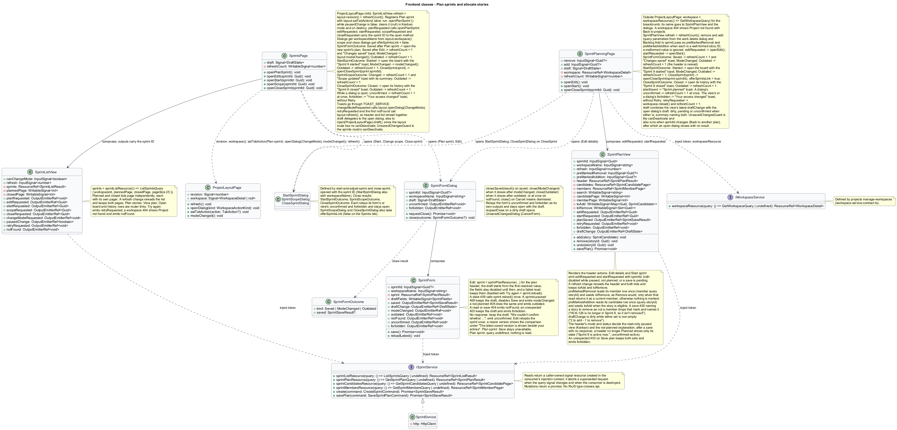

# Plan sprints and allocate stories

## Overview

Scrum groups unfinished stories into planned delivery periods within one workspace.

- **Sprint** — named period with goal, Toronto start/end calendar dates, and story scope
- **Open membership** — exclusive story allocation to one planned or active sprint

Tasks inherit their story's membership; they receive no separate allocation row.

This design refines the [L2 baseline](../../../specs/L2.md) and its linked L1 scope. Proposed defaults retain their proposal status.

## Description

The [shared design rules](../../README.md#shared-design-rules) apply: proposed type status, Application placement and MediatR `12.5.0`, authentication and validation V, responsive profile R and accessibility, token styling, data ownership and session handling, and incremental ATDD. This page records feature-specific behavior and exceptions only.

| Part | Responsibility and architectural home |
| --- | --- |
| `SprintsPage` | Routed page owned by `frontend/projects/mission-control` for `/projects/:id/sprints`, a `ProjectLayoutPage` child; composes `SprintListView`, binding its `refresh` input to the layout's `revision` plus the page's own counter, and registers Plan sprint as the header's create action with `ProjectLayoutPage.setTabAction({ label, run })` while `pausedChange` reports Scrum mode, clearing it with `setTabAction(null)` in Kanban mode and on destroy. It maps `planRequested` and Plan sprint to `openPlanSprint()`, `editRequested(sprintId)` to `openEdit`, `startRequested(sprintId)` to `openStart`, `scopeRequested(sprintId)` to `openScope`, and `closeRequested(sprintId)` to `openCloseSprint`, and passes `workspaceName` from the layout's `workspace` signal to `SprintFormDialog` and `StartSprintDialog`, and `offerSprintsLink` false to `SprintScopeDialog` and `CloseSprintDialog`, which then leave out their View sprints link to this tab. Reactions: `SprintFormOutcome` Saved after Plan sprint opens the new sprint's planning page, Saved after Edit increments the counter and shows the "Changes saved" toast naming the sprint, ModeChanged calls `ProjectLayoutPage.modeChanged()`, and Outdated increments the counter. `StartSprintOutcome` Started opens the sprint board with the "Sprint 9 started" toast, ModeChanged calls `modeChanged()`, Outdated increments the counter, and CloseSprint opens `CloseSprintDialog` for the named sprint. `SprintScopeOutcome` Changed increments the counter and shows the "Scope updated" toast with its summary, and Outdated increments it. `CloseSprintOutcome` Closed opens that sprint's history with the "Sprint 8 closed" toast and its counts, and Outdated increments the counter. While any of these dialogs stays open, its `unconfirmed` (a save, start, scope change, or close that got no response) increments the counter at once, and its `forbidden` shows the "Your access changed" toast, without Retry. Toasts go through `TOAST_SERVICE`. It relays `changeModeRequested` to `inject(ProjectLayoutPage).openDialog(ChangeMode)` and `retryRequested` to the layout's `refresh()`, so the header and the list reread together, calls `refresh()` on the first `notFound`, implements `FormDraft` by delegating to its open dialog, else to the layout's open dialog through `inject(ProjectLayoutPage).draft()`, because the layout route has no `canDeactivate` of its own, and has `UnsavedChangesGuard` as its route's `canDeactivate`. |
| `SprintPlanningPage` | Routed page for `/projects/:id/sprints/:sprintId/plan`, outside `ProjectLayoutPage`. It reads the workspace through `WORKSPACE_SERVICE` (`workspaceResource`) for the breadcrumb and passes its name to `SprintPlanView`, `SprintFormDialog`, and `StartSprintDialog`; a `404` for the workspace shows Project not found with Back to projects (`project-not-found`). It composes `SprintPlanView`, binding `refresh` to its own counter and passing the optional `remove` and `add` query parameters when each is a well-formed story ID (a malformed value is ignored, so nothing is pre-marked), and maps `editRequested(sprintId)` to `openEdit()` and `startRequested(sprintId)` to `openStart()`. Reactions: `SprintFormOutcome` Saved increments the counter and shows the "Changes saved" toast, and ModeChanged and Outdated increment it, so the view rereads its header. `StartSprintOutcome` Started opens the sprint board with the "Sprint 9 started" toast, ModeChanged and Outdated increment the counter, and CloseSprint calls `openCloseSprint(sprintId)`, which opens `CloseSprintDialog` with `offerSprintsLink` true. `CloseSprintOutcome` Closed opens that sprint's history with the "Sprint 8 closed" toast, and Outdated increments the counter. `planSaved` shows the "Sprint planned" toast naming the sprint and its story count, a dialog's `unconfirmed` increments the counter at once, the view's or a dialog's `forbidden` shows the "Your access changed" toast through `TOAST_SERVICE`, without Retry, and `retryRequested` reloads the workspace resource and increments the counter, so the breadcrumb and the plan reread together. As a routed form page that also hosts form dialogs, its `FormDraft` combines the view's latest `draftChange` with its open dialog's draft: it is dirty, pending, or unconfirmed when either is, and its summary names both. `UnsavedChangesGuard` is its `canDeactivate`; that guard also runs when a navigation changes the page's `sprintId`, such as Back or Forward to another sprint's plan, so an open dialog closes with no result once that navigation completes and the view reads the new sprint. |
| `SprintFormDialog` | Application dialog in `frontend/projects/mission-control`; takes `sprintId?` (Edit) and `workspaceName`, composes `SprintForm`, and implements `FormDraft` from its `draftChange`. It closes through `close(SprintFormOutcome?)` with the kinds `Saved(SprintSaveResult)` after `saved`, `ModeChanged` when it closes after `modeChanged`, and `Outdated` when it closes after `outdated` or at once after `notFound`; closing with no result (Cancel) means dismissed. It relays the form's `unconfirmed` (a create or save that got no response) and `forbidden` as its own outputs and stays open with the draft. Cancel, Close, or Escape on a dirty draft opens `UnsavedChangesDialog`. |
| `SprintListView` | Domain component in `frontend/projects/domain`; injects `SPRINT_SERVICE` and owns the Sprints tab list and its planned and closed page signals; a change of its `refresh` input rereads the list and keeps both pages. Plan stories, View plan, Open board, sprint titles, and history rows are router links; the card actions emit `editRequested`, `startRequested`, `scopeRequested`, and `closeRequested` with the sprint ID, the empty state emits `planRequested`, and the paused-sprints banner emits `changeModeRequested` when its `canChangeMode` input is true. Each resolved list emits `pausedChange` (true in Kanban mode). A read that finds the workspace missing shows Project not found with Back to projects and emits `notFound`; a failed read's Try again emits `retryRequested`. |
| `SprintForm` | Domain component; injects `SPRINT_SERVICE` and owns the name, goal, and date draft, the edited sprint's `sprintPlanResource`, the conflict comparison, and submit state in signals; emits `saved`, `draftChange`, `modeChanged`, `outdated`, `notFound`, `unconfirmed` (a create or save that got no response), and `forbidden` (an unexpected `403`). Its `workspaceName` input names the project in the paused explanation. |
| `SprintPlanView` | Domain component; owns the header, candidate, and member resources, the search and page signals, and the pending add and remove sets. It renders the header actions: Edit details emits `editRequested(sprintId)` and Start sprint emits `startRequested(sprintId)`, both disabled while the plan is paused or not planned or a save is pending, and Save plan is its own action. It emits `draftChange`, which the page combines with its open dialog's draft, `retryRequested` from a failed read's Try again, `forbidden` after a save refused with an unexpected `403`, and, after a committed save, `planSaved(SprintSaveResult)`. A change of its `refresh` input rereads the header and both lists and keeps both pending sets; its `workspaceName` input names the project in the paused notice and the not-found copy, and its `preMarkedRemoval` and `preMarkedAddition` inputs mark a story only after a read confirms it. |
| `ISprintService`, `SPRINT_SERVICE` | Interface and token in `frontend/projects/api/sprint.service.contract.ts`; consumers import the contract only. |
| `SprintService` | Production HTTP adapter in `api`; each read returns a caller-owned signal resource that aborts a superseded request, and each mutation returns a promise. Composition binds a mock adapter for Chromium Playwright. |
| `SprintsController` | Thin controller under `backend/src/MissionControl.Api/Controllers`, namespace `MissionControl.Api.Controllers`; binds, dispatches, and returns. |
| `Sprint`, `OpenSprintMembership` | Domain sprint lifecycle and the unique live membership row of one story. |
| `IMissionControlDataSession` | Shared Application data port defined in the [overview](../../README.md#data-access-and-security-ports); this feature uses its typed `Load…` and `List…` sprint reads, `AddSprint`, `AddAuditEvent`, `BeginWorkspaceTransactionAsync`, and `SaveChangesAsync`. |

`SprintsPage` owns `/projects/:id/sprints`; `SprintPlanningPage` owns `/projects/:id/sprints/:sprintId/plan`.
Dialog-opening controls emit outputs that the page maps to its openers; navigation controls are router links.
The dialog forms (`SprintForm` here, and the start, scope, and closure forms of the other sprint slices) read on open and live only while their dialog is open, so no page binds a `refresh` input to them; each rereads its own resource after a stale `409`.
A Scrum workspace with no sprints shows Plan sprint on its Sprints and Board tabs; collaborators see it too.
`SprintFormDialog` captures required name 1–200, goal 1–2,000, and start/end dates with end on or after start.
Dates use Toronto calendar values; actual start/closure use UTC instants. A suggested next sprint name is display assistance, not a uniqueness rule.
A sprint may be planned before any stories exist; its stories can be chosen later.
For Edit, `SprintForm` reads the sprint's plan header through its `sprintPlanResource`; the draft starts from the first resolved value, and the fields stay disabled until it arrives; a failed read keeps them disabled and offers Try again (`reload()`) and Cancel (`edit-loading` and `edit-load-failed` mock states). The reference ID shows only when the read was answered with a `500`; a read that gets no response shows the same alert without one. A read answered with `404` makes the form emit `notFound`; the dialog closes with Outdated, and the opening page rereads and shows its own state. For Plan sprint the query is `undefined`, so nothing is read.
`SprintForm` emits `draftChange`, dirty once a field differs from the values it opened with; Cancel, Close, or Escape on a dirty draft opens `UnsavedChangesDialog` with reason `CancelForm`.
Edits to a planned sprint carry its version.
A save answered with `400` keeps every value and shows the field messages without Retry or a reference ID: one field error moves focus to that field, which reads its error, and several move focus to the linked error summary (`validation`).
A `500`, or a `503` lock timeout with `Retry-After`, saves nothing: the form keeps every value, shows the reference ID, and Save sends again only when chosen (`failed`).
A save that gets no response is uncertain, because it may have committed. The form keeps every value and says "We couldn't confirm whether Sprint 10 was saved." without a reference ID, and it never says that nothing changed.
It emits `unconfirmed`, which `SprintFormDialog` relays while it stays open, so the opening page increments its counter at once and its sprints, plan header, or board reread.
For Edit the form then calls `reload()` once: an unchanged version offers Save again, and a newer version shows the comparison under the neutral heading "The latest saved version is shown beside your entries", never "Your edits haven't been saved" (`unconfirmed-changed`); Reload latest then works as after a stale `409`.
For Plan sprint, Save stays unavailable, because the sprint may exist already and the page behind has reread to show it; Cancel closes the dialog with no result.
An unexpected `403` (the account's access changed while the form was open) saves nothing either: the form keeps every value and emits `forbidden`, which `SprintFormDialog` relays as its own `forbidden` while it stays open, and the opening page shows the "Your access changed" toast through `TOAST_SERVICE`, without Retry.
On a stale-version `409` the form keeps the attempted values and calls `reload()` on its sprint resource once to read the latest version (no resubmission); Reload latest adopts the reloaded values and version while the comparison stays visible.
A save answered with the sprints-paused `409` (the project switched to Kanban), or for Edit with the not-planned `409` (the sprint started or closed), keeps every value, disables Save, and explains why with no retry (`paused`). The explanation sits in the dialog's alert region and becomes the dialog's description; Save no longer takes focus, so focus moves to that alert.
After the sprints-paused `409` `SprintForm` emits `modeChanged`, so when the dialog closes it returns ModeChanged: `SprintsPage` and `SprintBoardPage` call `ProjectLayoutPage.modeChanged()`, and `SprintPlanningPage` increments its counter, so its view rereads the plan header.
After the not-planned `409` it emits `outdated`, so the dialog closes with Outdated: `SprintsPage` rereads its list and `SprintPlanningPage` its plan header, which then shows the `not-planned` explanation.
A close with Saved after Plan sprint opens the new sprint's planning page so its stories can be chosen; after Edit, the opening page increments its counter, so its view rereads the sprint list or plan header, and shows the "Changes saved" toast naming the sprint.

Each endpoint shape has its own query and typed result.
`ListSprintsQuery { workspaceId, plannedPage, closedPage, pageSize }` returns the Sprints tab as a `SprintListResult`: the workspace mode, the active sprint, one page of planned sprints by start date, then ID, and one page of closed sprints, newest closure first, then ID, each with its total.
The planned and closed lists page independently, 25 per page by default, and each shows its own pager once it has more than one page.
Each `SprintListItem` carries its dates, goal, and server-computed story, Done, and point totals; a closed sprint adds its carried-over and returned counts, so Sprint 7 reads "6 of 8 done · 1 carried over · 1 returned".
`GetSprintPlanQuery { workspaceId, sprintId }` returns only the plan header as a `SprintPlanResult`: fields, `SprintStatus`, version, saved member count and points, and workspace mode.
`SprintPlanningPage` reads two story lists independently of that header and of each other:

- `GetSprintCandidatesQuery { workspaceId, sprintId, search?, storyId?, eligibleOnly, page, pageSize }` pages the workspace's stories outside this sprint whose key or title contains the search text; `storyId` narrows the page to that one story. This page sends `eligibleOnly` false: eligible stories come first, then stories that can't be added, each with its reason: Done, or in another open sprint (a `SprintReference`). The active sprint's scope dialog sends it true and lists eligible stories only.
- `GetSprintMembersQuery { workspaceId, sprintId, storyId?, page, pageSize }` pages the sprint's saved members, Done members included; `storyId` narrows the page to that one story, so a story that is not a current member returns an empty page.

Both lists default to 25, cap at 100, and return their totals in backlog priority order with story ID as the tie-breaker. Rows omit descriptions.
The candidate page's `total` and `eligibleTotal` give the hints "6 can be added" (`eligibleTotal` less the stories marked To add, which move under the sprint) and "15 stories can't be added" (`total − eligibleTotal`).
Typing in the search debounces on the view's query signal; a new search starts at page 1, and the candidate resource aborts the superseded read.
A failed header or list read shows Load failed with Try again (`error` mock state); the reference ID shows when the read was answered with a `500`, and a read that gets no response shows the same state without one.
Try again leaves the view through `retryRequested`: `SprintsPage` calls the layout's `refresh()`, so the project header, which may have failed too, rereads with the list, and `SprintPlanningPage` reloads its workspace resource and increments its counter.
The plan header's `404` shows Sprint not found with Back to sprints (`not-found`). The page's own workspace read decides Project not found: a missing workspace shows it with Back to projects instead (`project-not-found`), whatever the plan reads return.

`SprintPlanView` keeps the pending selection as two sets: stories to add and saved members to remove.
Add moves a candidate out of the candidate page and lists it first under the sprint with a To add label. Remove marks a saved member To remove in place, and Undo clears either mark.
Both sets survive search and paging, keyed by story ID.
The optional `remove` query parameter names one story to pre-mark To remove. The work delete dialog's "Change Sprint N's plan" navigates with it, so the page opens with that story marked when it is still a member (the planning mock's `paged` state shows HCK-126 marked this way).
`SprintPlanningPage` passes it to `SprintPlanView` as `preMarkedRemoval`. The view reads that story's member row once through the member query's `storyId`, and only when that read returns the story as a current member does it seed the To remove set exactly as Remove would; otherwise nothing is marked, so no removal the person never saw is sent. The member row shows the mark on whichever page lists it, and the summary counts it. Nothing is sent until Save plan. If the story leaves the sprint after that read, the save's `400` for a non-member in `removeStoryIds` names it, and the view drops the mark as described below. A summary such as "2 to add · 1 to remove — saved when you save the plan" stays visible while either set is non-empty.
The optional `add` query parameter names one story to pre-mark To add. Backlog Add to sprint on a planned sprint navigates to `/projects/:id/sprints/:sprintId/plan?add={storyId}`, and `SprintPlanningPage` passes it to `SprintPlanView` as `preMarkedAddition`. The view reads that story's candidate row once through the candidate query's `storyId`, and only a story that the read returns as eligible joins the To add set, exactly as Add would, and is listed first under the sprint (the planning mock's `paged` state shows HCK-130 marked this way); a story that is already a member, Done, or in another open sprint is not marked, and its candidate row shows why. A malformed `add` or `remove` value, one that is not a story ID, is ignored: the page passes no pre-mark, and nothing is marked.
`SprintPlanView` emits `draftChange`, dirty while either set is non-empty, with that summary. `SprintPlanningPage` combines it with the draft of its open form dialog, `SprintFormDialog` or `CloseSprintDialog`, into its `FormDraft`, dirty, pending, or unconfirmed when either is and with a summary naming both, so `UnsavedChangesGuard` and session end see the pending marks even while a dialog is open, and the guard asks before leaving (L2-031). After a successful save the sets clear, the header and both lists are read again, and the view emits `planSaved`, so the page shows the "Sprint planned" toast ("Sprint 9 has 3 stories.").
Below `992px` the available-story and sprint-story lists stack, matching the planning mock.

`SaveSprintPlanCommand { workspaceId, sprintId, expectedVersion, name, goal, startDate, endDate, addStoryIds[], removeStoryIds[] }` applies a delta to the saved membership atomically.
`SprintForm` sends edited fields with empty story sets. `SprintPlanningPage` sends the loaded fields with the pending sets, including a story pre-marked from Backlog Add to sprint.
The validator rejects duplicate IDs, or a story in both sets, with `400` before anything is read.
`SaveSprintPlanCommandHandler` calls `BeginWorkspaceTransactionAsync`, which takes the workspace lock, and then reads the mode, the sprint and its version, the stories to add with their open memberships, and the members to remove.
It decides every rejection before any write, so a rejected plan changes nothing:

- A missing workspace or sprint, or a sprint in another workspace, returns `404`. `SprintForm` emits `notFound`, so its dialog closes with Outdated and the opening page rereads. The planning page shows Sprint not found with Back to sprints, or Project not found with Back to projects when its workspace read finds no workspace.
- A `400` for the fields keeps the fields and both pending sets: one field error moves focus to that field, and several move focus to the linked error summary.
- Kanban mode returns `409` (L2-027.3); the page shows the plan read-only with the paused notice in its alert region (`paused`). A sprint that is no longer Planned returns `409`, so a closed sprint's history is never altered (L2-026.3); an alert replaces the lists, explaining that only planned sprints change here, with a link to the sprint board or its history and nothing to retry (`not-planned`). Both outcomes take Save plan away, so focus moves to the notice or the explanation.
- A stale sprint version returns `409`. The page keeps the pending sets, reads the latest header and both lists once, and drops marks that no longer apply, such as a story to add that is now a member. It names each dropped mark with neutral copy, and nothing is resubmitted (`stale` mock state).
- Only `addStoryIds` are new allocations. A Done or foreign-workspace story to add returns `400` identifying each story. A story to add that is in another planned or active sprint returns `409` naming it and its sprint (L2-022.3); the page marks it and keeps the rest of the selection (`allocated-conflict`).
- Each per-story `400` for a story to add uses the `allocated-conflict` presentation: the page marks every named story with its reason, such as "Now Done", and keeps the rest of the selection.
- A story in `removeStoryIds` that is not a member returns `400` naming it. The view drops that mark from the To remove set and names it with neutral copy, "HCK-126 is no longer in Sprint 9, so it isn't removed", keeping the rest of the selection, so Save plan can send the rest; nothing is resubmitted until it is pressed.

Existing members are never revalidated: a member that became Done stays in the sprint, untouched, unless its ID is in `removeStoryIds`.
Removal returns a story to the unallocated backlog without changing its status.
`LoadPlanChangeAsync` loads the `Sprint` aggregate with the memberships named in `removeStoryIds`. `Sprint.applyPlanDelta` adds and removes its `OpenSprintMembership` children, and the handler registers the success audit with `AddAuditEvent`.
`SaveChangesAsync` then writes the fields, the tracked membership children, and the audit under the expected version.
A `500`, or a `503` lock timeout, saves nothing: the page keeps the fields and both pending sets, shows the reference ID, and Save plan sends them again only when chosen (`failed` mock state).
A save that gets no response is uncertain. The page keeps both pending sets and says "We couldn't confirm whether Sprint 9's plan was saved." without a reference ID or a claim that nothing changed. It then reads the header and both lists once and drops marks that no longer apply, as after a stale `409`, but under the neutral heading "The latest plan is shown below" instead of the stale copy, which says the changes haven't been saved (`unconfirmed-changed`); Save plan is then offered again.
If that reread header is no longer Planned, the explanation replaces the lists as for `not-planned`, but it states only the sprint's current state, "Sprint 9 is active now." with Open board (or "Sprint 9 is closed now." with its history), and never says that nothing was changed, because this save may have committed first (`unconfirmed-active`); Save plan is gone, so focus moves to the explanation.
An unexpected `403` saves nothing either: `SprintPlanView` keeps the fields and both pending sets and emits `forbidden`, and `SprintPlanningPage` shows the "Your access changed" toast through `TOAST_SERVICE`, without Retry.
A planned sprint's version increments for field edits and membership changes, not for a member's status change, so a member becoming Done never makes a plan stale; the [closure revision matrix](../close-sprint/README.md#description) lists every case.

`OpenSprintMembership` uniquely indexes StoryId and references a same-workspace Story and Sprint.
Planned or active is the permitted referenced sprint state; closed membership moves to history and leaves this live table.
The unique index backs the workspace lock: a raced allocation rolls back the whole plan and returns `409` naming the story.
Kanban mode blocks creating sprints, plan mutations, and allocations with `409` while plans stay readable.
The planning page reads the mode with its plan header. In Kanban mode it shows the plan read-only, with Add, Remove, Edit details, Start sprint, and Save plan unavailable and a notice naming the pause and the project (`paused`); the Sprints tab's View plan opens it. A header that reads Active or Closed shows the `not-planned` explanation instead of the lists, with router links back to the sprints and to the sprint board or history; when that read follows a save that got no response, it shows the neutral `unconfirmed-active` variant instead.

| Behavior | Proposed boundary | Request / handler |
| --- | --- | --- |
| Create planned sprint | `POST /api/workspaces/{id}/sprints` | `CreateSprintCommand` / `CreateSprintCommandHandler` |
| Edit planned fields and story scope | `PUT /api/workspaces/{id}/sprints/{sprintId}/plan` | `SaveSprintPlanCommand` / `SaveSprintPlanCommandHandler` |
| Read the Sprints tab, a plan header, available stories, and members | `GET /api/workspaces/{id}/sprints`, `GET .../sprints/{sprintId}/plan`, `GET .../sprints/{sprintId}/candidates`, `GET .../sprints/{sprintId}/members` | `ListSprintsQuery`, `GetSprintPlanQuery`, `GetSprintCandidatesQuery`, `GetSprintMembersQuery` / their handlers |

Mock input and review references:

- [Sprints · Mission Control mock](../../../mocks/scrum/sprints.html); review states: `default`, `empty`, `kanban-paused`, `loading`, `error`.
- [Plan or edit sprint · Mission Control mock](../../../mocks/scrum/sprint-form-dialog.html); review states: `create`, `validation`, `saving`, `failed`, `paused`, `edit-loading`, `edit-load-failed`, `edit`, `conflict`, `conflict-reloaded`, `unconfirmed-changed`.
- [Plan sprint stories · Mission Control mock](../../../mocks/scrum/sprint-planning.html); review states: `default`, `paged`, `done-story`, `allocated-conflict`, `stale`, `saving`, `failed`, `unconfirmed-changed`, `unconfirmed-active`, `paused`, `not-planned`, `not-found`, `project-not-found`, `loading`, `error`.
- [Backlog · Mission Control mock](../../../mocks/backlog/backlog.html); review states: `default`, `add-to-sprint`, `kanban`, `kanban-preserved`, `collaborator`, `paged`, `empty`, `reorder-failed`, `reorder-conflict`, `loading`, `error`.

## Requirements

Requirement text and identifiers below are copied verbatim from L2, including the source use of `must`.

| L2 ID | Refines (L1) | Requirement |
| --- | --- | --- |
| `L2-022` | `L1-006` | Scrum workspaces must support planned sprints with a name (1–200 characters), goal (1–2,000 characters), start date, and end date on or after start. Dates use Toronto calendar dates. A story must belong to at most one planned/active sprint at a time; tasks inherit membership. Permitted users can edit planned sprints and add/remove unfinished stories. Done stories cannot be newly allocated. |
| `L2-026` | `L1-006` | Closed sprint history must preserve its name, goal, planned dates, actual start/ close instants, initial and final scope, and story IDs, titles, statuses, and carryover destinations as recorded at closure. Later edits, reparenting, or permitted deletions must not rewrite these recorded outcomes. |
| `L2-027` | `L1-006` | Only administrators must switch workspace mode. An active sprint must block a mode change. Kanban mode must preserve planned/closed sprints but disable their execution until returning to Scrum; work remains available on the Kanban board. |
| `L2-029` | `L1-007` | Primary navigation must reach Home, Leads, and Projects, with account management visible only to administrators. Work details must expose their workspace and parent path. Direct routes must enforce authentication and handle missing records. |
| `L2-031` | `L1-008` | Forms must expose field-specific validation, retain input on rejected saves, prevent duplicate submission while pending, display results, and confirm leaving with unsaved edits. Destructive confirmations must name the affected item. |
| `L2-039` | `L1-010` | The system must record UTC timestamp, actor ID when known, operation, entity type/ ID, outcome, and correlation ID for account/permission changes, contact/workspace/ work mutations, board/sprint mutations, successful login, denied access, and throttling. Audit data must exclude secrets and contact payloads. Only administrators must access audit records; audit mutation endpoints must be absent. |
| `L2-040` | `L1-011` | Committed account, contact, hierarchy, ordering, board, and sprint changes must survive restart. Operations spanning multiple records must commit entirely or leave all affected business records unchanged. |
| `L2-041` | `L1-011` | Edits must carry a record version or equivalent concurrency condition. SQL constraints must protect normalized account emails, lead email/category pairs, parent references, open sprint membership, and active sprint exclusivity. Caller errors must produce validation/conflict responses rather than generic failures. |
| `L2-045` | `L1-013` | Directories, workspace lists, backlogs, and history lists must default to 25 records per page and cap requested page size at 100. Invalid sizes must return 400. Results must include total matching count and stable ordering. Boards/hierarchies must load bounded batches of at most 100 and allow access to every matching item; counts must reflect the full dataset rather than just loaded records. |

## Diagrams

The context view identifies the actor and the Mission Control capability.

The container view separates the client, .NET API, and durable SQL records.

The component view locates request dispatch, domain behavior, and persistence within the feature.

The backend class view shows the typed requests, handlers, read models, domain records, and data port members of this feature.

The frontend class view shows the routed pages with their outcome reactions, the dialogs they open with their close results, the domain views with their `refresh` inputs and action outputs, and the sprint and workspace service contracts they inject.

Create planned sprint follows the sequence below. The flow traces its enforcing steps to `L2-022` and includes rejection or recovery paths.

Edit planned fields and story scope follows the sequence below. The flow traces its enforcing steps to `L2-022` and includes rejection or recovery paths.

Read the Sprints tab, a plan header, available stories, and members follows the sequence below. The flow traces its enforcing steps to `L2-022` and includes rejection or recovery paths.

