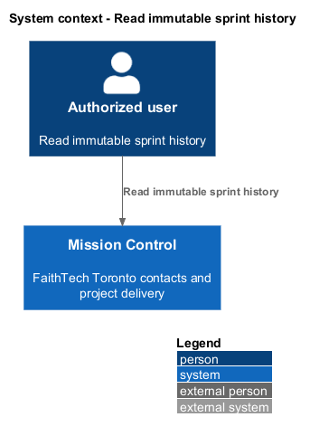
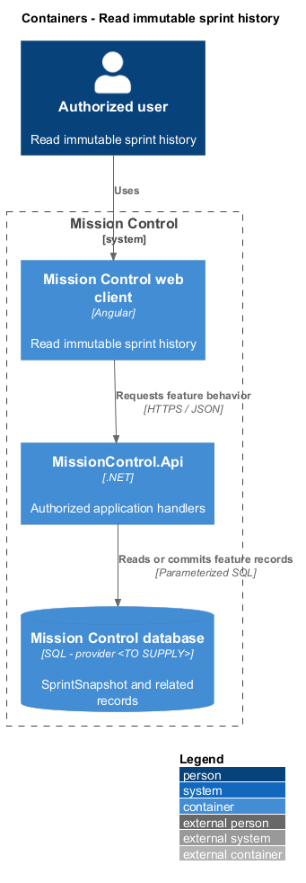
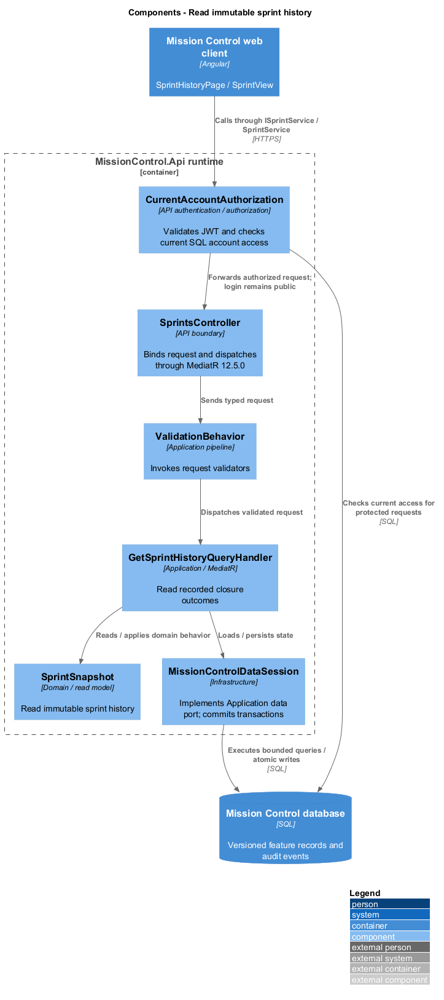
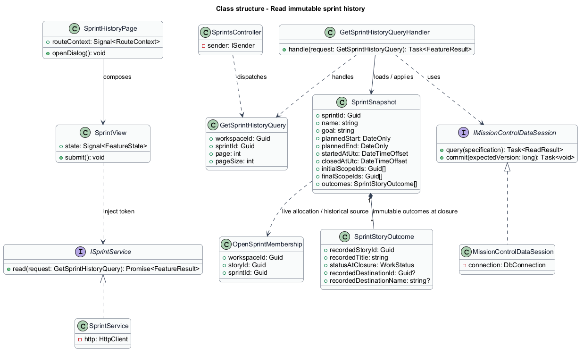
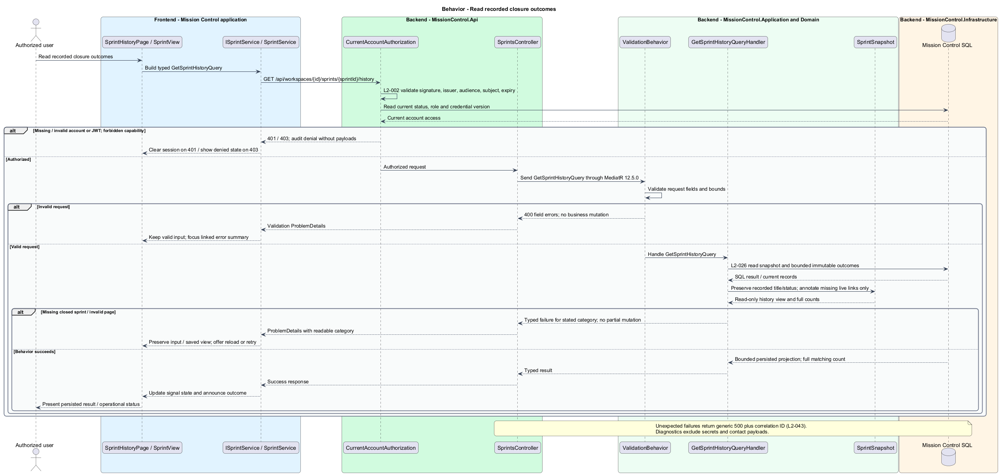

# Read immutable sprint history

## Overview

Sprint history preserves the actual decisions and delivery outcomes of closed work periods.

- **Recorded outcome** — story identity, title, closure status, and destination captured when the sprint closes

Live stories may later change or disappear. History remains a readable record of its original closure.

This design refines the [L2 baseline](../../../specs/L2.md) and its linked L1 scope. Proposed defaults retain their proposal status.

## Description

All named production types are proposed; the repository currently contains requirements and static mocks.

| Part | Responsibility and architectural home |
| --- | --- |
| `SprintHistoryPage` | Routed page or dialog owned by `frontend/projects/mission-control`; composes the domain library and presentational components. |
| `SprintView` | Domain component in `frontend/projects/domain`; injects `SPRINT_SERVICE` and holds feature state in signals. |
| `ISprintService`, `SPRINT_SERVICE` | Interface and token in `frontend/projects/api/sprint.service.contract.ts`; the consumer imports the contract only. |
| `SprintService` | Production HTTP adapter in `api`; owns HTTP calls and observable-to-signal conversion. Composition binds a mock adapter for Chromium Playwright. |
| `SprintsController` | Thin controller under `backend/src/MissionControl.Api/Controllers`, namespace `MissionControl.Api.Controllers`; binds, dispatches, and returns. |
| `SprintSnapshot` | Domain entity or Application read projection described below; Domain has no external project dependency. |
| `IMissionControlDataSession` | Application data port; the Infrastructure adapter runs parameterized queries and transaction commits. |

Commands, queries, handlers, and request validators live in Application feature folders. Each type has its own file; folders and namespaces agree.
MediatR remains pinned to `12.5.0`. Microsoft.Extensions supplies dependency injection, Options, and Configuration.

`SprintHistoryPage` owns `/projects/:id/sprints/:sprintId/history`; `SprintsPage` links to closed records newest first.
`GetSprintHistoryQueryHandler` reads immutable snapshot tables, not mutable WorkItem values as the historical truth.
History lists default to 25 and cap at 100. Large outcome collections page independently; full completed/unfinished counts aggregate all outcome rows.
Snapshot scope and outcomes preserve recorded IDs even after live item deletion. No cascade connects snapshots to live work.

Optional live lookup determines whether a navigation link still exists; it never overwrites recorded text or status.
The `renamed` mock shows the recorded title with an additional current-title note; missing stories/destinations remain labeled without broken links.
Planned Toronto dates remain calendar values; actual instants store UTC and display Toronto time.
Closed sprint mutation handlers return `409`; no snapshot edit endpoint exists.
History stays available during Kanban mode. Missing sprint receives `404` with navigation to the workspace sprint list.

The authenticated API evaluates current SQL permissions before feature dispatch. Validation V maps invalid fields to `400`, absent authentication to `401`, forbidden access to `403`, missing records to `404`, and conflicts to `409`.
Unexpected errors return a generic `500` with a correlation ID. Structured diagnostics exclude secrets and contact payloads.

Responsive profile R covers `320`, `375`, `576`, `768`, `992`, `1200`, and `1920` CSS-pixel widths at `800` pixels high.
Forms stack on compact screens; dialogs become sheets below `576px`. Templates, styles, and classes remain separate files.
Component styles read `var(--mc-<role>)` from the mirrored authoritative design-system tokens.
Keyboard actions include visible focus, named controls, modal focus containment, trigger focus restoration, and destination-heading focus after navigation.
Field errors connect to inputs; asynchronous results use status or alert announcements. Status text supplements color; primary touch targets measure at least `44×44` CSS pixels.

| Behavior | Proposed boundary | Request / handler |
| --- | --- | --- |
| Read recorded closure outcomes | `GET /api/workspaces/{id}/sprints/{sprintId}/history` | `GetSprintHistoryQuery` / `GetSprintHistoryQueryHandler` |

Mock input and review references:

- [Sprint history · Mission Control mock](../../../mocks/scrum/sprint-history.html); review states: `default`, `renamed`, `not-found`, `loading`, `error`.
- [Sprints · Mission Control mock](../../../mocks/scrum/sprints.html); review states: `default`, `no-sprints`, `kanban-paused`, `loading`, `error`.

Implementation proceeds one behavior at a time using the linked Given-When-Then criteria. An API integration acceptance check first fails for the expected missing behavior.
A Chromium Playwright check uses one page object per screen and a mock service bound through the same token. Tests express intent; page objects own selectors.
The smallest implementation turns those checks green before the next behavior begins. Relevant regression checks follow each slice; no architecture tests are introduced.

## Requirements

Requirement text and identifiers below are copied verbatim from L2, including the source use of `must`.

| L2 ID | Refines (L1) | Requirement |
| --- | --- | --- |
| `L2-018` | `L1-004` | Only administrators must delete work, after confirmation naming the item. Deletion must be blocked while children exist or a story belongs to a planned or active sprint. Closed sprint history must survive a later permitted deletion. |
| `L2-026` | `L1-006` | Closed sprint history must preserve its name, goal, planned dates, actual start/ close instants, initial and final scope, and story IDs, titles, statuses, and carryover destinations as recorded at closure. Later edits, reparenting, or permitted deletions must not rewrite these recorded outcomes. |
| `L2-027` | `L1-006` | Only administrators must switch workspace mode. An active sprint must block a mode change. Kanban mode must preserve planned/closed sprints but disable their execution until returning to Scrum; work remains available on the Kanban board. |
| `L2-032` | `L1-008` | Production views must use the application design tokens and consistent typography, spacing, focus, form, and status patterns. Loading, empty data, zero search results, and request errors must be distinguishable and offer relevant actions. Visual review is for application UX; design artifacts themselves remain exempt from automated tests. |
| `L2-045` | `L1-013` | Directories, workspace lists, backlogs, and history lists must default to 25 records per page and cap requested page size at 100. Invalid sizes must return 400. Results must include total matching count and stable ordering. Boards/hierarchies must load bounded batches of at most 100 and allow access to every matching item; counts must reflect the full dataset rather than just loaded records. |

## Diagrams

The context view identifies the actor and the Mission Control capability.

The container view separates the client, .NET API, and durable SQL records.

The component view locates request dispatch, domain behavior, and persistence within the feature.

The class view shows proposed typed requests, interface consumption, and relationships between the feature parts.

Read recorded closure outcomes follows the sequence below. The flow traces its enforcing steps to `L2-026` and includes rejection or recovery paths.

