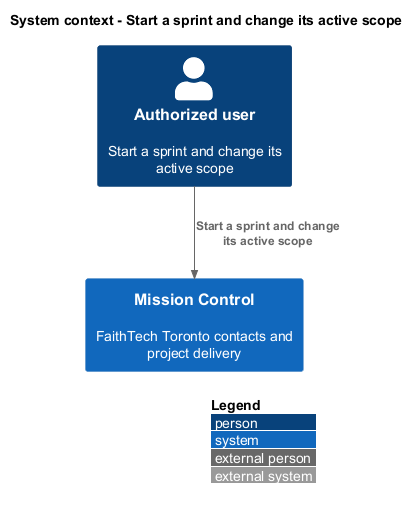
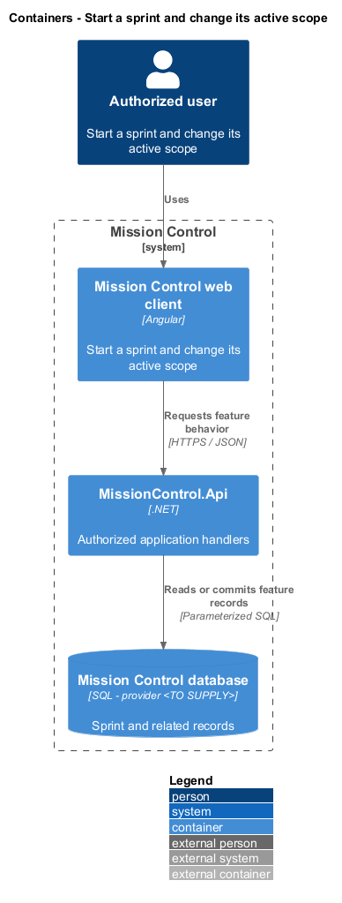
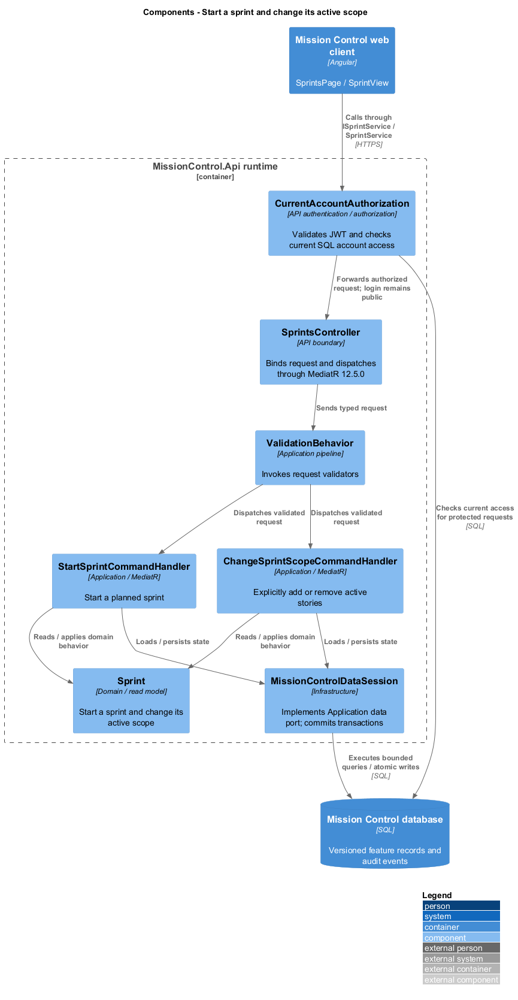
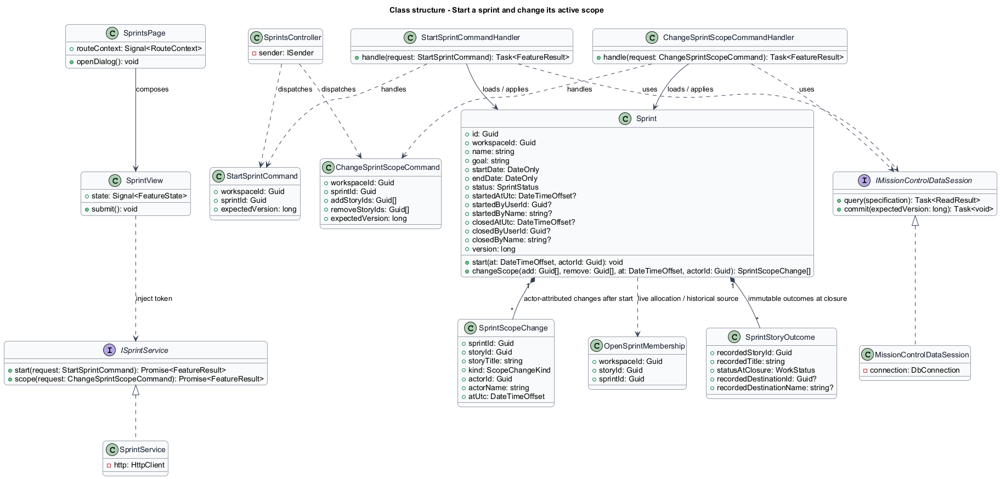
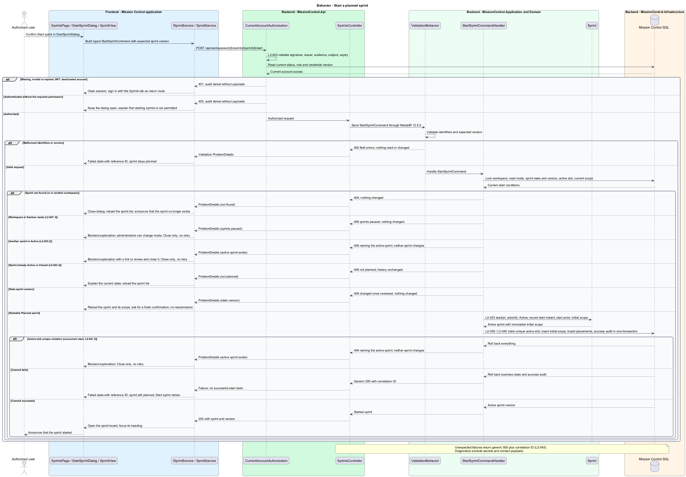
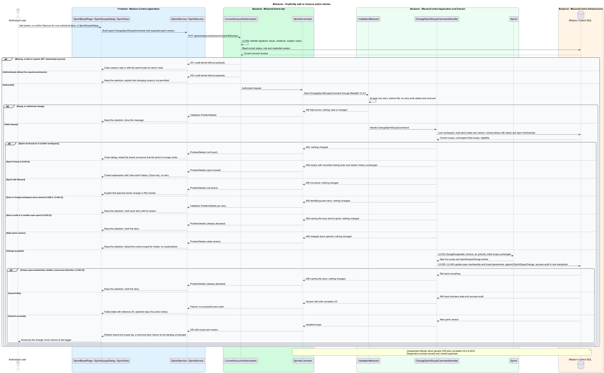

# Start a sprint and change its active scope

## Overview

Authorized users start planned delivery and explicitly adjust its live scope.

- **Initial scope** — story IDs recorded at the instant a planned sprint starts
- **Scope change** — actor-attributed addition or removal after start

One workspace runs at most one active sprint, including under concurrent start requests.

This design refines the [L2 baseline](../../../specs/L2.md) and its linked L1 scope. Proposed defaults retain their proposal status.

## Description

All named production types are proposed; the repository currently contains requirements and static mocks.

| Part | Responsibility and architectural home |
| --- | --- |
| `SprintsPage` | Routed page or dialog owned by `frontend/projects/mission-control`; composes the domain library and presentational components. |
| `SprintView` | Domain component in `frontend/projects/domain`; injects `SPRINT_SERVICE` and holds feature state in signals. |
| `ISprintService`, `SPRINT_SERVICE` | Interface and token in `frontend/projects/api/sprint.service.contract.ts`; the consumer imports the contract only. |
| `SprintService` | Production HTTP adapter in `api`; owns HTTP calls and observable-to-signal conversion. Composition binds a mock adapter for Chromium Playwright. |
| `SprintsController` | Thin controller under `backend/src/MissionControl.Api/Controllers`, namespace `MissionControl.Api.Controllers`; binds, dispatches, and returns. |
| `Sprint` | Domain entity or Application read projection described below; Domain has no external project dependency. |
| `IMissionControlDataSession` | Application data port; the Infrastructure adapter runs parameterized queries and transaction commits. |

Commands, queries, handlers, and request validators live in Application feature folders. Each type has its own file; folders and namespaces agree.
MediatR remains pinned to `12.5.0`. Microsoft.Extensions supplies dependency injection, Options, and Configuration.

`StartSprintDialog` names the planned sprint, goal, dates, and scope; focus starts on Cancel.
`StartSprintCommandHandler` locks the workspace, then reads its mode, the sprint state and version, and the active slot before any write.
A missing sprint returns `404`; the dialog closes and the sprint list reloads.
Kanban mode returns `409` (L2-027.3), and another active sprint returns `409` naming it (L2-023.2); both dialogs explain the next step and offer no retry.
An already Active or Closed sprint returns `409` (L2-023.4). A stale version returns `409`, and the dialog reloads the sprint for a fresh confirmation.
A SQL unique active-workspace key protects exclusivity; an `ActiveSprintSlot` row keyed by workspace can provide the invariant independent of filtered-index support.
The selected provider determines the final constraint syntax before implementation. A concurrent start that loses on the key rolls back and receives the same `409`.
Start records `StartedAtUtc` and the start actor (`StartedByUserId`, `StartedByName`).
It inserts immutable initial-scope IDs and creates the sprint board's stable story placements in the same transaction.
An empty sprint may start, matching the sprint-board mock; no minimum-story rule exists.

`SprintScopeDialog` handles explicit active additions/removals. Additions use the planned-sprint eligibility and unique-membership rules.
Change scope on the sprint board and the Sprints tab opens it for additions.
Remove on each unfinished sprint-board card opens it for that story; the work-item delete dialog's Remove from sprint action opens the same view.
Only unfinished stories are added or removed (L2-023.3); Done stories stay in scope and their cards offer no Remove.
Removal preserves work status, estimate, and tasks and returns the story to the unallocated backlog.
Each change records actor ID, actor name, UTC instant, affected story ID and title, and Add/Remove in `SprintScopeChange`.
Initial scope remains immutable, including stories removed later.
The sprint version increments for scope and relevant story/task changes; closure checks it to detect stale decisions.

`ChangeSprintScopeCommandHandler` locks the workspace and reads the sprint state and version and every named story before any write.
A missing sprint returns `404`. A Closed sprint returns `409` with its recorded closing actor and instant, so the dialog can explain who closed it; history stays unchanged.
A sprint that is still Planned returns `409`; planned stories change through Plan stories.
Done or foreign-workspace stories return `400` identifying each story. A story already in another open sprint returns `409` naming it.
A stale version returns `409`; the dialog keeps the selection and reloads the current scope without resubmitting.
An active sprint blocks a mode change (L2-027.2), so an active sprint's scope never meets Kanban mode.

The authenticated API evaluates current SQL permissions before feature dispatch. Validation V maps invalid fields to `400`, absent authentication to `401`, forbidden access to `403`, missing records to `404`, and conflicts to `409`.
Unexpected errors return a generic `500` with a correlation ID. Structured diagnostics exclude secrets and contact payloads.

Responsive profile R covers `320`, `375`, `576`, `768`, `992`, `1200`, and `1920` CSS-pixel widths at `800` pixels high.
Forms stack on compact screens; dialogs become sheets below `576px`. Templates, styles, and classes remain separate files.
Component styles read `var(--mc-<role>)` from the mirrored authoritative design-system tokens.
Keyboard actions include visible focus, named controls, modal focus containment, trigger focus restoration, and destination-heading focus after navigation.
Field errors connect to inputs; asynchronous results use status or alert announcements. Status text supplements color; primary touch targets measure at least `44×44` CSS pixels.

| Behavior | Proposed boundary | Request / handler |
| --- | --- | --- |
| Start a planned sprint | `POST /api/workspaces/{id}/sprints/{sprintId}/start` | `StartSprintCommand` / `StartSprintCommandHandler` |
| Explicitly add or remove active stories | `PUT /api/workspaces/{id}/sprints/{sprintId}/scope` | `ChangeSprintScopeCommand` / `ChangeSprintScopeCommandHandler` |

Mock input and review references:

- [Start sprint · Mission Control mock](../../../mocks/scrum/start-sprint-dialog.html); review states: `default`, `blocked-active`, `blocked-kanban`, `starting`, `failed`.
- [Change sprint scope · Mission Control mock](../../../mocks/scrum/sprint-scope-dialog.html); review states: `add`, `remove`, `closed`, `saving`, `failed`.
- [Sprint board · Mission Control mock](../../../mocks/scrum/sprint-board.html); review states: `default`, `scope-log`, `no-stories`, `no-active`, `no-sprints`, `move-failed`, `collaborator`, `loading`, `error`.

Implementation proceeds one behavior at a time using the linked Given-When-Then criteria. An API integration acceptance check first fails for the expected missing behavior.
A Chromium Playwright check uses one page object per screen and a mock service bound through the same token. Tests express intent; page objects own selectors.
The smallest implementation turns those checks green before the next behavior begins. Relevant regression checks follow each slice; no architecture tests are introduced.

## Requirements

Requirement text and identifiers below are copied verbatim from L2, including the source use of `must`.

| L2 ID | Refines (L1) | Requirement |
| --- | --- | --- |
| `L2-022` | `L1-006` | Scrum workspaces must support planned sprints with a name (1–200 characters), goal (1–2,000 characters), start date, and end date on or after start. Dates use Toronto calendar dates. A story must belong to at most one planned/active sprint at a time; tasks inherit membership. Permitted users can edit planned sprints and add/remove unfinished stories. Done stories cannot be newly allocated. |
| `L2-023` | `L1-006` | A workspace must have at most one active sprint. Starting must transition a planned sprint to Active and record the start instant. Active sprint scope can be changed explicitly by permitted users, without losing the recorded initial scope. |
| `L2-027` | `L1-006` | Only administrators must switch workspace mode. An active sprint must block a mode change. Kanban mode must preserve planned/closed sprints but disable their execution until returning to Scrum; work remains available on the Kanban board. |
| `L2-039` | `L1-010` | The system must record UTC timestamp, actor ID when known, operation, entity type/ ID, outcome, and correlation ID for account/permission changes, contact/workspace/ work mutations, board/sprint mutations, successful login, denied access, and throttling. Audit data must exclude secrets and contact payloads. Only administrators must access audit records; audit mutation endpoints must be absent. |
| `L2-040` | `L1-011` | Committed account, contact, hierarchy, ordering, board, and sprint changes must survive restart. Operations spanning multiple records must commit entirely or leave all affected business records unchanged. |
| `L2-041` | `L1-011` | Edits must carry a record version or equivalent concurrency condition. SQL constraints must protect normalized account emails, lead email/category pairs, parent references, open sprint membership, and active sprint exclusivity. Caller errors must produce validation/conflict responses rather than generic failures. |

## Diagrams

The context view identifies the actor and the Mission Control capability.

The container view separates the client, .NET API, and durable SQL records.

The component view locates request dispatch, domain behavior, and persistence within the feature.

The class view shows proposed typed requests, interface consumption, and relationships between the feature parts.

Start a planned sprint follows the sequence below. The flow traces its enforcing steps to `L2-023` and includes rejection or recovery paths.

Explicitly add or remove active stories follows the sequence below. The flow traces its enforcing steps to `L2-023` and includes rejection or recovery paths.

