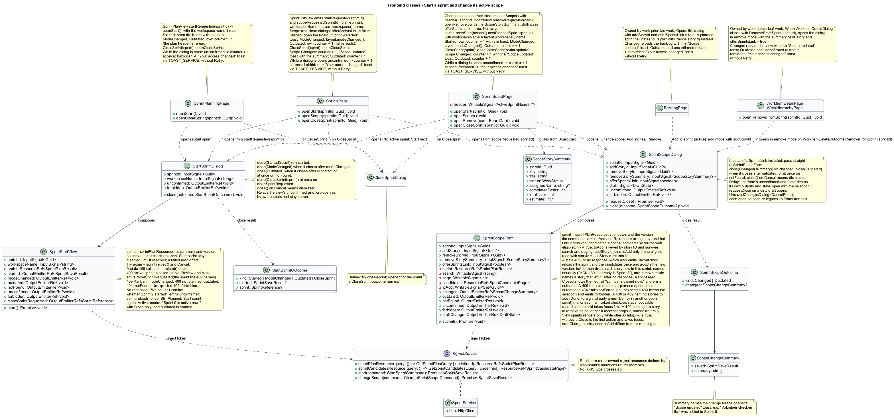

# Start a sprint and change its active scope

## Overview

Authorized users start planned delivery and explicitly adjust its live scope.

- **Initial scope** — story IDs recorded at the instant a planned sprint starts
- **Scope change** — actor-attributed addition or removal after start

One workspace runs at most one active sprint, including under concurrent start requests.

This design refines the [L2 baseline](../../../specs/L2.md) and its linked L1 scope. Proposed defaults retain their proposal status.

## Description

The [shared design rules](../../README.md#shared-design-rules) apply: proposed type status, Application placement and MediatR `12.5.0`, authentication and validation V, responsive profile R and accessibility, token styling, data ownership and session handling, and incremental ATDD. This page records feature-specific behavior and exceptions only.

| Part | Responsibility and architectural home |
| --- | --- |
| `SprintsPage` | Routed page owned by `frontend/projects/mission-control` for `/projects/:id/sprints`, defined by [plan sprints](../plan-sprints/README.md); `SprintListView` emits `startRequested(sprintId)` from a planned sprint's Start, which calls `openStart(sprintId)` with the name from the layout's `workspace` signal, and `scopeRequested(sprintId)` from the active sprint's Change scope, which calls `openScope(sprintId)` with `offerSprintsLink` false, because the dialog already sits over the Sprints tab. Reactions: `StartSprintOutcome` Started opens the sprint board with the "Sprint 9 started" toast, ModeChanged calls `ProjectLayoutPage.modeChanged()`, Outdated increments its counter so the list rereads, and CloseSprint calls `openCloseSprint(sprintId)` for the named sprint; `SprintScopeOutcome` Changed increments the counter and shows the "Scope updated" toast with the outcome's summary, and Outdated increments the counter. While a dialog stays open, its `unconfirmed` (a start or scope change that got no response) increments the counter at once, and its `forbidden` shows the "Your access changed" toast through `TOAST_SERVICE`, without Retry. Its `FormDraft` delegates to the open dialog, else to the layout's. |
| `SprintPlanningPage` | Routed page for a planned sprint's plan, defined by [plan sprints](../plan-sprints/README.md); `SprintPlanView`'s `startRequested(sprintId)` calls `openStart()`, which opens `StartSprintDialog` for that sprint with the workspace name it read. Reactions: Started opens the sprint board with the "Sprint 9 started" toast, ModeChanged and Outdated increment its counter so the view rereads the plan header, and CloseSprint calls `openCloseSprint(sprintId)`. While the dialog stays open, its `unconfirmed` increments the counter at once, and its `forbidden` shows the "Your access changed" toast through `TOAST_SERVICE`, without Retry. |
| `SprintBoardPage` | Routed page for the active sprint board, defined by [execute sprint work](../execute-sprint-work/README.md). Change scope and Add stories open `SprintScopeDialog` with the header's sprint ID, Remove on a card (`removeRequested`) opens it in remove mode with the card's summary, both with `offerSprintsLink` true, and Start on the No active sprint state opens `StartSprintDialog` for the next planned sprint with the name from the layout's `workspace` signal. Reactions: Started increments its counter, so the board and scope log reread, with the "Sprint 9 started" toast; ModeChanged calls `ProjectLayoutPage.modeChanged()`; Outdated increments the counter; CloseSprint calls `openCloseSprint(sprintId)`; scope Changed increments the counter with the "Scope updated" toast, and scope Outdated increments it. While a dialog stays open, its `unconfirmed` increments the counter at once, and its `forbidden` shows the "Your access changed" toast through `TOAST_SERVICE`, without Retry. Its `FormDraft` delegates to the open dialog, else to the layout's. |
| `BacklogPage` | Routed backlog page owned by the [prioritize work](../../work/prioritize-work/README.md) slice; Add to sprint on the active sprint opens `SprintScopeDialog` in add mode with that story as `addStoryId` and `offerSprintsLink` true, reloads the backlog on Changed, with the "Scope updated" toast, or Outdated, and at once on the dialog's `unconfirmed`, and shows the "Your access changed" toast through `TOAST_SERVICE`, without Retry, on the dialog's `forbidden`. |
| `StartSprintDialog` | Application dialog in `frontend/projects/mission-control`; takes `sprintId` and `workspaceName`, composes `SprintStartView`, and closes through `close(StartSprintOutcome?)` with the kinds `Started(SprintSaveResult)` after `started`, `ModeChanged` when it closes after `modeChanged`, `Outdated` when it closes after `outdated` or at once after `notFound`, and `CloseSprint(SprintReference)` at once after `closeSprintRequested`. Closing with no result (Cancel) means dismissed. It relays the view's `unconfirmed` (a start that got no response) and `forbidden` as its own outputs and stays open. |
| `WorkItemDetailPage`, `WorkHierarchyPage` | Routed work pages owned by the [delete leaf work](../../work/delete-leaf-work/README.md) slice; each opens `SprintScopeDialog` in remove mode, with `offerSprintsLink` true, when `WorkItemDeleteDialog` closes with `RemoveFromSprint(sprintId)`, reloads its view on Changed, with the "Scope updated" toast, or Outdated, and at once on the dialog's `unconfirmed`, and shows the "Your access changed" toast through `TOAST_SERVICE`, without Retry, on the dialog's `forbidden`. |
| `SprintScopeDialog` | Application dialog in `frontend/projects/mission-control`, opened by `SprintBoardPage`, `SprintsPage`, `BacklogPage`, `WorkItemDetailPage`, and `WorkHierarchyPage`. It takes `sprintId`, `addStoryId?`, `removeStoryId?`, `removeStorySummary?`, and `offerSprintsLink`, composes `SprintScopeForm` with them, and implements `FormDraft` from its `draftChange`. It closes through `close(SprintScopeOutcome?)` with the kinds `Changed(ScopeChangeSummary)` after `changed` and `Outdated` when it closes after `outdated` or at once after `notFound`; closing with no result (Cancel) means dismissed. It relays the form's `unconfirmed` (a change that got no response) and `forbidden` as its own outputs and stays open with the selection. Every opener rereads on Changed and Outdated, and at once on `unconfirmed`, shows the "Scope updated" toast on Changed, and shows the "Your access changed" toast through `TOAST_SERVICE`, without Retry, on `forbidden`. |
| `SprintStartView` | Domain component in `frontend/projects/domain`; injects `SPRINT_SERVICE`, reads the planned sprint's summary and version through its own `sprintPlanResource`, and submits the start. It emits `started`, `modeChanged`, `outdated` (the sprint is no longer planned), `notFound`, `unconfirmed` (a start that got no response), `forbidden` (an unexpected `403`), and `closeSprintRequested(SprintReference)` from the blocked explanation's Review and close action; its `workspaceName` input names the project in the Kanban explanation. |
| `SprintScopeForm` | Domain component; owns the sprint's `sprintPlanResource` (header and version), the eligible-story resource with its search and page signals, the stories chosen to add (kept across search and paging), or the one story to remove; renders View sprints only while its `offerSprintsLink` input is true; submits the scope change and emits `changed` with a `ScopeChangeSummary` (the saved result and a summary such as "“Volunteer check-in list” was added to Sprint 8"), `outdated` (the sprint closed or hasn't started), `notFound`, `unconfirmed` (a change that got no response), `forbidden` (an unexpected `403`), and `draftChange`. After a reread it drops from the chosen set every story now in this sprint and names each. |
| `ISprintService`, `SPRINT_SERVICE` | Interface and token in `frontend/projects/api/sprint.service.contract.ts`; consumers import the contract only. |
| `SprintService` | Production HTTP adapter in `api`; reads are caller-owned signal resources, and start and scope changes return promises. Composition binds a mock adapter for Chromium Playwright. |
| `SprintsController` | Thin controller under `backend/src/MissionControl.Api/Controllers`, namespace `MissionControl.Api.Controllers`; binds, dispatches, and returns. |
| `Sprint`, `SprintScopeChange` | Domain sprint aggregate; its initial-scope rows, `OpenSprintMembership` rows, and immutable `SprintScopeChange` rows are tracked children. |
| `ActiveSprintSlot` | Domain aggregate root holding the unique active slot of a workspace. |
| `IMissionControlDataSession` | Shared Application data port defined in the [overview](../../README.md#data-access-and-security-ports); this feature uses its typed `Load…` and `List…` reads, `AddActiveSprintSlot`, `AddBoardState`, `AddAuditEvent`, `BeginWorkspaceTransactionAsync`, and `SaveChangesAsync`. |

`StartSprintDialog` names the planned sprint, goal, dates, and scope; focus starts on Cancel.
`SprintStartView` reads the sprint when the dialog opens. That read returns the plan header only, so the dialog never checks for another active sprint on open; it always opens on the confirmation. Start sprint stays disabled until the read resolves (`loading`); a failed read shows Try again (`reload()`) and Cancel (`load-failed`), with the reference ID when the read was answered with a `500` and without one when it got no response. A read answered with `404` makes the view emit `notFound`; the dialog closes with Outdated, and the opening page rereads and shows its own state.
`StartSprintCommandHandler` calls `BeginWorkspaceTransactionAsync`, which takes the workspace lock, and then reads the mode, the sprint state and version, and the active sprint before any write.
A missing sprint returns `404`; the view emits `notFound`, the dialog closes with Outdated, and the opening page rereads.
Kanban mode returns `409` (L2-027.3), and another active sprint returns `409` naming it as a `SprintReference` (L2-023.2); both dialogs explain the next step and offer no retry (`blocked-kanban`, `blocked-active`). After the Kanban `409` `SprintStartView` emits `modeChanged`, and the dialog closes with ModeChanged: `SprintsPage` and `SprintBoardPage` call `ProjectLayoutPage.modeChanged()`, and the planning page increments its counter, so its view rereads the plan header.
The `blocked-active` explanation appears only after Start sprint is answered with that `409`. Its Review and close Sprint 8 action makes the view emit `closeSprintRequested` with the sprint the `409` named, and the dialog closes with CloseSprint, so `SprintsPage`, `SprintPlanningPage`, or `SprintBoardPage` opens `CloseSprintDialog` for that sprint through `openCloseSprint(sprintId)`.
An already Active or Closed sprint returns `409` (L2-023.4); the dialog names the sprint's current state and offers only Close (`not-planned`). The view emits `outdated`, so Close returns Outdated: `SprintsPage` rereads its list, `SprintPlanningPage` its plan header, and `SprintBoardPage` its board.
Each of these three explanations replaces the summary inside the dialog's alert region and becomes the dialog's description. Start sprint is gone, so focus moves to the first action offered: Review and close Sprint 8 for `blocked-active`, and Close otherwise.
A close with Started opens the sprint board, where the new sprint is read, and the opening page shows the "Sprint 9 started" toast through `TOAST_SERVICE`; on the board itself it increments the counter instead of navigating.
A stale version returns `409`. The dialog reads the sprint once and shows the refreshed summary with neutral copy, "Sprint 9 changed after you opened it"; nothing is resubmitted, and Start sprint asks again (`stale`).
A `500`, or a `503` lock timeout, starts nothing; the dialog shows the reference ID, and Start sprint retries only when chosen (`failed`).
A `400` for a malformed expected version starts nothing either: the same alert shows its message without a reference ID, and Start sprint becomes unavailable because a repeat would be refused again, so focus moves to the alert.
A start that gets no response is uncertain: the dialog says "We couldn't confirm whether Sprint 9 started." without a reference ID or a claim that nothing changed. The view emits `unconfirmed`, which the dialog relays while it stays open, so the opening page rereads at once, and it reads the sprint once (`reload()`).
A sprint still Planned at the same version offers Start sprint again. A sprint that is no longer Planned shows its state with neutral copy instead of the `not-planned` explanation, which says nothing changed: "Sprint 9 is active now." in the alert region as the dialog's description, with Close only, which returns Outdated; Start sprint is gone, so focus moves to Close (`unconfirmed-active`). The opening page's reread then shows the active sprint: the Sprints tab with its Open board, the planning page's explanation with a link to the board, or the board itself.
An unexpected `403` starts nothing: `SprintStartView` emits `forbidden`, which the dialog relays as its own `forbidden` while it stays open, and the opening page shows the "Your access changed" toast through `TOAST_SERVICE`, without Retry.
A SQL unique active-workspace key protects exclusivity; an `ActiveSprintSlot` row keyed by workspace can provide the invariant independent of filtered-index support.
The selected provider determines the final constraint syntax before implementation. A concurrent start that loses on the key rolls back and receives the same `409`.
Start records `StartedAtUtc` and the start actor (`StartedByUserId`, `StartedByName`).
`Sprint.start` adds the immutable initial-scope story IDs as tracked child rows of the loaded sprint.
The handler registers the active slot with `AddActiveSprintSlot`, the sprint board's `BoardState` with its stable story placements as children with `AddBoardState`, and the success audit with `AddAuditEvent`; `SaveChangesAsync` commits them in one transaction.
An empty sprint may start, matching the sprint-board mock; no minimum-story rule exists.

`SprintScopeDialog` handles explicit active additions/removals. Additions use the planned-sprint eligibility and unique-membership rules.
`SprintScopeForm` reads the sprint through its own `sprintPlanResource` when the dialog opens, for the title, dates, and the version its command carries. Add and Return to backlog stay disabled until that read resolves (`loading`); a failed read shows Try again (`reload()`) and Cancel (`load-failed`), with the reference ID only when the read was answered with a `500`. A read answered with `404` makes the form emit `notFound`; the dialog closes with Outdated, and the opening page rereads and shows its own state.
Its add list pages and searches through `GetSprintCandidatesQuery` from [sprint planning](../plan-sprints/README.md) with `eligibleOnly` set, so it lists only eligible stories in backlog priority order with story ID as the tie-breaker, 25 per page, with the eligible total ("Showing 26–50 of 198 eligible") and a pager once there is more than one page.
Search debounces on the form's query signal and restarts at page 1. The chosen stories are a set keyed by story ID, so choices survive search and paging (`paged`).
Change scope and Add stories on the sprint board, and Change scope on the Sprints tab, open it for additions; `SprintBoardPage.openScope()` and `SprintsPage.openScope(sprintId)` open the same dialog.
Backlog Add to sprint on the active sprint opens it in add mode with `addStoryId` set. The form reads that story's row once through the eligible candidate query's `storyId`, and the story joins the chosen set only if that read returns it; a story that became Done or joined an open sprint meanwhile is not returned, so the dialog opens with nothing chosen; the `add` mock state's note covers this arrival with HCK-130. On a planned sprint the backlog instead navigates to the sprint's planning page with `?add={storyId}`, defined by [plan sprints](../plan-sprints/README.md).
Remove on each unfinished sprint-board card emits `removeRequested(card)`; `SprintBoardPage.openRemove(card)` opens the dialog with `removeStoryId` and a `ScopeStorySummary` built from the card (key, title, status, assignee, task counts, estimate), which the remove confirmation shows.
The work-item delete dialog's Remove from Sprint 8 action closes `WorkItemDeleteDialog` with `RemoveFromSprint(sprintId)`; `WorkItemDetailPage` or `WorkHierarchyPage`, whichever opened the dialog, then opens `SprintScopeDialog` in remove mode for that story, with the summary built from the story it shows. The [delete leaf work](../../work/delete-leaf-work/README.md) slice owns that path.
`SprintScopeForm` emits `draftChange`, dirty once the chosen set differs from the one it opened with (a preselected story is not a change); remove mode is never dirty. Cancel, Close, or Escape on a dirty draft opens `UnsavedChangesDialog`, and each opening page implements `FormDraft` by delegating to the open dialog; `SprintsPage` and `SprintBoardPage`, as `ProjectLayoutPage` children, fall back to the layout's open dialog.
Only unfinished stories are added or removed (L2-023.3); Done stories stay in scope and their cards offer no Remove.
Removal preserves work status, estimate, and tasks and returns the story to the unallocated backlog.
Each change records actor ID, actor name, UTC instant, affected story ID, key, and title, and Add/Remove in `SprintScopeChange`, which is immutable once recorded.
Initial scope remains immutable, including stories removed later.
Scope changes increment the sprint version; the [closure revision matrix](../close-sprint/README.md#description) lists every change that does.

`ChangeSprintScopeCommandHandler` calls `BeginWorkspaceTransactionAsync`, then `LoadScopeChangeAsync` reads the sprint with its status, version, and the memberships to remove, the sprint's `BoardState`, and every named story before any write.
`Sprint.changeScope` adds `SprintScopeChange` rows and adds or removes `OpenSprintMembership` rows as tracked children of the sprint, and the board's placements change as tracked children of its `BoardState`.
The handler registers the success audit with `AddAuditEvent`, and `SaveChangesAsync` commits everything in one transaction.
A missing sprint returns `404`; the form emits `notFound`, the dialog closes with Outdated, and the opening page rereads. A Closed sprint returns `409` with its recorded closing actor and instant, so the dialog can explain who closed it and, when `offerSprintsLink` is true, link to the Sprints tab through View sprints; history stays unchanged (`closed`). Opened from the Sprints tab, the dialog leaves View sprints out, because it would only reopen the page behind it. The explanation sits in the dialog's alert region as its description, and with Add or Return to backlog gone, focus moves to the first action offered: View sprints, or Close on the Sprints tab.
A sprint that is still Planned returns `409`; the same `closed` presentation explains that its stories change through Plan stories. After either `409` the form emits `outdated`, so Close returns Outdated and the opening page rereads.
An empty or contradictory change returns `400`; the dialog keeps the selection so it can be corrected and shows the server's reason in the `failed` alert, without Try again or a reference ID, because sending the same change again would be refused again. Add (or Return to backlog) is still offered, so focus stays on it.
Done or foreign-workspace stories, a story to add that is already a member of this sprint, and a story to remove that is no longer a member return `400` identifying each story, and a story already in another open sprint returns `409` naming it and its sprint. Either way the dialog marks each named story to add with its reason and keeps the rest of the selection (`allocated`), without Retry or a reference ID. Focus moves to the first marked story's checkbox, which stays focusable with `aria-disabled` and reads its reason. In remove mode a story that is no longer a member is dropped and named with neutral copy, "HCK-118 is no longer in Sprint 8", Return to backlog becomes unavailable, and focus moves to the alert, as after a reread (`unconfirmed-added`).
A stale version returns `409`; the dialog keeps the selection, reloads the sprint and the eligible list once, adopts the new version, and explains with neutral copy without resubmitting (`stale`).
After that reread the form drops from the chosen set every story that is now in this sprint and names each with neutral copy, such as "HCK-130 is already in Sprint 8"; in remove mode a story that is no longer a member is named the same way, "HCK-118 is no longer in Sprint 8", and Return to backlog becomes unavailable. With nothing left chosen, Add is unavailable too and focus moves to the alert (`unconfirmed-added`).
A `500`, or a `503` lock timeout, changes nothing; the dialog keeps the selection, shows the reference ID, and retries only when chosen (`failed`).
A change that gets no response is uncertain: the dialog keeps the selection, says "We couldn't confirm whether Sprint 8's scope changed." without a reference ID or a claim that nothing changed, and the form emits `unconfirmed`, which the dialog relays while it stays open, so the opening page rereads at once.
The form then reloads the sprint and the eligible list once, as after a stale `409` but without the stale copy, which says nothing was added: it drops and names each chosen story now in the sprint, or the story to remove that left it, as above (`unconfirmed-added`), before Add or Return to backlog is offered again for what remains. A sprint that reads Closed by then shows neutral copy instead of the `closed` explanation, which says nothing was changed: "Sprint 8 is closed now." with "Its history shows its final scope and every scope change.", View sprints when `offerSprintsLink` is true, and Close, which returns Outdated; Add or Return to backlog is gone, so focus moves to the first action offered (`unconfirmed-closed`).
After `changed` the dialog closes with Changed, and the opening page rereads and shows the "Scope updated" toast through `TOAST_SERVICE` with the outcome's summary.
An unexpected `403` changes nothing: the form keeps the selection and emits `forbidden`, which the dialog relays as its own `forbidden` while it stays open, and the opening page shows the "Your access changed" toast through `TOAST_SERVICE`, without Retry.
An active sprint blocks a mode change (L2-027.2), so an active sprint's scope never meets Kanban mode.

| Behavior | Proposed boundary | Request / handler |
| --- | --- | --- |
| Start a planned sprint | `POST /api/workspaces/{id}/sprints/{sprintId}/start` | `StartSprintCommand` / `StartSprintCommandHandler` |
| Explicitly add or remove active stories | `PUT /api/workspaces/{id}/sprints/{sprintId}/scope` | `ChangeSprintScopeCommand` / `ChangeSprintScopeCommandHandler` |

Mock input and review references:

- [Start sprint · Mission Control mock](../../../mocks/scrum/start-sprint-dialog.html); review states: `default`, `loading`, `load-failed`, `stale`, `not-planned`, `blocked-active`, `blocked-kanban`, `starting`, `failed`, `unconfirmed-active`.
- [Change sprint scope · Mission Control mock](../../../mocks/scrum/sprint-scope-dialog.html); review states: `add`, `paged`, `remove`, `loading`, `load-failed`, `stale`, `allocated`, `closed`, `saving`, `failed`, `unconfirmed-added`, `unconfirmed-closed`.
- [Sprint board · Mission Control mock](../../../mocks/scrum/sprint-board.html); review states: `default`, `pending`, `scope-log`, `scope-log-loading`, `scope-log-failed`, `no-stories`, `no-active`, `no-planned`, `no-sprints`, `move-failed`, `collaborator`, `loading`, `error`.

## Requirements

Requirement text and identifiers below are copied verbatim from L2, including the source use of `must`.

| L2 ID | Refines (L1) | Requirement |
| --- | --- | --- |
| `L2-022` | `L1-006` | Scrum workspaces must support planned sprints with a name (1–200 characters), goal (1–2,000 characters), start date, and end date on or after start. Dates use Toronto calendar dates. A story must belong to at most one planned/active sprint at a time; tasks inherit membership. Permitted users can edit planned sprints and add/remove unfinished stories. Done stories cannot be newly allocated. |
| `L2-023` | `L1-006` | A workspace must have at most one active sprint. Starting must transition a planned sprint to Active and record the start instant. Active sprint scope can be changed explicitly by permitted users, without losing the recorded initial scope. |
| `L2-027` | `L1-006` | Only administrators must switch workspace mode. An active sprint must block a mode change. Kanban mode must preserve planned/closed sprints but disable their execution until returning to Scrum; work remains available on the Kanban board. |
| `L2-039` | `L1-010` | The system must record UTC timestamp, actor ID when known, operation, entity type/ ID, outcome, and correlation ID for account/permission changes, contact/workspace/ work mutations, board/sprint mutations, successful login, denied access, and throttling. Audit data must exclude secrets and contact payloads. Only administrators must access audit records; audit mutation endpoints must be absent. |
| `L2-040` | `L1-011` | Committed account, contact, hierarchy, ordering, board, and sprint changes must survive restart. Operations spanning multiple records must commit entirely or leave all affected business records unchanged. |
| `L2-041` | `L1-011` | Edits must carry a record version or equivalent concurrency condition. SQL constraints must protect normalized account emails, lead email/category pairs, parent references, open sprint membership, and active sprint exclusivity. Caller errors must produce validation/conflict responses rather than generic failures. |

## Diagrams

The context view identifies the actor and the Mission Control capability.

The container view separates the client, .NET API, and durable SQL records.

The component view locates request dispatch, domain behavior, and persistence within the feature.

The backend class view shows the typed start and scope requests, the sprint aggregate with its tracked children, and the data port members of this feature.

The frontend class view shows the pages that open the start and scope dialogs with their outcome reactions, the outputs and inputs that carry the sprint and story IDs, the dialogs' typed close results, the domain views the dialogs compose, and the sprint service contract.

Start a planned sprint follows the sequence below. The flow traces its enforcing steps to `L2-023` and includes rejection or recovery paths.

Explicitly add or remove active stories follows the sequence below. The flow traces its enforcing steps to `L2-023` and includes rejection or recovery paths.

