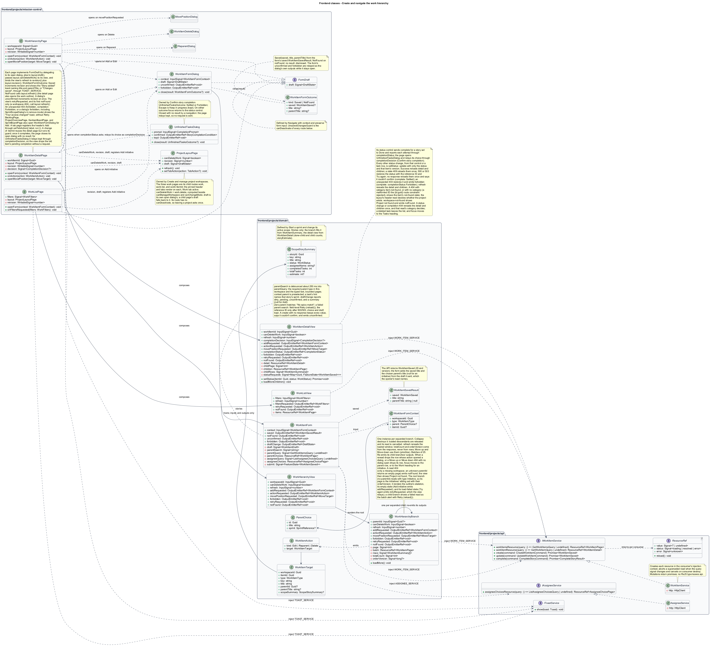

# Create and navigate the work hierarchy

## Overview

Project work follows four levels from broad purpose to executable steps.

- **Initiative** — top-level purpose in a workspace
- **Epic** — group of stories under one initiative
- **Story** — deliverable under one epic, shown as a board card
- **Task** — action under one story

Creating and navigating this hierarchy preserves the current workspace and parent path.

This design refines the [L2 baseline](../../../specs/L2.md) and its linked L1 scope. Proposed defaults retain their proposal status.

## Description

The [shared design rules](../../README.md#shared-design-rules) apply: proposed type status, Application placement and MediatR `12.5.0`, authentication and validation V, responsive profile R and accessibility, token styling, data ownership and session handling, and incremental ATDD. This page records feature-specific behavior and exceptions only.

| Part | Responsibility and architectural home |
| --- | --- |
| `WorkHierarchyPage` | Routed page in `frontend/projects/mission-control`, the `work` child route of `ProjectLayoutPage` (`/projects/:id/work`); composes `WorkHierarchyView` with the layout's `canDeleteWork` and binds the view's `refresh` input to its own counter plus the layout's `revision`. It opens `WorkItemFormDialog` from the header's Add initiative and the view's `addRequested`, and `ReparentDialog`, `WorkItemDeleteDialog`, and `MovePositionDialog` from its `actionRequested` and `movePositionRequested` outputs. It reacts to `WorkItemFormOutcome` as described below and to the other dialogs' outcomes as their slices define, incrementing its counter after every committed outcome and on a dialog's `unconfirmed`; calls the layout's `refresh()` on the view's `retryRequested` and on its first `notFound` only; and shows the "Your access changed" toast through `TOAST_SERVICE` on the view's or a dialog's `forbidden`, including `SprintScopeDialog`'s when it opens that dialog in remove mode ([Delete permitted leaf work](../delete-leaf-work/README.md#description)). It implements `FormDraft`: its route keeps `canDeactivate: UnsavedChangesGuard`, and its `draft` delegates to its open dialog, else falls back to the layout's open dialog (`inject(ProjectLayoutPage).draft()`), so leaving the project asks once. |
| `WorkListPage` | Routed page, the `work-list` child route (`/projects/:id/work-list`); keeps the type/status filters and page in route query parameters, renders the filter controls, passes the filters to `WorkListView`, and navigates to new query parameters on the view's `filtersRequested`; binds the view's `refresh` to its own counter plus the layout's `revision`; opens `WorkItemFormDialog` from the header's Add initiative and reacts to `WorkItemFormOutcome` as described below; calls the layout's `refresh()` on the view's `retryRequested` and on its first `notFound` only; shows the "Your access changed" toast on the dialog's `forbidden`; implements `FormDraft`: its route keeps `canDeactivate: UnsavedChangesGuard`, and its `draft` delegates to its open dialog, else falls back to the layout's open dialog (`inject(ProjectLayoutPage).draft()`), so leaving the project asks once. |
| `WorkItemDetailPage` | Routed page, the `work/:itemId` child route (`/projects/:id/work/:itemId`); composes `WorkItemDetailView` with the layout's `canDeleteWork` and binds its `refresh` to its own counter plus the layout's `revision`; opens `WorkItemFormDialog` (Edit, or Add from the children card), `ReparentDialog`, `WorkItemDeleteDialog`, and `MovePositionDialog` from the view's `addRequested`, `actionRequested`, and `movePositionRequested` outputs, and `UnfinishedTasksDialog` from `completionStatus`, relaying its choice through the view's `completionDecision` input, returning focus to the status control when that dialog closes with `Settled` or `Forbidden`, and relaying `kept` when a navigation closes it with no result; reacts to `WorkItemFormOutcome` as described below and to the other dialogs' outcomes as their slices define; calls the layout's `refresh()` on the view's `retryRequested` and on its first `notFound` only; shows the "Your access changed" toast through `TOAST_SERVICE` on the view's `forbidden`, a `completionStatus` of `Forbidden`, or a dialog's `forbidden`, including `SprintScopeDialog`'s in remove mode; implements `FormDraft`: its route keeps `canDeactivate: UnsavedChangesGuard`, and its `draft` delegates to its open dialog, else falls back to the layout's open dialog (`inject(ProjectLayoutPage).draft()`), so leaving the project asks once. A change of `:itemId` reuses the page but runs its guard, so it closes its open dialog with no result once that navigation completes. |
| `WorkItemFormDialog` | Application dialog for adding and editing work; passes the `WorkItemFormContext` (workspace, type, preselected parent, or edited item) to `WorkItemForm`, implements `FormDraft` from the form's latest `DraftState`, and opens `UnsavedChangesDialog` when Cancel, Close, or Escape meets a dirty draft. It closes through `close(result: WorkItemFormOutcome?)`: `Saved(saved, title, parentTitle)` from the `WorkItemSavedResult` of the form's `saved`, `NotFound` on `notFound`, and no result when dismissed. It relays the form's `unconfirmed` and `forbidden` (or an edit's completion `Forbidden`) as its own outputs and stays open with the draft. |
| `WorkHierarchyView` | Domain component in `frontend/projects/domain`; renders the initiatives as the root `WorkHierarchyBranch`, passes its `canDeleteWork` and `refresh` inputs down to every branch, and renders the project's not-found state in place of the outline. The root branch owns the outline's read, so it renders the outline's loading, empty, and load-failed states itself. The view relays the root branch's outputs as its own: `addRequested` (a `WorkItemFormContext` with the row as parent, or no parent for an initiative, including the empty state's Add initiative), `actionRequested` (a `WorkItemAction`: Edit, Reparent, or Delete with the row's `WorkItemTarget`), `movePositionRequested` (a `MoveTarget`), `forbidden` after a move, `retryRequested` from the load-failed Try again, and `notFound` when a branch's read finds the workspace missing, which replaces the outline with the not-found state. |
| `WorkHierarchyBranch` | Domain component, one instance per expanded branch; injects `WORK_ITEM_SERVICE` and `WORK_ORDER_SERVICE`; takes `parentId`, `canDeleteWork`, and `refresh`, whose change rereads its loaded window; builds each row's `WorkItemTarget` from its `WorkItemSummary`; owns its `workItemsResource`, appended batches, the parent's full count and sibling-order version, and its rows' pending Move up or Move down ([Prioritize siblings](../prioritize-work/README.md#description)) in signals. The root branch (no `parentId`) reads with `type: Initiative`, so its page is the workspace's initiatives as one sibling set; it renders the outline's skeleton while its first read loads, the empty state when the workspace has no initiatives, whose Add initiative emits `addRequested`, and the load-failed state when its first read fails, whose Try again emits `retryRequested`; a child branch shows a failed read as the batch alert with Retry, which reads it again. It emits `addRequested`, `actionRequested`, `movePositionRequested`, and `forbidden` for its own rows, `retryRequested` from the root's Try again, and `notFound` when its read returns `404`, and re-emits its child branches' outputs, so the view receives every row's actions. |
| `WorkListView` | Domain component; injects `WORK_ITEM_SERVICE`; owns a `workItemsResource` driven by the filters and page it receives, with no `parentId` (All types sends no type filter, so the page lists every item in outline order), and reread when `refresh` changes; its Clear filters, Clear filter, and pager emit `filtersRequested` with the new filters and page, and its load-failed Try again emits `retryRequested`; a `404` shows the project's not-found state and emits `notFound`. |
| `WorkItemDetailView` | Domain component; injects `WORK_ITEM_SERVICE`; takes `canDeleteWork` and builds the item's `WorkItemTarget` from its `WorkItemDetail`; owns a `workItemResource` for the item, a `workItemsResource` for its children with the appended batches, and the request state of its status control and task-row status selects; a change of `refresh` rereads the item and its children; emits `addRequested`, `actionRequested`, `movePositionRequested`, `completionStatus`, `forbidden`, and, from its load-failed Try again, `retryRequested`. An item `404` shows its own not-found state; a workspace `404` shows the project's not-found state and emits `notFound`. |
| `WorkItemForm` | Domain component; injects `WORK_ITEM_SERVICE` and `ASSIGNEE_SERVICE`; owns the draft, the searchable parent and assignee choice resources, and submit state; emits `saved` (a `WorkItemSavedResult`), `notFound`, `unconfirmed`, `forbidden`, and `draftChange`. |
| `IWorkItemService`, `WORK_ITEM_SERVICE` | Contract and token in `frontend/projects/api/work-item.service.contract.ts`; read members return a caller-owned `ResourceRef<T>`, mutation members a `Promise<TResult>`. |
| `WorkItemService` | HTTP adapter in `api`; creates each resource in the consumer's injection context, converts observables to signals or promises, aborts a superseded read when the query signal changes, and cancels reads on consumer destroy; no shared mutable state. |
| `IAssigneeService`, `ASSIGNEE_SERVICE`, `AssigneeService` | Assignee lookup contract, token, and adapter defined by [Edit, assign, and reparent work](../edit-and-reparent-work/README.md#description); creation uses the same lookup. |
| `WorkItemsController` | Thin controller in `MissionControl.Api.Controllers`; binds, dispatches, and returns. |
| `GetWorkItemsQuery`, `GetWorkItemQuery` | Application queries returning a `WorkItemPage` of `WorkItemSummary` rows and one `WorkItemDetail`. |
| `WorkItem` | Domain entity for every hierarchy level; a story also carries the `taskRevision` of its child tasks. Domain references no other project. |
| `IMissionControlDataSession` | Application data port defined in the [overview](../../README.md#data-access-and-security-ports); this slice uses `BeginWorkspaceTransactionAsync`, `LoadWorkItemCreationAsync`, `LoadAccountStatusAsync`, `AddWorkItem`, `AddAuditEvent`, `ListWorkItemsAsync`, `LoadWorkItemDetailAsync`, and `SaveChangesAsync`. |

`WorkHierarchyPage`, `WorkListPage`, and `WorkItemDetailPage` are the `work`, `work-list`, and `work/:itemId` child routes of `ProjectLayoutPage` under `/projects/:id`, each with `canDeactivate: UnsavedChangesGuard`.
The pinned project header and tabs render on all three, with the Work tab active; below them the detail shows its parent path and the item heading, which receives focus after navigation.
Each page reads `canDeleteWork` (the `work.delete` capability) from `inject(ProjectLayoutPage)`, which computes it beside `canManageWorkspace` and `canChangeMode`, and passes it to its view: `WorkHierarchyView` hands it to every `WorkHierarchyBranch`, and `WorkItemDetailView` takes it directly. Given `false`, Delete shows as unavailable with "Only administrators can delete work".
A row's or the detail's `WorkItemTarget` carries the workspace and item IDs, type, key, title, parent ID and title, and, for a story, a `scopeSummary` (`ScopeStorySummary`: key, title, status, assignee, task counts, and estimate). `WorkHierarchyBranch` fills it from the row's `WorkItemSummary` and `WorkItemDetailView` from its `WorkItemDetail`, so every action dialog, including the delete dialog's sprint remedy, has what it needs without another read.
Record links (titles, Open, ancestors, and the sprint and project links) are router links built from the row's or the detail's IDs; every control that opens a dialog emits one of the outputs above, which its page maps to the dialog.
Every routed project page that offers Add opens `WorkItemFormDialog` in create mode itself and rereads its own view after a `Saved` result or an `unconfirmed` output: `WorkHierarchyPage` (Add initiative, a row's Add child, and the empty state), `WorkItemDetailPage` (the children card's Add), `WorkListPage` (Add initiative), `BacklogPage` (Add story, and Add initiative when empty; [Prioritize siblings](../prioritize-work/README.md#description)), and, outside this slice, `ProjectOverviewPage`, `KanbanBoardPage`, and `SprintBoardPage` (a story, or an initiative while the workspace has no stories).
The pinned project header's primary Add button belongs to the active tab page: `WorkHierarchyPage`, `WorkListPage`, and `BacklogPage` register it through `inject(ProjectLayoutPage).setTabAction({ label, run })`, cleared on destroy; the header renders it, and choosing it calls back into that page.
`WorkItemForm` emits `draftChange` whenever its draft or pending save changes: `dirty` once a value differs from the opened values (for Add, the empty draft with its preselected parent), `pending` while the save is in flight, and a `summary` naming the edited item, or `null` for Add.
A committed save emits `saved` with a `WorkItemSavedResult`: `saved`, the API's `WorkItemSaved` (ID and version); `title`, the saved title; and `parentTitle`, the chosen parent's title, or `null` for an initiative. The API returns only the ID and version, so the form fills the titles from the draft it sent.
Each page that hosts `WorkItemFormDialog`, `ReparentDialog`, `MovePositionDialog`, or `WorkItemDeleteDialog` implements `FormDraft` by delegating to its open dialog, and otherwise falls back to the layout's open dialog through `inject(ProjectLayoutPage).draft()`.
Every child route keeps `canDeactivate: UnsavedChangesGuard` and the layout's own route has none, so leaving a project asks once: a tab change deactivates only the child page, whose guard sees a dialog the layout opened through that fallback.
`work/:itemId` is a parameter route. A navigation to another item, through a router link inside one of the detail page's dialogs, an ancestor or child link, or Back or Forward, reuses `WorkItemDetailPage` but still runs its `UnsavedChangesGuard`, so the page treats it as leaving: once that navigation completes it closes its open dialog with no result, and `WorkItemDetailView` reads the new item. When that dialog is `UnfinishedTasksDialog`, the page relays `kept` through `completionDecision`, so the view drops the old item's pending completion without a request. A navigation the guard cancels leaves the dialog open with its draft.
`WorkItemFormOutcome` lists what the openers react to when the dialog closes. `Saved(saved, title, parentTitle)` increments the page's `refresh` counter and shows, through `TOAST_SERVICE`, the "Story added" toast, named for the item's type, with the new item from `title` and its parent from `parentTitle` ("“Volunteer check-in list” was added to Hackathon team formation.", or only the item for an initiative) or, after an edit, "Changes saved".
`NotFound` calls the layout's `refresh()`, so the header and the active view reread, and `WorkItemDetailPage` also opens the work outline. No result changes nothing.
While the dialog stays open, its `unconfirmed` output makes the page increment its counter at once, so the view rereads before another attempt, and its `forbidden` output shows the "Your access changed" toast.
A view's load-failed Try again emits `retryRequested`, and the page calls the layout's `refresh()`, so a project header that failed too rereads with the tab.
A missing workspace returns `404` to every work read, also when the project is deleted after the page opened: a later read (expanding a branch, Load more, a filter or page change, a `refresh` change, or Try again) finds it.
The view then shows the project's not-found presentation, "Project not found" with Back to projects, without Try again or a reference ID, and focus moves to that heading when the content it replaces held focus.
It emits `notFound`, and the page calls the layout's `refresh()` on the first one only, so the header rereads once and keeps only the breadcrumb, and the view's repeated `404` cannot loop, as on the [Kanban board](../../kanban/view-story-board/README.md#description).
`GetWorkItemsQuery` answers `404` only for a missing workspace: a `parentId` that names no item in the workspace is a filter that matches nothing and returns an empty page.
`GetWorkItemQueryHandler` looks up the workspace before the item, so its `404` carries the category `workspace-not-found` or `item-not-found`.
`WorkItemDetailView` shows its own not-found state for a missing item, offering the project's work and the project list while the header still shows the project, and the project's not-found presentation, emitting `notFound`, for a missing workspace (`not-found` mock state and its note).
A `404` without a category comes from the `{id:guid}` route constraint, which rejects a malformed workspace or item ID before any handler runs; the view shows the item's not-found state for it too, and the layout's own header read decides separately whether the project exists.
`WorkItemFormDialog` preselects the launching parent from `WorkItemFormContext.parent`, a `ParentChoice` (ID, title, and a story's open sprint) taken from the launching row or detail. The parent field is a searchable combobox, the same pattern as `ReparentForm` and the assignee picker.
`WorkItemForm` debounces the typed text by about 250 ms into its `parentQuery` signal, a `GetWorkItemsQuery` filtered to the required parent type in this workspace and that text, read in bounded pages by its `workItemsResource`.
Searching reaches every valid parent however many exist; matches show the parent's own parent as a hint, and the match count is announced (`parent-search` mock state).
Zero matches show "No epics match" with the typed text, announced politely, and the chosen parent stays (`parent-no-match`).
A failed search (`500`, `503`, or no response) shows a field-level message under the combobox with Retry, which calls the parent choices resource's `reload()`, and the reference ID only after a `500` or `503`; the chosen parent and the rest of the draft stay intact, and Save remains available (`parent-failed`).
`CreateWorkItemCommand` includes type, workspace, parent, required 1–200-character title, and optional description up to 10,000 characters.
New items have To Do status and are appended after their parent's existing children; initiatives are appended after the workspace's initiatives.
Creating a story also appends it to the story backlog and inserts its Kanban `BoardPlacement` at the bottom of To Do in the same transaction, in either delivery mode.
`LoadWorkItemCreationAsync` returns the workspace, the parent, and the tracked orders the new item joins: its sibling order and, for a story, the backlog order and the Kanban board.
Appending to them adds the sibling position, the `StoryBacklogPosition`, and the To Do `BoardPlacement` as tracked children; `SaveChangesAsync` inserts them with the item registered through `AddWorkItem` and the success audit registered through `AddAuditEvent`, and increments each order version.
Creating a task increments its parent story's task revision in the same transaction, and changes neither the story's version nor a sprint's version, so a pending Done confirmation for that story is asked again through the `unfinished-tasks` `409` ([Confirm story completion](../../kanban/confirm-story-completion/README.md#description)).
Optional assignee, date, and story-estimate fields follow the edit-work rules. `CreateWorkItemCommand` carries the type and both dates, so its validator checks, before anything is read, that an estimate comes only with a story and is a whole number of 0 or more, and that the due date doesn't precede the start date; an edit makes the type and date-order checks in its handler instead.
A server `400` with one field error moves focus to that field, which reads its error; several move focus to the linked error summary (`validation`); neither offers Retry or a reference ID.
The assignee field is the searchable active-people combobox of the edit design (`assignee-search`, `assignee-no-match`, and `assignee-failed` mock states).
A chosen assignee who is inactive or unknown at save time returns `400` with an assignee field error, and the draft is kept; focus moves to the assignee field, which reads its error, with no Retry or reference ID (`rejected` mock state).
Initiatives have no parent; epics reference initiatives, stories reference epics, and tasks reference stories.

A self-referencing SQL foreign key `(WorkspaceId, ParentId, RequiredParentType)` targets `(WorkspaceId, Id, Type)`.
A row check derives the required parent type from item type and restricts null parent to initiatives.
The combined constraints enforce parent type and same-workspace links under races; no cycle is possible through the fixed level progression.
`CreateWorkItemCommandHandler` first calls `BeginWorkspaceTransactionAsync`, which takes the workspace lock that parent deletion also takes, so the two are serialized.
A parent deleted first makes the create return `400` with a parent field error; the form keeps every value, drops that parent from its choices, and moves focus to the parent field, which reads its error (`parent-deleted` mock state).
A child created first makes the parent deletion return `409` because children exist. Restrictive foreign keys back both checks, so no orphan can exist.
A lock-wait timeout returns `503` with `Retry-After` and changes nothing; the form treats it like a `500`, as an unavailable save that keeps every value and shows the reference ID, and only an explicit Save resends (`failed` mock state, which also covers a failed edit).
A create that gets no response may have committed, so the form never says nothing was saved: it keeps every value and shows the `failed` alert titled "We couldn't confirm whether the story was added", without a reference ID, which asks to check the outline before adding it again.
It emits `unconfirmed`, which the dialog relays, so the opening page rereads its view at once; Save sends again only when pressed. An edit also rereads its record ([Edit, assign, and reparent work](../edit-and-reparent-work/README.md#description)).
A missing workspace returns `404`; the form emits `notFound`, and the `NotFound` result's layout `refresh()` shows the project's not-found state linking to Projects.
Creating, updating, and reordering work need only an active session (profile P), so a `403` is unexpected; it still triggers the capability refresh.
The caller keeps or restores its saved state: a form keeps every value, and a status control or a move restores the saved status or order. It then emits `forbidden`, and the routed page shows the "Your access changed" toast through `TOAST_SERVICE`, without Retry or a reference ID.
Every page that opens `WorkItemFormDialog`, including `BacklogPage`, `ProjectOverviewPage`, `KanbanBoardPage`, and `SprintBoardPage`, handles the dialog's `forbidden` that way.

`GetWorkItemQuery` returns `WorkItemDetail`: the workspace name, ancestor links (`AncestorLink`: ID, type, key, and title), key, type, title, status, description, the current assignee as ID, display name, and active flag, dates, estimate, the open sprint as `SprintReference` and `SprintStatus` (a task carries its story's), child and done-child counts, the item's sibling position, sibling count, and sibling-order version, and the version.
Unset optional values carry explicit unset labels. The detail view reads its children through `GetWorkItemsQuery`, in bounded pages.
The children card shows "Showing N of M" from the detail's child count, and a story's tasks card shows "D of N done" from its done-child count; Load more appends batches of 25, keeps focus, and announces the added count; when the last batch arrives the control goes away, so focus moves to the first new row.
The detail's status control sends `complete` for a story set to Done and reports each attempt through its `completionStatus` output. When confirmation is required, `WorkItemDetailPage` opens `UnfinishedTasksDialog` and passes its choice back through `completionDecision`, and the view resubmits `CompleteStoryCommand` with the returned condition, as the boards do; the page calls no service.
A `500`, or a `503` lock-wait timeout, keeps the saved status and shows the reference ID with Try again, which resends the same request (`status-failed` mock state).
An unexpected `403` keeps the saved status and reports `Forbidden`, which closes any open confirmation; `WorkItemDetailPage` shows the "Your access changed" toast.
Every other status change, from the status control or a task row's status select, calls `setStatus(itemId, status)`.
It sends `update` with an `UpdateWorkItemCommand` carrying only the new status and that item's version (the detail's, or the task row's summary version); absent fields stay unchanged, as [Edit, assign, and reparent work](../edit-and-reparent-work/README.md#description) defines.
Success reloads the detail and its children and announces the change, for example "Add team capacity limits marked Done".
A stale-version `409` reloads the detail and its children once and announces that the item changed; nothing is resent.
A `500`, or a `503` lock-wait timeout, restores the saved status and shows the reference ID with Try again in the `status-failed` presentation, under the task's row for a task. An unexpected `403` restores the saved status the same way, without the alert, and the view emits `forbidden` for the page's toast. Only the changed control waits while its request runs.
A status change or completion that returns `404` (the item, a task row's task, or the project was deleted) rereads the detail and its children once: a deleted task leaves the children, and because its row held the focused status select, focus moves to the Tasks heading; for the item itself the detail read's category decides, as for any detail read, between the item's not-found state and the project's not-found presentation, which emits `notFound`; a pending completion reports `Settled` first, which closes any confirmation.
A status change that gets no response may have committed: the view reloads the detail and its children once, so the control shows the persisted status, and the `status-failed` presentation says "We couldn't confirm the status change" and names that status ("Volunteers can join a build team is In Progress now."), never "Nothing changed", without a reference ID or Try again; a pending completion reports `Settled`, which closes any confirmation and returns focus to the status control. If that reload fails, the view shows its `error` state.
Parent paths are computed from stored links rather than duplicated in descendants.
Hierarchy batches and list pages return `WorkItemSummary` rows without descriptions: ID, key, type, title, status, sibling position, parent title, assignee display name and active flag, story estimate, child and done-child counts, the open sprint as `SprintReference` and `SprintStatus` (a task carries its story's), and version.
Child and done-child counts are set-based aggregates in the same statement, never per-row queries.
`WorkItemPage` adds `orderVersion`, read in the same statement as the rows, only when the page is one sibling set with no status or search filter: the children of the given `parentId`, or the workspace's initiatives for `type: Initiative` without a `parentId`. Every other page, such as a cross-parent work list, carries a null `orderVersion`.
`GetWorkItemsQuery.search` matches the item's title or its parent's title, trimmed and case-insensitive, so an epic can be found by its initiative's name.

Hierarchy children load on expansion in batches of 25; the API caps any batch at 100. Each batch carries the parent's full child count from persisted records; counts never derive from rendered rows.
Collapsing a branch destroys its `WorkHierarchyBranch`, which releases the loaded descendants and cancels any read in flight; expanding it again reads the first batch afresh.
Load more moves the branch's query signal to the next page, and the branch appends that batch. Route-owned view state is released when its page is destroyed.
Load more retains focus and announces the additional count; when the last batch arrives the control goes away, so focus moves to the first new row.
A failed batch (`500`, `503`, or no response) keeps the loaded rows and replaces Load more with an alert holding Retry, which receives focus, and the reference ID when the server answered (`batch-error` mock state).
Release tooling records retained node counts and memory trend for a large workspace; windowing is introduced only if that measurement fails the budget.
Work-list type/status filters apply immediately, combine with AND, and reset page one; summaries use those routes.
With no `parentId` and no filters, `GetWorkItemsQuery` returns every item in the workspace in outline order (the work list's All types); the outline's root branch instead sends `type: Initiative` without a `parentId`, so it reads only the initiatives.
Rows follow outline order: initiative position, then epic, story, and task positions, then ID. A cross-parent work list therefore groups rows under their ancestors as the outline does, and a hierarchy batch, whose rows share one parent, orders by sibling position, then ID.
An unknown type or status, or a page or page size out of range, in the route returns `400`; the list shows the field message with Clear filter, and no Try again or reference ID (`filter-invalid` mock state).
Move up and Move down are sent only by `WorkHierarchyBranch`, for the rows it owns; the detail page offers Move to position… ([Prioritize siblings](../prioritize-work/README.md#description)).

Each view instance owns its resources and state signals, so a list, a detail, and an open form never overwrite one another's results. Views read on activation; there is no cross-view cache.
After a committed dialog outcome the page increments its `refresh` counter: every expanded `WorkHierarchyBranch` rereads its loaded window and keeps its expansion, so the counts on ancestor rows update too, and `WorkItemDetailView` rereads the detail and its children. One counter serves every outcome; no branch reloads on its own.
Rows are tracked by ID, so when the dialog closes, focus returns to the control that opened it. When the reread drops the row whose action opened the dialog (deleted, reparented, or moved past the loaded window), focus moves to that branch's parent row, or to the Work heading for an initiative. A Move up or Move down that gets a `404` with no dialog open drops its row the same way, and focus moves to the same place.
The parent path's middle levels fold into a reachable compact menu below `576px`. Toggle controls report expanded state.
Titles/descriptions render through Angular text binding; saved script or HTML text remains inert.
The work-detail mock shows a project-local key such as `HCK-112`; the key allocation policy is `<TO SUPPLY>` and is not an identity requirement.

| Behavior | Proposed boundary | Request / handler |
| --- | --- | --- |
| Create a typed child or initiative | `POST /api/workspaces/{id}/work-items` | `CreateWorkItemCommand` / `CreateWorkItemCommandHandler` |
| Read hierarchy, filtered list, or detail | `GET /api/workspaces/{id}/work-items[/{itemId}]` | `GetWorkItemsQuery` / `GetWorkItemsQueryHandler`; `GetWorkItemQuery` / `GetWorkItemQueryHandler` |

Mock input and review references:

- [Work hierarchy · Mission Control mock](../../../mocks/work/work-hierarchy.html); review states: `default`, `move-menu`, `move-failed`, `collaborator`, `empty`, `large`, `batch-error`, `loading`, `error`.
- [Work list · Mission Control mock](../../../mocks/work/work-list.html); review states: `default`, `zero-results`, `filter-invalid`, `loading`, `error`.
- [Work item detail · Mission Control mock](../../../mocks/work/work-item-detail.html); review states: `default`, `status-failed`, `initiative`, `epic`, `task`, `unset`, `inactive-assignee`, `collaborator`, `not-found`, `loading`, `error`.
- [Add or edit work item · Mission Control mock](../../../mocks/work/work-item-form-dialog.html); review states: `create-initiative`, `create-epic`, `create-story`, `parent-search`, `parent-no-match`, `parent-failed`, `create-task`, `edit-loading`, `edit-load-failed`, `edit-not-found`, `edit`, `edit-inactive-assignee`, `assignee-search`, `assignee-no-match`, `assignee-failed`, `validation`, `rejected`, `parent-deleted`, `saving`, `failed`, `conflict`, `conflict-reloaded`.

## Requirements

Requirement text and identifiers below are copied verbatim from L2, including the source use of `must`.

| L2 ID | Refines (L1) | Requirement |
| --- | --- | --- |
| `L2-015` | `L1-004` | Every work item must have an ID, type, workspace, required title (1–200 characters), optional description (up to 10,000 characters), status, and order. New items default to To Do. Initiatives have no parent; epics require an initiative, stories an epic, and tasks a story, within the same workspace. |
| `L2-016` | `L1-004` | Permitted users must edit item title, description, status, optional active-user assignee, optional start/due dates, and optional nonnegative integer story estimate. Due date must not precede start date when both exist. Reparenting must preserve item identity and valid same-workspace links and append the item after the target parent's existing children. Item type and workspace must not change. Estimates are accepted only for stories. |
| `L2-021` | `L1-005` | Marking a story Done while it contains unfinished tasks must require an explicit confirmation showing the unfinished count. Confirmation must not silently mark tasks Done. The rule applies to Kanban, Scrum, and direct story status edits. |
| `L2-029` | `L1-007` | Primary navigation must reach Home, Leads, and Projects, with account management visible only to administrators. Work details must expose their workspace and parent path. Direct routes must enforce authentication and handle missing records. |
| `L2-030` | `L1-008` | Every login/session, account-management, lead CRUD, workspace, hierarchy, backlog, board, sprint, home, and navigation workflow must satisfy responsive profile R. Compact layouts must stack form fields and summary cards and provide local board scrolling or a column selector. Larger layouts must use available space without overlapping controls. Vertical page scrolling is permitted. |
| `L2-032` | `L1-008` | Production views must use the application design tokens and consistent typography, spacing, focus, form, and status patterns. Loading, empty data, zero search results, and request errors must be distinguishable and offer relevant actions. Visual review is for application UX; design artifacts themselves remain exempt from automated tests. |
| `L2-033` | `L1-009` | Every application workflow must be operable by keyboard without required dragging. Focus must remain visible, follow a logical sequence, and be managed when dialogs open/close and routed content changes. |
| `L2-034` | `L1-009` | Application controls must expose programmatic names and roles. Inputs must have associated labels; field errors must identify their inputs. Pages must expose main/navigation regions and a coherent heading hierarchy. Asynchronous outcomes must be announced without relying only on visual changes. |
| `L2-037` | `L1-010` | The backend must independently enforce validation V, permission profile P, and record relationship rules. Data access must treat user text as data, and Angular must render user text without executing markup or scripts. CORS must permit only configured frontend origins. Public registration must not be exposed. |
| `L2-039` | `L1-010` | The system must record UTC timestamp, actor ID when known, operation, entity type/ ID, outcome, and correlation ID for account/permission changes, contact/workspace/ work mutations, board/sprint mutations, successful login, denied access, and throttling. Audit data must exclude secrets and contact payloads. Only administrators must access audit records; audit mutation endpoints must be absent. |
| `L2-040` | `L1-011` | Committed account, contact, hierarchy, ordering, board, and sprint changes must survive restart. Operations spanning multiple records must commit entirely or leave all affected business records unchanged. |
| `L2-041` | `L1-011` | Edits must carry a record version or equivalent concurrency condition. SQL constraints must protect normalized account emails, lead email/category pairs, parent references, open sprint membership, and active sprint exclusivity. Caller errors must produce validation/conflict responses rather than generic failures. |
| `L2-045` | `L1-013` | Directories, workspace lists, backlogs, and history lists must default to 25 records per page and cap requested page size at 100. Invalid sizes must return 400. Results must include total matching count and stable ordering. Boards/hierarchies must load bounded batches of at most 100 and allow access to every matching item; counts must reflect the full dataset rather than just loaded records. |

## Diagrams

The context view identifies the actor and the Mission Control capability.

The container view separates the client, .NET API, and durable SQL records.

The component view locates request dispatch, domain behavior, and persistence within the feature.

The frontend class view shows the routed pages and dialog, one domain component per consumer with its own resources, the outputs that carry each action's IDs, and the resource-returning reads and promise-returning mutations of the contracts.

The backend class view shows the typed requests and results, the summary and detail DTOs, and the data-session members this feature uses.

Create a typed child or initiative follows the sequence below. The flow traces its enforcing steps to `L2-015` and includes rejection or recovery paths.

Read hierarchy, filtered list, or detail follows the sequence below. The flow traces its enforcing steps to `L2-015` and includes rejection or recovery paths.

