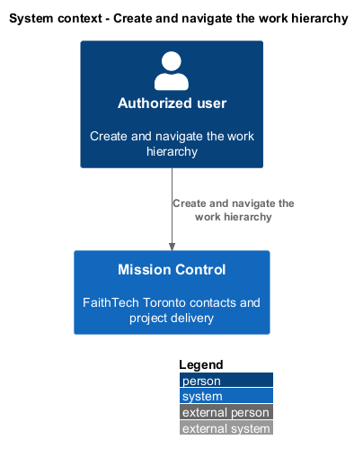
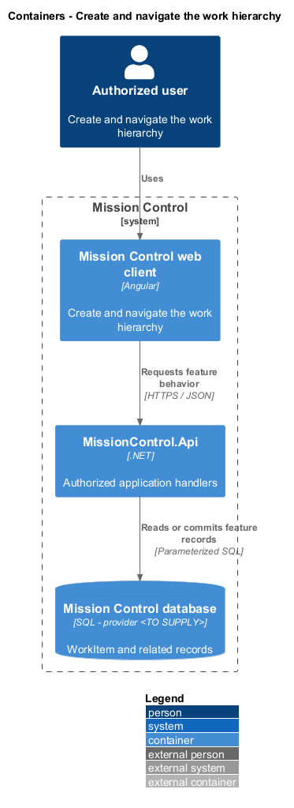
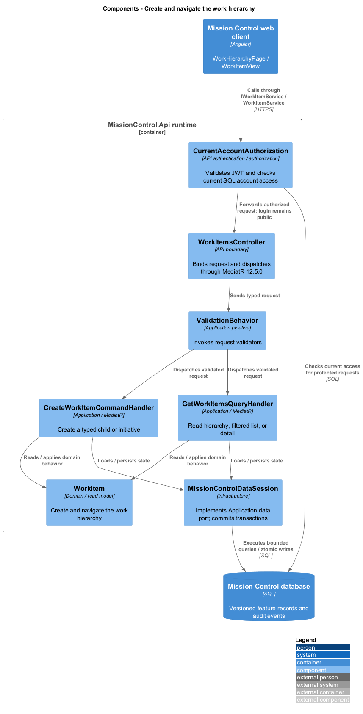
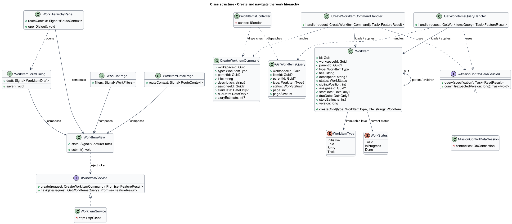
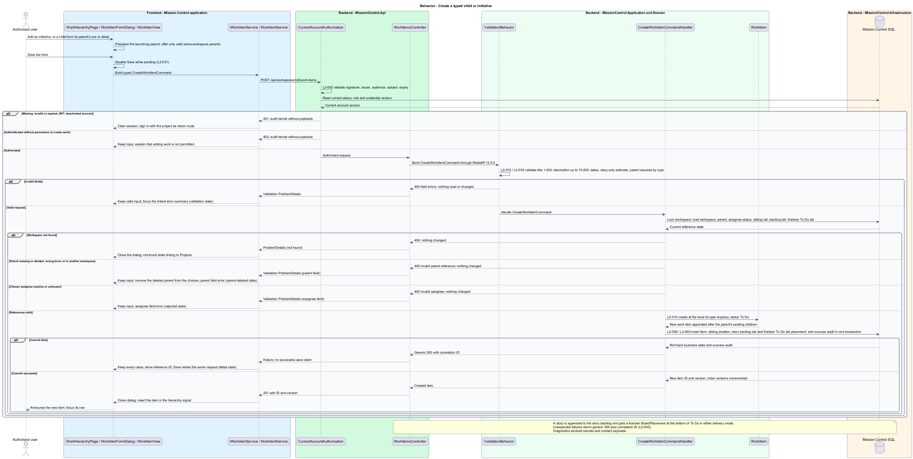
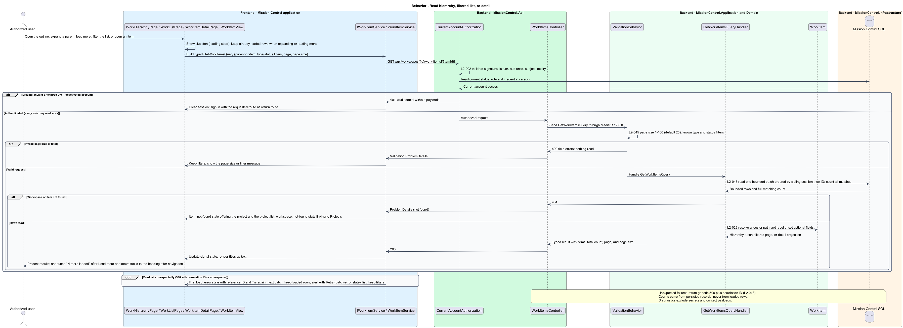

# Create and navigate the work hierarchy

## Overview

Project work follows four levels from broad purpose to executable steps.

- **Initiative** — top-level purpose in a workspace
- **Epic** — group of stories under one initiative
- **Story** — deliverable under one epic, shown as a board card
- **Task** — action under one story

Creating and navigating this hierarchy preserves the current workspace and parent path.

This design refines the [L2 baseline](../../../specs/L2.md) and its linked L1 scope. Proposed defaults retain their proposal status.

## Description

All named production types are proposed; the repository currently contains requirements and static mocks.

| Part | Responsibility and architectural home |
| --- | --- |
| `WorkHierarchyPage` | Routed page or dialog owned by `frontend/projects/mission-control`; composes the domain library and presentational components. |
| `WorkListPage`, `WorkItemDetailPage` | Routed pages in `frontend/projects/mission-control` for the filtered list and item detail; compose `WorkItemView`. |
| `WorkItemFormDialog` | Application dialog in `frontend/projects/mission-control` for adding and editing work; composes `WorkItemView`. |
| `WorkItemView` | Domain component in `frontend/projects/domain`; injects `WORK_ITEM_SERVICE` and holds feature state in signals. |
| `IWorkItemService`, `WORK_ITEM_SERVICE` | Interface and token in `frontend/projects/api/work-item.service.contract.ts`; the consumer imports the contract only. |
| `WorkItemService` | Production HTTP adapter in `api`; owns HTTP calls and observable-to-signal conversion. Composition binds a mock adapter for Chromium Playwright. |
| `WorkItemsController` | Thin controller under `backend/src/MissionControl.Api/Controllers`, namespace `MissionControl.Api.Controllers`; binds, dispatches, and returns. |
| `WorkItem` | Domain entity or Application read projection described below; Domain has no external project dependency. |
| `IMissionControlDataSession` | Application data port; the Infrastructure adapter runs parameterized queries and transaction commits. |

Commands, queries, handlers, and request validators live in Application feature folders. Each type has its own file; folders and namespaces agree.
MediatR remains pinned to `12.5.0`. Microsoft.Extensions supplies dependency injection, Options, and Configuration.

`WorkHierarchyPage`, `WorkListPage`, and `WorkItemDetailPage` own `/projects/:id/work`, `/projects/:id/work-list`, and `/projects/:id/work/:itemId`.
`WorkItemFormDialog` preselects the launching parent and offers only valid same-workspace candidates.
`CreateWorkItemCommand` includes type, workspace, parent, required 1–200-character title, and optional description up to 10,000 characters.
New items have To Do status and are appended after their parent's existing children; initiatives are appended after the workspace's initiatives.
Creating a story also appends it to the story backlog and inserts its Kanban `BoardPlacement` at the bottom of To Do in the same transaction, in either delivery mode.
Optional assignee/date/story-estimate fields use the edit-work validation rules. An inactive or unknown chosen assignee returns `400` with an assignee field error (`rejected` mock state).
Initiatives have no parent; epics reference initiatives, stories reference epics, and tasks reference stories.

A self-referencing SQL foreign key `(WorkspaceId, ParentId, RequiredParentType)` targets `(WorkspaceId, Id, Type)`.
A row check derives the required parent type from item type and restricts null parent to initiatives.
The combined constraints enforce parent type and same-workspace links under races; no cycle is possible through the fixed level progression.
Child creation and parent deletion take the same workspace transaction lock, so they are serialized.
A parent deleted first makes the create return `400` with a parent field error; the form keeps every value and drops that parent from its choices (`parent-deleted` mock state).
A child created first makes the parent deletion return `409` because children exist. Restrictive foreign keys back both checks, so no orphan can exist.
A missing workspace returns `404`, and the page shows a not-found state linking to Projects.
Details project ancestor links, status, assignee, optional unset labels, and bounded children. Parent paths are computed from stored links rather than duplicated in descendants.

Hierarchy children load on expansion in batches of at most 100, defaulting to 25. Full child counts come from persisted records.
Load more retains focus and announces the additional count; batch errors preserve loaded rows and offer retry.
Work-list type/status filters combine with AND and reset page one; summaries use those routes.
Breadcrumb middle levels fold into a reachable compact menu below `576px`. Toggle controls report expanded state.
Titles/descriptions render through Angular text binding; saved script or HTML text remains inert.
The work-detail mock shows a project-local key such as `HCK-112`; the key allocation policy is `<TO SUPPLY>` and is not an identity requirement.

The authenticated API evaluates current SQL permissions before feature dispatch. Validation V maps invalid fields to `400`, absent authentication to `401`, forbidden access to `403`, missing records to `404`, and conflicts to `409`.
Unexpected errors return a generic `500` with a correlation ID. Structured diagnostics exclude secrets and contact payloads.

Responsive profile R covers `320`, `375`, `576`, `768`, `992`, `1200`, and `1920` CSS-pixel widths at `800` pixels high.
Forms stack on compact screens; dialogs become sheets below `576px`. Templates, styles, and classes remain separate files.
Component styles read `var(--mc-<role>)` from the mirrored authoritative design-system tokens.
Keyboard actions include visible focus, named controls, modal focus containment, trigger focus restoration, and destination-heading focus after navigation.
Field errors connect to inputs; asynchronous results use status or alert announcements. Status text supplements color; primary touch targets measure at least `44×44` CSS pixels.

| Behavior | Proposed boundary | Request / handler |
| --- | --- | --- |
| Create a typed child or initiative | `POST /api/workspaces/{id}/work-items` | `CreateWorkItemCommand` / `CreateWorkItemCommandHandler` |
| Read hierarchy, filtered list, or detail | `GET /api/workspaces/{id}/work-items[/{itemId}]` | `GetWorkItemsQuery` / `GetWorkItemsQueryHandler` |

Mock input and review references:

- [Work hierarchy · Mission Control mock](../../../mocks/work/work-hierarchy.html); review states: `default`, `move-menu`, `collaborator`, `empty`, `large`, `batch-error`, `loading`, `error`.
- [Work list · Mission Control mock](../../../mocks/work/work-list.html); review states: `default`, `zero-results`, `loading`, `error`.
- [Work item detail · Mission Control mock](../../../mocks/work/work-item-detail.html); review states: `default`, `initiative`, `epic`, `task`, `unset`, `inactive-assignee`, `collaborator`, `not-found`, `loading`, `error`.
- [Add or edit work item · Mission Control mock](../../../mocks/work/work-item-form-dialog.html); review states: `create-initiative`, `create-epic`, `create-story`, `create-task`, `edit`, `edit-inactive-assignee`, `validation`, `rejected`, `parent-deleted`, `saving`, `failed`, `conflict`, `conflict-reloaded`.

Implementation proceeds one behavior at a time using the linked Given-When-Then criteria. An API integration acceptance check first fails for the expected missing behavior.
A Chromium Playwright check uses one page object per screen and a mock service bound through the same token. Tests express intent; page objects own selectors.
The smallest implementation turns those checks green before the next behavior begins. Relevant regression checks follow each slice; no architecture tests are introduced.

## Requirements

Requirement text and identifiers below are copied verbatim from L2, including the source use of `must`.

| L2 ID | Refines (L1) | Requirement |
| --- | --- | --- |
| `L2-015` | `L1-004` | Every work item must have an ID, type, workspace, required title (1–200 characters), optional description (up to 10,000 characters), status, and order. New items default to To Do. Initiatives have no parent; epics require an initiative, stories an epic, and tasks a story, within the same workspace. |
| `L2-029` | `L1-007` | Primary navigation must reach Home, Leads, and Projects, with account management visible only to administrators. Work details must expose their workspace and parent path. Direct routes must enforce authentication and handle missing records. |
| `L2-030` | `L1-008` | Every login/session, account-management, lead CRUD, workspace, hierarchy, backlog, board, sprint, home, and navigation workflow must satisfy responsive profile R. Compact layouts must stack form fields and summary cards and provide local board scrolling or a column selector. Larger layouts must use available space without overlapping controls. Vertical page scrolling is permitted. |
| `L2-032` | `L1-008` | Production views must use the application design tokens and consistent typography, spacing, focus, form, and status patterns. Loading, empty data, zero search results, and request errors must be distinguishable and offer relevant actions. Visual review is for application UX; design artifacts themselves remain exempt from automated tests. |
| `L2-033` | `L1-009` | Every application workflow must be operable by keyboard without required dragging. Focus must remain visible, follow a logical sequence, and be managed when dialogs open/close and routed content changes. |
| `L2-034` | `L1-009` | Application controls must expose programmatic names and roles. Inputs must have associated labels; field errors must identify their inputs. Pages must expose main/navigation regions and a coherent heading hierarchy. Asynchronous outcomes must be announced without relying only on visual changes. |
| `L2-037` | `L1-010` | The backend must independently enforce validation V, permission profile P, and record relationship rules. Data access must treat user text as data, and Angular must render user text without executing markup or scripts. CORS must permit only configured frontend origins. Public registration must not be exposed. |
| `L2-041` | `L1-011` | Edits must carry a record version or equivalent concurrency condition. SQL constraints must protect normalized account emails, lead email/category pairs, parent references, open sprint membership, and active sprint exclusivity. Caller errors must produce validation/conflict responses rather than generic failures. |
| `L2-045` | `L1-013` | Directories, workspace lists, backlogs, and history lists must default to 25 records per page and cap requested page size at 100. Invalid sizes must return 400. Results must include total matching count and stable ordering. Boards/hierarchies must load bounded batches of at most 100 and allow access to every matching item; counts must reflect the full dataset rather than just loaded records. |

## Diagrams

The context view identifies the actor and the Mission Control capability.

The container view separates the client, .NET API, and durable SQL records.

The component view locates request dispatch, domain behavior, and persistence within the feature.

The class view shows proposed typed requests, interface consumption, and relationships between the feature parts.

Create a typed child or initiative follows the sequence below. The flow traces its enforcing steps to `L2-015` and includes rejection or recovery paths.

Read hierarchy, filtered list, or detail follows the sequence below. The flow traces its enforcing steps to `L2-015` and includes rejection or recovery paths.

