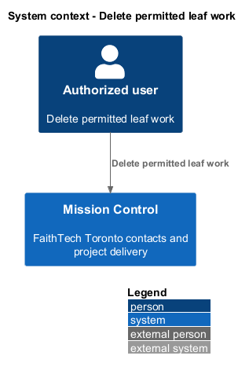
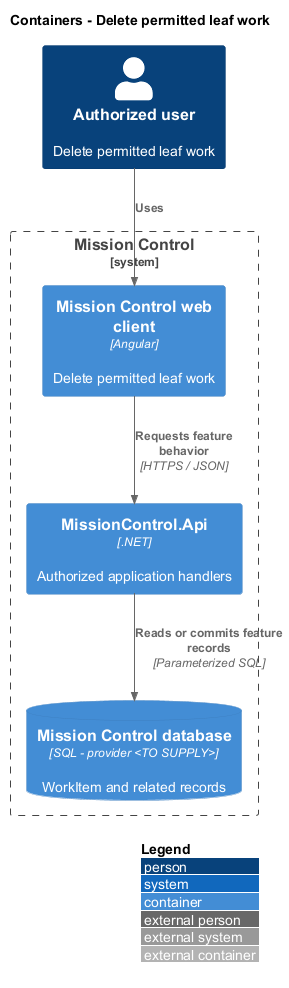
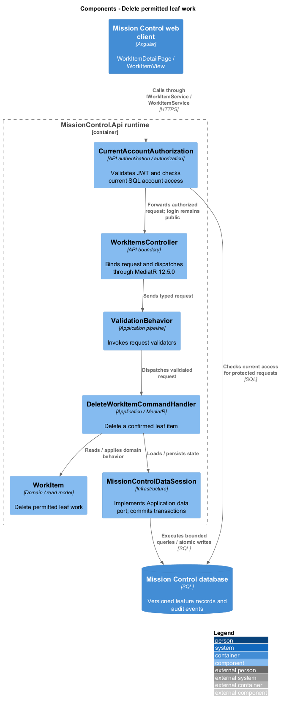
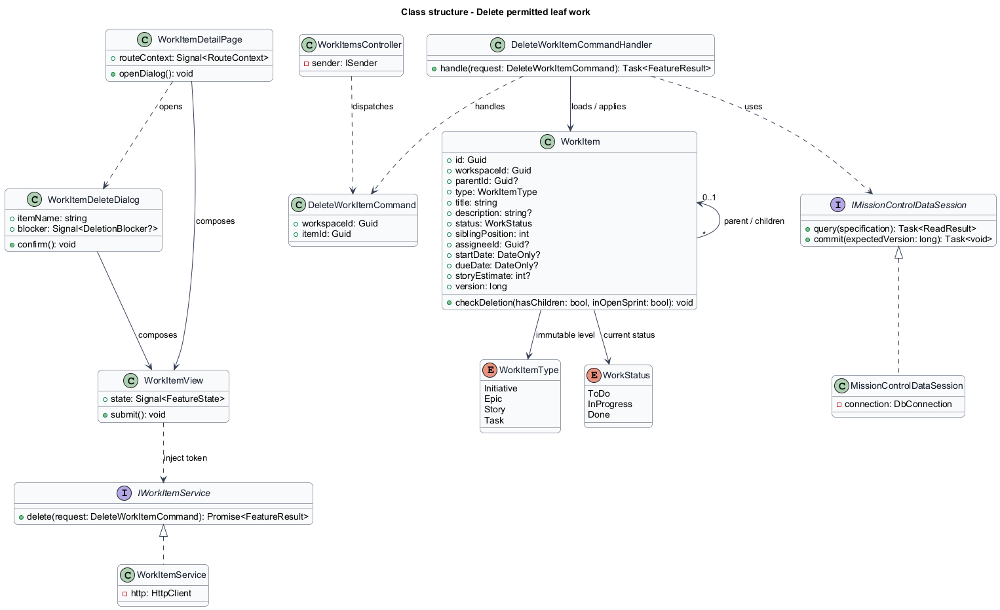
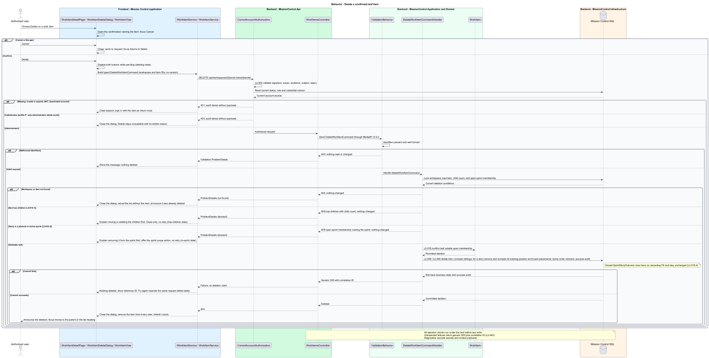

# Delete permitted leaf work

## Overview

Administrators remove work only when doing so preserves its children and recorded delivery outcomes.

- **Leaf item** — work item with no children
- **Open sprint** — planned or active sprint whose live story membership blocks deletion

Named confirmation and non-cascading persistence prevent accidental loss of related work.

This design refines the [L2 baseline](../../../specs/L2.md) and its linked L1 scope. Proposed defaults retain their proposal status.

## Description

All named production types are proposed; the repository currently contains requirements and static mocks.

| Part | Responsibility and architectural home |
| --- | --- |
| `WorkItemDetailPage` | Routed page or dialog owned by `frontend/projects/mission-control`; composes the domain library and presentational components. |
| `WorkItemDeleteDialog` | Application confirmation dialog in `frontend/projects/mission-control`, opened from the hierarchy and the detail page; composes `WorkItemView`. |
| `WorkItemView` | Domain component in `frontend/projects/domain`; injects `WORK_ITEM_SERVICE` and holds feature state in signals. |
| `IWorkItemService`, `WORK_ITEM_SERVICE` | Interface and token in `frontend/projects/api/work-item.service.contract.ts`; the consumer imports the contract only. |
| `WorkItemService` | Production HTTP adapter in `api`; owns HTTP calls and observable-to-signal conversion. Composition binds a mock adapter for Chromium Playwright. |
| `WorkItemsController` | Thin controller under `backend/src/MissionControl.Api/Controllers`, namespace `MissionControl.Api.Controllers`; binds, dispatches, and returns. |
| `WorkItem` | Domain entity or Application read projection described below; Domain has no external project dependency. |
| `IMissionControlDataSession` | Application data port; the Infrastructure adapter runs parameterized queries and transaction commits. |

Commands, queries, handlers, and request validators live in Application feature folders. Each type has its own file; folders and namespaces agree.
MediatR remains pinned to `12.5.0`. Microsoft.Extensions supplies dependency injection, Options, and Configuration.

`WorkItemDeleteDialog` names the item and initially focuses Cancel. It explains child and open-sprint blockers.
`DeleteWorkItemCommand` carries only the workspace and item IDs; a deletion carries no expected version.
`DeleteWorkItemCommandHandler` checks children and current open sprint membership inside the workspace transaction, before deleting anything.
An item with children returns `409` (`has-children` mock state). A story in a planned or active sprint returns `409` naming that sprint (`in-sprint` mock state).
Both explain the next step and offer no retry. A missing item returns `404`; the dialog closes, the list reloads without the item, and an announcement says it was already deleted.
Restrictive self-references and open-membership FKs protect races with child creation and sprint allocation.
Only a leaf outside open membership is deleted. Its sibling position is removed and the remaining siblings are compacted in the same transaction.
Deleting a story also removes its board placements and story backlog position and compacts both orders in that transaction; every affected order version increments.
Live views and totals refresh after commit. Closed `SprintStoryOutcome` rows keep independent recorded IDs/titles/statuses without a cascading FK to live work.
Later live deletion leaves snapshots intact; the history view suppresses missing destination/story links.
Collaborators see Delete unavailable with a written reason; direct requests receive `403`. Cancellation sends no deletion.

The authenticated API evaluates current SQL permissions before feature dispatch. Validation V maps invalid fields to `400`, absent authentication to `401`, forbidden access to `403`, missing records to `404`, and conflicts to `409`.
Unexpected errors return a generic `500` with a correlation ID. Structured diagnostics exclude secrets and contact payloads.

Responsive profile R covers `320`, `375`, `576`, `768`, `992`, `1200`, and `1920` CSS-pixel widths at `800` pixels high.
Forms stack on compact screens; dialogs become sheets below `576px`. Templates, styles, and classes remain separate files.
Component styles read `var(--mc-<role>)` from the mirrored authoritative design-system tokens.
Keyboard actions include visible focus, named controls, modal focus containment, trigger focus restoration, and destination-heading focus after navigation.
Field errors connect to inputs; asynchronous results use status or alert announcements. Status text supplements color; primary touch targets measure at least `44×44` CSS pixels.

| Behavior | Proposed boundary | Request / handler |
| --- | --- | --- |
| Delete a confirmed leaf item | `DELETE /api/workspaces/{id}/work-items/{itemId}` | `DeleteWorkItemCommand` / `DeleteWorkItemCommandHandler` |

Mock input and review references:

- [Delete work item · Mission Control mock](../../../mocks/work/work-item-delete-dialog.html); review states: `default`, `has-children`, `in-sprint`, `history`, `deleting`, `failed`.
- [Work item detail · Mission Control mock](../../../mocks/work/work-item-detail.html); review states: `default`, `initiative`, `epic`, `task`, `unset`, `inactive-assignee`, `collaborator`, `not-found`, `loading`, `error`.

Implementation proceeds one behavior at a time using the linked Given-When-Then criteria. An API integration acceptance check first fails for the expected missing behavior.
A Chromium Playwright check uses one page object per screen and a mock service bound through the same token. Tests express intent; page objects own selectors.
The smallest implementation turns those checks green before the next behavior begins. Relevant regression checks follow each slice; no architecture tests are introduced.

## Requirements

Requirement text and identifiers below are copied verbatim from L2, including the source use of `must`.

| L2 ID | Refines (L1) | Requirement |
| --- | --- | --- |
| `L2-018` | `L1-004` | Only administrators must delete work, after confirmation naming the item. Deletion must be blocked while children exist or a story belongs to a planned or active sprint. Closed sprint history must survive a later permitted deletion. |
| `L2-031` | `L1-008` | Forms must expose field-specific validation, retain input on rejected saves, prevent duplicate submission while pending, display results, and confirm leaving with unsaved edits. Destructive confirmations must name the affected item. |
| `L2-039` | `L1-010` | The system must record UTC timestamp, actor ID when known, operation, entity type/ ID, outcome, and correlation ID for account/permission changes, contact/workspace/ work mutations, board/sprint mutations, successful login, denied access, and throttling. Audit data must exclude secrets and contact payloads. Only administrators must access audit records; audit mutation endpoints must be absent. |
| `L2-040` | `L1-011` | Committed account, contact, hierarchy, ordering, board, and sprint changes must survive restart. Operations spanning multiple records must commit entirely or leave all affected business records unchanged. |
| `L2-041` | `L1-011` | Edits must carry a record version or equivalent concurrency condition. SQL constraints must protect normalized account emails, lead email/category pairs, parent references, open sprint membership, and active sprint exclusivity. Caller errors must produce validation/conflict responses rather than generic failures. |

## Diagrams

The context view identifies the actor and the Mission Control capability.

The container view separates the client, .NET API, and durable SQL records.

The component view locates request dispatch, domain behavior, and persistence within the feature.

The class view shows proposed typed requests, interface consumption, and relationships between the feature parts.

Delete a confirmed leaf item follows the sequence below. The flow traces its enforcing steps to `L2-018` and includes rejection or recovery paths.

