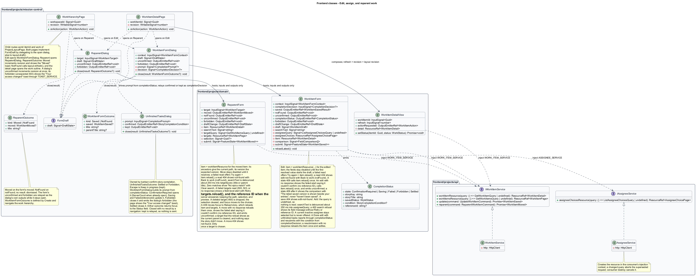
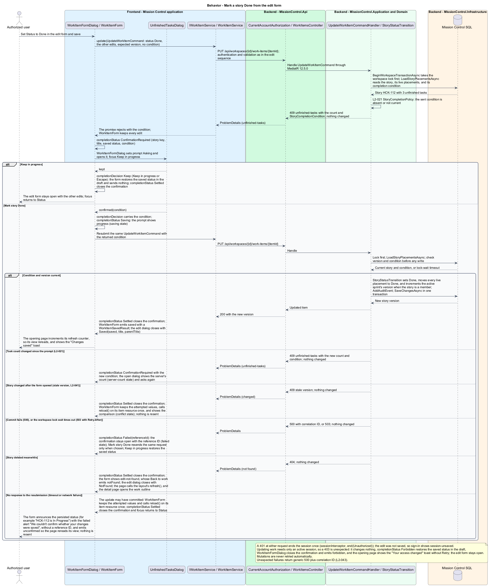
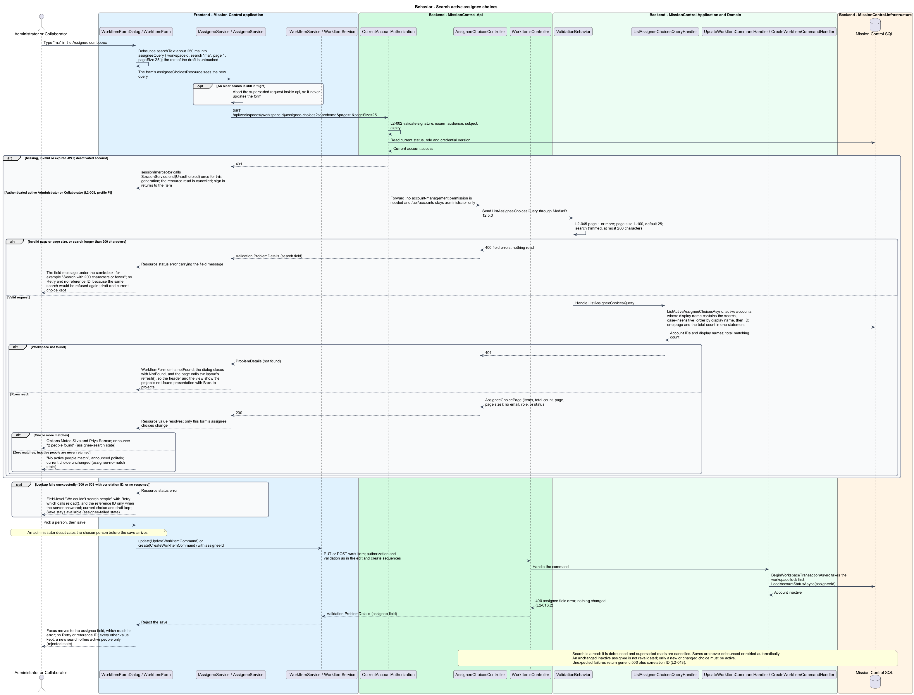

# Edit, assign, and reparent work

## Overview

Authorized users update work details and move work under a different valid parent.

- **Reparenting** — change of an item's parent within the same workspace and hierarchy level
- **Assignee choice** — active application account offered for assignment, identified by ID and display name only

Reparenting preserves the item and descendant IDs and each story's sprint membership. Assignment uses application accounts, independently of lead responsibilities.

This design refines the [L2 baseline](../../../specs/L2.md) and its linked L1 scope. Proposed defaults retain their proposal status.

## Description

The [shared design rules](../../README.md#shared-design-rules) apply: proposed type status, Application placement and MediatR `12.5.0`, authentication and validation V, responsive profile R and accessibility, token styling, data ownership and session handling, and incremental ATDD. This page records feature-specific behavior and exceptions only.

| Part | Responsibility and architectural home |
| --- | --- |
| `WorkItemDetailPage`, `WorkHierarchyPage` | Routed pages in `frontend/projects/mission-control`, the `work/:itemId` and `work` child routes of `ProjectLayoutPage`, that open `WorkItemFormDialog` (edit) and `ReparentDialog` from their views' `actionRequested` output (Edit or Reparent with the item's `WorkItemTarget`) and implement `FormDraft`: their routes keep `canDeactivate: UnsavedChangesGuard`, and their `draft` delegates to the open dialog, else falls back to the layout's open dialog (`inject(ProjectLayoutPage).draft()`), so leaving the project asks once. They react to `WorkItemFormOutcome` as [Create and navigate the work hierarchy](../create-and-navigate-work/README.md#description) defines, and to `ReparentOutcome` with: `Moved`, their `refresh` counter and the "Moved" toast through `TOAST_SERVICE` naming the item and its new parent; `NotFound`, the layout's `refresh()`, after which `WorkItemDetailPage` opens the work outline. A dialog's `unconfirmed` increments the counter at once, and its `forbidden` shows the "Your access changed" toast. |
| `WorkItemFormDialog` | Application dialog hosting `WorkItemForm`; passes the edited item's `WorkItemFormContext` to the form's `context` input, implements `FormDraft` from its `draftChange`, and closes through `close(result: WorkItemFormOutcome?)` as [Create and navigate the work hierarchy](../create-and-navigate-work/README.md#description) defines. It drives `UnfinishedTasksDialog`'s `prompt` from the form's `completionStatus` output, returns that dialog's `confirmed(condition)` or `kept` choice through the form's `completionDecision` input, relays `kept` the same way when a navigation closes that dialog with no result, so the form drops its pending Done change without a request, and moves focus back to the Status field when that dialog closes with `Settled` or `Forbidden`. It relays the form's `unconfirmed` and `forbidden`, or a completion `Forbidden`, as its own outputs and stays open with the draft. |
| `ReparentDialog` | Application dialog hosting `ReparentForm` with the item's `WorkItemTarget`; implements `FormDraft` from its `draftChange`, opens `UnsavedChangesDialog` when Cancel, Close, or Escape meets a chosen target, and closes through `close(result: ReparentOutcome?)`: `Moved(moved, title)` on the form's `moved`, `NotFound` on `notFound`, and no result when dismissed. It relays the form's `unconfirmed` and `forbidden` as its own outputs and stays open. |
| `UnfinishedTasksDialog` | Application dialog in `frontend/projects/mission-control`, owned by the kanban confirm-story-completion slice and reused here for direct story status edits; shows the count from its `prompt` input, emits `confirmed(condition)` or `kept` (Escape is Keep in progress), and closes through `close(result: UnfinishedTasksOutcome?)` with `Settled` or `Forbidden`. |
| `WorkItemForm` | Domain component in `frontend/projects/domain`; injects `WORK_ITEM_SERVICE` and `ASSIGNEE_SERVICE`; owns the draft, the edited item's `workItemResource`, the assignee choices resource, conflict comparison, and submit state in signals; emits `saved`, `notFound`, `unconfirmed`, `completionStatus`, `forbidden`, and `draftChange`. |
| `ReparentForm` | Domain component; injects `WORK_ITEM_SERVICE`; owns the item's `workItemResource` (current path and version), the search text, the target `workItemsResource` and its failure, selection, path preview, and submit state; emits `moved`, `notFound`, `unconfirmed`, `forbidden`, and `draftChange`. |
| `WorkItemDetailView` | Domain component defined by [Create and navigate the work hierarchy](../create-and-navigate-work/README.md#description); renders the current assignee and the item actions, and sends status-only updates from its status control and task rows. |
| `IWorkItemService`, `WORK_ITEM_SERVICE` | Contract and token in `frontend/projects/api/work-item.service.contract.ts`; read members return a caller-owned `ResourceRef<T>`, mutation members a `Promise<TResult>`. |
| `WorkItemService` | HTTP adapter in `api`; creates each resource in the consumer's injection context, converts observables to signals or promises, aborts a superseded read when the query signal changes, and cancels reads on consumer destroy; no shared mutable state. |
| `IAssigneeService`, `ASSIGNEE_SERVICE` | Contract and token in `frontend/projects/api/assignee.service.contract.ts`; `assigneeChoicesResource(query)` returns a caller-owned `ResourceRef<AssigneeChoicePage>`. |
| `AssigneeService` | HTTP adapter in `api`; each consumer's resource aborts the superseded request when its query signal changes and cancels on destroy; no shared mutable state. |
| `WorkItemsController`, `AssigneeChoicesController` | Thin controllers in `MissionControl.Api.Controllers`; bind, dispatch, and return. |
| `ListAssigneeChoicesQuery`, `ListAssigneeChoicesQueryHandler` | Application work-slice query and handler; project active accounts to `AssigneeChoice` (account ID and display name). |
| `WorkItem` | Domain entity; assignment references a `UserAccount` ID, never a lead contact. |
| `StoryStatusTransition` | Shared Application service defined by [Confirm story completion](../../kanban/confirm-story-completion/README.md#description) and also used by board moves and the completion endpoint; `UpdateWorkItemCommandHandler` makes every story status change through it. |
| `IMissionControlDataSession` | Application data port defined in the [overview](../../README.md#data-access-and-security-ports); this slice uses `BeginWorkspaceTransactionAsync`, `LoadWorkItemAsync`, `LoadStoryPlacementsAsync`, `LoadAccountStatusAsync`, `LoadSiblingOrderAsync`, `ListActiveAssigneeChoicesAsync`, `AddAuditEvent`, and `SaveChangesAsync`. |

`ListAssigneeChoicesQuery { workspaceId, search?, page, pageSize }` serves `GET /api/workspaces/{workspaceId}/assignee-choices`.
Every authenticated active account may read it, so Collaborators can assign work under profile P. The account management endpoints under `/api/accounts` stay administrator-only.
The handler returns only active accounts, as `AssigneeChoice` rows of account ID and display name (first and last name); no email, role, or status leaves the API.
Search is a trimmed, case-insensitive display-name substring of at most 200 characters; that limit is a design proposal, because L2 sets none, and is listed among the overview's [retained decisions](../../README.md#retained-decisions-and-gaps). Rows order by display name, then ID, and page per L2-045: default 25, maximum 100, with the total matching count in the same statement.
An invalid page or page size, or a search longer than 200 characters, returns `400` with a field message; a missing workspace returns `404`, and the form emits `notFound`, so the dialog closes with `NotFound` and the layout's `refresh()` shows the project's not-found presentation.

The assignee field is a searchable combobox, the same pattern as the project form's lead picker.
`WorkItemForm` debounces its typed search text by about 250 ms into the query signal of its `assigneeChoicesResource`; the query stays undefined, and nothing is read, until the person types.
When the query signal changes, `AssigneeService` aborts the superseded request inside `api`, and closing the form cancels any read in flight.
Matches appear as options with an announced count (`assignee-search` mock state). Zero matches show "No active people match" (`assignee-no-match`).
A `400` search refusal shows its field message under the combobox, with no Retry or reference ID, because repeating the same search would be refused again; the current choice and the draft stay intact.
A failed lookup (`500`, `503`, or no response) shows a field-level message with Retry, which calls the resource's `reload()`, and the reference ID when the server answered (`500` or `503`); the current choice and the rest of the draft stay intact, and Save remains available (`assignee-failed`).
Clearing the field sends an explicit null. Picking a person is never debounced into a save; mutations are never debounced or retried automatically.

`UpdateWorkItemCommand` accepts title, description, status, nullable active-user assignee, dates, story estimate, and the expected item version.
Clearing an optional field sends explicit null; absent edit fields are not mistaken for a requested clear, so an absent field stays unchanged.
The validator checks what the command alone decides: title measures 1–200 and description at most 10,000 characters, the status is known, dates are calendar values rather than UTC instants, and an estimate is a whole number of 0 or more.
The command carries no item type and may leave a date absent, so `UpdateWorkItemCommandHandler` makes the other two checks after the item loads, before anything changes: only stories accept an estimate, and the due date cannot precede the start date when both exist after merging the sent dates with the saved ones.
Either refusal returns `400` with a field error on the estimate or the due date and changes nothing; the form keeps every value and moves focus to that field, which reads its error, with no Retry or reference ID.
The detail's status control and task-row status selects send the command with only the status and the item's version; [Create and navigate](../create-and-navigate-work/README.md#description) defines their outcomes.
For Edit, `WorkItemForm` reads the item through its `workItemResource`; the draft starts from the first resolved value, and the fields stay disabled until it arrives; a failed read keeps them disabled and offers Try again (`reload()`), with the reference ID when the server answered (`edit-loading` and `edit-load-failed` mock states).
A read `404`, for an item deleted after the page loaded, keeps the fields and Save disabled and says the item no longer exists, with Back to work and no reference ID or Try again (`edit-not-found`); Back to work emits `notFound`, the dialog closes with `NotFound`, and the outline rereads, or the detail page opens it. For Add the query is `undefined`, so nothing is read.
`WorkItemForm` emits `draftChange` whenever its draft or pending save changes: `dirty` once a value differs from the opened values, `pending` while a save is in flight, and a `summary` naming the edited item.
Work item detail and edit data include the current assignee as ID, display name, and active flag.
The edit form keeps a current inactive assignee selected and labelled inactive (`edit-inactive-assignee` mock state); the lookup never offers an inactive person.
An unchanged inactive assignment is preserved on unrelated edits.
A newly chosen or changed assignee is revalidated as active inside the transaction through `LoadAccountStatusAsync`. A person deactivated after selection, or an unknown ID, returns `400` with an assignee field error; nothing is saved, the draft is kept, and focus moves to the assignee field, which reads its error (`rejected` mock state).
A save `404` shows the same not-found presentation (`edit-not-found`), whose Back to work emits `notFound`.
A `500`, or a `503` lock-wait timeout, keeps every value and shows the alert with the reference ID, "We couldn't save this story" for an edit; focus stays on Save, which resends only when chosen (`failed`).
On a stale-version `409` the form keeps the attempted values and calls `reload()` on its item resource once to read the latest version (no resubmission); Reload latest adopts the reloaded values and version while the comparison stays visible.
Save gives way to Reload latest in the `conflict` state, so focus moves to Reload latest; after the reload, focus moves to the title field (`conflict-reloaded`).
The comparison lists each field whose attempted and latest values differ (`conflict` and `conflict-reloaded` mock states).
`SaveChangesAsync` also compares the tracked expected version; its `ConcurrencyConflictException` maps to the same `409`.
An edit that gets no response may have committed, so the form never says nothing was saved: it keeps the attempted values, shows the `failed` alert titled "We couldn't confirm whether your changes were saved", without a reference ID, and calls `reload()` on its item resource once.
It emits `unconfirmed`, which the dialog relays, so the opening page rereads its view at once. Save sends again only when pressed; if the first save went through, that Save meets the stale-version `409` and its comparison, so nothing is applied twice.
Because the earlier save may have applied those edits, the comparison after it never says "Your edits haven't been saved": its alert reads "The latest saved version is shown beside your entries. Compare them, then reload it and re-apply what you need."

`ReparentDialog` shows the current parent, searchable valid targets, and destination path preview.
`ReparentForm` reads the item on open through its `workItemResource`: the current path comes from its ancestor links, and the expected version from its version.
Move stays disabled until the item resolves, with focus on Cancel; it then moves to the search field (`loading`). A failed read shows the alert with Try again (`reload()`), Cancel, and the reference ID when the server answered, and focus moves to Try again (`load-failed`).
A read `404` says the item no longer exists, with Back to work and no reference ID or Try again (`not-found`); Back to work emits `notFound`, the dialog closes with `NotFound`, and the outline rereads, or the detail page opens it.
`ReparentForm` reads targets through a `workItemsResource` whose `GetWorkItemsQuery` is filtered to the required parent type and its debounced search text, which matches a target's title or its parent's title, in bounded pages. Each target shows its own parent's title and child count from `WorkItemSummary`.
A failed target read (`500`, `503`, or no response) shows a field-level message under the search with Retry, which calls the targets resource's `reload()`, and the reference ID when the server answered; the current path, any chosen target, and its path preview stay, so Move remains available (`targets-failed` mock state).
A status region under the search announces the match count from the result's total. Zero matches show "No epics match" with the typed text and Clear search, and Move stays unavailable until a target is chosen (`no-match` mock state).
`ReparentWorkItemCommandHandler` changes only the item's parent link and appends its sibling position under the target.
Descendant paths derive from links; no descendant ID or sprint membership is rewritten.
Type and workspace are immutable. Initiatives have no reparent action.
Under the workspace transaction lock the handler loads the source and target sibling orders through `LoadSiblingOrderAsync` as tracked aggregates, compacts the source siblings, appends to the target's children, and increments both sibling-order versions.
Reparenting a task also increments the task revision of both its old and its new story in the same transaction, and changes neither story's version nor any sprint's version.
The target position is always the end, so the command carries only the expected item version.
A target that is missing or deleted after selection, of the wrong level, the current parent, or in another workspace returns `400` with a target field error, with no Retry or reference ID (`rejected` mock state).
The form drops a deleted target from the choices and clears the selection, so no stale choice stays checked, and focus moves to the target choices, which read the error.
A stale item version returns `409` and makes Move unavailable, so focus moves to Reload story (`conflict` mock state); Reload story calls `reload()` on the item and target resources, reading the current parent, version, and valid targets without resending.
`ReparentForm` emits `draftChange`: `dirty` once a target is chosen, `pending` while the move is in flight, and a `summary` naming the item.
A move `404` shows the same not-found presentation (`not-found`), whose Back to work emits `notFound`. In every rejection the old hierarchy stays intact.
A move that gets no response may have committed: the form keeps the chosen target, calls `reload()` on the item and target resources once, as Reload story does, so the current path shows whether the item moved, and shows the `failed` alert titled "We couldn't confirm whether the story moved", without a reference ID. It emits `unconfirmed`, which the dialog relays, so the opening page rereads its view at once; Move sends again only when pressed.
When the reread shows the item already under the chosen target, that target is now its current parent, which can't be chosen, so the selection clears and Move stays unavailable; the alert names the current parent and never says nothing moved.

Both handlers call `BeginWorkspaceTransactionAsync` first; it takes the workspace lock, held only until the change commits or rolls back.
A lock-wait timeout returns `503` with `Retry-After` and changes nothing; the dialog treats it like a `500`, as an unavailable save that keeps the input and shows the reference ID (`failed` mock state), and only an explicit Save or Move resends.
Editing and reparenting need only an active session (profile P), so a `403` is unexpected; it still triggers the capability refresh, changes nothing, and keeps the form's values or the chosen target.
The form emits `forbidden`, its dialog relays it and stays open, and the opening page shows the "Your access changed" toast through `TOAST_SERVICE`, without Retry or a reference ID.
After a committed edit or move the opening page increments its `refresh` counter: the outline rereads every expanded branch, including the source and target parents, and the detail rereads itself and its path.

`UpdateWorkItemCommandHandler` makes a story status change through `StoryStatusTransition`, which applies `StoryCompletionPolicy` before a Done transition, as board moves and completion do.
For a story status change it loads the story through `LoadStoryPlacementsAsync`: the story, its live placements, and its completion condition. Other edits load the item through `LoadWorkItemAsync`.
A story edit to Done while tasks are unfinished returns `409` with category `unfinished-tasks`, the current unfinished count, and a `StoryCompletionCondition`.
`WorkItemForm` keeps the edit and reports each Done attempt through `completionStatus` (story key, title, and saved status, the condition, and a reference ID when failed), as the detail view and boards do.
It emits `ConfirmationRequired(condition)` when the `409` arrives, `Saving` while a resubmission runs, `Failed(referenceId)` when the resubmission returns `500` or `503`, `Forbidden` when it returns an unexpected `403`, and `Settled` when the attempt ends.
`WorkItemFormDialog` drives `UnfinishedTasksDialog`'s `prompt` from it: ConfirmationRequired opens the dialog, or shows the new count when it is already open; Saving shows progress; Failed keeps it open with the reference ID, and Mark story Done retries; Forbidden closes it, the form restores the saved status in the draft and keeps the other edits, and the dialog emits `forbidden` so the opening page shows the "Your access changed" toast; Settled closes it.
Mark story Done passes the returned condition back through `completionDecision`, and the form resubmits the same `UpdateWorkItemCommand` with it. Success settles, emits `saved`, and closes both dialogs.
Keep in progress restores the saved status in the draft, sends nothing, and settles; the edit form stays open with the other edits.
A changed count returns a new `409` and asks again. A stale-version `409` to the resubmission settles, which closes the confirmation, and the form shows the conflict comparison as for any stale save. The shared completion slice describes these races in detail.
A resubmission that gets no response may have committed: the form calls `reload()` on its item resource once, `completionStatus` reports `Settled`, which closes the confirmation and returns focus to the Status field, and the form announces the persisted status (for example "HCK-112 is In Progress") with the couldn't-confirm alert above and emits `unconfirmed`; nothing is resent.
A story status change moves the story's live board placements to the new status column in the same transaction.
When the story belongs to the active sprint, the same transaction increments that sprint's version, as the [closure revision matrix](../../scrum/close-sprint/README.md#description) lists; other field edits leave it unchanged.
A task status edit increments its parent story's task revision in the same transaction, and changes neither the story's version nor a sprint's version, so a pending Done confirmation for that story is asked again through the `unfinished-tasks` `409` rather than a stale-version one ([Confirm story completion](../../kanban/confirm-story-completion/README.md#description)).

| Behavior | Proposed boundary | Request / handler |
| --- | --- | --- |
| Edit fields, assignment, dates, and status | `PUT /api/workspaces/{id}/work-items/{itemId}` | `UpdateWorkItemCommand` / `UpdateWorkItemCommandHandler` |
| Search active assignee choices | `GET /api/workspaces/{workspaceId}/assignee-choices` | `ListAssigneeChoicesQuery` / `ListAssigneeChoicesQueryHandler` |
| Move item to another valid parent | `PUT /api/workspaces/{id}/work-items/{itemId}/parent` | `ReparentWorkItemCommand` / `ReparentWorkItemCommandHandler` |

Mock input and review references:

- [Add or edit work item · Mission Control mock](../../../mocks/work/work-item-form-dialog.html); review states: `create-initiative`, `create-epic`, `create-story`, `parent-search`, `parent-no-match`, `parent-failed`, `create-task`, `edit-loading`, `edit-load-failed`, `edit-not-found`, `edit`, `edit-inactive-assignee`, `assignee-search`, `assignee-no-match`, `assignee-failed`, `validation`, `rejected`, `parent-deleted`, `saving`, `failed`, `conflict`, `conflict-reloaded`.
- [Move to another parent · Mission Control mock](../../../mocks/work/reparent-dialog.html); review states: `default`, `loading`, `load-failed`, `not-found`, `no-match`, `targets-failed`, `rejected`, `conflict`, `saving`, `failed`.
- [Work item detail · Mission Control mock](../../../mocks/work/work-item-detail.html); review states: `default`, `status-failed`, `initiative`, `epic`, `task`, `unset`, `inactive-assignee`, `collaborator`, `not-found`, `loading`, `error`.
- [Unfinished tasks confirmation · Mission Control mock](../../../mocks/kanban/unfinished-tasks-dialog.html); review states: `default`, `server-count`, `saving`, `failed`.

## Requirements

Requirement text and identifiers below are copied verbatim from L2, including the source use of `must`.

| L2 ID | Refines (L1) | Requirement |
| --- | --- | --- |
| `L2-005` | `L1-001` | The API and UI must apply permission profile P. Lead category or contact creation must not create a login or change a user's authorization. |
| `L2-015` | `L1-004` | Every work item must have an ID, type, workspace, required title (1–200 characters), optional description (up to 10,000 characters), status, and order. New items default to To Do. Initiatives have no parent; epics require an initiative, stories an epic, and tasks a story, within the same workspace. |
| `L2-016` | `L1-004` | Permitted users must edit item title, description, status, optional active-user assignee, optional start/due dates, and optional nonnegative integer story estimate. Due date must not precede start date when both exist. Reparenting must preserve item identity and valid same-workspace links and append the item after the target parent's existing children. Item type and workspace must not change. Estimates are accepted only for stories. |
| `L2-021` | `L1-005` | Marking a story Done while it contains unfinished tasks must require an explicit confirmation showing the unfinished count. Confirmation must not silently mark tasks Done. The rule applies to Kanban, Scrum, and direct story status edits. |
| `L2-031` | `L1-008` | Forms must expose field-specific validation, retain input on rejected saves, prevent duplicate submission while pending, display results, and confirm leaving with unsaved edits. Destructive confirmations must name the affected item. |
| `L2-039` | `L1-010` | The system must record UTC timestamp, actor ID when known, operation, entity type/ ID, outcome, and correlation ID for account/permission changes, contact/workspace/ work mutations, board/sprint mutations, successful login, denied access, and throttling. Audit data must exclude secrets and contact payloads. Only administrators must access audit records; audit mutation endpoints must be absent. |
| `L2-040` | `L1-011` | Committed account, contact, hierarchy, ordering, board, and sprint changes must survive restart. Operations spanning multiple records must commit entirely or leave all affected business records unchanged. |
| `L2-041` | `L1-011` | Edits must carry a record version or equivalent concurrency condition. SQL constraints must protect normalized account emails, lead email/category pairs, parent references, open sprint membership, and active sprint exclusivity. Caller errors must produce validation/conflict responses rather than generic failures. |
| `L2-045` | `L1-013` | Directories, workspace lists, backlogs, and history lists must default to 25 records per page and cap requested page size at 100. Invalid sizes must return 400. Results must include total matching count and stable ordering. Boards/hierarchies must load bounded batches of at most 100 and allow access to every matching item; counts must reflect the full dataset rather than just loaded records. |

## Diagrams

The context view identifies the actor and the Mission Control capability.

The container view separates the client, .NET API, and durable SQL records.

The component view locates request dispatch, domain behavior, and persistence within the feature.

The frontend class view shows the dialogs, the domain forms that own drafts and request state, and the work-item and assignee contracts.

The backend class view shows the typed commands, the assignee-choice query and projection, and the data-session members this feature uses.

Edit fields, assignment, dates, and status follows the sequence below. The flow traces its enforcing steps to `L2-016` and includes rejection or recovery paths.

Marking a story Done from the edit form while tasks are unfinished follows the sequence below, from the first `409` through confirmation, resubmission, and its failure and stale-version outcomes. The flow traces its enforcing steps to `L2-021`.

Search active assignee choices follows the sequence below. The flow traces its enforcing steps to `L2-016` and `L2-045`, including no matches, a refused search, a failed lookup, and a person deactivated after selection.

Move item to another valid parent follows the sequence below. The flow traces its enforcing steps to `L2-016` and includes rejection or recovery paths.

