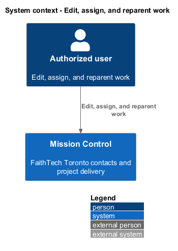
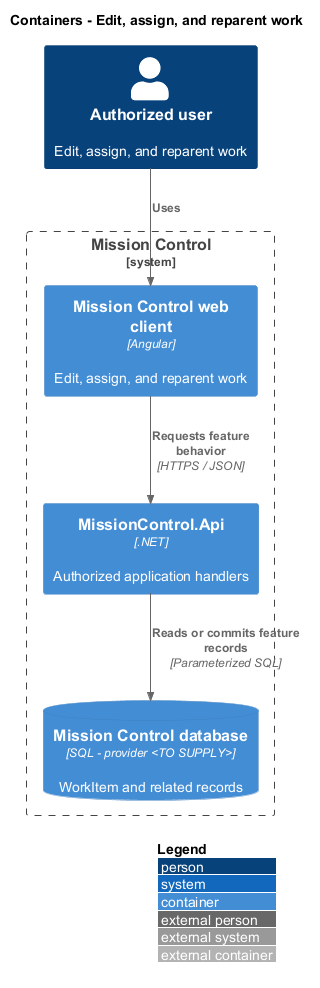
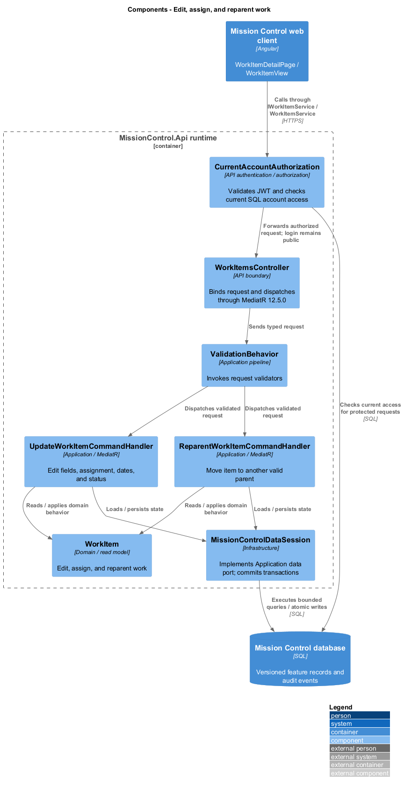
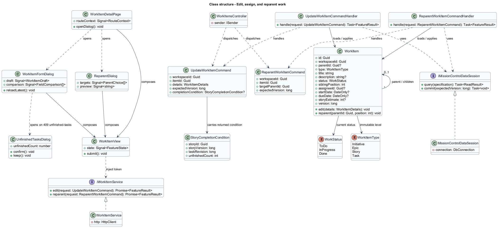
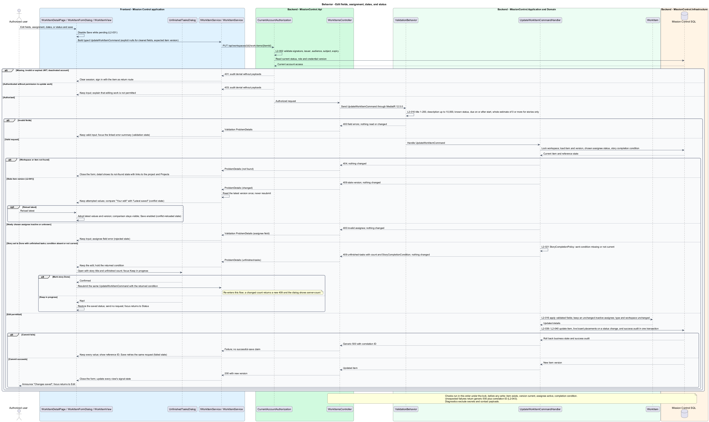
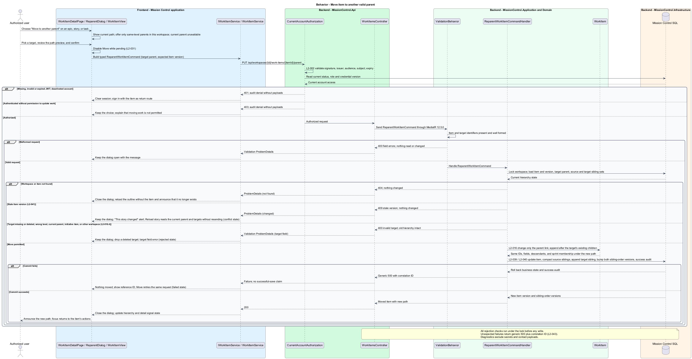

# Edit, assign, and reparent work

## Overview

Authorized users update work details and move work under a different valid parent.

- **Reparenting** — change of an item's parent within the same workspace and hierarchy level

Reparenting preserves the item and descendant IDs and each story's sprint membership. Assignment uses application accounts, independently of lead responsibilities.

This design refines the [L2 baseline](../../../specs/L2.md) and its linked L1 scope. Proposed defaults retain their proposal status.

## Description

All named production types are proposed; the repository currently contains requirements and static mocks.

| Part | Responsibility and architectural home |
| --- | --- |
| `WorkItemDetailPage` | Routed page or dialog owned by `frontend/projects/mission-control`; composes the domain library and presentational components. |
| `WorkItemFormDialog`, `ReparentDialog` | Application dialogs in `frontend/projects/mission-control`, opened from the hierarchy and the detail page; compose `WorkItemView`. |
| `UnfinishedTasksDialog` | Application dialog in `frontend/projects/mission-control`, owned by the kanban confirm-story-completion slice and reused here for direct story status edits. |
| `WorkItemView` | Domain component in `frontend/projects/domain`; injects `WORK_ITEM_SERVICE` and holds feature state in signals. |
| `IWorkItemService`, `WORK_ITEM_SERVICE` | Interface and token in `frontend/projects/api/work-item.service.contract.ts`; the consumer imports the contract only. |
| `WorkItemService` | Production HTTP adapter in `api`; owns HTTP calls and observable-to-signal conversion. Composition binds a mock adapter for Chromium Playwright. |
| `WorkItemsController` | Thin controller under `backend/src/MissionControl.Api/Controllers`, namespace `MissionControl.Api.Controllers`; binds, dispatches, and returns. |
| `WorkItem` | Domain entity or Application read projection described below; Domain has no external project dependency. |
| `IMissionControlDataSession` | Application data port; the Infrastructure adapter runs parameterized queries and transaction commits. |

Commands, queries, handlers, and request validators live in Application feature folders. Each type has its own file; folders and namespaces agree.
MediatR remains pinned to `12.5.0`. Microsoft.Extensions supplies dependency injection, Options, and Configuration.

`UpdateWorkItemCommand` accepts title, description, status, nullable active-user assignee, dates, story estimate, and the expected item version.
Title measures 1–200 and description at most 10,000 characters. Due date cannot precede start when both exist.
Dates are calendar values, not UTC instants. Only stories accept a nonnegative integer estimate.
Clearing an optional field sends explicit null; absent edit fields are not mistaken for a requested clear.
Existing inactive assignees remain readable. The edit form keeps a current inactive assignee selected and labelled inactive (`edit-inactive-assignee` mock state).
An unchanged inactive assignment is preserved on unrelated edits; inactive people are never offered as new choices.
A newly selected or changed assignee is revalidated as active inside the transaction; an inactive or unknown choice returns `400` with an assignee field error.
A missing item returns `404`; the form closes and the detail page shows its not-found state.
On a stale-version `409` the form keeps the attempted values and reads the latest version once (no resubmission); Reload latest adopts the latest values and version while the comparison stays visible.
The comparison lists each field whose attempted and latest values differ (`conflict` and `conflict-reloaded` mock states).

`ReparentDialog` shows the current parent, searchable valid targets, and destination path preview.
`ReparentWorkItemCommandHandler` changes only the item's parent link and appends its sibling position under the target.
Descendant paths derive from links; no descendant ID or sprint membership is rewritten.
Type and workspace are immutable. Initiatives have no reparent action.
Under the workspace transaction lock the handler compacts the source siblings, appends to the target's children, and increments both sibling-order versions.
The target position is always the end, so the command carries only the expected item version.
A target that is missing or deleted after selection, of the wrong level, the current parent, or in another workspace returns `400` with a target field error (`rejected` mock state).
A stale item version returns `409` (`conflict` mock state); Reload story reads the current parent and valid targets without resending.
A missing item returns `404`; the dialog closes and the outline reloads without it. In every rejection the old hierarchy stays intact.

Direct story status changes use `StoryCompletionPolicy`, also used by board moves.
A story edit to Done while tasks are unfinished returns `409` with category `unfinished-tasks`, the current unfinished count, and a `StoryCompletionCondition`.
The form keeps the edit and opens `UnfinishedTasksDialog`, which shows the count only.
Mark story Done resubmits the same `UpdateWorkItemCommand` with the returned condition; Keep in progress restores the saved status and sends nothing.
A changed count returns a new `409` and asks again. The shared completion slice describes these races in detail.
A status change moves the story's live board placements to the new status column in the same transaction.

The authenticated API evaluates current SQL permissions before feature dispatch. Validation V maps invalid fields to `400`, absent authentication to `401`, forbidden access to `403`, missing records to `404`, and conflicts to `409`.
Unexpected errors return a generic `500` with a correlation ID. Structured diagnostics exclude secrets and contact payloads.

Responsive profile R covers `320`, `375`, `576`, `768`, `992`, `1200`, and `1920` CSS-pixel widths at `800` pixels high.
Forms stack on compact screens; dialogs become sheets below `576px`. Templates, styles, and classes remain separate files.
Component styles read `var(--mc-<role>)` from the mirrored authoritative design-system tokens.
Keyboard actions include visible focus, named controls, modal focus containment, trigger focus restoration, and destination-heading focus after navigation.
Field errors connect to inputs; asynchronous results use status or alert announcements. Status text supplements color; primary touch targets measure at least `44×44` CSS pixels.

| Behavior | Proposed boundary | Request / handler |
| --- | --- | --- |
| Edit fields, assignment, dates, and status | `PUT /api/workspaces/{id}/work-items/{itemId}` | `UpdateWorkItemCommand` / `UpdateWorkItemCommandHandler` |
| Move item to another valid parent | `PUT /api/workspaces/{id}/work-items/{itemId}/parent` | `ReparentWorkItemCommand` / `ReparentWorkItemCommandHandler` |

Mock input and review references:

- [Add or edit work item · Mission Control mock](../../../mocks/work/work-item-form-dialog.html); review states: `create-initiative`, `create-epic`, `create-story`, `create-task`, `edit`, `edit-inactive-assignee`, `validation`, `rejected`, `parent-deleted`, `saving`, `failed`, `conflict`, `conflict-reloaded`.
- [Move to another parent · Mission Control mock](../../../mocks/work/reparent-dialog.html); review states: `default`, `rejected`, `conflict`, `saving`, `failed`.
- [Work item detail · Mission Control mock](../../../mocks/work/work-item-detail.html); review states: `default`, `initiative`, `epic`, `task`, `unset`, `inactive-assignee`, `collaborator`, `not-found`, `loading`, `error`.
- [Unfinished tasks confirmation · Mission Control mock](../../../mocks/kanban/unfinished-tasks-dialog.html); review states: `default`, `server-count`, `saving`, `failed`.

Implementation proceeds one behavior at a time using the linked Given-When-Then criteria. An API integration acceptance check first fails for the expected missing behavior.
A Chromium Playwright check uses one page object per screen and a mock service bound through the same token. Tests express intent; page objects own selectors.
The smallest implementation turns those checks green before the next behavior begins. Relevant regression checks follow each slice; no architecture tests are introduced.

## Requirements

Requirement text and identifiers below are copied verbatim from L2, including the source use of `must`.

| L2 ID | Refines (L1) | Requirement |
| --- | --- | --- |
| `L2-016` | `L1-004` | Permitted users must edit item title, description, status, optional active-user assignee, optional start/due dates, and optional nonnegative integer story estimate. Due date must not precede start date when both exist. Reparenting must preserve item identity and valid same-workspace links and append the item after the target parent's existing children. Item type and workspace must not change. Estimates are accepted only for stories. |
| `L2-021` | `L1-005` | Marking a story Done while it contains unfinished tasks must require an explicit confirmation showing the unfinished count. Confirmation must not silently mark tasks Done. The rule applies to Kanban, Scrum, and direct story status edits. |
| `L2-031` | `L1-008` | Forms must expose field-specific validation, retain input on rejected saves, prevent duplicate submission while pending, display results, and confirm leaving with unsaved edits. Destructive confirmations must name the affected item. |
| `L2-040` | `L1-011` | Committed account, contact, hierarchy, ordering, board, and sprint changes must survive restart. Operations spanning multiple records must commit entirely or leave all affected business records unchanged. |
| `L2-041` | `L1-011` | Edits must carry a record version or equivalent concurrency condition. SQL constraints must protect normalized account emails, lead email/category pairs, parent references, open sprint membership, and active sprint exclusivity. Caller errors must produce validation/conflict responses rather than generic failures. |

## Diagrams

The context view identifies the actor and the Mission Control capability.

The container view separates the client, .NET API, and durable SQL records.

The component view locates request dispatch, domain behavior, and persistence within the feature.

The class view shows proposed typed requests, interface consumption, and relationships between the feature parts.

Edit fields, assignment, dates, and status follows the sequence below. The flow traces its enforcing steps to `L2-016` and includes rejection or recovery paths.

Move item to another valid parent follows the sequence below. The flow traces its enforcing steps to `L2-016` and includes rejection or recovery paths.

