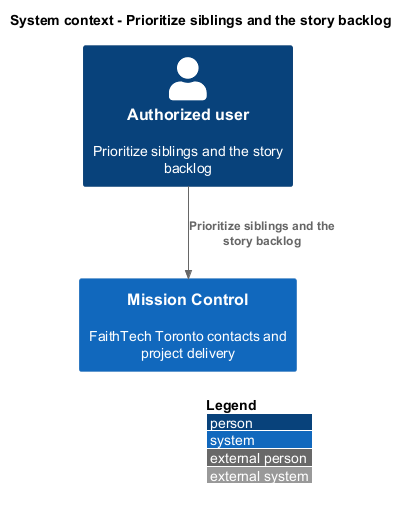
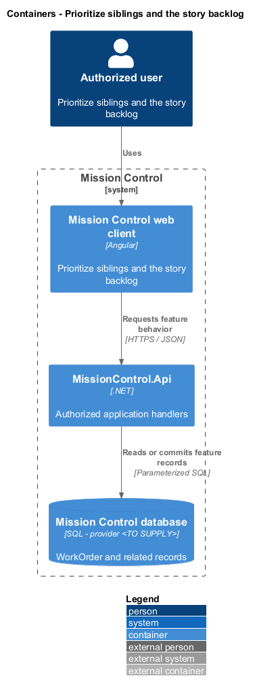
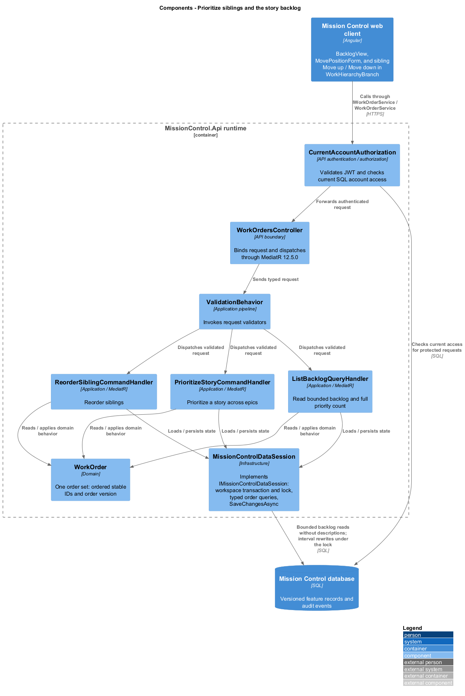
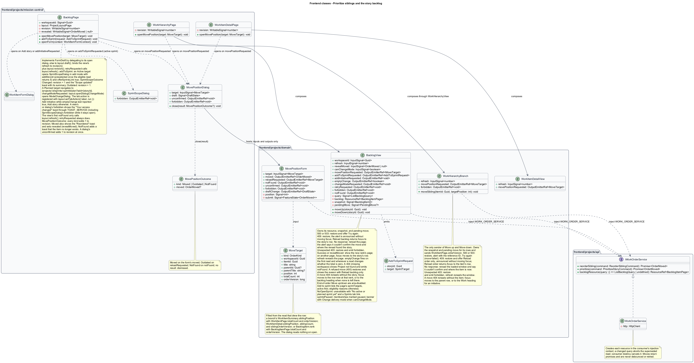
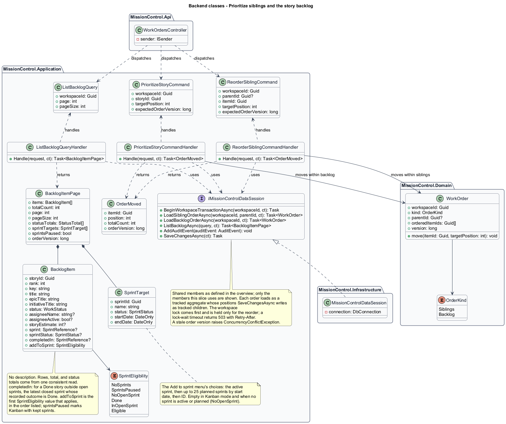
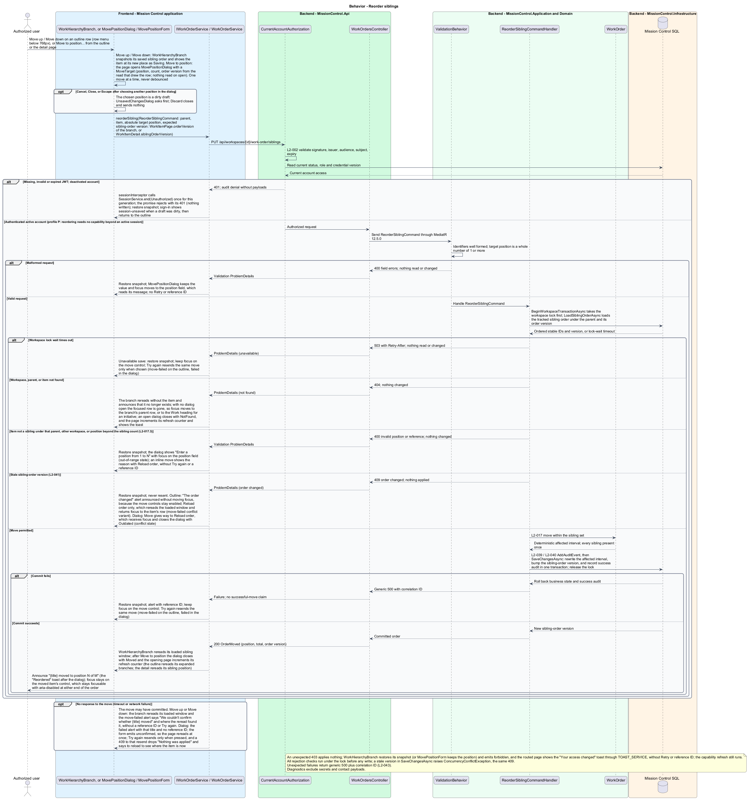
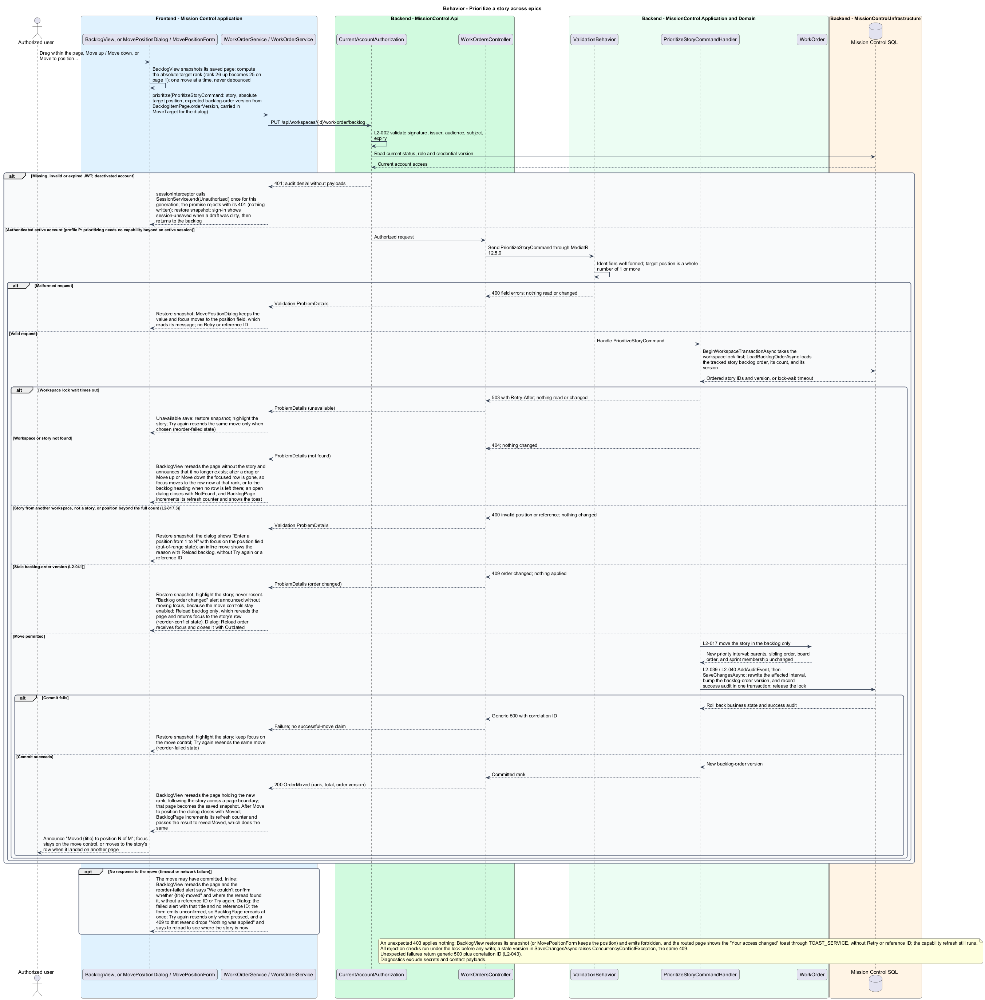
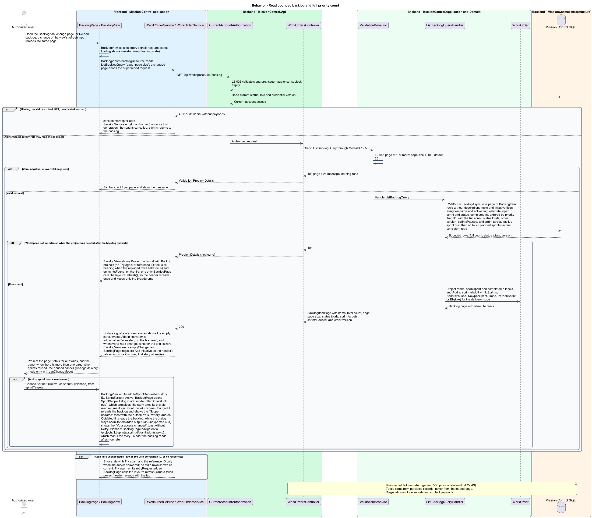

# Prioritize siblings and the story backlog

## Overview

Authorized users organize related work and decide which stories take priority next.

- **Sibling order** — order of items sharing a parent and hierarchy level
- **Backlog priority** — workspace-wide story order independent of epic membership
- **Column order** — board-card order independent of both sibling order and backlog priority

This slice changes the first two orders while preserving stable IDs.

This design refines the [L2 baseline](../../../specs/L2.md) and its linked L1 scope. Proposed defaults retain their proposal status.

## Description

The [shared design rules](../../README.md#shared-design-rules) apply: proposed type status, Application placement and MediatR `12.5.0`, authentication and validation V, responsive profile R and accessibility, token styling, data ownership and session handling, and incremental ATDD. This page records feature-specific behavior and exceptions only.

| Part | Responsibility and architectural home |
| --- | --- |
| `BacklogPage` | Routed page in `frontend/projects/mission-control`, the `backlog` child route of `ProjectLayoutPage` (`/projects/:id/backlog`); composes `BacklogView` with the layout's `canChangeMode`, binds its `refresh` input to its own counter plus the layout's `revision`, and passes a dialog's committed move to its `revealMoved` input. It opens `MovePositionDialog` from `movePositionRequested`, `WorkItemFormDialog` (create) from Add story and the view's `addInitiativeRequested`, and `SprintScopeDialog` or the sprint plan from `addToSprintRequested`; relays `changeModeRequested` through `inject(ProjectLayoutPage).openDialog(ChangeMode)`; calls the layout's `refresh()` on the view's `retryRequested` and on its first `notFound` only; and registers the header's tab action through `setTabAction({ label, run })`: Add initiative while the view's `emptyChange` last reported `true`, Add story otherwise. It reacts to `MovePositionOutcome` as listed below, to `WorkItemFormOutcome` as [Create and navigate the work hierarchy](../create-and-navigate-work/README.md#description) defines, and to `SprintScopeOutcome` as described below; increments its counter at once on a dialog's `unconfirmed` (`MovePositionDialog`, `WorkItemFormDialog`, or `SprintScopeDialog`); shows the "Your access changed" toast through `TOAST_SERVICE` on the view's `forbidden` or a dialog's (`MovePositionDialog`, `WorkItemFormDialog`, or `SprintScopeDialog`); and implements `FormDraft`: its route keeps `canDeactivate: UnsavedChangesGuard`, and its `draft` delegates to its open dialog, else falls back to the layout's open dialog (`inject(ProjectLayoutPage).draft()`), so leaving the project asks once. |
| `WorkHierarchyPage`, `WorkItemDetailPage` | Routed pages, the `work` and `work/:itemId` child routes of `ProjectLayoutPage`, that open `MovePositionDialog` from their views' `movePositionRequested` output and react to `MovePositionOutcome` as listed below, and to its `unconfirmed` and `forbidden` outputs as `BacklogPage` does; their `FormDraft` delegates to it while it is open, else falls back to the layout's open dialog, as [Create and navigate the work hierarchy](../create-and-navigate-work/README.md#description) defines. Only `WorkHierarchyBranch` ([Create and navigate the work hierarchy](../create-and-navigate-work/README.md#description)) sends Move up and Move down, for the sibling rows it owns; the detail page offers Move to position… for the item itself. |
| `MovePositionDialog` | Application dialog for absolute sibling or backlog positions; hosts `MovePositionForm` with a `MoveTarget` and implements `FormDraft` from its `draftChange`. It closes through `close(result: MovePositionOutcome?)`: `Moved(moved)` on the form's `moved`, `Outdated` on `reloadRequested`, `NotFound` on `notFound`, and no result when dismissed; it relays the form's `unconfirmed` and `forbidden` as its own outputs and stays open. |
| `BacklogView` | Domain component in `frontend/projects/domain`; injects `WORK_ORDER_SERVICE`; owns its `backlogResource`, saved snapshot, and pending move in signals. A change of `refresh` rereads its page, and a `revealMoved` value shows the page holding that move's rank and moves focus to the story's row, as after its own move. It emits `forbidden` after a move refused with an unexpected `403`, `movePositionRequested` (a `MoveTarget`), `addToSprintRequested` (an `AddToSprintRequest`: the story ID and the chosen `SprintTarget`), `addInitiativeRequested` from the empty state, `emptyChange` (`true` while the backlog holds no stories) when its first read resolves and whenever a later read changes whether the total is zero, `retryRequested` from the load-failed Try again, `notFound` when a read finds the workspace missing (it then shows Project not found with Back to projects, without Try again or a reference ID), and, from the paused-sprints banner when its `canChangeMode` input is true, `changeModeRequested`. Open story and a row's sprint board or plan link are router links built from the row's IDs. |
| `MovePositionForm` | Domain component; injects `WORK_ORDER_SERVICE`; owns the target position, pending, and rejection state for one sibling or backlog move; emits `moved`, `reloadRequested`, `notFound`, `unconfirmed`, `forbidden`, and `draftChange`. |
| `IWorkOrderService`, `WORK_ORDER_SERVICE` | Contract and token in `frontend/projects/api/work-order.service.contract.ts`; `backlogResource(query)` returns a caller-owned `ResourceRef<BacklogItemPage>`, and the move members return a `Promise<OrderMoved>`. |
| `WorkOrderService` | HTTP adapter in `api`; creates each resource in the consumer's injection context, aborts a superseded read when the query signal changes, and cancels reads on consumer destroy; no shared mutable state. |
| `WorkOrdersController` | Thin controller in `MissionControl.Api.Controllers`; binds, dispatches, and returns. |
| `WorkOrder` | Domain value for one order set: its ordered stable IDs and order version; moves one item to an absolute position. |
| `IMissionControlDataSession` | Application data port defined in the [overview](../../README.md#data-access-and-security-ports); this slice uses `BeginWorkspaceTransactionAsync`, `LoadSiblingOrderAsync`, `LoadBacklogOrderAsync`, `ListBacklogAsync`, `AddAuditEvent`, and `SaveChangesAsync`. |

`BacklogPage` owns `/projects/:id/backlog`; hierarchy and detail actions share `MovePositionDialog`.
Each story has a `StoryBacklogPosition` row independent of its WorkItem sibling position and board placement.
Backlog pages default to 25, ordered by priority then ID. New stories append; deletion removes their live ordering rows.
`ListBacklogQuery` returns a `BacklogItemPage` of `BacklogItem` rows without descriptions: rank, key, title, epic and initiative titles, status, assignee display name and active flag, story estimate, the open sprint as `SprintReference` and `SprintStatus`, `completedIn` (for a Done story outside open sprints, the latest closed sprint whose recorded outcome is Done), and Add to sprint eligibility.
`SprintEligibility` takes the first value that applies of `NoSprints` (Kanban with no kept sprints), `SprintsPaused`, `NoOpenSprint` (Scrum with no active or planned sprint), `Done`, `InOpenSprint`, and `Eligible`, so a paused project reports `SprintsPaused`, and a Scrum project with nothing to add to reports `NoOpenSprint`, on every row.
The page adds the full count, status totals, the order version, `sprintsPaused` (Kanban with kept sprints), and `sprintTargets`.
`sprintTargets` lists the Add to sprint menu's choices as `SprintTarget` (sprint ID, name, status, and dates): the active sprint, then up to 25 planned sprints by start date, then ID. It is empty in Kanban mode and when no sprint is active or planned.
A project with more planned sprints adds stories to the later ones from that sprint's plan page.
Move up/down, pointer dragging, and absolute Move to position all dispatch typed move commands.
Below `768px` Move up and Move down sit in each row's menu. At either end of the order they stay focusable and are marked unavailable with `aria-disabled="true"` rather than `disabled`, so focus stays on the control when a move reaches the end.
Absolute positions refer to the full ordered set, so an item can move to a position on an unloaded page.
Ranks are absolute across pages: Move up on the first row of page 2 moves the story to rank 25 on page 1 and announces the new position; the view shows page 1, and because the row left the page, focus moves to the moved story's row there (`paged` mock state).
Dragging stays within the visible page; Move to position reaches any rank. Totals always count every story, not the loaded page.
The API validates the destination against the persisted set rather than the visible page.

`ReorderSiblingCommandHandler` and `PrioritizeStoryCommandHandler` first call `BeginWorkspaceTransactionAsync`, which takes the workspace lock before any read, and hold it only until the reorder commits or rolls back.
They then load the affected order set as a tracked aggregate through `LoadSiblingOrderAsync` or `LoadBacklogOrderAsync` and compare `expectedOrderVersion` with it. An order set is either the siblings under one parent or the workspace story backlog.
A move sends the order version from the read that drew its position: `WorkItemPage.orderVersion` of the branch for Move up, Move down, and an outline Move to position; `WorkItemDetail.siblingOrderVersion` for Move to position from the detail page; and `BacklogItemPage.orderVersion` for backlog moves.
`MoveTarget` carries that version with the order kind, the item's ID and title, its current position (`WorkItemSummary.siblingPosition`, `WorkItemDetail.siblingPosition`, or `BacklogItem.rank`), the full count, and, for siblings, the parent's ID and title.
`MovePositionDialog` reads nothing when it opens; a version that went stale meanwhile returns the `409` below.
Every opener increments its `refresh` counter on each `MovePositionOutcome`. `Moved(moved)` also shows the "Reordered" toast through `TOAST_SERVICE`, naming the item and its new position, and `BacklogPage` passes the result to `revealMoved`. `Outdated` follows Reload order, and focus returns to the item's actions. `NotFound` adds a toast saying the item no longer exists.
The dialog's `unconfirmed` output also increments the counter at once, so the view rereads before another attempt.
`MovePositionForm` emits `draftChange`: `dirty` once the chosen position differs from the current one, `pending` while the move is in flight, and a `summary` naming the item; after a `409` the position no longer applies, so the draft is clean.
The simple design rewrites only the affected contiguous position interval in one transaction.
Unique keys protect `(WorkspaceId, ParentId, Type, SiblingPosition)` and `(WorkspaceId, BacklogPosition)`.
The SQL adapter uses temporary positions or equivalent provider-safe deferred ordering during interval updates; the provider-specific strategy is `<TO SUPPLY>`.
Each order set's version increments after any reorder, insert, delete, or reparent that touches it.
Cross-workspace IDs and positions outside 1 to the full count return `400` with a position message (`out-of-range` mock state); a refused Move up, Move down, or drag restores the order and shows the reason with Reload, without Try again or a reference ID.
A missing item or workspace returns `404`: the view rereads without the item and announces that it no longer exists, and an open dialog closes with `NotFound` (the `reorder-failed`, `move-failed`, and dialog `failed` notes name this outcome).
With no dialog open, the reread removes the row whose Move up, Move down, or drag handle held focus, so focus moves in the outline to the branch's parent row, or to the Work heading for an initiative, and on the backlog to the row now at that rank, or to the backlog heading when no row is left at that rank.
When the workspace itself is gone, that reread, like any backlog or outline read, returns `404` too: the view shows Project not found with Back to projects, without Try again or a reference ID, and emits `notFound`, and the page calls the layout's `refresh()` on the first one only, so the header rereads once and keeps only the breadcrumb (the `error` notes name this outcome).
A failed save returns `500`; the view restores the last saved order, shows the reference ID, keeps focus on the move control, and Try again resends the same move.
The backlog shows this as `reorder-failed`, the outline's Move up and Move down as `move-failed`, and Move to position as the dialog's `failed` mock state.
A lock-wait timeout returns `503` with `Retry-After` and no partial change. The view treats it as an unavailable save, exactly like the `500`: restore, then an explicit Try again.
A stale `expectedOrderVersion` returns `409` and nothing is applied. The view restores the order it showed and offers only Reload.
The backlog shows this as `reorder-conflict`, the outline as the conflict variant described in its `move-failed` note ("The order changed" with Reload order), and the dialog as `conflict`.
It never resends the move, because a position chosen from an outdated order could land somewhere unintended. Moves are never debounced or retried automatically.
The move controls stay enabled, so the backlog's and the outline's alert is announced without moving focus; Reload backlog or Reload order rereads the order and returns focus to the moved item's row.
In the dialog the `409` replaces Move with Reload order, so focus moves to Reload order, which closes the dialog with `Outdated`.
A move that gets no response may have committed, so no view says nothing moved. Move up, Move down, or a drag rereads the affected page or loaded window and shows the `reorder-failed` or `move-failed` alert titled "We couldn't confirm whether Book AV for demo day moved", which says where the reread found the item, without a reference ID or Try again, because the reread shows the saved order.
The dialog keeps the position and shows its `failed` alert with that title and no reference ID; the form emits `unconfirmed`, so the opening page rereads at once, and Try again sends again only when pressed, meeting the `409` above if the first move went through.
That `409`'s alert then drops "Nothing was applied", because the first move may have applied it, and reads "The order under Venue and logistics has changed since this dialog opened. Reload to see where Book AV for demo day is now."
Reordering needs only an active session (profile P), so a `403` is unexpected; it still triggers the capability refresh. The view restores the order it showed (the dialog keeps its position) and emits `forbidden`, and the routed page shows the "Your access changed" toast through `TOAST_SERVICE`, without Retry or a reference ID.

The view that sent a move owns its snapshot and pending state. After a committed move it reloads the affected resource: the backlog page holding the story's new rank, or the loaded sibling window under that parent. When the story lands on another backlog page, focus moves to its row there.
After a Move to position the opening page increments its `refresh` counter, so its view rereads; `BacklogPage` also passes the `OrderMoved` result to `revealMoved`, so the backlog follows the story to its page as after an inline move. No other view shares these rows, so nothing else is invalidated.

A Kanban backlog with no kept sprints shows no sprint information or actions (`NoSprints`).
In Kanban with kept sprints (`sprintsPaused`), memberships stay readable and marked paused, Add to sprint is disabled with the pause reason, and a banner explains the pause without naming sprints.
The banner's Change delivery mode appears only when `canChangeMode` is true; `BacklogView` emits `changeModeRequested`, and `BacklogPage` calls `inject(ProjectLayoutPage).openDialog(ChangeMode)`, which opens `ModeChangeDialog`.
In Scrum, an `Eligible` row's Add to sprint lists the page's `sprintTargets`, the active sprint first. Other rows show the reason of their first applying eligibility value instead.
With `NoOpenSprint`, Add to sprint is unavailable with "No active or planned sprint yet" and a router link to the Sprints tab, where both roles can plan one.
A `Done` story says it can't be added; a Done member of the active sprint instead reads "Done in Sprint 8. It stays with the sprint's outcomes." beside the Open Sprint 8 board link, because a Done story can't leave an active sprint's scope. An unfinished member (`InOpenSprint`) links to its sprint's board or plan, where its scope changes.
Choosing a sprint makes `BacklogView` emit `addToSprintRequested` with the story ID and the `SprintTarget`.
For the active sprint, `BacklogPage` opens `SprintScopeDialog` in add mode with `addStoryId` set to the story, which the dialog preselects once its eligible read returns it, and `offerSprintsLink` true, and its `FormDraft` delegates to that dialog while it is open; the addition is an explicit active-scope change. On `SprintScopeOutcome` `Changed(ScopeChangeSummary)` the page increments its `refresh` counter and shows the "Scope updated" toast with the outcome's summary through `TOAST_SERVICE`; on `Outdated` it increments the counter; no result changes nothing. While that dialog stays open, its `forbidden` output (an unexpected `403`) shows the "Your access changed" toast through `TOAST_SERVICE`, without Retry.
For a planned sprint, the page navigates to `/projects/:id/sprints/:sprintId/plan?add={storyId}`, which opens the plan with that story marked To add; nothing is saved until Save plan, and the backlog reads afresh when the person returns.
Ordering itself does not alter parent links, story status, or any sprint membership.

| Behavior | Proposed boundary | Request / handler |
| --- | --- | --- |
| Reorder siblings | `PUT /api/workspaces/{id}/work-order/siblings` | `ReorderSiblingCommand` / `ReorderSiblingCommandHandler` |
| Prioritize a story across epics | `PUT /api/workspaces/{id}/work-order/backlog` | `PrioritizeStoryCommand` / `PrioritizeStoryCommandHandler` |
| Read bounded backlog and full priority count | `GET /api/workspaces/{id}/backlog` | `ListBacklogQuery` / `ListBacklogQueryHandler` |

Mock input and review references:

- [Backlog · Mission Control mock](../../../mocks/backlog/backlog.html); review states: `default`, `add-to-sprint`, `kanban`, `kanban-preserved`, `collaborator`, `paged`, `empty`, `reorder-failed`, `reorder-conflict`, `loading`, `error`.
- [Move to position · Mission Control mock](../../../mocks/work/move-position-dialog.html); review states: `default`, `backlog`, `out-of-range`, `conflict`, `failed`.
- [Work hierarchy · Mission Control mock](../../../mocks/work/work-hierarchy.html); review states: `default`, `move-menu`, `move-failed`, `collaborator`, `empty`, `large`, `batch-error`, `loading`, `error`.

## Requirements

Requirement text and identifiers below are copied verbatim from L2, including the source use of `must`.

| L2 ID | Refines (L1) | Requirement |
| --- | --- | --- |
| `L2-017` | `L1-004` | Permitted users must reorder siblings at each hierarchy level and prioritize a workspace's story backlog independently of sibling ordering. Reordering must preserve stable item IDs and persist a deterministic order without duplicates. |
| `L2-020` | `L1-005` | Permitted users must move stories between statuses and reorder cards using both pointer dragging and labeled move controls. The API must apply status and column order atomically. Failed or conflicting moves must restore the last saved view. |
| `L2-022` | `L1-006` | Scrum workspaces must support planned sprints with a name (1–200 characters), goal (1–2,000 characters), start date, and end date on or after start. Dates use Toronto calendar dates. A story must belong to at most one planned/active sprint at a time; tasks inherit membership. Permitted users can edit planned sprints and add/remove unfinished stories. Done stories cannot be newly allocated. |
| `L2-023` | `L1-006` | A workspace must have at most one active sprint. Starting must transition a planned sprint to Active and record the start instant. Active sprint scope can be changed explicitly by permitted users, without losing the recorded initial scope. |
| `L2-027` | `L1-006` | Only administrators must switch workspace mode. An active sprint must block a mode change. Kanban mode must preserve planned/closed sprints but disable their execution until returning to Scrum; work remains available on the Kanban board. |
| `L2-033` | `L1-009` | Every application workflow must be operable by keyboard without required dragging. Focus must remain visible, follow a logical sequence, and be managed when dialogs open/close and routed content changes. |
| `L2-034` | `L1-009` | Application controls must expose programmatic names and roles. Inputs must have associated labels; field errors must identify their inputs. Pages must expose main/navigation regions and a coherent heading hierarchy. Asynchronous outcomes must be announced without relying only on visual changes. |
| `L2-039` | `L1-010` | The system must record UTC timestamp, actor ID when known, operation, entity type/ ID, outcome, and correlation ID for account/permission changes, contact/workspace/ work mutations, board/sprint mutations, successful login, denied access, and throttling. Audit data must exclude secrets and contact payloads. Only administrators must access audit records; audit mutation endpoints must be absent. |
| `L2-040` | `L1-011` | Committed account, contact, hierarchy, ordering, board, and sprint changes must survive restart. Operations spanning multiple records must commit entirely or leave all affected business records unchanged. |
| `L2-041` | `L1-011` | Edits must carry a record version or equivalent concurrency condition. SQL constraints must protect normalized account emails, lead email/category pairs, parent references, open sprint membership, and active sprint exclusivity. Caller errors must produce validation/conflict responses rather than generic failures. |
| `L2-045` | `L1-013` | Directories, workspace lists, backlogs, and history lists must default to 25 records per page and cap requested page size at 100. Invalid sizes must return 400. Results must include total matching count and stable ordering. Boards/hierarchies must load bounded batches of at most 100 and allow access to every matching item; counts must reflect the full dataset rather than just loaded records. |

## Diagrams

The context view identifies the actor and the Mission Control capability.

The container view separates the client, .NET API, and durable SQL records.

The component view locates request dispatch, domain behavior, and persistence within the feature.

The frontend class view shows which domain component owns each order set's rows, snapshot, and pending move, the dialog's form, and the outputs that carry each move, Add to sprint, and mode-change request.

The backend class view shows the typed move commands and backlog query, the description-free backlog rows, and the data-session members this feature uses.

Reorder siblings follows the sequence below. The flow traces its enforcing steps to `L2-017` and includes rejection or recovery paths.

Prioritize a story across epics follows the sequence below. The flow traces its enforcing steps to `L2-017` and includes rejection or recovery paths.

Read bounded backlog and full priority count follows the sequence below. The flow traces its enforcing steps to `L2-017` and includes rejection or recovery paths.

