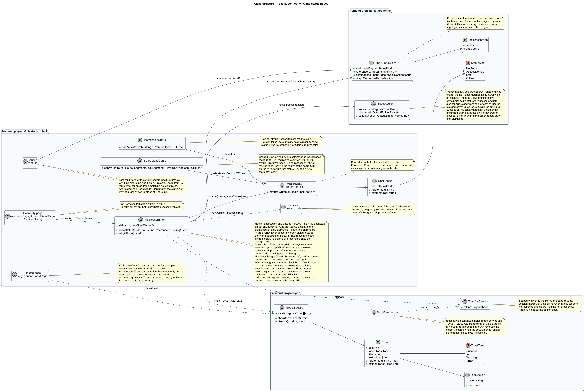

# Navigate with context and preserve form input

## Overview

Application navigation keeps users oriented and protects unfinished form work.

- **Route context** — current workspace, record, and ancestor path represented by the application URL and held client-side in the `RouteContext` signal model
- **Dirty form** — local draft that differs from its last loaded or committed values

Navigation exposes permitted destinations, restores safe direct routes after login, and distinguishes missing records, denied access, and request failure.

This design refines the [L2 baseline](../../../specs/L2.md) and its linked L1 scope. Proposed defaults retain their proposal status.

## Description

The [shared design rules](../../README.md#shared-design-rules) apply: proposed type status, Application placement and MediatR `12.5.0`, authentication and validation V, responsive profile R and accessibility, token styling, data ownership and session handling, and incremental ATDD. This page records feature-specific behavior and exceptions only.

| Part | Responsibility and architectural home |
| --- | --- |
| `ApplicationShell` | Layout route of every protected page in `frontend/projects/mission-control`; owns primary navigation, the compact menu, the Router outlet, the skip link, the offline banner, the status pages, and the host of `ToastRegion`. Primary navigation lists the destinations `currentSession` permits; with no summary held (`currentSession()` is `null`), it lists Home, Leads, and Projects only. It renders `ToastRegion` in the overlay layer, stacked above any open dialog and outside the background a modal makes inert; below `576px` the region sits above a sheet's pinned footer. While its `status` signal is set it renders `ShellStatusView` in place of the routed content; `showStatus(kind, referenceId?)` sets it, the next navigation clears it when it starts, and Try again navigates to the attempted URL with `onSameUrlNavigation: 'reload'`, so route matching and guards run again even when the router already holds that URL. The offline banner's Try again calls `retryOffline()`, which reloads the current route through the `reload` route. It runs Sign out from the user menu and navigates to `/login` (with `replaceUrl`) by itself only when the session ends as `Expired` or `Unauthorized`. `ReplacePasswordDialog` is the other `end(SignedOut)` caller, after an own password replacement. |
| `RouteContext` | Root-provided signal model in `frontend/projects/mission-control` holding only route identifiers (`requestedPath`, `workspaceId`, `ancestorIds`), `loginNotice`, and the shell `status` (`ShellStatus`: kind, reference ID, attempted URL) behind `ApplicationShell.status`. It holds no protected data and never reaches the API; the identifiers and notice survive the navigation to `/login`, and the shell clears `status` when the next navigation starts. |
| `AuthenticationGuard`, `PermissionGuard` | Route guards in `frontend/projects/mission-control`. `AuthenticationGuard` reads `signedIn()` and sends no request; `PermissionGuard` awaits `refreshCapabilities()` on each primary-route activation and decides through `permits(path, session)`, the route rule `LoginPage` also applies after sign-in. A denial sets the `AccessDenied` status and returns `false`. |
| `ShellStatusView`, `StatusKind`, `ShellDestination` | Presentational component in `frontend/projects/components` with its own input types: inputs `kind` (`NotFound`, `AccessDenied`, `Error`, or `Offline`), `referenceId` (optional), and the permitted `destinations` to offer; output `retry`. It renders the not-found, access-denied, error, and offline pages, injects no service, and imports no other project. |
| `**` route | Last child route of `ApplicationShell`. It renders `ShellStatusView` with kind `NotFound` and the destinations every role may use (Home, Projects, Leads) from its route data, for an address that matches no client route. A `BoardModeGuard` (`canMatch`) that declines on a `500`, `503`, or no response leaves the router at the board URL on this route; the status that guard set is shown in place of the outlet, so NotFound does not appear, and Try again runs the match again. |
| `reload` route | Componentless child route of `ApplicationShell` (`path: 'reload'`, `children: []`, no guard) that renders nothing. `retryOffline()` navigates to it with `skipLocationChange`, so the address bar never shows it, and then back to the current URL. |
| `UnsavedChangesGuard`, `FormDraft`, `UnsavedChangesDialog`, `LeaveReason`, `LeaveChoice` | Application-project guard, draft contract, dialog, reason, and result. `FormDraft.draft` holds the latest `DraftState`; the guard is the `canDeactivate` of every route whose page is a form or hosts form dialogs (the project tabs, not `ProjectLayoutPage`, whose dialogs they cover); `confirm(reason, summary)` asks before input is lost, with `LeaveReason` `Navigate`, `CancelForm`, or `SignOut`. The dialog closes through `close(result?: LeaveChoice)`: `Discard` on Leave without saving, Discard changes, or Sign out without saving, and `Stay` on the stay choice; closing with no result (Escape) means `Stay`. `confirm` resolves with that choice, and its caller proceeds only on `Discard`. |
| `DraftState` | Domain type in `frontend/projects/domain`: `dirty`, `pending`, `unconfirmed` (the last save got no response and nothing has settled it since), and `summary` (what would be lost, or `null` for generic copy). Every domain form emits it through `draftChange: OutputEmitterRef<DraftState>`. |
| `UserMenuView` | Domain component in `frontend/projects/domain`; injects `SESSION_SERVICE`, renders the name, email, and role from `currentSession`, and emits `signOutRequested`, which `ApplicationShell` maps to `signOut()`. With no summary held (`currentSession()` is `null`), the menu shows only Sign out, with no name or role. |
| `ToastRegion` | Presentational component in `frontend/projects/components`, hosted by `ApplicationShell` in the overlay layer above any open dialog and outside the inert background, so both live containers keep announcing while a dialog is open; below `576px` it sits above a sheet's pinned footer, so no toast covers the footer's actions, and the sheet's bottom scroll padding includes the toast region, so a focused field never sits under a toast, and a toast's own actions become reachable once the dialog closes. It keeps two persistent live containers, a polite status container for success and info toasts and an alert container for errors and warnings, renders each toast it is given into the matching one (a toast carries no role of its own), and emits `dismissed` and `actionChosen`. It owns the timing: a success or info toast without an action emits `dismissed` after 8 seconds, paused while it is hovered or holds focus, and error, warning, and action toasts stay until dismissed. It declares its own input shape, which the `api` `Toast` matches structurally, so it imports no other project. |
| `IToastService`, `TOAST_SERVICE`, `ToastService` | Contract and token in `frontend/projects/api/toast.service.contract.ts`, and its adapter in `api`. Routed pages call `show(toast)` after an outcome; `ToastService` holds the visible toasts in a root signal, keeps at most three (a proposed display choice: a fourth removes the oldest), and clears them when the session ends. |
| `ISessionService`, `SESSION_SERVICE` | Interface and token in `frontend/projects/api/session.service.contract.ts`. The [sign-in slice](../../identity/sign-in-and-end-session/README.md) defines the session protocol; navigation uses `signedIn`, `currentSession`, `endReason`, `offline`, `refreshCapabilities()`, and `end(reason)`. |
| `SessionService`, `sessionInterceptor` | Session adapter and interceptor in `api`, defined by the sign-in slice. The interceptor sets `offline` when a request gets no response and clears it on the next response. Composition binds a mock adapter for Chromium Playwright. |
| `SessionsController` | Thin controller under `backend/src/MissionControl.Api/Controllers`, namespace `MissionControl.Api.Controllers`. |
| `CurrentSession` | Application read projection: account ID, display name, email, role, capability summary; no contact data. |
| `IMissionControlDataSession` | Shared Application data port defined in the [overview](../../README.md#data-access-and-security-ports); this slice uses only its typed reads. |

Route context is client state only: the URL plus the root-provided `RouteContext`. No navigation API exists.
`ApplicationShell` is the parent layout route of every protected route; `/login` sits outside it.
`AuthenticationGuard` reads `signedIn()`; with no token in memory it sends no request.
It stores the internal requested path in `RouteContext.requestedPath` and redirects to `/login`, replacing the current history entry (`replaceUrl`).
Every navigation to `/login` does the same: this redirect, Sign out, the own-password sign-out, and the session-end navigation. `LoginPage`'s navigation after sign-in also uses `replaceUrl`.
`/login` opened while a session is held redirects to `/home`, except the sign-out navigation itself: a `SignedOut` caller navigates with router state `{ signOut: true }`, which the `/login` guard lets through, and only then calls `end(SignedOut)`. Browser Back therefore never reaches the sign-in form of a live session.
The login notice is `session-ended` when the browser's Navigation Timing entry reports a reload, and `deep-link` otherwise. Neither names the record.
Only internal application paths are stored, and none goes to browser storage.

`PermissionGuard` runs on each primary-route activation: Home, Leads, Projects, Accounts, and Audit log.
It awaits `refreshCapabilities()`, the deduplicated `GET /api/session`, so the first activation after login loads the capability summary and later ones pick up role changes.
After any `403` the interceptor refreshes the summary as well, so navigation and controls bound to `currentSession` follow the current role.
The guard decides through `permits(path, currentSession())`: `/accounts` needs `accounts.manage` and `/audit` needs `audit.read`, so both are administrator-only destinations; the backend still enforces every operation.
If the refresh fails without a `401`, the guard decides with the summary already held.
With none held, a route that needs no capability opens and its own reads report their failures, while a capability route shows the error page with its reference ID, or the offline page when there was no response.
A route the role cannot use is never activated: the guard sets the `AccessDenied` status and returns `false`, so nothing protected is requested, whether the route was reached through an in-app link, browser history, or a role that changed mid-session.
Sign-in never ends on that page, because `LoginPage` restores only a permitted path.

`ApplicationShell` owns the status pages. While its `status` signal is set, it renders the presentational `ShellStatusView` in place of the routed content, with the destinations the current role may use, and focuses its heading.
Routed pages call `inject(ApplicationShell).showStatus(kind, referenceId?)`, which records the current URL as the attempted one.
The status itself lives in the root `RouteContext.status` signal, because `PermissionGuard` runs before any component exists and cannot inject the shell; the guard sets that signal for the URL it is checking. `BoardModeGuard` ([Create and manage project workspaces](../../projects/manage-workspaces/README.md)) sets it the same way when the board's mode read fails with `500`, `503`, or no response.
The next navigation clears the status when it starts. Try again on the error and offline pages navigates to the attempted URL with `onSameUrlNavigation: 'reload'`, so route matching, the guards, and the route's reads run again even when the router already holds that URL.
A `BoardModeGuard` (`canMatch`) that declines leaves the router at the board URL on the `**` route with the status it set, so the shell shows that error or offline page, not NotFound, and Try again runs the match again.
An address that matches no client route reaches the shell's last child route, `**`, which renders `ShellStatusView` with kind `NotFound`.
The shell's other non-feature child route is the componentless `reload` route, which only the offline banner's Try again uses.

A permitted route opens, and its routed view reads the record through its existing lead, workspace, work, or sprint resource.
A `200` renders the page, fills `workspaceId` and `ancestorIds`, and focuses the heading.
A `404`, a `500`, or no response to that read renders the routed view's own not-found or error state inside the shell, for example "Lead not found" with Back to leads, or the view's error with Try again and, for a `500`, its reference ID.
A malformed record ID inside a matched route, such as `/leads/not-a-guid`, reaches the routed view as well: the API's `{id:guid}` route constraint answers its read with `404`, so the view shows its own not-found state.
The shell's status pages cover only what no feature view can show: not-found for an address that matches no client route, access-denied for a route the role cannot use, and error or offline for a failure before any feature view exists, such as the capability check or the Board tab's mode read.
A `403` on a read arises only on the capability routes, Accounts and the Audit log, when the role changed after the check: `AccountView`, `AccountDetailView`, and `AuditEventView` emit `forbidden`, and their routed page calls `showStatus(AccessDenied)`.
Lead, workspace, work, and sprint reads need only an active session, so their views have no `403` branch; an unexpected `403` follows the session rules.
A `401` carrying the current generation ends the session through `end(Unauthorized)`, and that request rejects with its `401`.

Guards and route-scoped state follow the sign-in slice's session protocol. Routed pages, their domain views, and route-scoped providers hold protected data; root-level services hold none.
When `endReason` becomes `Expired` or `Unauthorized`, `ApplicationShell` stores the current path, clears `workspaceId` and `ancestorIds`, sets `loginNotice` to `session-ended`, and navigates to `/login` with `replaceUrl`.
That navigation destroys the shell, every routed page, and their route-scoped providers, so no protected data remains in application memory or on screen.
Responses that arrive after the session ended carry an older generation. The interceptor discards them, so they never update a view and never end the next session.
During the session-end navigation `UnsavedChangesGuard` opens no dialog, because nothing can be saved without a session (L2-003.4).
It reads the page's `FormDraft` and sets `loginNotice` to `session-save-unknown` when the form or dialog reported its save still `pending` or `unconfirmed`, otherwise `session-unsaved` when the draft was dirty.
Ending the session aborts that save in the browser only, so it never resolves for the form; it may have committed, and login asks the user to check the record.
A save answered `401` is no longer pending: the `401` proves nothing was written, so a dirty draft stays dirty. Neither notice reports a successful save.
Only a `FormDraft` reporting `pending` or `unconfirmed` yields `session-save-unknown`: a board move, reorder, status control, or other mutation without a `FormDraft` leaves `loginNotice` at `session-ended`, and its view rereads after sign-in.
Sign out runs the other way round: `UserMenuView` emits `signOutRequested`, and `ApplicationShell` navigates to `/login` with `replaceUrl` and state `{ signOut: true }`, so the guard confirms leaving first with reason `SignOut` and the `/login` guard lets the still-signed-in navigation through; then it calls `end(SignedOut)` and sets `loginNotice` to `signed-out`.
Replacing one's own password signs out the same way from `ReplacePasswordDialog` ([manage accounts](../../identity/manage-accounts/README.md)): it sets `loginNotice` to `signed-out`, navigates to `/login` with `replaceUrl` and state `{ signOut: true }`, then calls `end(SignedOut)`. `ApplicationShell` navigates by itself only on `Expired` or `Unauthorized`.
After a successful sign-in, `LoginPage` clears `loginNotice`, awaits `refreshCapabilities()`, and navigates with `replaceUrl` to `requestedPath` only if `PermissionGuard.permits(requestedPath, currentSession())` holds, otherwise to `/home` (L2-029.3).
If that refresh fails, no summary is held, so `LoginPage` opens `/home`; Home needs no capability, so it opens and its sections report their own read failures.

`UnsavedChangesGuard` and application-owned `UnsavedChangesDialog` protect in-app route changes, dialog cancellation, and Sign out.
Every domain form emits `draftChange: OutputEmitterRef<DraftState>`; `DraftState { dirty, pending, unconfirmed, summary }` carries a `summary` naming what would be lost, or `null` for generic copy; `unconfirmed` is true after the form's last save got no response, until a reread or the next answered save settles it.
Each application form dialog and routed form page implements `FormDraft` from the latest `DraftState`. A routed page that hosts form dialogs implements `FormDraft` by delegating to its open dialog, and is clean when none is open; this covers the lead pages, `ProjectListPage`, `ProjectLayoutPage` and its child pages, the work pages, the board and sprint pages, the account pages, and `HomePage`.
A routed form page that also hosts form dialogs, such as the sprint plan, combines its own form's draft with its open dialog's: it is dirty, pending, or unconfirmed when either is, and its summary names both.
Angular runs `canDeactivate` only for the routes a navigation deactivates, so a dialog that `ProjectLayoutPage` opens is hosted by the active child page: every `ProjectLayoutPage` child page's `draft` falls back to the layout's open dialog when it has none of its own (`inject(ProjectLayoutPage).draft()`).
Such a page also follows the [shared dialog and refresh rules](../../README.md#frontend-data-ownership): each dialog closes through `close(result?)` with its typed outcome, and while open relays its form's `unconfirmed` and `forbidden` outputs and stays open.
The page increments the counter bound to its views' `refresh` inputs after any committed, not-found, or outdated outcome, and at once when the open dialog relays `unconfirmed`; a `ProjectLayoutPage` child page calls the layout's `refresh()` (or `modeChanged()`) instead when the header must reread too, including on a view's `retryRequested` and first `notFound`. That is the whole invalidation map.
`UnsavedChangesGuard` is the `canDeactivate` of every route whose page is a form or hosts form dialogs, for example the lead directory, Home, the project tabs, and the sprint plan; the `ProjectLayoutPage` route has none, because each project tab's `draft` falls back to the layout's open dialog, so leaving a project asks once.
While a modal form dialog is open the page behind is inert, so a route change reaches it only through a router link inside the dialog (such as View existing lead), browser Back or Forward, or a session end; delegation lets the guard see that dialog's draft each way.
A dialog closes with no result (dismissed) once a navigation completes that deactivates the page hosting it, so its opener changes nothing; a navigation the guard cancels leaves the dialog open with its draft.
A navigation that reuses the hosting page, such as a query-only Back or Forward on a filtered list, runs no `canDeactivate` and leaves the dialog open with its draft while the page's views read the restored query.
A change of the route's own parameter, such as View existing lead from one lead's details to another's, reuses the page but still runs its `canDeactivate`, so the page treats it as leaving and closes its dialog with no result once that navigation completes.
`ProjectLayoutPage` defers its own re-navigation, `modeChanged()`'s same-URL reload and the `sprints` to `overview` redirect, until its open dialog closes; its `revision` still increments at once.
The guard reads `draft()` before the change proceeds. A dirty draft opens `UnsavedChangesDialog.confirm(reason, summary)` with reason `SignOut` when the destination is `/login` (Sign out's `replaceUrl` navigation) and `Navigate` otherwise.
A form dialog's Cancel, Close, or Escape on a dirty draft opens the same dialog itself with reason `CancelForm`.
The reason sets the title and the two choices (the `navigate`, `cancel-form`, and `sign-out` mock states); the body names what would be lost when the form supplies a summary and uses generic copy otherwise.
The body says what leaving or discarding drops and never states that the input hasn't been saved, because a form whose last save got no response may already have saved it.
Stay, or closing the dialog with no result, retains session and input; Discard navigates or closes without save. A browser unload prompt covers reload/tab close when supported.
The primary save control suppresses duplicate submissions while pending and shows progress. Cancel and Close stay disabled until the save resolves.
A route change requested during a pending save waits for its result; a failed save keeps the draft and opens the dialog.
Success alone updates the saved baseline and closes the dialog.
Validation with one field error moves focus to that field, which reads its error; several move focus to the linked error summary. This holds for checks before sending and for a server `400`, which offers no Retry or reference ID.
Save failure retains valid input; a conflict retains the draft beside the latest record, which the form's resource reloads once. A save that gets no response keeps the draft and reads persisted state before another attempt, as the [failure presentation rules](../../README.md#failure-presentation) require.
Password fields clear on authentication failure and successful completion.

The compact menu exposes every permitted destination, closes after selection, and moves focus to the new heading.
While open, the drawer is modal: the top bar, the skip link, and the page behind are inert and Tab stays in the drawer; Escape, the close button, or a tap on the overlay closes it and returns focus to the menu button.
Modal focus starts on the first field or safe Cancel action, stays inside, and returns to the trigger or a surviving contextual control.
The shell keeps navigation available on not-found, access-denied, error, and offline pages.
`sessionInterceptor` sets `ISessionService.offline` when a request gets no response and clears it on the next response.
While `offline()` holds, `ApplicationShell` keeps any content already on screen and shows the offline banner. Its Try again calls `retryOffline()`, which reloads the current route: it navigates to the shell's componentless `reload` child route with `skipLocationChange`, then back to the current URL.
Leaving therefore passes through `UnsavedChangesGuard`, where a dirty draft asks first and Stay cancels the reload, and the route's guards and views are created again and read again; a plain navigation to the same URL would reuse them and read nothing.
When a request made before any feature view exists cannot reach the API, as when the capability check for Accounts or the Audit log fails with no summary held or the Board tab's mode read gets no response, the offline page appears instead; a routed view whose own first read gets no response shows its error state with Try again.
Routed pages report outcomes through `TOAST_SERVICE`. `ApplicationShell` passes the visible toasts to `ToastRegion`, whose persistent status container announces success and info politely and whose alert container announces errors and warnings, without taking focus.
`ApplicationShell` renders `ToastRegion` in the overlay layer, stacked above any open dialog and outside the background a modal makes inert, so both live containers keep announcing while a dialog is open. Below `576px` the region sits above a sheet's pinned footer, so no toast covers the footer's actions, and the sheet's bottom scroll padding includes the toast region, so a focused field never sits under a toast. A toast's own actions become reachable once the dialog closes.
`ToastRegion` dismisses a success or info toast without an action after 8 seconds, waiting while it is hovered or focused; error, warning, and action toasts stay until dismissed. `ToastService` keeps at most three visible, the oldest leaving first; that limit is a proposed display choice.
An unexpected `403` on an operation that needs only an active session (card moves; work create, update, and prioritize; sprint plan, start, scope, and close) makes the caller restore its saved state, and its routed page shows the "Your access changed" toast while the capability summary refreshes. It has no Retry, because a repeat would be refused again; its one action is Go to Home. Callers with a designed `403` presentation, such as administrator-only dialogs and the capability routes, show that presentation instead.
`ToastService` clears every toast when the session ends through `end()`, so no toast text outlives its session. Connectivity has the banner only, with no separate offline toast.
The proposed WCAG target remains unconfirmed; its concrete keyboard, labeling, zoom, and touch criteria remain the design baseline.
Manual visual review includes 200% text zoom and every profile R width; production Chromium checks cover actual workflows, not artifact structure.

| Behavior | Proposed boundary | Request / handler |
| --- | --- | --- |
| Check session and restore a permitted route | `GET /api/session; existing route-specific record endpoint` | `GetCurrentSessionQuery` / `GetCurrentSessionQueryHandler` |
| Confirm leaving unsaved input | Client only; no request | `UnsavedChangesGuard.canDeactivate(FormDraft)`, `UnsavedChangesDialog.confirm(reason, summary)` resolving with `LeaveChoice` |

Mock input and review references:

- [Navigation · Mission Control mock](../../../mocks/shell/navigation.html); review states: `default`, `collaborator`, `compact-menu`, `user-menu`, `focus`.
- [Status pages · Mission Control mock](../../../mocks/shell/status-pages.html); review states: `not-found`, `access-denied`, `error`, `offline`.
- [Unsaved changes · Mission Control mock](../../../mocks/shell/unsaved-changes-dialog.html); review states: `navigate`, `cancel-form`, `sign-out`.
- [Notifications and pop-ups · Mission Control mock](../../../mocks/feedback/notifications.html); review states: `default`, `toast-stack`.
- [Sign in · Mission Control mock](../../../mocks/auth/login.html); review states: `default`, `validation`, `submitting`, `invalid`, `throttled`, `signed-out`, `session-ended`, `session-unsaved`, `session-save-unknown`, `deep-link`, `error`, `unreachable`.

## Requirements

Requirement text and identifiers below are copied verbatim from L2, including the source use of `must`.

| L2 ID | Refines (L1) | Requirement |
| --- | --- | --- |
| `L2-003` | `L1-001` | The client must hold the token in memory, clear it on logout, and require login after reload or expiry. Local logout does not revoke a copied valid access token. |
| `L2-029` | `L1-007` | Primary navigation must reach Home, Leads, and Projects, with account management visible only to administrators. Work details must expose their workspace and parent path. Direct routes must enforce authentication and handle missing records. |
| `L2-030` | `L1-008` | Every login/session, account-management, lead CRUD, workspace, hierarchy, backlog, board, sprint, home, and navigation workflow must satisfy responsive profile R. Compact layouts must stack form fields and summary cards and provide local board scrolling or a column selector. Larger layouts must use available space without overlapping controls. Vertical page scrolling is permitted. |
| `L2-031` | `L1-008` | Forms must expose field-specific validation, retain input on rejected saves, prevent duplicate submission while pending, display results, and confirm leaving with unsaved edits. Destructive confirmations must name the affected item. |
| `L2-032` | `L1-008` | Production views must use the application design tokens and consistent typography, spacing, focus, form, and status patterns. Loading, empty data, zero search results, and request errors must be distinguishable and offer relevant actions. Visual review is for application UX; design artifacts themselves remain exempt from automated tests. |
| `L2-033` | `L1-009` | Every application workflow must be operable by keyboard without required dragging. Focus must remain visible, follow a logical sequence, and be managed when dialogs open/close and routed content changes. |
| `L2-034` | `L1-009` | Application controls must expose programmatic names and roles. Inputs must have associated labels; field errors must identify their inputs. Pages must expose main/navigation regions and a coherent heading hierarchy. Asynchronous outcomes must be announced without relying only on visual changes. |
| `L2-035` | `L1-009` | The application must meet the proposed WCAG 2.2 AA target. Normal text must reach 4.5:1 contrast, large text 3:1, and essential control boundaries/focus/status graphics 3:1 against adjacent colors. Status must include text or another non-color cue. Primary touch controls must provide at least 44×44 CSS-pixel targets; other controls must satisfy applicable AA target-size requirements. |
| `L2-043` | `L1-012` | The API must return a correlation ID for unexpected failures and write structured diagnostic records containing operation, UTC time, outcome, and that same ID. Users must receive useful error categories without internal stack traces or secret values. Production logs and diagnostics must be restricted operational data. |

## Diagrams

The context view identifies the actor and the Mission Control capability.

The container view separates the client, .NET API, and durable SQL records.

The component view locates request dispatch, the `CurrentSession` read projection, and persistence; route context stays in the web client.

The class view shows the guards, the root-provided `RouteContext`, the draft contract and its delegation, the typed dialog results and refresh counter that hosting pages use, and the session members navigation uses.

The feedback class view shows who owns toasts, the offline banner, and the status pages: routed pages raise toasts, `ToastService` keeps at most three, `ApplicationShell` hosts them in `ToastRegion` above any open dialog, and `ToastRegion` times their dismissal, `sessionInterceptor` drives the `offline` signal, the banner's Try again reloads the route through the `reload` route, and `ShellStatusView` renders the status that `PermissionGuard`, `BoardModeGuard`, the `**` route, or a routed page sets.

Check session and restore a permitted route follows the sequence below. The flow traces its enforcing steps to `L2-029`.
It covers the stored return path, sign-in with a capability refresh that restores only a permitted path (otherwise Home), the in-session access-denied status, an address that matches no client route, and the record's `200`, `401`, `403`, and `404` outcomes, with the routed view rendering its own `404` (including a malformed ID) and `500` states.

Confirm navigation away from unsaved input remains a client-side behavior with no mutation request for discarded input.
It covers route changes, including a router link inside a dialog, and form-dialog cancellation with clean, pending, and dirty drafts, and a session that ends while a draft is dirty, while a save is pending or unconfirmed, or while no `FormDraft` reports either.

