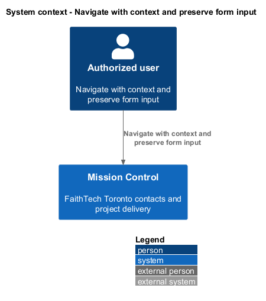
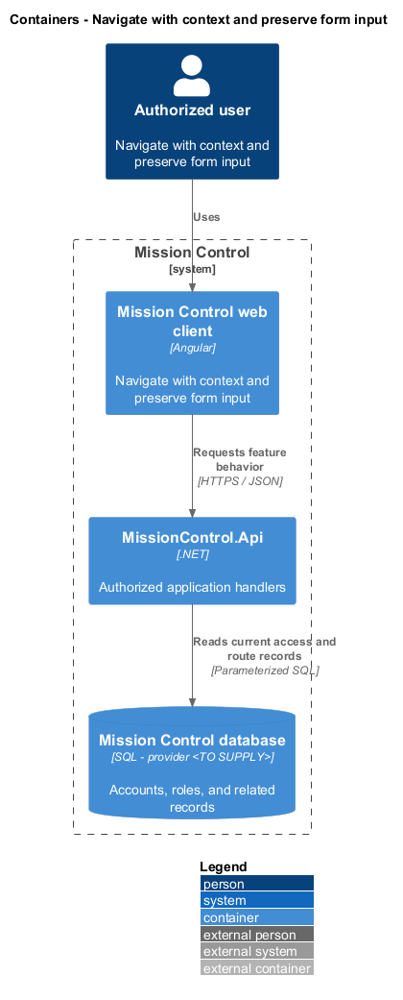
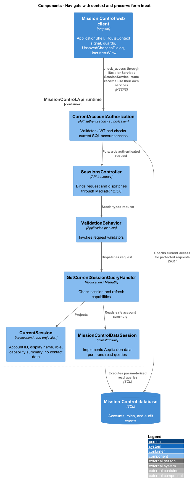
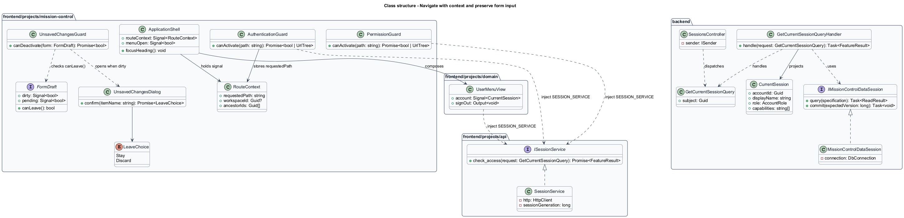
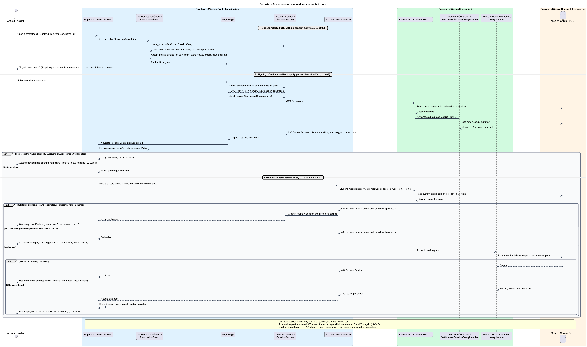
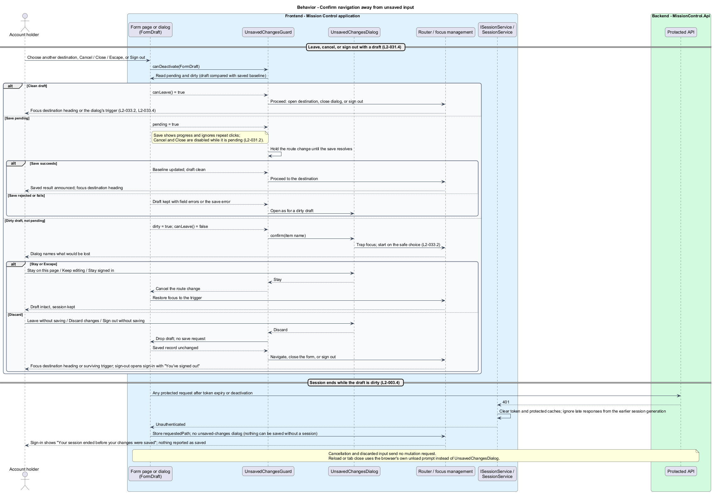

# Navigate with context and preserve form input

## Overview

Application navigation keeps users oriented and protects unfinished form work.

- **Route context** — current workspace, record, and ancestor path represented by the application URL and held client-side in the `RouteContext` signal
- **Dirty form** — local draft that differs from its last loaded or committed values

Navigation exposes permitted destinations, restores safe direct routes after login, and distinguishes missing records, denied access, and request failure.

This design refines the [L2 baseline](../../../specs/L2.md) and its linked L1 scope. Proposed defaults retain their proposal status.

## Description

All named production types are proposed; the repository currently contains requirements and static mocks.

| Part | Responsibility and architectural home |
| --- | --- |
| `ApplicationShell` | Application shell owned by `frontend/projects/mission-control`; owns primary navigation, the compact menu, Router outlets, the skip link, and the `RouteContext` signal. |
| `RouteContext` | Application-project signal model in `frontend/projects/mission-control`: `requestedPath`, `workspaceId`, `ancestorIds`. `ApplicationShell` and the guards own it; it never reaches the API. |
| `AuthenticationGuard`, `PermissionGuard` | Route guards in `frontend/projects/mission-control`; both call `check_access` through `SESSION_SERVICE`. |
| `UnsavedChangesGuard`, `FormDraft`, `UnsavedChangesDialog` | Application-project guard, form-state contract, and dialog. Every form page and dialog exposes `FormDraft` (`dirty`, `pending`, `canLeave()`). |
| `UserMenuView` | Domain component in `frontend/projects/domain`; injects `SESSION_SERVICE`, renders the signed-in name and role, and emits Sign out to the shell. |
| `ISessionService`, `SESSION_SERVICE` | Interface and token in `frontend/projects/api/session.service.contract.ts`, shared with the sign-in slice; navigation calls `check_access` only. |
| `SessionService` | Production HTTP adapter in `api`; holds the token and `CurrentSession` in memory, owns the session generation counter, HTTP calls, and observable-to-signal conversion. Composition binds a mock adapter for Chromium Playwright. |
| `SessionsController` | Thin controller under `backend/src/MissionControl.Api/Controllers`, namespace `MissionControl.Api.Controllers`; binds, dispatches, and returns. |
| `CurrentSession` | Application read projection: account ID, display name, role, capability summary; no contact data. |
| `IMissionControlDataSession` | Application data port; the Infrastructure adapter runs parameterized queries and transaction commits. |

Commands, queries, handlers, and request validators live in Application feature folders. Each type has its own file; folders and namespaces agree.
MediatR remains pinned to `12.5.0`. Microsoft.Extensions supplies dependency injection, Options, and Configuration.

`ApplicationShell` owns primary navigation, compact menu, Router outlets, and the skip link.
Route context is client state only: the URL plus the `RouteContext` signal. No navigation API exists.
`AuthenticationGuard` and `PermissionGuard` call `check_access` through `SESSION_SERVICE`.
With no token in memory, `SessionService` answers unauthenticated without sending a request.
Otherwise it returns the `CurrentSession` read from `GET /api/session` for the current session generation.
A `403` from any endpoint discards that summary, so the next guard check reads current capabilities again.
The backend still enforces every operation independently. `/accounts` and `/audit` are administrator-only destinations.
The guard checks authentication before requesting record data. A direct protected URL stores an internal return path in `RouteContext.requestedPath`.
Only internal application paths are stored. Sign-in opens in its `deep-link` state without naming the record.
After `LoginCommand` succeeds, `check_access` reads `GET /api/session` for the role and capability summary.
`PermissionGuard` then checks the stored path; a route the role cannot use shows the access-denied page without requesting the record.
A permitted route opens, and its existing lead, workspace, work, or sprint query reads the record.
A `200` renders the page, fills `workspaceId` and `ancestorIds`, and focuses the heading.
A `404` shows the not-found page offering Home, Projects, and Leads; a `403` shows the access-denied page with permitted destinations.
A `401` during any request clears the in-memory session, stores the current path, and opens sign-in with the session-ended message.

`UnsavedChangesGuard` and application-owned `UnsavedChangesDialog` protect in-app route changes, dialog cancellation, and logout.
Each form exposes `FormDraft`; the guard reads `dirty` and `pending` and asks `canLeave()` before the change proceeds.
Stay retains session and input; Discard navigates or closes without save. A browser unload prompt covers reload/tab close when supported.
The primary save control suppresses duplicate submissions while pending and shows progress. Cancel and Close stay disabled until the save resolves.
A route change requested during a pending save waits for its result; a failed save keeps the draft and opens the dialog.
Success alone updates the saved baseline and closes the dialog.
Validation focuses the linked error summary. Save failure retains valid input; conflict retains draft beside a separately fetched latest record.
Session expiry clears protected caches and explains unpersisted input; it does not display a success toast or the unsaved-changes dialog.
`SessionService` ignores late responses from an earlier session generation. Password fields clear on authentication failure and successful completion.

The compact menu exposes every permitted destination, closes after selection, and moves focus to the new heading.
Modal focus starts on the first field or safe Cancel action, stays inside, and returns to the trigger or a surviving contextual control.
The shell keeps navigation available on not-found, access-denied, error, and offline pages.
A request that cannot reach the API keeps any content already on screen and shows the offline banner with Try again.
A page whose first request cannot reach the API shows the offline page instead, because nothing is saved to show yet.
Toasts announce success politely and errors as alerts without taking focus. The mock's maximum three-toast stack is a proposed display choice.
All view states use `--mc-` tokens, non-color status cues, named icon buttons, at least 44×44 primary touch targets, and the stated contrast ratios.
The proposed WCAG target remains unconfirmed; its concrete keyboard, labeling, zoom, and touch criteria remain the design baseline.
Manual visual review includes 200% text zoom and every profile R width; production Chromium checks cover actual workflows, not artifact structure.

The authenticated API evaluates current SQL permissions before feature dispatch. Validation V maps invalid fields to `400`, absent authentication to `401`, forbidden access to `403`, missing records to `404`, and conflicts to `409`.
Unexpected errors return a generic `500` with a correlation ID. Structured diagnostics exclude secrets and contact payloads.

Responsive profile R covers `320`, `375`, `576`, `768`, `992`, `1200`, and `1920` CSS-pixel widths at `800` pixels high.
Forms stack on compact screens; dialogs become sheets below `576px`. Templates, styles, and classes remain separate files.
Component styles read `var(--mc-<role>)` from the mirrored authoritative design-system tokens.
Keyboard actions include visible focus, named controls, modal focus containment, trigger focus restoration, and destination-heading focus after navigation.
Field errors connect to inputs; asynchronous results use status or alert announcements. Status text supplements color; primary touch targets measure at least `44×44` CSS pixels.

| Behavior | Proposed boundary | Request / handler |
| --- | --- | --- |
| Check session and restore a permitted route | `GET /api/session; existing route-specific record endpoint` | `GetCurrentSessionQuery` / `GetCurrentSessionQueryHandler` |

Mock input and review references:

- [Navigation · Mission Control mock](../../../mocks/shell/navigation.html); review states: `default`, `collaborator`, `compact-menu`, `user-menu`, `focus`.
- [Status pages · Mission Control mock](../../../mocks/shell/status-pages.html); review states: `not-found`, `access-denied`, `error`, `offline`.
- [Unsaved changes · Mission Control mock](../../../mocks/shell/unsaved-changes-dialog.html); review states: `navigate`, `cancel-form`, `sign-out`.
- [Notifications and pop-ups · Mission Control mock](../../../mocks/feedback/notifications.html); review states: `default`, `toast-stack`.
- [Sign in · Mission Control mock](../../../mocks/auth/login.html); review states: `default`, `validation`, `submitting`, `invalid`, `throttled`, `signed-out`, `session-ended`, `session-unsaved`, `deep-link`, `error`.

Implementation proceeds one behavior at a time using the linked Given-When-Then criteria. An API integration acceptance check first fails for the expected missing behavior.
A Chromium Playwright check uses one page object per screen and a mock service bound through the same token. Tests express intent; page objects own selectors.
The smallest implementation turns those checks green before the next behavior begins. Relevant regression checks follow each slice; no architecture tests are introduced.

## Requirements

Requirement text and identifiers below are copied verbatim from L2, including the source use of `must`.

| L2 ID | Refines (L1) | Requirement |
| --- | --- | --- |
| `L2-003` | `L1-001` | The client must hold the token in memory, clear it on logout, and require login after reload or expiry. Local logout does not revoke a copied valid access token. |
| `L2-029` | `L1-007` | Primary navigation must reach Home, Leads, and Projects, with account management visible only to administrators. Work details must expose their workspace and parent path. Direct routes must enforce authentication and handle missing records. |
| `L2-030` | `L1-008` | Every login/session, account-management, lead CRUD, workspace, hierarchy, backlog, board, sprint, home, and navigation workflow must satisfy responsive profile R. Compact layouts must stack form fields and summary cards and provide local board scrolling or a column selector. Larger layouts must use available space without overlapping controls. Vertical page scrolling is permitted. |
| `L2-031` | `L1-008` | Forms must expose field-specific validation, retain input on rejected saves, prevent duplicate submission while pending, display results, and confirm leaving with unsaved edits. Destructive confirmations must name the affected item. |
| `L2-032` | `L1-008` | Production views must use the application design tokens and consistent typography, spacing, focus, form, and status patterns. Loading, empty data, zero search results, and request errors must be distinguishable and offer relevant actions. Visual review is for application UX; design artifacts themselves remain exempt from automated tests. |
| `L2-033` | `L1-009` | Every application workflow must be operable by keyboard without required dragging. Focus must remain visible, follow a logical sequence, and be managed when dialogs open/close and routed content changes. |
| `L2-034` | `L1-009` | Application controls must expose programmatic names and roles. Inputs must have associated labels; field errors must identify their inputs. Pages must expose main/navigation regions and a coherent heading hierarchy. Asynchronous outcomes must be announced without relying only on visual changes. |
| `L2-035` | `L1-009` | The application must meet the proposed WCAG 2.2 AA target. Normal text must reach 4.5:1 contrast, large text 3:1, and essential control boundaries/focus/status graphics 3:1 against adjacent colors. Status must include text or another non-color cue. Primary touch controls must provide at least 44×44 CSS-pixel targets; other controls must satisfy applicable AA target-size requirements. |
| `L2-043` | `L1-012` | The API must return a correlation ID for unexpected failures and write structured diagnostic records containing operation, UTC time, outcome, and that same ID. Users must receive useful error categories without internal stack traces or secret values. Production logs and diagnostics must be restricted operational data. |

## Diagrams

The context view identifies the actor and the Mission Control capability.

The container view separates the client, .NET API, and durable SQL records.

The component view locates request dispatch, the `CurrentSession` read projection, and persistence; route context stays in the web client.

The class view shows proposed typed requests, interface consumption, and relationships between the feature parts.

Check session and restore a permitted route follows the sequence below. The flow traces its enforcing steps to `L2-029`.
It covers the stored return path, sign-in, the capability refresh, and the record's `200`, `401`, `403`, and `404` outcomes.

Confirm navigation away from unsaved input remains a client-side behavior with no mutation request for discarded input.
It covers clean, pending, and dirty drafts, and a session that ends while a draft is dirty.

