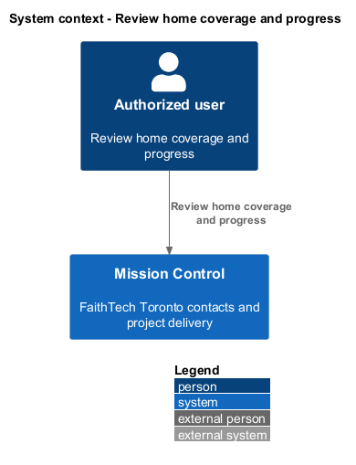
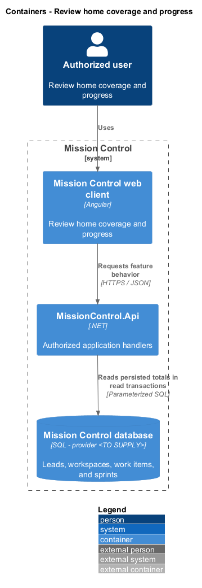
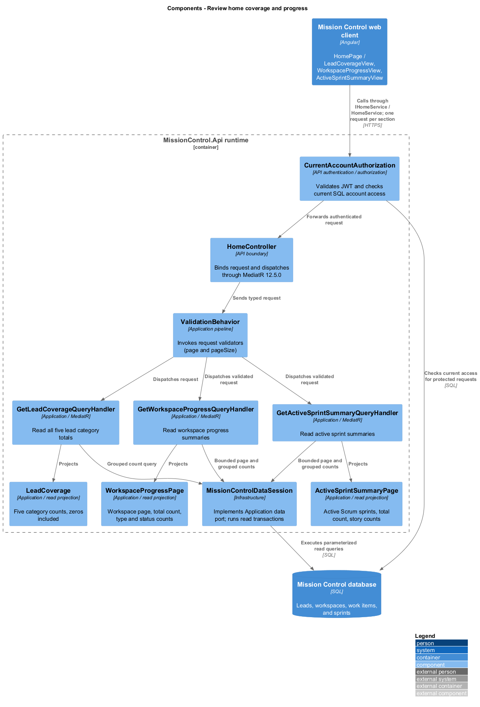
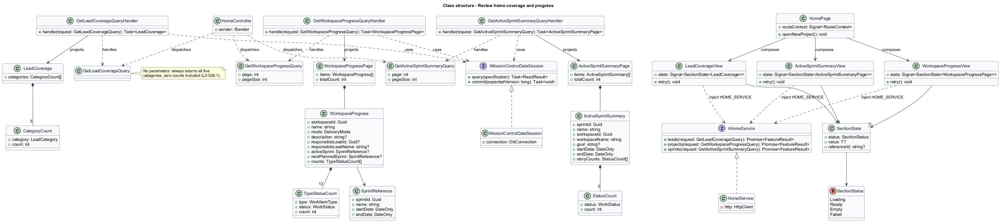
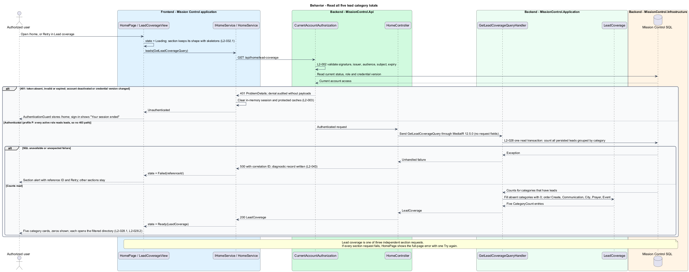
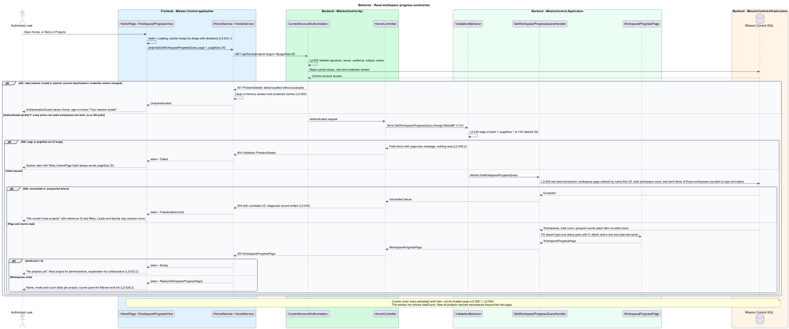
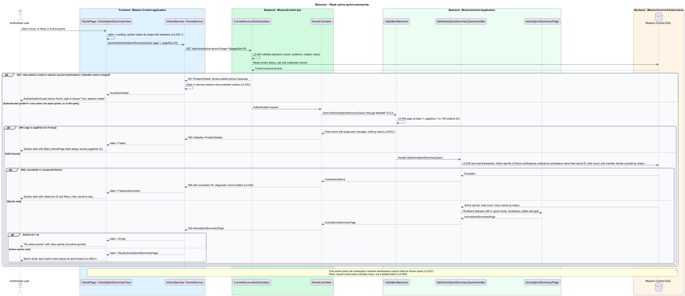

# Review home coverage and progress

## Overview

Home brings Toronto lead coverage and project delivery into one overview.

- **Coverage count** — total persisted lead records in one of the five responsibility categories
- **Progress summary** — workspace work counts by type/status and active sprint identity

Each count links to its underlying filtered records, and empty categories show zero.

This design refines the [L2 baseline](../../../specs/L2.md) and its linked L1 scope. Proposed defaults retain their proposal status.

## Description

All named production types are proposed; the repository currently contains requirements and static mocks.

| Part | Responsibility and architectural home |
| --- | --- |
| `HomePage` | Routed page owned by `frontend/projects/mission-control` at `/home`; composes the three section views and offers New project to administrators. |
| `LeadCoverageView`, `WorkspaceProgressView`, `ActiveSprintSummaryView` | Domain components in `frontend/projects/domain`; each injects `HOME_SERVICE`, holds its own `SectionState` signal, and retries only its own request. |
| `IHomeService`, `HOME_SERVICE` | Interface and token in `frontend/projects/api/home.service.contract.ts`; the consumer imports the contract only. |
| `HomeService` | Production HTTP adapter in `api`; owns HTTP calls and observable-to-signal conversion. Composition binds a mock adapter for Chromium Playwright. |
| `HomeController` | Thin controller under `backend/src/MissionControl.Api/Controllers`, namespace `MissionControl.Api.Controllers`; binds, dispatches, and returns. |
| `LeadCoverage`, `WorkspaceProgressPage`, `ActiveSprintSummaryPage` | Application read projections, one per endpoint. Their item types (`CategoryCount`, `WorkspaceProgress`, `TypeStatusCount`, `SprintReference`, `ActiveSprintSummary`, `StatusCount`) each take their own file. No Domain entity is added. |
| `IMissionControlDataSession` | Application data port; the Infrastructure adapter runs parameterized queries and transaction commits. |

Commands, queries, handlers, and request validators live in Application feature folders. Each type has its own file; folders and namespaces agree.
MediatR remains pinned to `12.5.0`. Microsoft.Extensions supplies dependency injection, Options, and Configuration.

`HomePage` owns `/home` and composes `LeadCoverageView`, `WorkspaceProgressView`, and `ActiveSprintSummaryView` from the domain library.
Each view consumes `IHomeService` through `HOME_SERVICE` and calls its own endpoint.
Its `state` signal holds a `SectionState` of `Loading`, `Ready`, `Empty`, or `Failed`, with the reference ID of a failed request.
`retry()` repeats only that section's request; the views have no submit action because Home is read-only.
The API runs grouped SQL counts over all persisted records, not client-loaded pages.
`GetLeadCoverageQuery` takes no parameters and always returns all five categories; absent categories count zero.
Work counts group each work item once by type and status, and absent type and status pairs count zero.
Project and active-sprint lists are paged, defaulting to 25 and capped at 100; work totals are not truncated with the list.
Projects order by name, then ID; active sprints order by workspace name, then sprint ID, so paging stays stable.
Each page carries `totalCount`; the Projects hint shows it, and View all projects reaches workspaces beyond the first page.
Separate summary endpoints allow the `section-error` mock to retry Projects while Leads and Sprints remain visible.
When every section request fails, `HomePage` shows the full-page `error` state with one Try again.
Home reads need no capability beyond an active account, so no section has a `403` path.
A `401` from any section clears the in-memory session, and sign-in opens with the session-ended message.

Category links set directory filters; type/status counts set workspace work-list filters; sprint names open the matching board.
Each summary read runs in one SQL read transaction per response, avoiding contradictory counts from separate queries within one projection.
Separate sections may reflect different request instants; they do not claim a single global snapshot.
Completed mutations invalidate related summary signals; revisiting or refreshing refetches persisted totals.
The first-run administrator sees the seeded City contact and permitted New project action; a collaborator sees an explanatory empty state.
Compact layouts stack cards. Primary navigation and creation controls follow current permissions.

The authenticated API evaluates current SQL permissions before feature dispatch. Validation V maps invalid fields to `400`, absent authentication to `401`, forbidden access to `403`, missing records to `404`, and conflicts to `409`.
Unexpected errors return a generic `500` with a correlation ID. Structured diagnostics exclude secrets and contact payloads.

Responsive profile R covers `320`, `375`, `576`, `768`, `992`, `1200`, and `1920` CSS-pixel widths at `800` pixels high.
Forms stack on compact screens; dialogs become sheets below `576px`. Templates, styles, and classes remain separate files.
Component styles read `var(--mc-<role>)` from the mirrored authoritative design-system tokens.
Keyboard actions include visible focus, named controls, modal focus containment, trigger focus restoration, and destination-heading focus after navigation.
Field errors connect to inputs; asynchronous results use status or alert announcements. Status text supplements color; primary touch targets measure at least `44×44` CSS pixels.

| Behavior | Proposed boundary | Request / handler |
| --- | --- | --- |
| Read all five lead category totals | `GET /api/home/lead-coverage` | `GetLeadCoverageQuery` / `GetLeadCoverageQueryHandler` |
| Read workspace progress summaries | `GET /api/home/projects` | `GetWorkspaceProgressQuery` / `GetWorkspaceProgressQueryHandler` |
| Read active sprint summaries | `GET /api/home/active-sprints` | `GetActiveSprintSummaryQuery` / `GetActiveSprintSummaryQueryHandler` |

Mock input and review references:

- [Home · Mission Control mock](../../../mocks/home/home.html); review states: `default`, `collaborator`, `first-run-admin`, `first-run-collaborator`, `no-active-sprints`, `loading`, `error`, `section-error`.
- [Work list · Mission Control mock](../../../mocks/work/work-list.html); review states: `default`, `zero-results`, `loading`, `error`.
- [Lead directory · Mission Control mock](../../../mocks/leads/lead-directory.html); review states: `default`, `collaborator`, `filtered`, `zero-results`, `page-2`, `deleted`, `empty-admin`, `empty-collaborator`, `loading`, `error`.
- [Project overview · Mission Control mock](../../../mocks/projects/project-overview.html); review states: `default`, `kanban`, `new-empty`, `new-empty-collaborator`, `kanban-preserved`, `collaborator`, `not-found`, `loading`, `error`.

Implementation proceeds one behavior at a time using the linked Given-When-Then criteria. An API integration acceptance check first fails for the expected missing behavior.
A Chromium Playwright check uses one page object per screen and a mock service bound through the same token. Tests express intent; page objects own selectors.
The smallest implementation turns those checks green before the next behavior begins. Relevant regression checks follow each slice; no architecture tests are introduced.

## Requirements

Requirement text and identifiers below are copied verbatim from L2, including the source use of `must`.

| L2 ID | Refines (L1) | Requirement |
| --- | --- | --- |
| `L2-005` | `L1-001` | The API and UI must apply permission profile P. Lead category or contact creation must not create a login or change a user's authorization. |
| `L2-028` | `L1-007` | Home must show all five lead categories with counts, project names/modes, per-workspace work-item counts by type and status, and active Scrum sprint names. Totals must be computed from persisted records rather than visible pages. |
| `L2-030` | `L1-008` | Every login/session, account-management, lead CRUD, workspace, hierarchy, backlog, board, sprint, home, and navigation workflow must satisfy responsive profile R. Compact layouts must stack form fields and summary cards and provide local board scrolling or a column selector. Larger layouts must use available space without overlapping controls. Vertical page scrolling is permitted. |
| `L2-032` | `L1-008` | Production views must use the application design tokens and consistent typography, spacing, focus, form, and status patterns. Loading, empty data, zero search results, and request errors must be distinguishable and offer relevant actions. Visual review is for application UX; design artifacts themselves remain exempt from automated tests. |
| `L2-034` | `L1-009` | Application controls must expose programmatic names and roles. Inputs must have associated labels; field errors must identify their inputs. Pages must expose main/navigation regions and a coherent heading hierarchy. Asynchronous outcomes must be announced without relying only on visual changes. |
| `L2-045` | `L1-013` | Directories, workspace lists, backlogs, and history lists must default to 25 records per page and cap requested page size at 100. Invalid sizes must return 400. Results must include total matching count and stable ordering. Boards/hierarchies must load bounded batches of at most 100 and allow access to every matching item; counts must reflect the full dataset rather than just loaded records. |

## Diagrams

The context view identifies the actor and the Mission Control capability.

The container view separates the client, .NET API, and durable SQL records.

The component view locates request dispatch, the three read projections, and persistence within the feature.

The class view shows proposed typed requests, interface consumption, and relationships between the feature parts.

Read all five lead category totals follows the sequence below. The flow traces its enforcing steps to `L2-028`.
It covers the `401` path and the section-only `500` path; the query has no input, so no `400` path exists.

Read workspace progress summaries follows the sequence below. The flow traces its enforcing steps to `L2-028`.
It covers the `401`, page-size `400`, and section-only `500` paths, and the empty and ready states.

Read active sprint summaries follows the sequence below. The flow traces its enforcing steps to `L2-028`.
It covers the `401`, page-size `400`, and section-only `500` paths, and the empty and ready states.

